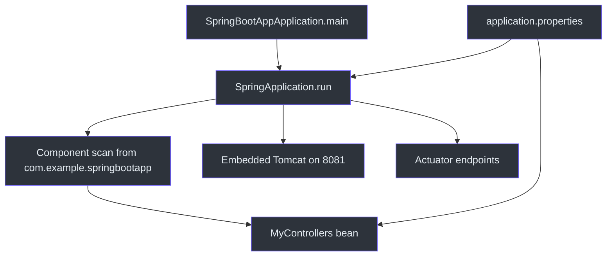
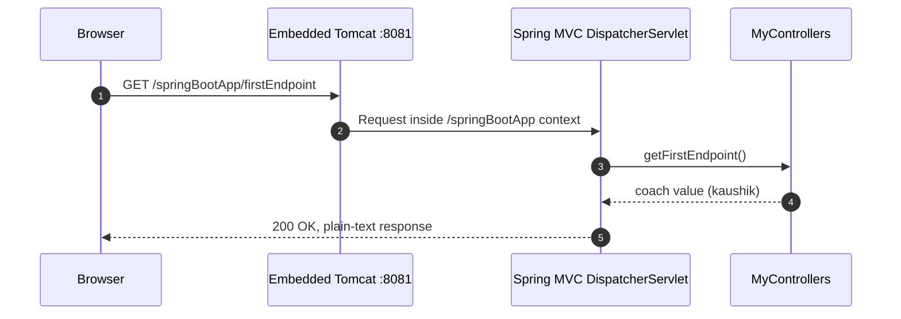
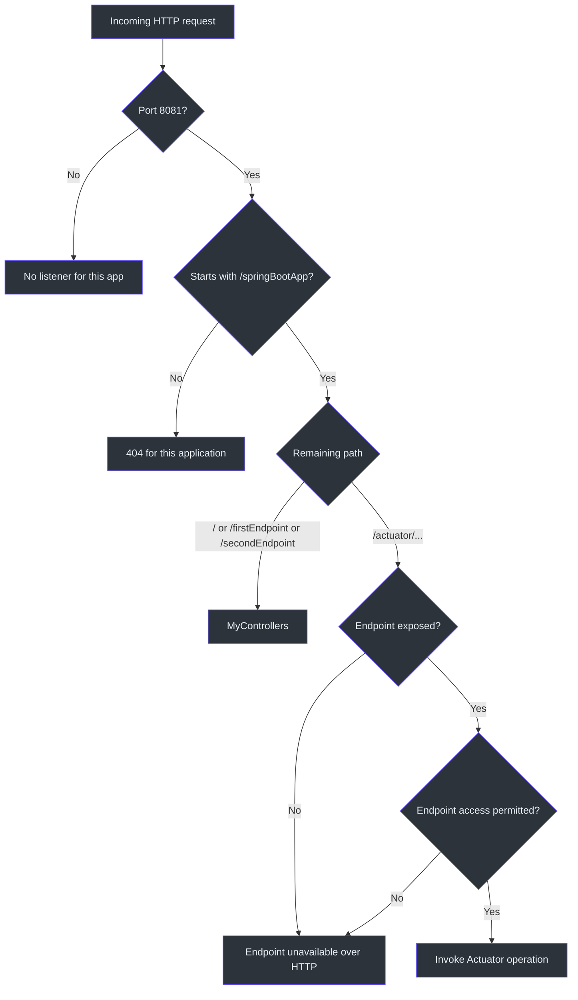

# Spring Boot First Application — Revision Notes

> **Project snapshot:** Spring Boot 4.1.1, Java 26, Maven, Spring MVC, Actuator, and DevTools. These notes describe the checked-out project on **15 September 2026**. Framework defaults are tied to Spring Boot 4.1.1 and may differ in other versions.

## 1. Quick revision sheet

| Question | Answer in this project | Source |
|---|---|---|
| What starts the application? | `SpringApplication.run(SpringBootAppApplication.class, args)` inside the class annotated with `@SpringBootApplication`. | (`src/main/java/com/example/springbootapp/SpringBootAppApplication.java:6`) |
| Which HTTP server and port are used? | Embedded Tomcat on port `8081`. Port `8080` is Spring Boot's usual default, but this project overrides it. | (`src/main/resources/application.properties:12`) |
| What is the application's context path? | `/springBootApp` | (`src/main/resources/application.properties:13`) |
| What is the home URL? | `http://localhost:8081/springBootApp/` | (`src/main/java/com/example/springbootapp/myapp/MyControllers.java:16`) |
| Where is the Actuator discovery page? | `http://localhost:8081/springBootApp/actuator` | (`src/main/resources/application.properties:9`) |
| How are all Actuator endpoints exposed over HTTP? | `management.endpoints.web.exposure.include=*` | (`src/main/resources/application.properties:9`) |
| How are selected exposed endpoints hidden? | Give their IDs to `management.endpoints.web.exposure.exclude`, for example `env,beans`. Exclusion wins over inclusion. | [Spring Boot 4.1.1 Actuator endpoints](https://docs.spring.io/spring-boot/reference/actuator/endpoints.html#actuator.endpoints.exposing) |
| How are `info.app.*` values shown? | Expose the `info` endpoint and enable the environment contributor with `management.info.env.enabled=true`. | (`src/main/resources/application.properties:3`) |
| How are custom properties read in Java? | `@Value("${coach.name}")` and `@Value("${player.name}")` inject the values into controller fields. | (`src/main/java/com/example/springbootapp/myapp/MyControllers.java:11`) |
| What does the current test prove? | The Spring application context can start with the current beans and configuration. | (`src/test/java/com/example/springbootapp/SpringBootAppApplicationTests.java:6`) |

### URL formula to remember

```text
http://localhost:{server.port}{server.servlet.context-path}{controller-or-actuator-path}
```

For this project:

```text
http://localhost:8081 + /springBootApp + /firstEndpoint
= http://localhost:8081/springBootApp/firstEndpoint
```

## 2. What this project teaches

This is a small Spring MVC application that demonstrates four ideas:

1. Spring Boot can start an embedded web server from a Java `main` method.
2. `@RestController` and `@GetMapping` turn Java methods into HTTP endpoints.
3. `application.properties` can configure Spring Boot and provide custom application values.
4. Actuator adds operational endpoints for inspecting health, mappings, metrics, configuration, and other runtime information.

| Project part | Why it exists | Current implementation | Source |
|---|---|---|---|
| Application class | Provides the entry point and enables Spring Boot configuration and component scanning. | `SpringBootAppApplication` | (`src/main/java/com/example/springbootapp/SpringBootAppApplication.java:6`) |
| REST controller | Handles incoming HTTP GET requests and writes return values into response bodies. | `MyControllers` | (`src/main/java/com/example/springbootapp/myapp/MyControllers.java:8`) |
| Properties file | Keeps changeable values outside compiled Java code. | Server, Actuator, app metadata, coach, and player settings | (`src/main/resources/application.properties:1`) |
| Maven build | Defines the framework version, Java version, dependencies, and packaging plugin. | Spring Boot parent 4.1.1 and Java 26 | (`pom.xml:5`) |
| Context test | Detects failures while creating the Spring application context. | One `contextLoads()` test | (`src/test/java/com/example/springbootapp/SpringBootAppApplicationTests.java:6`) |


<!-- Sources: src/main/java/com/example/springbootapp/SpringBootAppApplication.java:6, src/main/java/com/example/springbootapp/myapp/MyControllers.java:8, src/main/resources/application.properties:1, pom.xml:33 -->

## 3. Maven configuration and dependencies

### Project coordinates and versions

| POM item | Value | Meaning | Source |
|---|---|---|---|
| Parent | `org.springframework.boot:spring-boot-starter-parent:4.1.1` | Supplies compatible dependency/plugin versions and useful Maven defaults. | (`pom.xml:5`) |
| Group ID | `com.example` | Namespace used to identify the project. | (`pom.xml:11`) |
| Artifact ID | `springBootApp` | Maven artifact name; it also contributes to the packaged JAR filename. | (`pom.xml:12`) |
| Version | `0.0.1-SNAPSHOT` | Early development version. `SNAPSHOT` means it is not a final release. | (`pom.xml:13`) |
| Java release | `26` | Maven compiles the project for Java 26. | (`pom.xml:29`) |

### Dependencies

| Dependency | Scope | What it contributes here | Source |
|---|---|---|---|
| `spring-boot-starter-webmvc` | Compile/runtime | Spring MVC, `@RestController`, request mapping, JSON/web infrastructure, and an embedded servlet server. | (`pom.xml:41`) |
| `spring-boot-starter-actuator` | Compile/runtime | Monitoring and management endpoints such as `health`, `info`, `mappings`, and `metrics`. | (`pom.xml:33`) |
| `spring-boot-devtools` | Runtime, optional | Development-time automatic restart and development defaults. It is not intended to be a required transitive dependency for consumers. | (`pom.xml:46`) |
| `spring-boot-starter-webmvc-test` | Test | Spring MVC test support and general web testing tools. | (`pom.xml:62`) |
| `spring-boot-starter-actuator-test` | Test | Test support for Actuator behavior. | (`pom.xml:52`) |
| `spring-boot-starter-security` | Commented out | Has no effect because XML comments remove it from the effective POM. | (`pom.xml:37`) |
| `spring-boot-starter-security-test` | Commented out | Also has no effect. | (`pom.xml:57`) |

The `spring-boot-maven-plugin` supports tasks such as `spring-boot:run` and packaging an executable Spring Boot JAR. (`pom.xml:69`)

## 4. Application startup and component scanning

```java
@SpringBootApplication
public class SpringBootAppApplication {
    public static void main(String[] args) {
        SpringApplication.run(SpringBootAppApplication.class, args);
    }
}
```

`@SpringBootApplication` is the usual single entry annotation. It combines application configuration, auto-configuration, and component scanning. See the [official Spring Boot application annotation documentation](https://docs.spring.io/spring-boot/reference/using/structuring-your-code.html#using.structuring-your-code.locating-the-main-class).

The main class is in `com.example.springbootapp`, while `MyControllers` is in the child package `com.example.springbootapp.myapp`. The default component scan begins at the main class's package and reaches subpackages, so Spring finds the controller and creates it as a bean. (`src/main/java/com/example/springbootapp/SpringBootAppApplication.java:1`, `src/main/java/com/example/springbootapp/myapp/MyControllers.java:1`)

**Memory rule:** place the main application class near the top of your application's package tree. A component in an unrelated or parent package will not be found by the default scan.

## 5. Controller and request flow

### Endpoint reference

| HTTP method | Controller mapping | Complete URL | Response | Source |
|---|---|---|---|---|
| GET | `/` | `http://localhost:8081/springBootApp/` | `Hello World` | (`src/main/java/com/example/springbootapp/myapp/MyControllers.java:16`) |
| GET | `/firstEndpoint` | `http://localhost:8081/springBootApp/firstEndpoint` | Value of `coach.name`: `kaushik` | (`src/main/java/com/example/springbootapp/myapp/MyControllers.java:21`) |
| GET | `/secondEndpoint` | `http://localhost:8081/springBootApp/secondEndpoint` | Value of `player.name`: `yadav` | (`src/main/java/com/example/springbootapp/myapp/MyControllers.java:26`) |

`@RestController` marks the class as a Spring web component whose method return values are written to the HTTP response body. Since these methods return `String`, the client receives plain text. `@GetMapping` restricts each method to HTTP GET requests and supplies the path handled by that method. (`src/main/java/com/example/springbootapp/myapp/MyControllers.java:8`)


<!-- Sources: src/main/resources/application.properties:12, src/main/resources/application.properties:13, src/main/java/com/example/springbootapp/myapp/MyControllers.java:21 -->

Do not repeat the context path inside `@GetMapping`. The context path is an application-wide prefix added by the server. A mapping of `@GetMapping("/springBootApp/firstEndpoint")` would produce the duplicated path `/springBootApp/springBootApp/firstEndpoint`.

## 6. `application.properties` explained

Spring Boot loads `src/main/resources/application.properties` into its `Environment`. Framework-owned keys configure Spring Boot; custom keys can be injected into application beans. [Official external configuration reference](https://docs.spring.io/spring-boot/reference/features/external-config.html)

### Every property in the current file

| Property | Current value/state | What it controls | Observed effect | Source |
|---|---|---|---|---|
| `spring.application.name` | `springBootApp` | Logical application name, commonly included in logs and used by integrations. It does not set the URL or context path. | Startup log identifies the application as `springBootApp`. | (`src/main/resources/application.properties:1`) |
| `management.info.env.enabled` | Commented out | Enables the info contributor that copies `info.*` environment properties into `/actuator/info`. | Because it is commented, current `/actuator/info` returns `{}`. | (`src/main/resources/application.properties:3`) |
| `info.app.name` | `springBootApp` | Custom application metadata waiting to be contributed to `/actuator/info`. | Hidden until the `env` info contributor is enabled. | (`src/main/resources/application.properties:5`) |
| `info.app.description` | `This is a basic spring boot application` | Custom descriptive metadata. | Hidden until the `env` contributor is enabled. | (`src/main/resources/application.properties:6`) |
| `info.app.version` | `1.0` | Custom application version metadata; independent of Maven's `0.0.1-SNAPSHOT`. | Hidden until the `env` contributor is enabled. | (`src/main/resources/application.properties:7`) |
| `management.endpoints.web.exposure.include` | `*` | Exposes every available Actuator endpoint over HTTP. | Startup reports 12 exposed endpoints. | (`src/main/resources/application.properties:9`) |
| `management.endpoints.web.exposure.exclude` | Empty | Removes listed endpoint IDs from web exposure. | Removes none because the value is empty. | (`src/main/resources/application.properties:10`) |
| `server.port` | `8081` | HTTP listening port for the embedded server. | Tomcat listens on `8081` instead of the default `8080`. | (`src/main/resources/application.properties:12`) |
| `server.servlet.context-path` | `/springBootApp` | Prefix placed before every application and same-port Actuator path. | `/firstEndpoint` becomes `/springBootApp/firstEndpoint`. | (`src/main/resources/application.properties:13`) |
| `coach.name` | `kaushik` | Custom property used by `MyControllers`. | `/firstEndpoint` returns `kaushik`. | (`src/main/resources/application.properties:15`) |
| `player.name` | `yadav` | Custom property used by `MyControllers`. | `/secondEndpoint` returns `yadav`. | (`src/main/resources/application.properties:16`) |

### Changing the application name, port, or context path

```properties
spring.application.name=my-learning-app
server.port=9090
server.servlet.context-path=/api
```

With those example values, the home URL would become `http://localhost:9090/api/`. The application name changes its logical identity and log label; it does not automatically change the Maven artifact ID, Java package, JAR filename, or context path.

The current web starter runs an embedded Tomcat server. `server.port` changes where that server listens. Replacing Tomcat with another embedded servlet container, such as Jetty, requires changing Maven dependencies; it is not accomplished with `server.port`.

## 7. Reading custom property values

The controller uses field injection:

```java
@Value("${coach.name}")
private String coach;

@Value("${player.name}")
private String player;
```

At bean creation time, Spring resolves each `${...}` placeholder from the `Environment` and assigns the result to the field. Later, the endpoint returns the already injected value. (`src/main/java/com/example/springbootapp/myapp/MyControllers.java:11`)

```mermaid
flowchart LR
    File[application.properties] -->|coach.name=kaushik| Environment[Spring Environment]
    Environment -->|resolve $ coach.name| Value[@Value field]
    Value --> Bean[MyControllers bean]
    Request[GET /firstEndpoint] --> Bean
    Bean --> Response[kaushik]
    classDef dark fill:#2d333b,stroke:#6d5dfc,color:#e6edf3
    class File,Environment,Value,Bean,Request,Response dark
```
<!-- Sources: src/main/resources/application.properties:15, src/main/java/com/example/springbootapp/myapp/MyControllers.java:11, src/main/java/com/example/springbootapp/myapp/MyControllers.java:21 -->

### Missing values and defaults

The current placeholders have no fallback. If `coach.name` or `player.name` cannot be resolved, application context creation fails. A small optional setting can provide a default after a colon:

```java
@Value("${coach.name:Unknown Coach}")
private String coach;
```

This example means “use `coach.name`; if it is absent, use `Unknown Coach`.” It is an alternative example and is not implemented in the current controller.

### Ways to override a property

Later property sources can override `application.properties`. Two practical examples are:

```powershell
# Command-line argument for one run
.\mvnw.cmd spring-boot:run "-Dspring-boot.run.arguments=--server.port=9090"

# Environment variable for the current PowerShell session
$env:SERVER_PORT = "9090"
.\mvnw.cmd spring-boot:run
Remove-Item Env:SERVER_PORT
```

The environment-variable spelling for a canonical property usually replaces dots with underscores and uses uppercase: `server.port` becomes `SERVER_PORT`, and `coach.name` becomes `COACH_NAME`.

### When to move beyond `@Value`

`@Value` is convenient for one or two values. When settings form a group, `@ConfigurationProperties` gives one typed configuration object, relaxed binding, IDE metadata support, and optional validation. This is a future improvement, not code currently present in this project. See [type-safe configuration properties](https://docs.spring.io/spring-boot/reference/features/external-config.html#features.external-config.typesafe-configuration-properties).

## 8. Actuator: access, exposure, and information content

These three ideas are easy to mix up:

| Concern | Question answered | Property family |
|---|---|---|
| Endpoint access | Is the endpoint bean allowed to exist, and which operations are permitted? | `management.endpoint.<id>.access` and `management.endpoints.access.*` |
| Technology exposure | Can the endpoint be reached over HTTP or JMX? | `management.endpoints.web.exposure.*` or `management.endpoints.jmx.exposure.*` |
| Info contributor | What sections are placed inside the `info` response? | `management.info.<id>.enabled` |

An Actuator endpoint is remotely available only when access is permitted **and** it is exposed through the chosen technology. The contents of `/info` then depend on enabled `InfoContributor` beans. [Official endpoint model](https://docs.spring.io/spring-boot/reference/actuator/endpoints.html)

### What is enabled by default in Spring Boot 4.1.1?

The precise answer is:

- Access to most endpoints is unrestricted by default; `shutdown` and `heapdump` are exceptions.
- Only `health` is exposed over HTTP and JMX by default.
- The `info` endpoint therefore is not reachable over HTTP with default exposure settings.
- The `env` info contributor, which reads `info.*` properties, is disabled by default.
- Build and Git info contributors are enabled by default when their prerequisite metadata files exist.

So the shorthand “info is enabled by default” is incomplete. For this project's custom `info.app.*` fields to appear over HTTP, both of these are needed:

```properties
management.endpoints.web.exposure.include=health,info
management.info.env.enabled=true
```

The current project already uses `include=*`, which includes `info`. Uncommenting line 3 is therefore enough to show its custom values:

```json
{
  "app": {
    "name": "springBootApp",
    "description": "This is a basic spring boot application",
    "version": "1.0"
  }
}
```

That response was also verified by supplying `--management.info.env.enabled=true` as a runtime override, without changing the project file.

### Common exposure configurations

Expose only the two usual learning/monitoring endpoints:

```properties
management.endpoints.web.exposure.include=health,info
```

Expose every available endpoint:

```properties
management.endpoints.web.exposure.include=*
```

Expose all except selected endpoints:

```properties
management.endpoints.web.exposure.include=*
management.endpoints.web.exposure.exclude=env,beans
```

`exclude` takes precedence. In the last example, `env` and `beans` remain hidden over HTTP even though `*` initially selects them.

If YAML is used, quote the wildcard because `*` has special YAML syntax:

```yaml
management:
  endpoints:
    web:
      exposure:
        include: "*"
        exclude: "env,beans"
```

### Hiding versus disabling an endpoint

To hide an endpoint only from HTTP, use web exposure:

```properties
management.endpoints.web.exposure.exclude=env
```

To make an endpoint inaccessible and remove it from the application context in Spring Boot 4.1.1, use access control:

```properties
management.endpoint.env.access=none
```

To make all endpoints opt-in and allow only read access to selected ones:

```properties
management.endpoints.access.default=none
management.endpoint.health.access=read-only
management.endpoint.info.access=read-only
```

**Memory rule:** exposure decides the doorway; access decides whether the room exists and what operations are allowed.

### Current Actuator URLs

The default Actuator base path is `/actuator`. Because this application uses the same HTTP port and has a servlet context path, the current prefix is:

```text
http://localhost:8081/springBootApp/actuator
```

| Endpoint | Current URL | Why it is useful |
|---|---|---|
| Discovery | `/springBootApp/actuator` | Links to exposed endpoints. |
| Health | `/springBootApp/actuator/health` | Reports whether the application is up. |
| Info | `/springBootApp/actuator/info` | Shows contributed application/build/Git information. |
| Mappings | `/springBootApp/actuator/mappings` | Shows registered request mappings; useful when a URL gives 404. |
| Beans | `/springBootApp/actuator/beans` | Lists beans in the application context. |
| Conditions | `/springBootApp/actuator/conditions` | Explains why auto-configurations matched or did not match. |
| Config props | `/springBootApp/actuator/configprops` | Shows bound `@ConfigurationProperties` objects; values are sanitized where appropriate. |
| Environment | `/springBootApp/actuator/env` | Shows property sources and environment keys; sensitive values are sanitized by default. |
| Metrics | `/springBootApp/actuator/metrics` | Lists metric names; append a metric name to inspect it. |
| Loggers | `/springBootApp/actuator/loggers` | Shows and can change logger levels. |
| Thread dump | `/springBootApp/actuator/threaddump` | Shows application thread state. |
| Scheduled tasks | `/springBootApp/actuator/scheduledtasks` | Lists scheduled tasks known to Spring. |
| SBOM | `/springBootApp/actuator/sbom` | Exposes detected software bill-of-materials data. |

The exact endpoint set depends on dependencies and beans in the application. On 15 September 2026, this project logged **12 endpoints exposed** beneath `/actuator`.

### Security reminder

Exposure is not authentication. The Spring Security dependencies are currently commented out, so this project does not add Spring Security protection. (`pom.xml:37`) Exposing `env`, `beans`, `configprops`, `mappings`, or write-capable management operations publicly can reveal sensitive operational details. Wildcard exposure is useful for a local course exercise; use a narrow list and proper security for deployed applications.

## 9. How the final route is selected


<!-- Sources: src/main/resources/application.properties:9, src/main/resources/application.properties:12, src/main/resources/application.properties:13, src/main/java/com/example/springbootapp/myapp/MyControllers.java:16 -->

## 10. Testing and running the project

Run commands from `springBootApp` on Windows:

```powershell
# Run the test suite
.\mvnw.cmd test

# Start the application for development
.\mvnw.cmd spring-boot:run

# Build the executable JAR, including tests
.\mvnw.cmd clean package

# Run the packaged application
java -jar .\target\springBootApp-0.0.1-SNAPSHOT.jar
```

### What `contextLoads()` checks

`@SpringBootTest` asks Spring Boot to find the application configuration and create the application context. The empty `contextLoads()` method passes if setup completes without an exception. (`src/test/java/com/example/springbootapp/SpringBootAppApplicationTests.java:6`)

This is valuable because it catches problems such as:

- invalid bean configuration;
- missing required `@Value` properties;
- failures during auto-configuration;
- incompatible dependencies that prevent startup.

It does not send HTTP requests or assert the three controller responses. Endpoint behavior would need focused MVC or live-server tests.

### Observed verification

| Date | Check | Result |
|---|---|---|
| 2026-09-15 | `.\mvnw.cmd test` on Java 26.0.1 and Maven Wrapper 3.9.16 | Passed: 1 test, 0 failures, 0 errors, 0 skipped. |
| 2026-09-15 | Start with unchanged properties | Tomcat started on port `8081`, context path `/springBootApp`, with 12 Actuator endpoints exposed. |
| 2026-09-15 | GET `/`, `/firstEndpoint`, `/secondEndpoint` using complete URLs | `200`: `Hello World`, `kaushik`, and `yadav`. |
| 2026-09-15 | GET `/actuator/health` | `200`, status `UP`. |
| 2026-09-15 | GET `/actuator/info` with the file unchanged | `200`, body `{}`. |
| 2026-09-15 | Start with runtime override `--management.info.env.enabled=true` | `/actuator/info` returned the configured `app` name, description, and version. |

## 11. Common mistakes and fixes

| Symptom | Likely cause | Fix |
|---|---|---|
| `http://localhost:8080/` fails | The project overrides the default port. | Use port `8081`. |
| `http://localhost:8081/firstEndpoint` gives 404 | The servlet context path is missing. | Use `/springBootApp/firstEndpoint`. |
| `/actuator/info` gives 404 with default exposure | `info` is not exposed over HTTP by default. | Add `info` to `management.endpoints.web.exposure.include`. |
| `/actuator/info` returns `{}` | The endpoint is exposed, but no active contributor supplies content. | Set `management.info.env.enabled=true` for `info.*` properties. |
| Excluded endpoint still seems included in `*` | `include=*` is being read without considering `exclude`. | Remember that `exclude` wins; use the correct endpoint ID. |
| Application fails with an unresolved placeholder | A required custom property used by `@Value` is missing or misspelled. | Add the property or use a deliberate `${key:default}` fallback. |
| Controller is never found | It is outside the default component-scan package tree. | Put it below `com.example.springbootapp` or configure scanning explicitly. |
| Application name change does not change the URL | `spring.application.name` is not a routing property. | Use `server.servlet.context-path` for the application URL prefix. |
| Properties changed but behavior appears old | The running process has not reloaded or restarted. | Restart the application; DevTools can restart when classpath resources change in supported IDE workflows. |

## 12. Active-recall questions

1. **How is the complete URL assembled?**

   Port + context path + controller or Actuator path.

2. **What is the difference between `spring.application.name` and `server.servlet.context-path`?**

   The first is the application's logical identity; the second changes the URL prefix.

3. **What exposes all Actuator endpoints over HTTP?**

   `management.endpoints.web.exposure.include=*`.

4. **How do you expose everything except `env` and `beans`?**

   Include `*`, then set `management.endpoints.web.exposure.exclude=env,beans`.

5. **Why can `/actuator/info` return `{}` even when reachable?**

   Exposure made the endpoint reachable, but no enabled info contributor supplied content.

6. **What makes `info.app.name` visible in this project?**

   `management.info.env.enabled=true` plus web exposure of the `info` endpoint.

7. **What is the difference between hiding and disabling an endpoint?**

   Web exclusion hides it over HTTP; `management.endpoint.<id>.access=none` makes it inaccessible and removes it from the application context.

8. **What happens if `coach.name` is missing?**

   The current `${coach.name}` placeholder has no default, so context startup fails.

9. **Why is `MyControllers` found automatically?**

   It is in a subpackage of the package containing the main `@SpringBootApplication` class.

10. **What does `contextLoads()` prove?**

    It proves the Spring context starts; it does not prove HTTP response behavior.

## 13. Official references

- [Spring Boot 4.1.1 — Actuator endpoints, access, exposure, and security](https://docs.spring.io/spring-boot/reference/actuator/endpoints.html)
- [Spring Boot 4.1.1 — externalized configuration and property precedence](https://docs.spring.io/spring-boot/reference/features/external-config.html)
- [Spring Boot 4.1.1 — common application properties](https://docs.spring.io/spring-boot/appendix/application-properties/)
- [Spring Boot 4.1.1 — servlet web applications and embedded server configuration](https://docs.spring.io/spring-boot/reference/web/servlet.html)
- [Spring Boot 4.1.1 — DevTools](https://docs.spring.io/spring-boot/reference/using/devtools.html)

## Related pages

| Page | Relationship |
|---|---|
| [Course index](../../README.md) | Tracks course sections, projects, progress, and navigation. |
| [Cumulative course review](../../COURSE_REVIEW.md) | Distills the most important ideas across completed sections. |
| [Instructor-folder agent guidance](../../AGENTS.md) | Defines how future course projects and revision notes should be inspected, written, and verified. |
