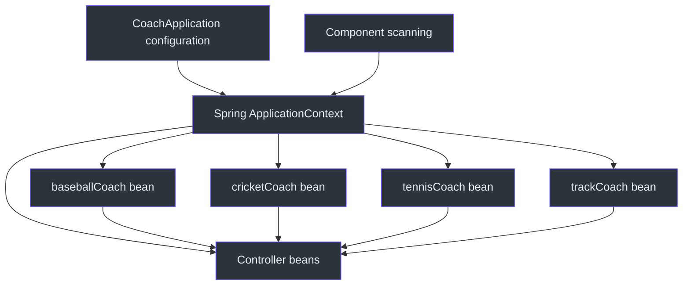
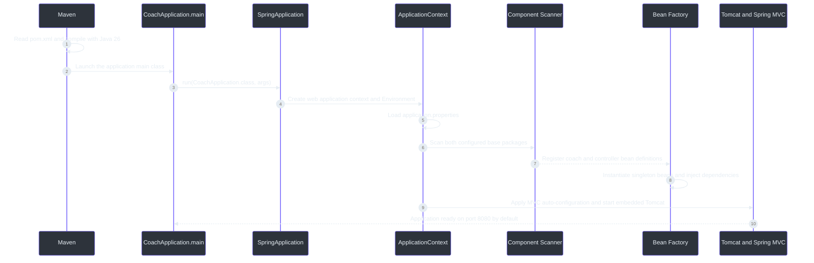
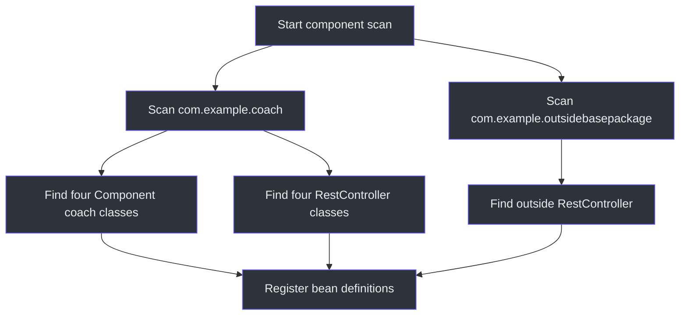
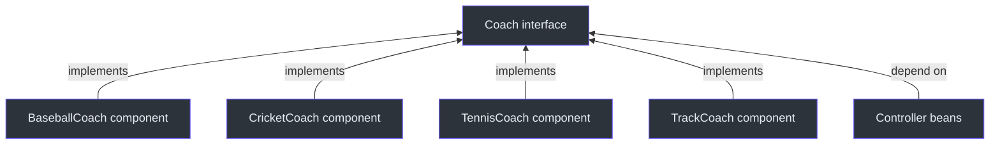
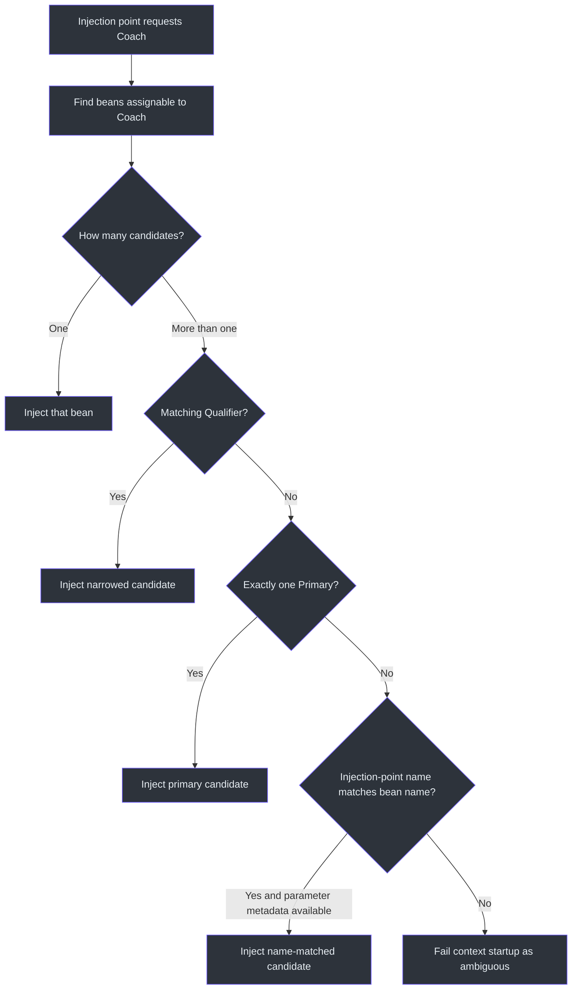
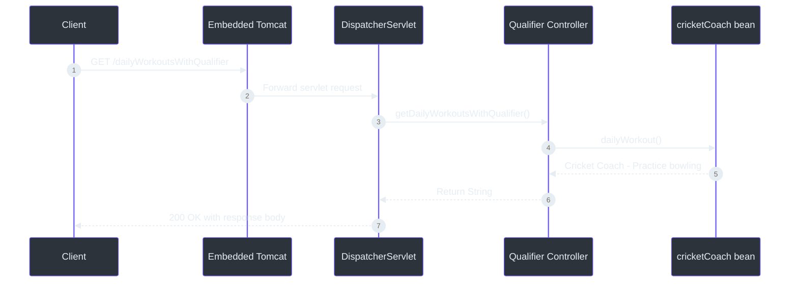
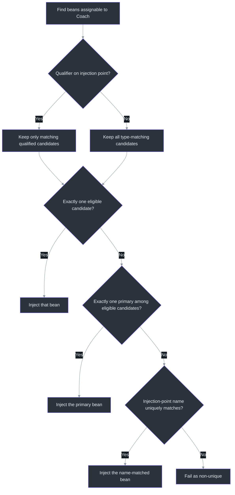
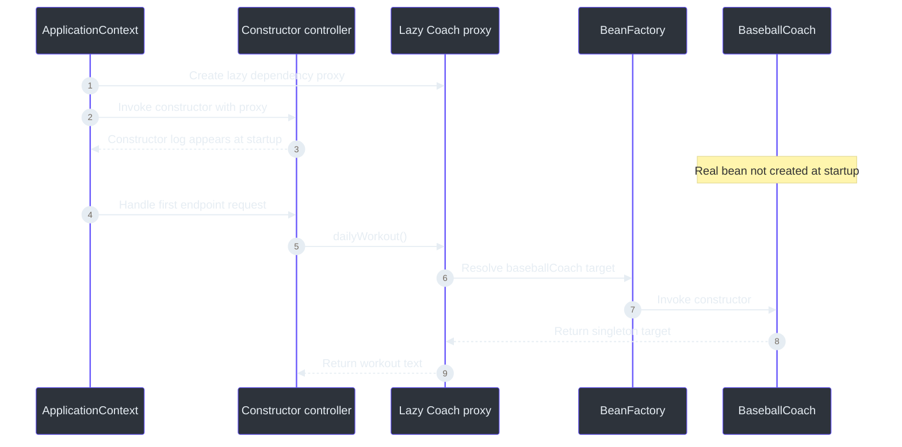

# Spring Core, Dependency Injection, Bean Selection, and Lazy Initialization — Revision Notes

> **Project snapshot:** Spring Boot 4.1.1, Spring Framework 7.0.9, Java 26, Maven 3.9.16, Spring MVC, Actuator, and DevTools. These notes describe the checked-out `coach` project through **16 September 2026**. The course section is **in progress** and will continue in the next lesson.

## 1. Quick revision sheet

| Question | Short answer | Source |
|---|---|---|
| What does `@SpringBootApplication` do? | It combines Boot configuration, auto-configuration, and component scanning on the main application class. | (`src/main/java/com/example/coach/CoachApplication.java:6`) |
| What is IoC? | The application gives control of object creation, assembly, and lifecycle to Spring's container. | [Spring Framework 7.0 — IoC container](https://docs.spring.io/spring-framework/reference/core/beans/introduction.html) |
| What is dependency injection? | An object declares what it needs, and Spring supplies matching beans instead of the object constructing its own dependencies. | [Spring Framework 7.0 — dependencies](https://docs.spring.io/spring-framework/reference/core/beans/dependencies/factory-collaborators.html) |
| What is the application context? | The running Spring container that stores bean definitions, creates beans, connects dependencies, and manages their lifecycle. | [Spring Framework 7.0 — IoC container](https://docs.spring.io/spring-framework/reference/core/beans/introduction.html) |
| What is a bean? | An ordinary Java object whose creation and lifecycle are managed by Spring. | (`src/main/java/com/example/coach/common/CricketCoach.java:8`) |
| What does `@Component` do? | It marks a class as a component-scanning candidate, allowing Spring to register and manage it as a bean. | (`src/main/java/com/example/coach/common/BaseballCoach.java:8`) |
| Which injection style is preferred for required dependencies? | Constructor injection, because requirements are explicit and the dependency reference can be `final`. | (`src/main/java/com/example/coach/common/CoachControllerWithConstructorInjection.java:18`) |
| Is setter injection the same as field injection? | No. Setter injection calls an annotated method; field injection writes directly to an annotated field. | (`src/main/java/com/example/coach/common/CoachControllerWithSetterInjection.java:14`) |
| When is `@Autowired` optional? | A Spring bean with exactly one constructor does not need `@Autowired` on that constructor. | [Spring Framework 7.0 — using `@Autowired`](https://docs.spring.io/spring-framework/reference/core/beans/annotation-config/autowired.html) |
| Why did four `Coach` implementations break startup? | Injection by the interface type found four matching beans, so Spring needed a rule for choosing one. | (`src/main/java/com/example/coach/common/Coach.java:3`) |
| What does `@Qualifier` solve? | It narrows the type-matched candidates for one injection point to the requested bean or qualifier label. | (`src/main/java/com/example/coach/common/CoachControllerWithQualifiers.java:12`) |
| What does `@Primary` solve? | It supplies the preferred default when an unqualified single-valued injection point has several candidates and exactly one is primary. | (`src/main/java/com/example/coach/common/CricketCoach.java:9`) |
| Which wins when `@Qualifier("tennisCoach")` and a primary cricket bean both exist? | The qualifier narrows the eligible candidates to tennis, so tennis is injected. | (`src/main/java/com/example/coach/common/CoachControllerWithPrimaryAnnotation.java:13`) |
| What does parameter-level `@Lazy` do? | It injects a proxy now and resolves the real dependency when that proxy is first used. | (`src/main/java/com/example/coach/common/CoachControllerWithConstructorInjection.java:23`) |
| What is `@RestController`? | A controller whose handler return values are written to the HTTP response body; effectively `@Controller` plus `@ResponseBody`. | [Spring Framework 7.0 — `@ResponseBody`](https://docs.spring.io/spring-framework/reference/web/webmvc/mvc-controller/ann-methods/responsebody.html) |

## 2. Lesson snapshot

The project demonstrates Spring's core object-management model through a small `Coach` interface. Four implementations are registered as Spring beans. Five controllers request a `Coach` dependency and demonstrate qualifiers, a primary bean, eager singleton creation, and lazy dependency resolution.

| Project part | Current implementation | Learning purpose | Source |
|---|---|---|---|
| Application entry point | `CoachApplication` | Starts Spring Boot and explicitly selects two component-scan roots. | (`src/main/java/com/example/coach/CoachApplication.java:6`) |
| Abstraction | `Coach` | Allows controllers to depend on a contract rather than one concrete coach class. | (`src/main/java/com/example/coach/common/Coach.java:3`) |
| Bean implementations | `BaseballCoach`, `CricketCoach`, `TennisCoach`, `TrackCoach` | Demonstrate multiple Spring beans sharing the same interface type. | (`src/main/java/com/example/coach/common/BaseballCoach.java:8`) |
| Constructor injection | `CoachControllerWithConstructorInjection` | Demonstrates a required, `final` dependency selected with `baseballCoach`. | (`src/main/java/com/example/coach/common/CoachControllerWithConstructorInjection.java:18`) |
| Setter injection | `CoachControllerWithSetterInjection` | Demonstrates injection after construction, selected with `tennisCoach`. | (`src/main/java/com/example/coach/common/CoachControllerWithSetterInjection.java:14`) |
| Qualifier demonstration | `CoachControllerWithQualifiers` | Demonstrates constructor-parameter qualification with `cricketCoach`. | (`src/main/java/com/example/coach/common/CoachControllerWithQualifiers.java:12`) |
| Primary demonstration | `CoachControllerWithPrimaryAnnotation` | Demonstrates that an explicit `tennisCoach` qualifier overrides the normal primary-cricket default for this injection point. | (`src/main/java/com/example/coach/common/CoachControllerWithPrimaryAnnotation.java:13`) |
| Outside-package scan | `ControllerFromOutsideBasePackage` | Proves that explicit component-scan roots can include an otherwise undiscovered controller. | (`src/main/java/com/example/outsidebasepackage/ControllerFromOutsideBasePackage.java:8`) |
| Context test | `CoachApplicationTests.contextLoads()` | Checks whether Spring can create the current context and resolve every required dependency. | (`src/test/java/com/example/coach/CoachApplicationTests.java:6`) |

### Versions and dependencies

| Item | Current value | Meaning | Source |
|---|---:|---|---|
| Spring Boot parent | `4.1.1` | Controls the compatible dependency and plugin versions. | (`pom.xml:8`) |
| Spring Framework | `7.0.9` | Resolved transitively by Spring Boot 4.1.1; observed with `mvn dependency:tree`. | Observed 2026-09-15 |
| Java release | `26` | Maven compiles this project for Java 26. | (`pom.xml:30`) |
| Maven Wrapper target | `3.9.16` | Version recorded in the wrapper distribution URL. | (`.mvn/wrapper/maven-wrapper.properties:3`) |
| `spring-boot-starter-webmvc` | Compile/runtime | Supplies Spring MVC and the embedded servlet web stack. | (`pom.xml:39`) |
| `spring-boot-starter-actuator` | Compile/runtime | Supplies operational endpoints; Actuator is present but is not the focus of this lesson. | (`pom.xml:35`) |
| `spring-boot-devtools` | Runtime, optional | Supplies development-time restart support and development defaults. | (`pom.xml:44`) |
| Web MVC and Actuator test starters | Test | Supply testing support for the selected starters. | (`pom.xml:50`) |

## 3. Mental model: IoC, DI, context, beans, and components

These terms describe related parts of one process, not five unrelated features.

| Term | Meaning | Memory aid |
|---|---|---|
| **Inversion of Control (IoC)** | The application no longer controls the complete creation and wiring process. Spring's container takes that responsibility. | “Spring controls construction.” |
| **Dependency** | Another object that a class needs to do its work. A controller's `Coach` reference is a dependency. | “What this object needs.” |
| **Dependency Injection (DI)** | Spring supplies a dependency from outside the object through a constructor, method, or field. | “Needs are provided, not searched for.” |
| **Application context** | The Spring IoC container used by the running application. It knows the bean definitions and manages their instances. | “Spring's managed-object registry and factory.” |
| **Bean** | An object instantiated, assembled, and managed by that container. | “An object known to Spring.” |
| **Component** | A class marked for automatic discovery, normally with `@Component` or a specialized stereotype such as `@Controller`. | “A scanned bean candidate.” |


<!-- Sources: src/main/java/com/example/coach/CoachApplication.java:6, src/main/java/com/example/coach/common/BaseballCoach.java:8, src/main/java/com/example/coach/common/CricketCoach.java:8, src/main/java/com/example/coach/common/TennisCoach.java:7, src/main/java/com/example/coach/common/TrackCoach.java:7 -->

### Plain Java construction versus Spring-managed construction

Without DI, a controller could choose and construct its own implementation:

```java
private final Coach coach = new CricketCoach();
```

That tightly couples the controller to `CricketCoach`. Replacing it with `TennisCoach` requires changing the controller itself.

With constructor injection, the controller asks only for the interface:

```java
private final Coach coach;

public CoachControllerWithQualifiers(
        @Qualifier("cricketCoach") Coach coach) {
    this.coach = coach;
}
```

Spring selects the bean and passes it into the constructor. The current implementation is in `CoachControllerWithQualifiers`. (`src/main/java/com/example/coach/common/CoachControllerWithQualifiers.java:10`)

### Which objects are actually managed?

- The four coach implementations are managed because they are discovered through `@Component`.
- The controllers are managed because `@RestController` includes the `@Controller` stereotype, which is a specialized component.
- The `Coach` interface itself is not instantiated; it is only the contract implemented by the four beans.
- An object created manually with `new` is normally an ordinary Java object outside the application context. Spring does not automatically inject dependencies into it or manage its lifecycle.
- A class does not have to use `@Component` to become a bean. A future configuration class can also expose an object using an `@Bean` method. That alternative is not implemented here.

By default, a component bean uses singleton scope: one instance exists for that bean definition inside one application context. This is a Spring-container singleton, not necessarily one instance for the entire JVM. [Official bean scopes](https://docs.spring.io/spring-framework/reference/core/beans/factory-scopes.html)

## 4. `@SpringBootApplication` and application startup

The current application class contains:

```java
@SpringBootApplication(scanBasePackages = {
        "com.example.coach",
        "com.example.outsidebasepackage"
})
public class CoachApplication {
    static void main(String[] args) {
        SpringApplication.run(CoachApplication.class, args);
    }
}
```

The actual code is at `src/main/java/com/example/coach/CoachApplication.java:6`.

### The three capabilities bundled by `@SpringBootApplication`

| Included annotation | Responsibility |
|---|---|
| `@SpringBootConfiguration` | Marks this as the primary Spring Boot configuration class; it is based on Spring's `@Configuration`. |
| `@EnableAutoConfiguration` | Lets Spring Boot configure infrastructure according to the classpath, existing beans, and properties. Because the MVC starter is present, Boot configures the servlet web application. |
| `@ComponentScan` | Finds eligible components in configured packages and registers their bean definitions. |

The official Spring Boot 4.1.1 API defines `@SpringBootApplication` as this composed annotation and documents `scanBasePackages` as an alias for `@ComponentScan`'s `basePackages`. [Spring Boot 4.1.1 API](https://docs.spring.io/spring-boot/api/java/org/springframework/boot/autoconfigure/SpringBootApplication.html)

### What happens after `mvn spring-boot:run`?


<!-- Sources: pom.xml:8, pom.xml:30, src/main/java/com/example/coach/CoachApplication.java:6, src/main/resources/application.properties:1, src/main/java/com/example/coach/common/CoachControllerWithConstructorInjection.java:23 -->

Important distinction: `SpringApplication.run(...)` does much more than call controller methods. It creates the application context first. If one required dependency cannot be resolved, context creation fails and the web server never becomes ready.

## 5. Component scanning and the outside-package experiment

### Default scan behavior

Without an explicit `scanBasePackages`, scanning begins from the package containing the `@SpringBootApplication` class and continues through its subpackages.

```text
com.example.coach                 <- main application package
└── com.example.coach.common      <- included by default

com.example.outsidebasepackage   <- not below com.example.coach
```

Therefore, `com.example.coach.common` is inside the natural scan tree, while `com.example.outsidebasepackage` is outside it.

### Current explicit scan behavior

The project now explicitly declares both roots:

```java
@SpringBootApplication(scanBasePackages = {
        "com.example.coach",
        "com.example.outsidebasepackage"
})
```

Once explicit scan roots are supplied, list every root that must be scanned. Do not assume the original package will be added automatically. That is why the current list correctly includes both `com.example.coach` and `com.example.outsidebasepackage`. (`src/main/java/com/example/coach/CoachApplication.java:6`)


<!-- Sources: src/main/java/com/example/coach/CoachApplication.java:6, src/main/java/com/example/coach/common/BaseballCoach.java:8, src/main/java/com/example/coach/common/CoachControllerWithConstructorInjection.java:11, src/main/java/com/example/outsidebasepackage/ControllerFromOutsideBasePackage.java:8 -->

### Why the outside endpoint originally returned 404

Before adding the outside package to the scan roots, Spring never registered `ControllerFromOutsideBasePackage` as a controller bean. The application could still start because an undiscovered controller is not itself a startup error. Only the requested URL was missing.

When `/dailyWorkoutFromOutsideBasePackage` was requested, `DispatcherServlet` could not find a controller mapping. Its static-resource handler then looked for a resource with that path and also found nothing, producing the observed messages:

```text
Mapped to ResourceHttpRequestHandler
Resource not found for path [dailyWorkoutFromOutsideBasePackage]
No static resource dailyWorkoutFromOutsideBasePackage
Completed 404 NOT_FOUND
```

This does **not** mean the endpoint was supposed to be a static file. It means no controller handler matched, so processing reached the static-resource fallback and that fallback also failed.

At the normal `INFO` logging level, a client-side 404 does not have to produce an obvious console error. Temporarily using `TRACE` exposed Spring MVC's internal mapping decisions. The current project has returned to:

```properties
logging.level.org.springframework=info
```

(`src/main/resources/application.properties:2`)

A narrower future diagnostic setting would be `logging.level.org.springframework.web=trace`; this is an alternative and is not currently active.

> **Future package alternative:** Moving the main application class to the common parent package `com.example` would naturally include both child packages and could remove the need for explicit scan roots. That restructuring is not implemented in this project.

## 6. The `Coach` abstraction and its beans

The interface defines one capability:

```java
public interface Coach {
    String dailyWorkout();
}
```

(`src/main/java/com/example/coach/common/Coach.java:3`)

Each implementation provides a different response and is annotated with `@Component`.

| Class | Default bean name | Returned workout | Source |
|---|---|---|---|
| `BaseballCoach` | `baseballCoach` | `Baseball Coach - Do baseball things` | (`src/main/java/com/example/coach/common/BaseballCoach.java:8`) |
| `CricketCoach` | `cricketCoach` | `Cricket Coach - Practice bowling` | (`src/main/java/com/example/coach/common/CricketCoach.java:8`) |
| `TennisCoach` | `tennisCoach` | `Tennis Coach - Do Tennis things` | (`src/main/java/com/example/coach/common/TennisCoach.java:7`) |
| `TrackCoach` | `trackCoach` | `Track Coach - Do track things` | (`src/main/java/com/example/coach/common/TrackCoach.java:7`) |


<!-- Sources: src/main/java/com/example/coach/common/Coach.java:3, src/main/java/com/example/coach/common/BaseballCoach.java:10, src/main/java/com/example/coach/common/CricketCoach.java:10, src/main/java/com/example/coach/common/TennisCoach.java:8, src/main/java/com/example/coach/common/TrackCoach.java:8 -->

### `@Component` does not inject anything by itself

`@Component` makes a class discoverable and registers its instances for Spring management. Injection happens when another Spring bean declares a dependency and Spring resolves that injection point.

For automatic injection, both sides must be known to Spring:

1. A provider must exist as a bean, such as `CricketCoach` through `@Component`.
2. The consumer must also be a Spring-managed bean, such as a class annotated with `@RestController`.
3. The consumer must declare an injection point, such as its constructor or an `@Autowired` setter.

## 7. Dependency-injection styles

Field, setter, and constructor injection all supply a dependency, but they are not interchangeable Java mechanisms.

| Style | How Spring supplies the dependency | `@Autowired` in this lesson | Can the field naturally be `final`? | Recommended use |
|---|---|---|---|---|
| Constructor injection | Passes the bean while constructing the consumer. | Not needed when the bean has exactly one constructor. | Yes | Required dependencies; preferred default. |
| Setter injection | Constructs the consumer, then calls an annotated method. | Yes, for annotation-driven setter injection. | No | Optional or intentionally replaceable dependencies. |
| Field injection | Constructs the consumer, then assigns an annotated field. | Yes, for annotation-driven field injection. | No practical constructor guarantee | Small demonstrations or legacy code; generally avoid for new code. |

### Constructor injection — implemented

```java
private final Coach coach;

@Autowired
public CoachControllerWithConstructorInjection(
        @Qualifier("baseballCoach") @Lazy Coach coach) {
    this.coach = coach;
}
```

(`src/main/java/com/example/coach/common/CoachControllerWithConstructorInjection.java:18`)

The IDE suggested `final` because the reference is required during construction and is assigned exactly once. `final` prevents the controller from later being pointed to a different `Coach` reference. It does **not** make the injected coach object immutable.

Constructor injection makes an invalid object harder to create: callers must supply the dependency. It also exposes requirements in the constructor signature and makes plain unit tests easy because a test can call `new Controller(fakeCoach)`.

The current lesson code explicitly includes `@Autowired` to support the constructor-selection discussion, even though this class currently has only one constructor and therefore does not require the annotation. Parameter-level `@Lazy` is a separate concern: it makes the injected `Coach` reference a lazy-resolution proxy. See the dated lesson update below for the observed startup and request order.

### Setter injection — implemented

```java
private Coach coach;

@Autowired
public void setCoach(@Qualifier("tennisCoach") Coach coach) {
    this.coach = coach;
}
```

(`src/main/java/com/example/coach/common/CoachControllerWithSetterInjection.java:12`)

The order is:

1. Java constructs the controller object.
2. Spring resolves the `tennisCoach` bean.
3. Spring calls `setCoach(...)`.
4. The controller is ready for normal use.

The field cannot be `final` here because Java requires a blank `final` instance field to be assigned during declaration or construction. A setter executes after construction. The resulting compile error is a Java rule, not a Spring limitation.

### Field injection — discussed but not implemented

```java
@Autowired
@Qualifier("cricketCoach")
private Coach coach;
```

In this annotation-based example, omitting `@Autowired` would leave the field as an ordinary field; Spring would not treat it as that field-injection point.

Field injection is generally avoided for new code because:

- The dependency is hidden from the constructor signature.
- Java allows the object to be constructed manually without supplying the required dependency.
- A plain unit test often needs Spring or reflection to populate a private field.
- The reference cannot conveniently express the required-dependency guarantee with `final`.
- Many injected fields can hide that a class has accumulated too many responsibilities.

### What `@Autowired` actually does

`@Autowired` marks a constructor, field, setter, or configuration method as an injection point. Spring first looks at the required type, gathers matching bean candidates, applies selection rules such as `@Qualifier` or `@Primary`, and supplies the result.

It does not mean “create this exact class.” It means “resolve a suitable bean for this declared dependency.” [Official `@Autowired` reference](https://docs.spring.io/spring-framework/reference/core/beans/annotation-config/autowired.html)

## 8. Multiple beans, ambiguity, qualifiers, and primary beans

### Why startup failed after adding three implementations

Before the extra implementations, requesting a `Coach` produced one candidate: `cricketCoach`. After adding baseball, tennis, and track, the same type request produced four candidates.

```text
Coach dependency
├── baseballCoach
├── cricketCoach
├── tennisCoach
└── trackCoach
```

Spring could not safely guess which behavior the controller intended, so context creation failed with a “required a single bean, but 4 were found” message.

### Why adding one qualifier did not initially fix the application

A qualifier applies only to the injection point where it is written. Adding `@Qualifier("cricketCoach")` to `CoachControllerWithQualifiers` resolved that controller, but the constructor, setter, and outside-package controllers still had unqualified `Coach` dependencies.

Spring creates all singleton controller beans during application-context startup. One unresolved controller is enough to fail the whole context, even if the intended request would target a different controller.

### Current qualifier selections

| Consumer | Injection point | Selected bean | Source |
|---|---|---|---|
| Constructor controller | Constructor parameter with a lazy proxy | `baseballCoach` | (`src/main/java/com/example/coach/common/CoachControllerWithConstructorInjection.java:23`) |
| Setter controller | Setter parameter | `tennisCoach` | (`src/main/java/com/example/coach/common/CoachControllerWithSetterInjection.java:14`) |
| Qualifier controller | Constructor parameter | `cricketCoach` | (`src/main/java/com/example/coach/common/CoachControllerWithQualifiers.java:12`) |
| Primary demonstration controller | Constructor parameter | `tennisCoach`; its qualifier narrows away the primary cricket bean | (`src/main/java/com/example/coach/common/CoachControllerWithPrimaryAnnotation.java:13`) |
| Outside-package controller | Constructor parameter | `trackCoach` | (`src/main/java/com/example/outsidebasepackage/ControllerFromOutsideBasePackage.java:13`) |


<!-- Sources: src/main/java/com/example/coach/common/Coach.java:3, src/main/java/com/example/coach/common/CoachControllerWithConstructorInjection.java:23, src/main/java/com/example/coach/common/CoachControllerWithQualifiers.java:12, src/main/java/com/example/coach/common/CoachControllerWithSetterInjection.java:15 -->

### Qualifier naming convention

With an unnamed `@Component`, Spring's default bean name is normally the class name with its initial character changed to lowercase:

```text
CricketCoach -> cricketCoach
BaseballCoach -> baseballCoach
```

Therefore, `@Qualifier("cricketCoach")` is correct for the current bean. `@Qualifier("CricketCoach")` is not the current bean name and qualifier values are case-sensitive.

For this course project, matching the lower-camel-case bean name is clear and easy to trace. In a larger project, semantic labels such as `@Qualifier("indoor")` can be more stable than names tied directly to implementation classes. Spring qualifiers are fundamentally filtering labels within the candidates already selected by type. [Official qualifier reference](https://docs.spring.io/spring-framework/reference/core/beans/annotation-config/autowired-qualifiers.html)

### What the `-parameters` suggestion meant

When no qualifier, primary, or fallback resolves a non-unique dependency, Spring can use an injection-point name that matches a bean name. Retaining constructor parameter names requires compiler parameter metadata.

For example, a parameter named `cricketCoach` may match the bean with that name. The current generic parameter name `coach` matches none of the four beans, so adding `-parameters` alone would not tell Spring which coach was intended. Explicit `@Qualifier` is clearer for this lesson.

### `@Primary` — implemented, with a qualifier override

The current project marks `CricketCoach` as primary:

```java
@Component
@Primary
public class CricketCoach implements Coach {
    // ...
}
```

An unqualified single-valued `Coach` dependency receives `cricketCoach` while it is the only primary candidate. The current `CoachControllerWithPrimaryAnnotation` deliberately adds `@Qualifier("tennisCoach")`, so that local injection point receives tennis instead. Use `@Primary` for a default policy and `@Qualifier` for a local choice. [Official `@Primary` reference](https://docs.spring.io/spring-framework/reference/core/beans/annotation-config/autowired-primary.html)

There must be a unique primary **among the candidates for one single-valued dependency**. Two unrelated primary beans of different types are not automatically a problem, but two primary `Coach` candidates leave an unqualified `Coach` injection ambiguous.

If a consumer genuinely needs every implementation, it can request `List<Coach>` or `Map<String, Coach>` instead of a single `Coach`. That alternative is not implemented here.

## 9. `@RestController`, `@Controller`, and the HTTP request path

### `@RestController` versus `@Controller`

| Annotation | Main purpose | Meaning of a returned `String` |
|---|---|---|
| `@RestController` | REST endpoints and response data | Written into the HTTP response body. |
| `@Controller` | Traditional server-rendered MVC | Normally treated as a logical view name unless `@ResponseBody` is added. |

`@RestController` is effectively `@Controller` plus class-level `@ResponseBody`. Both participate in component scanning, but their default handling of method return values differs. [Official MVC response-body reference](https://docs.spring.io/spring-framework/reference/web/webmvc/mvc-controller/ann-methods/responsebody.html)

### What happens for a successful request?


<!-- Sources: src/main/java/com/example/coach/common/CoachControllerWithQualifiers.java:12, src/main/java/com/example/coach/common/CoachControllerWithQualifiers.java:16, src/main/java/com/example/coach/common/CricketCoach.java:8 -->

The injected object is selected during context creation, before the request arrives. The controller does not search the context on every request; it already holds the chosen `Coach` reference.

## 10. Current configuration, commands, and URLs

### `application.properties`

| Property | Current value | Effect | State | Source |
|---|---|---|---|---|
| `spring.application.name` | `coach` | Gives the application a logical name used in logs and integrations; it does not change the URL. | Active | (`src/main/resources/application.properties:1`) |
| `logging.level.org.springframework` | `info` | Shows Spring messages at `INFO` and above. The earlier `TRACE` setting was temporary diagnostic configuration. | Active | (`src/main/resources/application.properties:2`) |
| `server.port` | Not configured | Uses the normal embedded-server port `8080`. | Framework default | (`src/main/resources/application.properties:1`) |
| `server.servlet.context-path` | Not configured | Uses the root context path `/`. | Framework default | (`src/main/resources/application.properties:1`) |

### Endpoint reference

With the current properties and no command-line override:

| URL | Controller and selected bean | Expected response | Source |
|---|---|---|---|
| `http://localhost:8080/dailyWorkoutWithConstructor` | Constructor controller → `baseballCoach` | `Baseball Coach - Do baseball things` | (`src/main/java/com/example/coach/common/CoachControllerWithConstructorInjection.java:30`) |
| `http://localhost:8080/dailyWorkoutWithSetter` | Setter controller → `tennisCoach` | `Tennis Coach - Do Tennis things` | (`src/main/java/com/example/coach/common/CoachControllerWithSetterInjection.java:19`) |
| `http://localhost:8080/dailyWorkoutsWithQualifier` | Qualifier controller → `cricketCoach` | `Cricket Coach - Practice bowling` | (`src/main/java/com/example/coach/common/CoachControllerWithQualifiers.java:16`) |
| `http://localhost:8080/dailyWorkoutWithPrimaryAnnotation` | Primary demonstration controller → explicitly qualified `tennisCoach` | `Tennis Coach - Do Tennis things` | (`src/main/java/com/example/coach/common/CoachControllerWithPrimaryAnnotation.java:17`) |
| `http://localhost:8080/dailyWorkoutFromOutsideBasePackage` | Outside controller → `trackCoach` | `Track Coach - Do track things` | (`src/main/java/com/example/outsidebasepackage/ControllerFromOutsideBasePackage.java:18`) |

Be precise about the third path: the current mapping is plural, `/dailyWorkoutsWithQualifier`.

### Commands

Run these from `02-spring-boot-core\coach`:

```powershell
# Run the test suite
.\mvnw.cmd test

# Start the application
.\mvnw.cmd spring-boot:run

# Build the executable JAR
.\mvnw.cmd clean package

# Run the packaged application
java -jar .\target\coach-0.0.1-SNAPSHOT.jar
```

Before starting the application, check whether port `8080` is already occupied:

```powershell
Get-NetTCPConnection -LocalPort 8080 -State Listen -ErrorAction SilentlyContinue
```

## 11. Testing and observed verification

### What the current test proves

```java
@SpringBootTest
class CoachApplicationTests {
    @Test
    void contextLoads() {
    }
}
```

(`src/test/java/com/example/coach/CoachApplicationTests.java:6`)

This test proves that Spring can build the current application context, scan the configured packages, instantiate the eager registered beans, and resolve direct dependencies or lazy proxies as configured. It caught the earlier multiple-`Coach` ambiguity because that failure occurred during context creation.

It does not prove the endpoint mappings or response bodies. A future focused MVC test could verify those without relying only on manual HTTP requests.

### Observed verification

| Date | Check | Result |
|---|---|---|
| 2026-09-15 | `mvn test` using installed Maven 3.9.16 | Passed: 1 test, 0 failures, 0 errors, 0 skipped; the Spring context started. |
| 2026-09-15 | Dependency tree for Spring context and Web MVC | Resolved Spring Framework 7.0.9 under Spring Boot 4.1.1. |
| 2026-09-15 | Start with command-line override `--server.port=8081` | Application started successfully on temporary test port `8081`. This did not modify `application.properties`. |
| 2026-09-15 | GET all four workout paths on port `8081` | All returned HTTP `200` with Baseball, Tennis, Cricket, and Track responses matching their qualifiers. |
| 2026-09-15 | Stop temporary application | Graceful Tomcat shutdown completed; port `8081` was free afterward. |
| 2026-09-16 | `mvn test` using installed Maven 3.9.16 and Java 26.0.1 | Passed with exit code `0`; the context started with the controller proxy plus eager tennis, cricket, and track beans, while the real baseball bean was absent from startup logs. |
| 2026-09-16 | Start with `--server.port=8081` and call all five workout paths | Every endpoint returned HTTP `200`; the primary-demonstration endpoint returned tennis because of its qualifier. |
| 2026-09-16 | Compare startup logs with the first constructor-endpoint request | The controller constructor logged during startup. `BaseballCoach` logged only on the first request, proving parameter-level lazy proxy resolution. |
| 2026-09-16 | Stop temporary application | Graceful Tomcat shutdown completed after the smoke test. |

### Local Maven Wrapper observation

The preferred command is still `./mvnw.cmd` because the wrapper records Maven 3.9.16. In the current PowerShell tooling environment, the wrapper script stopped before Maven started with:

```text
Cannot index into a null array
Cannot start maven from wrapper
```

For this documentation run, installed Maven 3.9.16 was used as the verification fallback. This is a local wrapper-launch issue, not a failed Spring test. It remains separate from the lesson's application behavior.

## 12. Common mistakes and fixes

| Symptom | Cause | Fix |
|---|---|---|
| `required a single bean, but 4 were found` | Several beans implement `Coach`, and the injection point gives Spring no selection rule. | Add a suitable `@Qualifier`, designate one `@Primary`, or intentionally inject a collection. |
| Adding a qualifier to one controller still leaves startup broken | Another Spring-managed controller still has an ambiguous `Coach` dependency. | Read the class named in the error and resolve every ambiguous injection point. |
| `@Qualifier("CricketCoach")` does not match | The default component bean name is `cricketCoach`, and names are case-sensitive. | Use `@Qualifier("cricketCoach")` or define an explicit semantic qualifier. |
| Error suggests `-parameters`, but ambiguity remains | The generic parameter name `coach` does not match any bean name. | Prefer an explicit qualifier or primary bean for clear intent. |
| Outside-package endpoint returns 404 | Its controller is outside the configured component-scan roots. | Add the required package to `scanBasePackages`, move the class under a scan root, or move the main class to a common parent package. |
| Original controllers disappear after configuring scanning | An explicit package list omitted `com.example.coach`. | Include every required scan root; the current application lists both roots. |
| Logs mention `No static resource` for a controller URL | No controller handler matched, so MVC reached the static-resource fallback. | Correct component scanning or the requested mapping; do not create a static file for a REST endpoint. |
| Browser shows 404 but normal console logs show no obvious error | `INFO` does not display all request-mapping internals. | Temporarily enable web `DEBUG` or `TRACE`, reproduce once, then restore normal logging. |
| Field injection leaves `coach` null | The field is not marked as an injection point, the consumer is not a bean, or no candidate can be resolved. | Prefer constructor injection; otherwise use the correct annotation and ensure both objects are Spring-managed. |
| Setter injection into a `final` field fails to compile | Java requires that `final` reference to be initialized during declaration or construction. | Keep setter-injected fields non-final, or move a required dependency to the constructor. |
| Manually created controller has no injected dependency | `new` bypassed Spring's bean creation process. | Let Spring create the consumer or explicitly supply its constructor dependency in plain Java. |
| `@Controller` method returning text is treated as a view | Plain `@Controller` does not automatically write every return value to the body. | Use `@RestController` or add `@ResponseBody` to the handler. |
| Application never serves requests after a bean error | Context creation failed before the embedded server became ready. | Fix the first bean-creation cause in the startup failure and rerun the context test. |
| Two `Coach` classes are both `@Primary` | An unqualified single-valued `Coach` dependency still has more than one preferred candidate. | Keep one primary for that candidate set, or add a qualifier at the consumer. |
| A lazy coach still logs during startup | A non-lazy singleton directly needs the real coach, so Spring must satisfy that dependency during startup. | Make the consuming bean lazy too, or use parameter-level `@Lazy` when a proxy is appropriate. |
| Controller logs at startup but its coach does not | Parameter-level `@Lazy` injected a proxy; it did not make the controller bean lazy. | This is expected. Put `@Lazy` on the controller class to delay the controller itself. |
| Adding a no-argument constructor forces removal of `final` | Every constructor must definitely assign a blank final field, and the new constructor leaves `coach` unassigned. | Keep only the required constructor, or make every constructor delegate to one that assigns the field. Do not remove `final` merely to permit an invalid null state. |

## 13. Active-recall questions

1. **What are the three main capabilities combined by `@SpringBootApplication`?**

   Boot configuration, auto-configuration, and component scanning.

2. **What is inverted in Inversion of Control?**

   Control of constructing, assembling, and managing application objects moves from application classes to Spring's container.

3. **What is the difference between the application context and a bean?**

   The context is the container; a bean is an object managed by that container.

4. **Does every dependency class have to use `@Component`?**

   It must be registered as a bean, but `@Component` is only one registration method. An `@Bean` method is another method that can be learned later.

5. **Why is the `Coach` interface not itself a bean?**

   It is a contract and cannot be directly instantiated. Its four component implementations become beans.

6. **Why is constructor injection preferred for required dependencies?**

   The dependency is explicit, must be supplied during construction, can be held in a `final` field, and is easy to provide in a plain test.

7. **Why does the only constructor not need `@Autowired`?**

   Spring has exactly one constructor choice and uses it automatically for that bean.

8. **Why does the setter require `@Autowired` here?**

   The annotation marks that method as an injection point that Spring should call with a resolved bean.

9. **Why can a constructor-injected field be `final` while a setter-injected field cannot?**

   Java permits constructor assignment of a blank final field; the setter runs only after construction.

10. **Why is field injection not the same as setter injection?**

    Field injection writes to the field directly; setter injection invokes a method that performs the assignment.

11. **Why did adding four `Coach` implementations cause startup failure?**

    Injection by `Coach` type found four candidates, and Spring had no unique choice.

12. **What is the current default bean name for `CricketCoach`?**

    `cricketCoach`.

13. **Does one qualifier choose a bean globally?**

    No. It narrows candidates only for its own injection point.

14. **When would `@Primary` be better than repeating a qualifier?**

    When one implementation should be the normal default for unqualified injection points.

15. **Why did the outside-package request fall through to a static-resource handler?**

    Its controller had not been scanned, so no controller mapping matched the request.

16. **After supplying `scanBasePackages`, why was `com.example.coach` listed again?**

    The explicit scan list defines the roots to use; every required root must be included.

17. **When is the specific coach selected: for every HTTP request or during bean creation?**

    During application-context bean creation. The controller already holds the chosen reference when a request arrives.

18. **What does `contextLoads()` fail to prove?**

    It does not prove the URLs, HTTP status codes, or response bodies.

## 14. Lesson update (2026-09-16): `@Primary`, constructors, and lazy initialization

### 14.1 Lesson snapshot

Today’s experiments answered three connected questions: how Spring chooses one bean, how Java chooses and chains constructors, and when Spring creates a selected bean.

| Topic | Current project state | Source |
|---|---|---|
| Primary bean | `CricketCoach` is the only current primary `Coach`. | (`src/main/java/com/example/coach/common/CricketCoach.java:9`) |
| Qualifier overriding the default | `CoachControllerWithPrimaryAnnotation` requests `tennisCoach`, so tennis is injected despite primary cricket. | (`src/main/java/com/example/coach/common/CoachControllerWithPrimaryAnnotation.java:13`) |
| Lazy provider bean | `BaseballCoach` is marked `@Lazy`. | (`src/main/java/com/example/coach/common/BaseballCoach.java:9`) |
| Lazy injection point | The constructor controller receives its baseball dependency through a lazy proxy. | (`src/main/java/com/example/coach/common/CoachControllerWithConstructorInjection.java:23`) |
| Eager consumer | The constructor controller itself is not currently lazy because its class-level annotation is commented out. | (`src/main/java/com/example/coach/common/CoachControllerWithConstructorInjection.java:12`) |
| Observable trigger | The endpoint invokes `coach.dailyWorkout()`, which is the first real use of the lazy proxy. | (`src/main/java/com/example/coach/common/CoachControllerWithConstructorInjection.java:30`) |

### 14.2 `@Primary` and `@Qualifier`: default versus local choice

`@Primary` and `@Qualifier` solve different parts of bean selection. They can be used together because they are not contradictory annotations.

| Annotation | Question it answers | Scope | Best use |
|---|---|---|---|
| `@Primary` | “Which candidate should normally win when the consumer gives no local preference?” | Bean definition | One implementation is the application’s normal default. |
| `@Qualifier` | “Which candidate does this particular injection point require?” | Field, constructor parameter, or method parameter | A consumer needs a specific implementation or semantic category. |

The useful mental model is **type first, qualifier filtering next, unique preference after filtering**:


<!-- Sources: src/main/java/com/example/coach/common/Coach.java:3, src/main/java/com/example/coach/common/CricketCoach.java:9, src/main/java/com/example/coach/common/TennisCoach.java:7, src/main/java/com/example/coach/common/CoachControllerWithPrimaryAnnotation.java:13 -->

#### Results from today’s combinations

| Bean setup | Consumer setup | Result |
|---|---|---|
| Cricket is primary | Unqualified `Coach` parameter | Cricket is injected because it is the unique primary candidate. This was the first successful primary experiment. |
| Cricket is primary | `@Qualifier("tennisCoach") Coach coach` | Tennis is injected. The qualifier makes tennis the only eligible candidate for this injection point. This is the current code. |
| Cricket and tennis are both primary | Unqualified `Coach` parameter | Context creation fails because more than one primary remains. |
| Cricket and tennis are both primary | A qualifier that uniquely selects tennis | Tennis can still be selected because the qualifier narrows the eligible set. |

The temporary two-primary experiment produced an outer `UnsatisfiedDependencyException` while Spring was constructing the controller. The important nested cause was that no unique `Coach` could be chosen because more than one primary bean existed. The candidate list in the message included all `Coach` beans, but the phrase `more than one 'primary' bean found` identified the actual reason.

**Rule to remember:** do not interpret this as “an application may contain only one `@Primary` annotation.” The restriction is narrower: a single-valued injection point needs one resolvable winner among its eligible candidates. Different bean types can each have their own primary.

### 14.3 Java constructor rules behind constructor injection

Spring chooses a constructor, but Java defines what happens after that constructor is selected.

| Question | Rule |
|---|---|
| Is a no-argument constructor always called before a parameterized constructor? | No. Java invokes the constructor that was selected. Another constructor in the same class runs only when explicitly chained with `this(...)`. |
| When does Java generate a default no-argument constructor? | Only when the class declares no constructor at all. Declaring the injection constructor prevents generation of that default constructor. |
| What does `super()` call? | The no-argument constructor of the direct superclass, not the no-argument constructor of the same class. |
| Must `super()` be written? | Usually no. If the constructor does not explicitly invoke `this(...)` or `super(...)`, Java implicitly invokes `super()`. |
| Can `super()` be written inside an autowired constructor? | Yes. Constructor injection does not change the Java rule. For this controller, it would explicitly call `Object()`, which Java already does implicitly. |
| Why did adding a no-argument constructor conflict with `final Coach coach`? | Every constructor must leave the blank final field definitely assigned. An empty constructor does not assign `coach`, so compilation fails. |

The following explicit `super()` is legal but unnecessary in this controller:

```java
@Autowired
public CoachControllerWithConstructorInjection(
        @Qualifier("baseballCoach") @Lazy Coach coach) {
    super();
    this.coach = coach;
}
```

The controller has no declared superclass, so its direct superclass is `Object`. `super()` therefore calls `Object()`; it does **not** call another `CoachControllerWithConstructorInjection()` constructor. Java inserts the same superclass call automatically. [Java SE 26 JLS §8.8.7](https://docs.oracle.com/javase/specs/jls/se26/html/jls-8.html#jls-8.8.7)

Adding this constructor would create an invalid state and fail while `coach` remains final:

```java
public CoachControllerWithConstructorInjection() {
    // coach was never assigned
}
```

Removing `final` only hides that design problem by allowing `coach` to remain `null`. For a required dependency, the cleaner design is one constructor that receives and assigns the dependency. Spring always uses a bean class’s sole constructor even without `@Autowired`; with multiple constructors, annotation and constructor-resolution rules become relevant. [Official constructor autowiring rules](https://docs.spring.io/spring-framework/reference/core/beans/annotation-config/autowired.html)

### 14.4 Lazy initialization: bean definitions versus dependency proxies

By default, Spring’s `ApplicationContext` creates singleton beans eagerly during context initialization. A lazy bean is created when first requested, but a non-lazy singleton that directly requires that bean can force it to be created at startup. [Official lazy-initialization reference](https://docs.spring.io/spring-framework/reference/core/beans/dependencies/factory-lazy-init.html)

There are two useful `@Lazy` roles in this lesson:

| Placement | What becomes lazy? | Controller constructor | Real `BaseballCoach` |
|---|---|---|---|
| `@Lazy` on `BaseballCoach` only | The baseball bean definition | Still runs at startup | Still runs at startup if the eager controller directly requires the real bean. |
| `@Lazy` on the controller class | The controller bean and therefore its dependency chain | Delayed until the controller is first requested | Created while the controller is being built if injection is direct. |
| `@Lazy` on the constructor parameter | Resolution of that `Coach` dependency through a proxy | Runs at startup when the controller remains eager | Delayed until code first calls through the proxy. |
| Class-level and parameter-level `@Lazy` together | Controller creation and real dependency resolution | Delayed until the first matching request | Delayed until the handler first uses the proxy. |
| `@Lazy` on the constructor declaration | Not the clear mechanism for either of the above behaviors | Do not rely on it for bean timing | Use class-level or parameter-level placement instead. |

The official `@Lazy` API distinguishes component initialization from an injection-point proxy. At an injection point, Spring injects a proxy and resolves/caches the singleton target on first access. [Official `@Lazy` API](https://docs.spring.io/spring-framework/docs/current/javadoc-api/org/springframework/context/annotation/Lazy.html)

#### The four experiments and their log order

| Experiment | Startup | First `/dailyWorkoutWithConstructor` request | Evidence type |
|---|---|---|---|
| No `@Lazy` | All coach beans and the eager controller are created. | No first-time construction remains for baseball. | Observed manually during the lesson. |
| Only `BaseballCoach` is lazy; controller uses direct injection | The eager controller needs baseball, so baseball is still created at startup. | Endpoint uses the existing bean. | Observed manually and matches Spring documentation. |
| `BaseballCoach` and controller class are lazy; parameter is direct | Tennis, cricket, and track start eagerly. | Baseball is created first to satisfy controller construction, then the controller constructor runs. | Observed manually during the lesson. |
| `BaseballCoach` is lazy; constructor parameter is lazy; controller class is eager | Controller constructor plus tennis, cricket, and track appear at startup; baseball does not. | Baseball is created when `coach.dailyWorkout()` first uses the proxy. | Current implementation; verified 2026-09-16. |

The current implementation follows this sequence:


<!-- Sources: src/main/java/com/example/coach/common/BaseballCoach.java:9, src/main/java/com/example/coach/common/BaseballCoach.java:14, src/main/java/com/example/coach/common/CoachControllerWithConstructorInjection.java:23, src/main/java/com/example/coach/common/CoachControllerWithConstructorInjection.java:30 -->

If class-level and parameter-level `@Lazy` are both active, the first request creates the controller with a proxy; the controller constructor can therefore log before the real baseball constructor. Constructor-level `@Lazy` adds no useful behavior for this lesson and should be omitted to keep the intent clear.

**Dependency-graph rule:** `@Lazy` is not an absolute promise that a bean will survive startup uncreated. Search for every eager bean that depends on it. Any direct eager dependency can request it early; a lazy injection-point proxy changes that edge of the graph.

### 14.5 Observed verification for the final lesson state

The final active state is `@Primary` on cricket, `@Lazy` on baseball, parameter-level `@Lazy` plus `@Qualifier("baseballCoach")` in the constructor controller, and `@Qualifier("tennisCoach")` in the primary demonstration controller.

| Time and check | Observed result |
|---|---|
| 2026-09-16, `mvn test -q` with installed Maven 3.9.16 | Exit code `0`; Spring Boot 4.1.1 context started on Java 26.0.1. |
| Test startup logs | Controller constructor, tennis, cricket, and track logged. Baseball did not log. |
| Temporary application on port `8081` | All five workout endpoints returned HTTP `200`. |
| `/dailyWorkoutWithPrimaryAnnotation` | Returned `Tennis Coach - Do Tennis things`, confirming the qualifier’s local choice. |
| First `/dailyWorkoutWithConstructor` | Returned the baseball response and produced the first `BaseballCoach constructor called` log. |
| Shutdown | Embedded Tomcat completed graceful shutdown. |

The Maven Wrapper was attempted first and again stopped before Maven launched with `Cannot index into a null array`; installed Maven 3.9.16 was the verified fallback. This wrapper-launch symptom is separate from the successful Spring test.

### 14.6 Recall prompts for tomorrow

1. **What is the one-sentence difference between `@Primary` and `@Qualifier`?**

   Primary defines a default bean; qualifier makes a local choice at one injection point.

2. **Why did tennis win even though cricket was primary?**

   `@Qualifier("tennisCoach")` narrowed that injection point’s eligible candidates to tennis.

3. **Can two classes anywhere in the application be primary?**

   Yes, when they are not competing for the same single-valued dependency. The problem is multiple primary candidates in one eligible candidate set.

4. **Why did two primary `Coach` beans fail?**

   The unqualified `Coach` dependency still had more than one preferred candidate, so Spring could not choose a unique bean.

5. **Does Java always run the no-argument constructor first?**

   No. It runs the selected constructor. Same-class constructor chaining occurs only through `this(...)`.

6. **What does an omitted `super()` mean?**

   Java implicitly invokes the direct superclass’s no-argument constructor.

7. **Why should the injected `Coach` field remain final?**

   It records that the required reference is assigned during construction and cannot later be replaced.

8. **Why can a lazy bean still be created at startup?**

   An eager singleton may directly require it during its own construction.

9. **What does parameter-level `@Lazy` inject?**

   A lazy-resolution proxy, not the real target bean at that moment.

10. **How do class-level and parameter-level `@Lazy` differ?**

    Class-level delays the consumer bean itself; parameter-level delays resolution of one dependency used by that consumer.

11. **In the current logs, why does the controller appear at startup but baseball appears on the first request?**

    The controller is eager, but it receives a lazy baseball proxy.

12. **What is the fastest debugging question for unexpected lazy behavior?**

    “Which eager bean is requesting this bean, and is that dependency direct or proxied?”

## 15. Official references

- [Spring Boot 4.1.1 API — `@SpringBootApplication`](https://docs.spring.io/spring-boot/api/java/org/springframework/boot/autoconfigure/SpringBootApplication.html)
- [Spring Framework 7.0 — IoC container and beans](https://docs.spring.io/spring-framework/reference/core/beans/introduction.html)
- [Spring Framework 7.0 — dependencies and dependency injection](https://docs.spring.io/spring-framework/reference/core/beans/dependencies/factory-collaborators.html)
- [Spring Framework 7.0 — classpath scanning and managed components](https://docs.spring.io/spring-framework/reference/core/beans/classpath-scanning.html)
- [Spring Framework 7.0 — using `@Autowired`](https://docs.spring.io/spring-framework/reference/core/beans/annotation-config/autowired.html)
- [Spring Framework 7.0 — qualifier-based autowiring](https://docs.spring.io/spring-framework/reference/core/beans/annotation-config/autowired-qualifiers.html)
- [Spring Framework 7.0 — `@Primary` and `@Fallback`](https://docs.spring.io/spring-framework/reference/core/beans/annotation-config/autowired-primary.html)
- [Spring Framework 7.0 — lazy-initialized beans](https://docs.spring.io/spring-framework/reference/core/beans/dependencies/factory-lazy-init.html)
- [Spring Framework 7.0 API — `@Lazy`](https://docs.spring.io/spring-framework/docs/current/javadoc-api/org/springframework/context/annotation/Lazy.html)
- [Spring Framework 7.0 — bean scopes](https://docs.spring.io/spring-framework/reference/core/beans/factory-scopes.html)
- [Spring Framework 7.0 — `@ResponseBody` and `@RestController`](https://docs.spring.io/spring-framework/reference/web/webmvc/mvc-controller/ann-methods/responsebody.html)
- [Java SE 26 Language Specification — constructor bodies and invocations](https://docs.oracle.com/javase/specs/jls/se26/html/jls-8.html#jls-8.8.7)
- [Java SE 26 Language Specification — default constructors](https://docs.oracle.com/javase/specs/jls/se26/html/jls-8.html#jls-8.8.9)

## Related pages

| Page | Relationship |
|---|---|
| [Course index](../../README.md) | Tracks course sections, projects, progress, and navigation. |
| [Cumulative course review](../../COURSE_REVIEW.md) | Distills the most important ideas across the completed lessons. |
| [Section 01 notes](../../01-spring-boot-basics/springBootApp/notes.md) | Reviews the first application, external configuration, Actuator, URLs, and context testing. |
| [Instructor-folder agent guidance](../../AGENTS.md) | Defines how course projects and revision notes should be inspected, written, and verified. |
