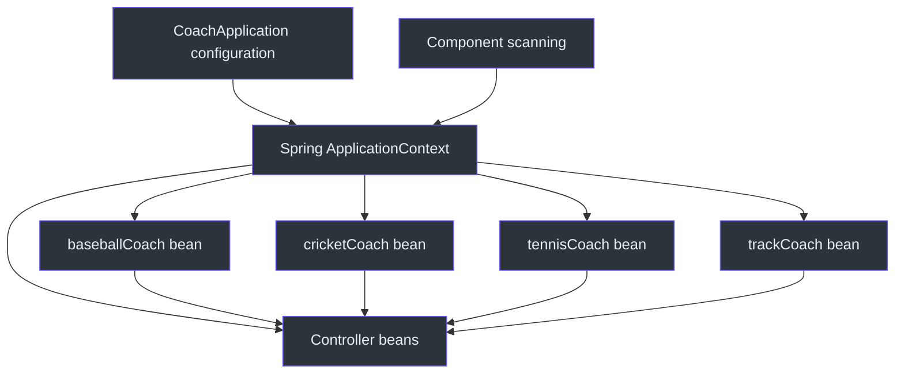
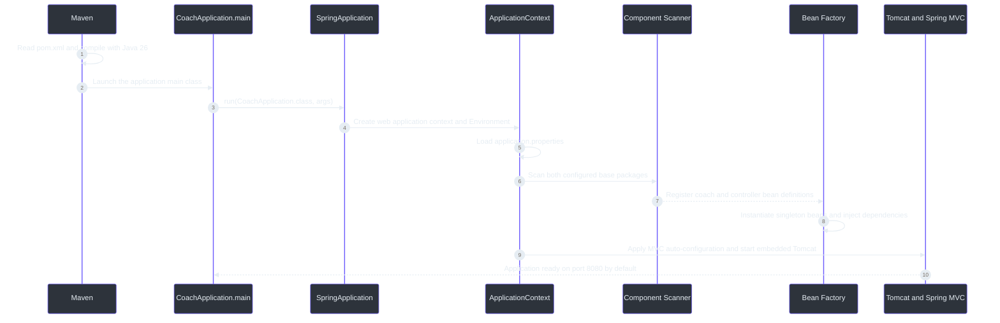
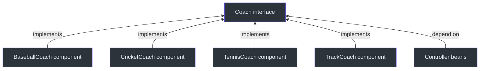
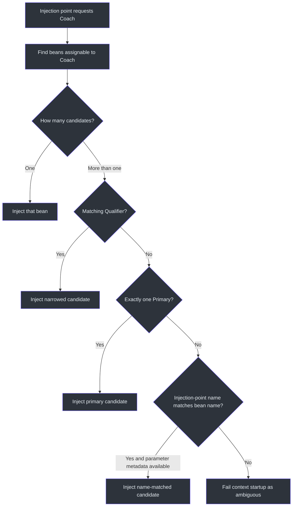
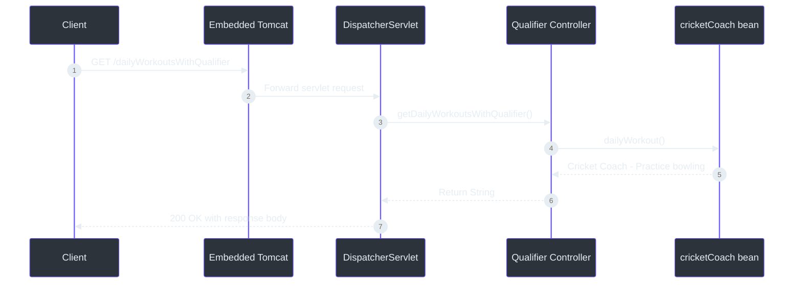

# Spring Core, Dependency Injection, and Qualifiers — Revision Notes

> **Project snapshot:** Spring Boot 4.1.1, Spring Framework 7.0.9, Java 26, Maven 3.9.16, Spring MVC, Actuator, and DevTools. These notes describe the checked-out `coach` project through **15 September 2026**. The course section is **in progress** and will continue in the next lesson.

## 1. Quick revision sheet

| Question | Short answer | Source |
|---|---|---|
| What does `@SpringBootApplication` do? | It combines Boot configuration, auto-configuration, and component scanning on the main application class. | (`src/main/java/com/example/coach/CoachApplication.java:6`) |
| What is IoC? | The application gives control of object creation, assembly, and lifecycle to Spring's container. | [Spring Framework 7.0 — IoC container](https://docs.spring.io/spring-framework/reference/core/beans/introduction.html) |
| What is dependency injection? | An object declares what it needs, and Spring supplies matching beans instead of the object constructing its own dependencies. | [Spring Framework 7.0 — dependencies](https://docs.spring.io/spring-framework/reference/core/beans/dependencies/factory-collaborators.html) |
| What is the application context? | The running Spring container that stores bean definitions, creates beans, connects dependencies, and manages their lifecycle. | [Spring Framework 7.0 — IoC container](https://docs.spring.io/spring-framework/reference/core/beans/introduction.html) |
| What is a bean? | An ordinary Java object whose creation and lifecycle are managed by Spring. | (`src/main/java/com/example/coach/common/CricketCoach.java:5`) |
| What does `@Component` do? | It marks a class as a component-scanning candidate, allowing Spring to register and manage it as a bean. | (`src/main/java/com/example/coach/common/BaseballCoach.java:5`) |
| Which injection style is preferred for required dependencies? | Constructor injection, because requirements are explicit and the dependency reference can be `final`. | (`src/main/java/com/example/coach/common/CoachControllerWithConstructorInjection.java:10`) |
| Is setter injection the same as field injection? | No. Setter injection calls an annotated method; field injection writes directly to an annotated field. | (`src/main/java/com/example/coach/common/CoachControllerWithSetterInjection.java:14`) |
| When is `@Autowired` optional? | A Spring bean with exactly one constructor does not need `@Autowired` on that constructor. | [Spring Framework 7.0 — using `@Autowired`](https://docs.spring.io/spring-framework/reference/core/beans/annotation-config/autowired.html) |
| Why did four `Coach` implementations break startup? | Injection by the interface type found four matching beans, so Spring needed a rule for choosing one. | (`src/main/java/com/example/coach/common/Coach.java:3`) |
| What does `@Qualifier` solve? | It narrows the type-matched candidates for one injection point to the requested bean or qualifier label. | (`src/main/java/com/example/coach/common/CoachControllerWithQualifiers.java:12`) |
| What is `@RestController`? | A controller whose handler return values are written to the HTTP response body; effectively `@Controller` plus `@ResponseBody`. | [Spring Framework 7.0 — `@ResponseBody`](https://docs.spring.io/spring-framework/reference/web/webmvc/mvc-controller/ann-methods/responsebody.html) |

## 2. Lesson snapshot

The project demonstrates Spring's core object-management model through a small `Coach` interface. Four implementations are registered as Spring beans. Four controllers then request a `Coach` dependency and use qualifiers to select different implementations.

| Project part | Current implementation | Learning purpose | Source |
|---|---|---|---|
| Application entry point | `CoachApplication` | Starts Spring Boot and explicitly selects two component-scan roots. | (`src/main/java/com/example/coach/CoachApplication.java:6`) |
| Abstraction | `Coach` | Allows controllers to depend on a contract rather than one concrete coach class. | (`src/main/java/com/example/coach/common/Coach.java:3`) |
| Bean implementations | `BaseballCoach`, `CricketCoach`, `TennisCoach`, `TrackCoach` | Demonstrate multiple Spring beans sharing the same interface type. | (`src/main/java/com/example/coach/common/BaseballCoach.java:5`) |
| Constructor injection | `CoachControllerWithConstructorInjection` | Demonstrates a required, `final` dependency selected with `baseballCoach`. | (`src/main/java/com/example/coach/common/CoachControllerWithConstructorInjection.java:10`) |
| Setter injection | `CoachControllerWithSetterInjection` | Demonstrates injection after construction, selected with `tennisCoach`. | (`src/main/java/com/example/coach/common/CoachControllerWithSetterInjection.java:14`) |
| Qualifier demonstration | `CoachControllerWithQualifiers` | Demonstrates constructor-parameter qualification with `cricketCoach`. | (`src/main/java/com/example/coach/common/CoachControllerWithQualifiers.java:12`) |
| Outside-package scan | `ControllerFromOutsideBasePackage` | Proves that explicit component-scan roots can include an otherwise undiscovered controller. | (`src/main/java/com/example/outsidebasepackage/ControllerFromOutsideBasePackage.java:8`) |
| Context test | `CoachApplicationTests.contextLoads()` | Checks whether Spring can create the current context and resolve every required dependency. | (`src/test/java/com/example/coach/CoachApplicationTests.java:6`) |

### Versions and dependencies

| Item | Current value | Meaning | Source |
|---|---:|---|---|
| Spring Boot parent | `4.1.1` | Controls the compatible dependency and plugin versions. | (`pom.xml:5`) |
| Spring Framework | `7.0.9` | Resolved transitively by Spring Boot 4.1.1; observed with `mvn dependency:tree`. | Observed 2026-09-15 |
| Java release | `26` | Maven compiles this project for Java 26. | (`pom.xml:29`) |
| Maven Wrapper target | `3.9.16` | Version recorded in the wrapper distribution URL. | (`.mvn/wrapper/maven-wrapper.properties:3`) |
| `spring-boot-starter-webmvc` | Compile/runtime | Supplies Spring MVC and the embedded servlet web stack. | (`pom.xml:37`) |
| `spring-boot-starter-actuator` | Compile/runtime | Supplies operational endpoints; Actuator is present but is not the focus of this lesson. | (`pom.xml:33`) |
| `spring-boot-devtools` | Runtime, optional | Supplies development-time restart support and development defaults. | (`pom.xml:42`) |
| Web MVC and Actuator test starters | Test | Supply testing support for the selected starters. | (`pom.xml:48`) |

## 3. Mental model: IoC, DI, context, beans, and components

These terms describe related parts of one process, not five unrelated features.

| Term | Meaning | Memory aid |
|---|---|---|
| **Inversion of Control (IoC)** | The application no longer controls the complete creation and wiring process. Spring's container takes that responsibility. | “Spring controls construction.” |
| **Dependency** | Another object that a class needs to do its work. A controller's `Coach` reference is a dependency. | “What this object needs.” |
| **Dependency Injection (DI)** | Spring supplies a dependency from outside the object through a constructor, method, or field. | “Needs are provided, not searched for.” |
| **Application context** | The Spring IoC container used by the running application. It knows the bean definitions and manages their instances. | “Spring's managed-object registry and factory.” |
| **Bean** | An object instantiated, assembled, and managed by that container. | “An object known to Spring.” |
| **Component** | A class marked for automatic discovery, normally with `@Component` or a specialized stereotype such as `@Controller`. | “A scanned bean candidate.” |


<!-- Sources: src/main/java/com/example/coach/CoachApplication.java:6, src/main/java/com/example/coach/common/BaseballCoach.java:5, src/main/java/com/example/coach/common/CricketCoach.java:5, src/main/java/com/example/coach/common/TennisCoach.java:5, src/main/java/com/example/coach/common/TrackCoach.java:5 -->

### Plain Java construction versus Spring-managed construction

Without DI, a controller could choose and construct its own implementation:

```java
private final Coach coach = new CricketCoach();
```

That tightly couples the controller to `CricketCoach`. Replacing it with `TennisCoach` requires changing the controller itself.

With constructor injection, the controller asks only for the interface:

```java
private final Coach coach;

public CoachControllerWithQualifiers(
        @Qualifier("cricketCoach") Coach coach) {
    this.coach = coach;
}
```

Spring selects the bean and passes it into the constructor. The current implementation is in `CoachControllerWithQualifiers`. (`src/main/java/com/example/coach/common/CoachControllerWithQualifiers.java:10`)

### Which objects are actually managed?

- The four coach implementations are managed because they are discovered through `@Component`.
- The controllers are managed because `@RestController` includes the `@Controller` stereotype, which is a specialized component.
- The `Coach` interface itself is not instantiated; it is only the contract implemented by the four beans.
- An object created manually with `new` is normally an ordinary Java object outside the application context. Spring does not automatically inject dependencies into it or manage its lifecycle.
- A class does not have to use `@Component` to become a bean. A future configuration class can also expose an object using an `@Bean` method. That alternative is not implemented here.

By default, a component bean uses singleton scope: one instance exists for that bean definition inside one application context. This is a Spring-container singleton, not necessarily one instance for the entire JVM. [Official bean scopes](https://docs.spring.io/spring-framework/reference/core/beans/factory-scopes.html)

## 4. `@SpringBootApplication` and application startup

The current application class contains:

```java
@SpringBootApplication(scanBasePackages = {
        "com.example.coach",
        "com.example.outsidebasepackage"
})
public class CoachApplication {
    static void main(String[] args) {
        SpringApplication.run(CoachApplication.class, args);
    }
}
```

The actual code is at `src/main/java/com/example/coach/CoachApplication.java:6`.

### The three capabilities bundled by `@SpringBootApplication`

| Included annotation | Responsibility |
|---|---|
| `@SpringBootConfiguration` | Marks this as the primary Spring Boot configuration class; it is based on Spring's `@Configuration`. |
| `@EnableAutoConfiguration` | Lets Spring Boot configure infrastructure according to the classpath, existing beans, and properties. Because the MVC starter is present, Boot configures the servlet web application. |
| `@ComponentScan` | Finds eligible components in configured packages and registers their bean definitions. |

The official Spring Boot 4.1.1 API defines `@SpringBootApplication` as this composed annotation and documents `scanBasePackages` as an alias for `@ComponentScan`'s `basePackages`. [Spring Boot 4.1.1 API](https://docs.spring.io/spring-boot/api/java/org/springframework/boot/autoconfigure/SpringBootApplication.html)

### What happens after `mvn spring-boot:run`?


<!-- Sources: pom.xml:5, pom.xml:29, src/main/java/com/example/coach/CoachApplication.java:6, src/main/resources/application.properties:1, src/main/java/com/example/coach/common/CoachControllerWithConstructorInjection.java:12 -->

Important distinction: `SpringApplication.run(...)` does much more than call controller methods. It creates the application context first. If one required dependency cannot be resolved, context creation fails and the web server never becomes ready.

## 5. Component scanning and the outside-package experiment

### Default scan behavior

Without an explicit `scanBasePackages`, scanning begins from the package containing the `@SpringBootApplication` class and continues through its subpackages.

```text
com.example.coach                 <- main application package
└── com.example.coach.common      <- included by default

com.example.outsidebasepackage   <- not below com.example.coach
```

Therefore, `com.example.coach.common` is inside the natural scan tree, while `com.example.outsidebasepackage` is outside it.

### Current explicit scan behavior

The project now explicitly declares both roots:

```java
@SpringBootApplication(scanBasePackages = {
        "com.example.coach",
        "com.example.outsidebasepackage"
})
```

Once explicit scan roots are supplied, list every root that must be scanned. Do not assume the original package will be added automatically. That is why the current list correctly includes both `com.example.coach` and `com.example.outsidebasepackage`. (`src/main/java/com/example/coach/CoachApplication.java:6`)


<!-- Sources: src/main/java/com/example/coach/CoachApplication.java:6, src/main/java/com/example/coach/common/BaseballCoach.java:5, src/main/java/com/example/coach/common/CoachControllerWithConstructorInjection.java:7, src/main/java/com/example/outsidebasepackage/ControllerFromOutsideBasePackage.java:8 -->

### Why the outside endpoint originally returned 404

Before adding the outside package to the scan roots, Spring never registered `ControllerFromOutsideBasePackage` as a controller bean. The application could still start because an undiscovered controller is not itself a startup error. Only the requested URL was missing.

When `/dailyWorkoutFromOutsideBasePackage` was requested, `DispatcherServlet` could not find a controller mapping. Its static-resource handler then looked for a resource with that path and also found nothing, producing the observed messages:

```text
Mapped to ResourceHttpRequestHandler
Resource not found for path [dailyWorkoutFromOutsideBasePackage]
No static resource dailyWorkoutFromOutsideBasePackage
Completed 404 NOT_FOUND
```

This does **not** mean the endpoint was supposed to be a static file. It means no controller handler matched, so processing reached the static-resource fallback and that fallback also failed.

At the normal `INFO` logging level, a client-side 404 does not have to produce an obvious console error. Temporarily using `TRACE` exposed Spring MVC's internal mapping decisions. The current project has returned to:

```properties
logging.level.org.springframework=info
```

(`src/main/resources/application.properties:2`)

A narrower future diagnostic setting would be `logging.level.org.springframework.web=trace`; this is an alternative and is not currently active.

> **Future package alternative:** Moving the main application class to the common parent package `com.example` would naturally include both child packages and could remove the need for explicit scan roots. That restructuring is not implemented in this project.

## 6. The `Coach` abstraction and its beans

The interface defines one capability:

```java
public interface Coach {
    String dailyWorkout();
}
```

(`src/main/java/com/example/coach/common/Coach.java:3`)

Each implementation provides a different response and is annotated with `@Component`.

| Class | Default bean name | Returned workout | Source |
|---|---|---|---|
| `BaseballCoach` | `baseballCoach` | `Baseball Coach - Do baseball things` | (`src/main/java/com/example/coach/common/BaseballCoach.java:5`) |
| `CricketCoach` | `cricketCoach` | `Cricket Coach - Practice bowling` | (`src/main/java/com/example/coach/common/CricketCoach.java:5`) |
| `TennisCoach` | `tennisCoach` | `Tennis Coach - Do Tennis things` | (`src/main/java/com/example/coach/common/TennisCoach.java:5`) |
| `TrackCoach` | `trackCoach` | `Track Coach - Do track things` | (`src/main/java/com/example/coach/common/TrackCoach.java:5`) |


<!-- Sources: src/main/java/com/example/coach/common/Coach.java:3, src/main/java/com/example/coach/common/BaseballCoach.java:6, src/main/java/com/example/coach/common/CricketCoach.java:6, src/main/java/com/example/coach/common/TennisCoach.java:6, src/main/java/com/example/coach/common/TrackCoach.java:6 -->

### `@Component` does not inject anything by itself

`@Component` makes a class discoverable and registers its instances for Spring management. Injection happens when another Spring bean declares a dependency and Spring resolves that injection point.

For automatic injection, both sides must be known to Spring:

1. A provider must exist as a bean, such as `CricketCoach` through `@Component`.
2. The consumer must also be a Spring-managed bean, such as a class annotated with `@RestController`.
3. The consumer must declare an injection point, such as its constructor or an `@Autowired` setter.

## 7. Dependency-injection styles

Field, setter, and constructor injection all supply a dependency, but they are not interchangeable Java mechanisms.

| Style | How Spring supplies the dependency | `@Autowired` in this lesson | Can the field naturally be `final`? | Recommended use |
|---|---|---|---|---|
| Constructor injection | Passes the bean while constructing the consumer. | Not needed when the bean has exactly one constructor. | Yes | Required dependencies; preferred default. |
| Setter injection | Constructs the consumer, then calls an annotated method. | Yes, for annotation-driven setter injection. | No | Optional or intentionally replaceable dependencies. |
| Field injection | Constructs the consumer, then assigns an annotated field. | Yes, for annotation-driven field injection. | No practical constructor guarantee | Small demonstrations or legacy code; generally avoid for new code. |

### Constructor injection — implemented

```java
private final Coach coach;

public CoachControllerWithConstructorInjection(
        @Qualifier("baseballCoach") Coach coach) {
    this.coach = coach;
}
```

(`src/main/java/com/example/coach/common/CoachControllerWithConstructorInjection.java:10`)

The IDE suggested `final` because the reference is required during construction and is assigned exactly once. `final` prevents the controller from later being pointed to a different `Coach` reference. It does **not** make the injected coach object immutable.

Constructor injection makes an invalid object harder to create: callers must supply the dependency. It also exposes requirements in the constructor signature and makes plain unit tests easy because a test can call `new Controller(fakeCoach)`.

### Setter injection — implemented

```java
private Coach coach;

@Autowired
public void setCoach(@Qualifier("tennisCoach") Coach coach) {
    this.coach = coach;
}
```

(`src/main/java/com/example/coach/common/CoachControllerWithSetterInjection.java:12`)

The order is:

1. Java constructs the controller object.
2. Spring resolves the `tennisCoach` bean.
3. Spring calls `setCoach(...)`.
4. The controller is ready for normal use.

The field cannot be `final` here because Java requires a blank `final` instance field to be assigned during declaration or construction. A setter executes after construction. The resulting compile error is a Java rule, not a Spring limitation.

### Field injection — discussed but not implemented

```java
@Autowired
@Qualifier("cricketCoach")
private Coach coach;
```

In this annotation-based example, omitting `@Autowired` would leave the field as an ordinary field; Spring would not treat it as that field-injection point.

Field injection is generally avoided for new code because:

- The dependency is hidden from the constructor signature.
- Java allows the object to be constructed manually without supplying the required dependency.
- A plain unit test often needs Spring or reflection to populate a private field.
- The reference cannot conveniently express the required-dependency guarantee with `final`.
- Many injected fields can hide that a class has accumulated too many responsibilities.

### What `@Autowired` actually does

`@Autowired` marks a constructor, field, setter, or configuration method as an injection point. Spring first looks at the required type, gathers matching bean candidates, applies selection rules such as `@Qualifier` or `@Primary`, and supplies the result.

It does not mean “create this exact class.” It means “resolve a suitable bean for this declared dependency.” [Official `@Autowired` reference](https://docs.spring.io/spring-framework/reference/core/beans/annotation-config/autowired.html)

## 8. Multiple beans, ambiguity, qualifiers, and primary beans

### Why startup failed after adding three implementations

Before the extra implementations, requesting a `Coach` produced one candidate: `cricketCoach`. After adding baseball, tennis, and track, the same type request produced four candidates.

```text
Coach dependency
├── baseballCoach
├── cricketCoach
├── tennisCoach
└── trackCoach
```

Spring could not safely guess which behavior the controller intended, so context creation failed with a “required a single bean, but 4 were found” message.

### Why adding one qualifier did not initially fix the application

A qualifier applies only to the injection point where it is written. Adding `@Qualifier("cricketCoach")` to `CoachControllerWithQualifiers` resolved that controller, but the constructor, setter, and outside-package controllers still had unqualified `Coach` dependencies.

Spring creates all singleton controller beans during application-context startup. One unresolved controller is enough to fail the whole context, even if the intended request would target a different controller.

### Current qualifier selections

| Consumer | Injection point | Selected bean | Source |
|---|---|---|---|
| Constructor controller | Constructor parameter | `baseballCoach` | (`src/main/java/com/example/coach/common/CoachControllerWithConstructorInjection.java:12`) |
| Setter controller | Setter parameter | `tennisCoach` | (`src/main/java/com/example/coach/common/CoachControllerWithSetterInjection.java:14`) |
| Qualifier controller | Constructor parameter | `cricketCoach` | (`src/main/java/com/example/coach/common/CoachControllerWithQualifiers.java:12`) |
| Outside-package controller | Constructor parameter | `trackCoach` | (`src/main/java/com/example/outsidebasepackage/ControllerFromOutsideBasePackage.java:13`) |


<!-- Sources: src/main/java/com/example/coach/common/Coach.java:3, src/main/java/com/example/coach/common/CoachControllerWithConstructorInjection.java:13, src/main/java/com/example/coach/common/CoachControllerWithQualifiers.java:12, src/main/java/com/example/coach/common/CoachControllerWithSetterInjection.java:15 -->

### Qualifier naming convention

With an unnamed `@Component`, Spring's default bean name is normally the class name with its initial character changed to lowercase:

```text
CricketCoach -> cricketCoach
BaseballCoach -> baseballCoach
```

Therefore, `@Qualifier("cricketCoach")` is correct for the current bean. `@Qualifier("CricketCoach")` is not the current bean name and qualifier values are case-sensitive.

For this course project, matching the lower-camel-case bean name is clear and easy to trace. In a larger project, semantic labels such as `@Qualifier("indoor")` can be more stable than names tied directly to implementation classes. Spring qualifiers are fundamentally filtering labels within the candidates already selected by type. [Official qualifier reference](https://docs.spring.io/spring-framework/reference/core/beans/annotation-config/autowired-qualifiers.html)

### What the `-parameters` suggestion meant

When no qualifier, primary, or fallback resolves a non-unique dependency, Spring can use an injection-point name that matches a bean name. Retaining constructor parameter names requires compiler parameter metadata.

For example, a parameter named `cricketCoach` may match the bean with that name. The current generic parameter name `coach` matches none of the four beans, so adding `-parameters` alone would not tell Spring which coach was intended. Explicit `@Qualifier` is clearer for this lesson.

### `@Primary` — alternative, not implemented

If one implementation should be the default everywhere, it could be marked:

```java
@Component
@Primary
public class CricketCoach implements Coach {
    // ...
}
```

An unqualified single-valued `Coach` dependency would then receive `cricketCoach`. A qualifier at a particular injection point can still request another candidate. Use `@Primary` for a default policy and `@Qualifier` for a local choice. [Official `@Primary` reference](https://docs.spring.io/spring-framework/reference/core/beans/annotation-config/autowired-primary.html)

If a consumer genuinely needs every implementation, it can request `List<Coach>` or `Map<String, Coach>` instead of a single `Coach`. That alternative is not implemented here.

## 9. `@RestController`, `@Controller`, and the HTTP request path

### `@RestController` versus `@Controller`

| Annotation | Main purpose | Meaning of a returned `String` |
|---|---|---|
| `@RestController` | REST endpoints and response data | Written into the HTTP response body. |
| `@Controller` | Traditional server-rendered MVC | Normally treated as a logical view name unless `@ResponseBody` is added. |

`@RestController` is effectively `@Controller` plus class-level `@ResponseBody`. Both participate in component scanning, but their default handling of method return values differs. [Official MVC response-body reference](https://docs.spring.io/spring-framework/reference/web/webmvc/mvc-controller/ann-methods/responsebody.html)

### What happens for a successful request?


<!-- Sources: src/main/java/com/example/coach/common/CoachControllerWithQualifiers.java:12, src/main/java/com/example/coach/common/CoachControllerWithQualifiers.java:16, src/main/java/com/example/coach/common/CricketCoach.java:8 -->

The injected object is selected during context creation, before the request arrives. The controller does not search the context on every request; it already holds the chosen `Coach` reference.

## 10. Current configuration, commands, and URLs

### `application.properties`

| Property | Current value | Effect | State | Source |
|---|---|---|---|---|
| `spring.application.name` | `coach` | Gives the application a logical name used in logs and integrations; it does not change the URL. | Active | (`src/main/resources/application.properties:1`) |
| `logging.level.org.springframework` | `info` | Shows Spring messages at `INFO` and above. The earlier `TRACE` setting was temporary diagnostic configuration. | Active | (`src/main/resources/application.properties:2`) |
| `server.port` | Not configured | Uses the normal embedded-server port `8080`. | Framework default | (`src/main/resources/application.properties:1`) |
| `server.servlet.context-path` | Not configured | Uses the root context path `/`. | Framework default | (`src/main/resources/application.properties:1`) |

### Endpoint reference

With the current properties and no command-line override:

| URL | Controller and selected bean | Expected response | Source |
|---|---|---|---|
| `http://localhost:8080/dailyWorkoutWithConstructor` | Constructor controller → `baseballCoach` | `Baseball Coach - Do baseball things` | (`src/main/java/com/example/coach/common/CoachControllerWithConstructorInjection.java:17`) |
| `http://localhost:8080/dailyWorkoutWithSetter` | Setter controller → `tennisCoach` | `Tennis Coach - Do Tennis things` | (`src/main/java/com/example/coach/common/CoachControllerWithSetterInjection.java:19`) |
| `http://localhost:8080/dailyWorkoutsWithQualifier` | Qualifier controller → `cricketCoach` | `Cricket Coach - Practice bowling` | (`src/main/java/com/example/coach/common/CoachControllerWithQualifiers.java:16`) |
| `http://localhost:8080/dailyWorkoutFromOutsideBasePackage` | Outside controller → `trackCoach` | `Track Coach - Do track things` | (`src/main/java/com/example/outsidebasepackage/ControllerFromOutsideBasePackage.java:18`) |

Be precise about the third path: the current mapping is plural, `/dailyWorkoutsWithQualifier`.

### Commands

Run these from `02-spring-boot-core\coach`:

```powershell
# Run the test suite
.\mvnw.cmd test

# Start the application
.\mvnw.cmd spring-boot:run

# Build the executable JAR
.\mvnw.cmd clean package

# Run the packaged application
java -jar .\target\coach-0.0.1-SNAPSHOT.jar
```

Before starting the application, check whether port `8080` is already occupied:

```powershell
Get-NetTCPConnection -LocalPort 8080 -State Listen -ErrorAction SilentlyContinue
```

## 11. Testing and observed verification

### What the current test proves

```java
@SpringBootTest
class CoachApplicationTests {
    @Test
    void contextLoads() {
    }
}
```

(`src/test/java/com/example/coach/CoachApplicationTests.java:6`)

This test proves that Spring can build the current application context, scan the configured packages, instantiate the registered beans, and resolve their required dependencies. It caught the multiple-`Coach` ambiguity because that failure occurred during context creation.

It does not prove the endpoint mappings or response bodies. A future focused MVC test could verify those without relying only on manual HTTP requests.

### Observed verification

| Date | Check | Result |
|---|---|---|
| 2026-09-15 | `mvn test` using installed Maven 3.9.16 | Passed: 1 test, 0 failures, 0 errors, 0 skipped; the Spring context started. |
| 2026-09-15 | Dependency tree for Spring context and Web MVC | Resolved Spring Framework 7.0.9 under Spring Boot 4.1.1. |
| 2026-09-15 | Start with command-line override `--server.port=8081` | Application started successfully on temporary test port `8081`. This did not modify `application.properties`. |
| 2026-09-15 | GET all four workout paths on port `8081` | All returned HTTP `200` with Baseball, Tennis, Cricket, and Track responses matching their qualifiers. |
| 2026-09-15 | Stop temporary application | Graceful Tomcat shutdown completed; port `8081` was free afterward. |

### Local Maven Wrapper observation

The preferred command is still `./mvnw.cmd` because the wrapper records Maven 3.9.16. In the current PowerShell tooling environment, the wrapper script stopped before Maven started with:

```text
Cannot index into a null array
Cannot start maven from wrapper
```

For this documentation run, installed Maven 3.9.16 was used as the verification fallback. This is a local wrapper-launch issue, not a failed Spring test. It remains separate from the lesson's application behavior.

## 12. Common mistakes and fixes

| Symptom | Cause | Fix |
|---|---|---|
| `required a single bean, but 4 were found` | Several beans implement `Coach`, and the injection point gives Spring no selection rule. | Add a suitable `@Qualifier`, designate one `@Primary`, or intentionally inject a collection. |
| Adding a qualifier to one controller still leaves startup broken | Another Spring-managed controller still has an ambiguous `Coach` dependency. | Read the class named in the error and resolve every ambiguous injection point. |
| `@Qualifier("CricketCoach")` does not match | The default component bean name is `cricketCoach`, and names are case-sensitive. | Use `@Qualifier("cricketCoach")` or define an explicit semantic qualifier. |
| Error suggests `-parameters`, but ambiguity remains | The generic parameter name `coach` does not match any bean name. | Prefer an explicit qualifier or primary bean for clear intent. |
| Outside-package endpoint returns 404 | Its controller is outside the configured component-scan roots. | Add the required package to `scanBasePackages`, move the class under a scan root, or move the main class to a common parent package. |
| Original controllers disappear after configuring scanning | An explicit package list omitted `com.example.coach`. | Include every required scan root; the current application lists both roots. |
| Logs mention `No static resource` for a controller URL | No controller handler matched, so MVC reached the static-resource fallback. | Correct component scanning or the requested mapping; do not create a static file for a REST endpoint. |
| Browser shows 404 but normal console logs show no obvious error | `INFO` does not display all request-mapping internals. | Temporarily enable web `DEBUG` or `TRACE`, reproduce once, then restore normal logging. |
| Field injection leaves `coach` null | The field is not marked as an injection point, the consumer is not a bean, or no candidate can be resolved. | Prefer constructor injection; otherwise use the correct annotation and ensure both objects are Spring-managed. |
| Setter injection into a `final` field fails to compile | Java requires that `final` reference to be initialized during declaration or construction. | Keep setter-injected fields non-final, or move a required dependency to the constructor. |
| Manually created controller has no injected dependency | `new` bypassed Spring's bean creation process. | Let Spring create the consumer or explicitly supply its constructor dependency in plain Java. |
| `@Controller` method returning text is treated as a view | Plain `@Controller` does not automatically write every return value to the body. | Use `@RestController` or add `@ResponseBody` to the handler. |
| Application never serves requests after a bean error | Context creation failed before the embedded server became ready. | Fix the first bean-creation cause in the startup failure and rerun the context test. |

## 13. Active-recall questions

1. **What are the three main capabilities combined by `@SpringBootApplication`?**

   Boot configuration, auto-configuration, and component scanning.

2. **What is inverted in Inversion of Control?**

   Control of constructing, assembling, and managing application objects moves from application classes to Spring's container.

3. **What is the difference between the application context and a bean?**

   The context is the container; a bean is an object managed by that container.

4. **Does every dependency class have to use `@Component`?**

   It must be registered as a bean, but `@Component` is only one registration method. An `@Bean` method is another method that can be learned later.

5. **Why is the `Coach` interface not itself a bean?**

   It is a contract and cannot be directly instantiated. Its four component implementations become beans.

6. **Why is constructor injection preferred for required dependencies?**

   The dependency is explicit, must be supplied during construction, can be held in a `final` field, and is easy to provide in a plain test.

7. **Why does the only constructor not need `@Autowired`?**

   Spring has exactly one constructor choice and uses it automatically for that bean.

8. **Why does the setter require `@Autowired` here?**

   The annotation marks that method as an injection point that Spring should call with a resolved bean.

9. **Why can a constructor-injected field be `final` while a setter-injected field cannot?**

   Java permits constructor assignment of a blank final field; the setter runs only after construction.

10. **Why is field injection not the same as setter injection?**

    Field injection writes to the field directly; setter injection invokes a method that performs the assignment.

11. **Why did adding four `Coach` implementations cause startup failure?**

    Injection by `Coach` type found four candidates, and Spring had no unique choice.

12. **What is the current default bean name for `CricketCoach`?**

    `cricketCoach`.

13. **Does one qualifier choose a bean globally?**

    No. It narrows candidates only for its own injection point.

14. **When would `@Primary` be better than repeating a qualifier?**

    When one implementation should be the normal default for unqualified injection points.

15. **Why did the outside-package request fall through to a static-resource handler?**

    Its controller had not been scanned, so no controller mapping matched the request.

16. **After supplying `scanBasePackages`, why was `com.example.coach` listed again?**

    The explicit scan list defines the roots to use; every required root must be included.

17. **When is the specific coach selected: for every HTTP request or during bean creation?**

    During application-context bean creation. The controller already holds the chosen reference when a request arrives.

18. **What does `contextLoads()` fail to prove?**

    It does not prove the URLs, HTTP status codes, or response bodies.

## 14. Official references

- [Spring Boot 4.1.1 API — `@SpringBootApplication`](https://docs.spring.io/spring-boot/api/java/org/springframework/boot/autoconfigure/SpringBootApplication.html)
- [Spring Framework 7.0 — IoC container and beans](https://docs.spring.io/spring-framework/reference/core/beans/introduction.html)
- [Spring Framework 7.0 — dependencies and dependency injection](https://docs.spring.io/spring-framework/reference/core/beans/dependencies/factory-collaborators.html)
- [Spring Framework 7.0 — classpath scanning and managed components](https://docs.spring.io/spring-framework/reference/core/beans/classpath-scanning.html)
- [Spring Framework 7.0 — using `@Autowired`](https://docs.spring.io/spring-framework/reference/core/beans/annotation-config/autowired.html)
- [Spring Framework 7.0 — qualifier-based autowiring](https://docs.spring.io/spring-framework/reference/core/beans/annotation-config/autowired-qualifiers.html)
- [Spring Framework 7.0 — `@Primary` and `@Fallback`](https://docs.spring.io/spring-framework/reference/core/beans/annotation-config/autowired-primary.html)
- [Spring Framework 7.0 — bean scopes](https://docs.spring.io/spring-framework/reference/core/beans/factory-scopes.html)
- [Spring Framework 7.0 — `@ResponseBody` and `@RestController`](https://docs.spring.io/spring-framework/reference/web/webmvc/mvc-controller/ann-methods/responsebody.html)

## Related pages

| Page | Relationship |
|---|---|
| [Course index](../../README.md) | Tracks course sections, projects, progress, and navigation. |
| [Cumulative course review](../../COURSE_REVIEW.md) | Distills the most important ideas across the completed lessons. |
| [Section 01 notes](../../01-spring-boot-basics/springBootApp/notes.md) | Reviews the first application, external configuration, Actuator, URLs, and context testing. |
| [Instructor-folder agent guidance](../../AGENTS.md) | Defines how course projects and revision notes should be inspected, written, and verified. |
