# Spring Data JPA setup, entity mapping, and generated IDs

These notes capture the first Spring Data JPA lesson and the follow-up discussion from **2026-09-19**. They explain the current code as implemented, then clearly label alternatives that are not yet part of the project.

Course navigation: [repository README](../../README.md) · [cumulative course review](../../COURSE_REVIEW.md) · [previous Spring Core notes](../../02-spring-boot-core/coach/notes.md)

## Quick revision

| Question | Short answer | Source |
|---|---|---|
| What is JPA? | A Jakarta specification for mapping Java objects to relational data and managing their persistence. Hibernate is the implementation used here. | [`pom.xml:33`](pom.xml#L33) |
| What does `@Entity` do? | Marks `Student` as a persistent entity that JPA can manage. It does not make `Student` a Spring component. | [`Student.java:5`](src/main/java/com/example/cruddemo/entity/Student.java#L5) |
| Why is the no-argument constructor present? | Jakarta Persistence requires an entity to have a public or protected no-argument constructor. | [`Student.java:23`](src/main/java/com/example/cruddemo/entity/Student.java#L23) |
| Why is `IDENTITY` correct here? | The MySQL `id` column is `AUTO_INCREMENT`, so the database generates the value during the insert. | [`Student.java:9`](src/main/java/com/example/cruddemo/entity/Student.java#L9), [`02-student-tracker.sql:10`](../00-starter-sql-scripts/00-starter-sql-scripts/02-student-tracker.sql#L10) |
| Is `AUTO` the same as `IDENTITY`? | No. `IDENTITY` selects one mechanism; `AUTO` delegates the choice to the persistence provider. | [`Student.java:10`](src/main/java/com/example/cruddemo/entity/Student.java#L10) |
| Do mapping annotations create database objects by themselves? | No. Creation depends on schema-generation configuration or an external schema tool/script. | [`application.properties:1`](src/main/resources/application.properties#L1) |
| What does `allocationSize` mean? | A sequence/table generator can reserve a block of identifiers, reducing generator round trips. It is not JDBC statement batching. | Alternative, not currently implemented |
| Why might `Integer` be clearer than `int`? | A new entity can use `null` to mean “no database ID assigned yet”; primitive `int` starts at `0`. | Current field: [`Student.java:12`](src/main/java/com/example/cruddemo/entity/Student.java#L12) |

## 1. Lesson snapshot

| Item | Current project | Source |
|---|---|---|
| Learning goal | Connect Spring Boot to MySQL and map the `student` table to a Java entity. | [`application.properties:2`](src/main/resources/application.properties#L2), [`Student.java:5`](src/main/java/com/example/cruddemo/entity/Student.java#L5) |
| Spring Boot | 4.1.1 | [`pom.xml:5`](pom.xml#L5) |
| Java compilation target | 25 | [`pom.xml:29`](pom.xml#L29) |
| Verification runtime | Java 26.0.1 | Observed on 2026-09-19 with `mvn test` |
| Persistence API | Jakarta Persistence 3.2.0 | Observed with `mvn dependency:tree` on 2026-09-19 |
| ORM provider | Hibernate ORM 7.4.5.Final | Observed with `mvn dependency:tree` and startup logs |
| Database driver | MySQL Connector/J 9.7.0 | Observed with `mvn dependency:tree` |
| Database | `student_tracker` on local MySQL | [`application.properties:2`](src/main/resources/application.properties#L2) |
| Current model | One `Student` entity; no DAO or repository has been implemented yet. | [`Student.java:7`](src/main/java/com/example/cruddemo/entity/Student.java#L7) |
| Current runner | Prints `Hello World` after the application context starts. | [`CruddemoApplication.java:15`](src/main/java/com/example/cruddemo/CruddemoApplication.java#L15) |

The project currently proves **configuration, entity scanning, MySQL connectivity, and JPA startup**. It does not yet prove an insert, select, update, or delete because there is no persistence operation in the runner or test. (`src/main/java/com/example/cruddemo/CruddemoApplication.java:15`, `src/test/java/com/example/cruddemo/CruddemoApplicationTests.java:6`)

## 2. Mental model: Spring Data JPA is a stack

| Layer | Responsibility | Current evidence | Source |
|---|---|---|---|
| Application | Defines domain classes and asks for persistence operations. | `Student` and `CruddemoApplication` | [`Student.java:7`](src/main/java/com/example/cruddemo/entity/Student.java#L7), [`CruddemoApplication.java:8`](src/main/java/com/example/cruddemo/CruddemoApplication.java#L8) |
| Spring Data JPA | Can generate repository implementations and reduce DAO boilerplate. | Dependency is present, but no repository exists yet. | [`pom.xml:33`](pom.xml#L33) |
| Jakarta Persistence | Defines standard annotations and persistence contracts. | `jakarta.persistence.*` annotations | [`Student.java:3`](src/main/java/com/example/cruddemo/entity/Student.java#L3) |
| Hibernate | Implements Jakarta Persistence and translates entity work into SQL. | Brought in by the JPA starter. | [`pom.xml:33`](pom.xml#L33) |
| JDBC and Connector/J | Carry SQL and results between Java and MySQL. | MySQL driver is a runtime dependency. | [`pom.xml:44`](pom.xml#L44) |
| MySQL | Stores the physical `student` rows and generates `AUTO_INCREMENT` IDs. | SQL setup script | [`02-student-tracker.sql:10`](../00-starter-sql-scripts/00-starter-sql-scripts/02-student-tracker.sql#L10) |

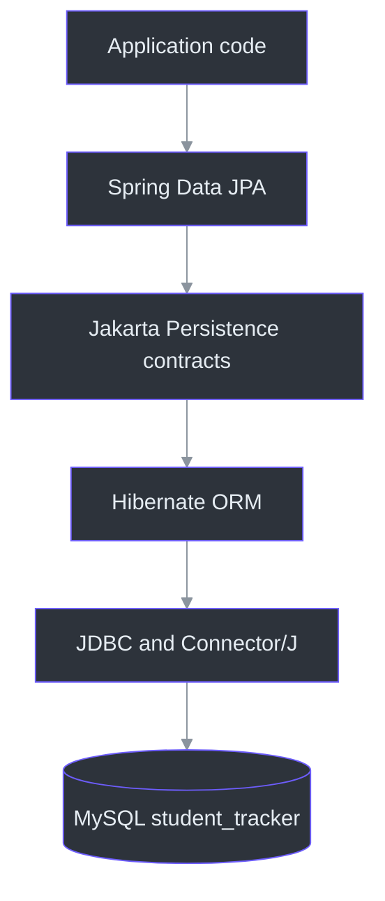
<!-- Sources: pom.xml:33, pom.xml:44, src/main/java/com/example/cruddemo/entity/Student.java:3, ../00-starter-sql-scripts/00-starter-sql-scripts/02-student-tracker.sql:10 -->

**Memory aid:** JPA is the specification, Hibernate is the implementation, Spring Data JPA reduces repository boilerplate, JDBC is the database communication API, and MySQL stores the data.

## 3. Project map and startup path

| File | Responsibility | Source |
|---|---|---|
| `pom.xml` | Selects Spring Boot 4.1.1, Java 25, JPA, MySQL, DevTools, and test dependencies. | [`pom.xml:5`](pom.xml#L5) |
| `CruddemoApplication.java` | Starts Spring Boot and currently runs a simple `CommandLineRunner`. | [`CruddemoApplication.java:7`](src/main/java/com/example/cruddemo/CruddemoApplication.java#L7) |
| `Student.java` | Maps a Java entity to the `student` table. | [`Student.java:5`](src/main/java/com/example/cruddemo/entity/Student.java#L5) |
| `application.properties` | Configures the application identity, MySQL datasource, banner, and attempted log level. | [`application.properties:1`](src/main/resources/application.properties#L1) |
| `CruddemoApplicationTests.java` | Verifies that Spring can create the application context. | [`CruddemoApplicationTests.java:6`](src/test/java/com/example/cruddemo/CruddemoApplicationTests.java#L6) |
| `01-create-user.sql` | Recreates the training database user and grants privileges. | [`01-create-user.sql:1`](../00-starter-sql-scripts/00-starter-sql-scripts/01-create-user.sql#L1) |
| `02-student-tracker.sql` | Creates the database and recreates the `student` table. | [`02-student-tracker.sql:1`](../00-starter-sql-scripts/00-starter-sql-scripts/02-student-tracker.sql#L1) |

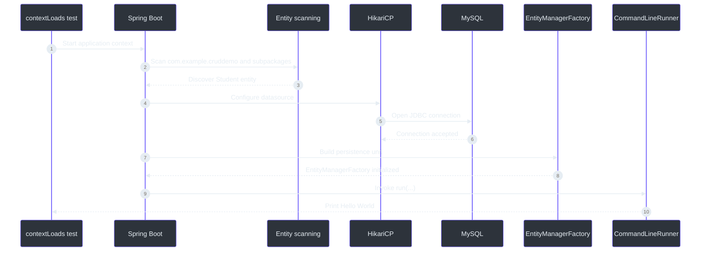
<!-- Sources: src/test/java/com/example/cruddemo/CruddemoApplicationTests.java:6, src/main/java/com/example/cruddemo/CruddemoApplication.java:7, src/main/java/com/example/cruddemo/entity/Student.java:1, src/main/resources/application.properties:2 -->

Because `CruddemoApplication` is in `com.example.cruddemo`, its default scan reaches `com.example.cruddemo.entity.Student`. (`src/main/java/com/example/cruddemo/CruddemoApplication.java:1`, `src/main/java/com/example/cruddemo/entity/Student.java:1`)

## 4. Database setup and object-relational mapping

### 4.1 Current schema

The setup scripts perform two separate jobs:

| Script | Effect | Important caution | Source |
|---|---|---|---|
| `01-create-user.sql` | Drops and recreates the training user, then grants privileges. | Destructive for an existing user with that name; intended for this local course environment. | [`01-create-user.sql:1`](../00-starter-sql-scripts/00-starter-sql-scripts/01-create-user.sql#L1) |
| `02-student-tracker.sql` | Creates `student_tracker`, drops any existing `student` table, then recreates it. | Running it again removes existing student data. | [`02-student-tracker.sql:1`](../00-starter-sql-scripts/00-starter-sql-scripts/02-student-tracker.sql#L1) |

The notes intentionally do not repeat the training password from `application.properties`. Do not use course credentials for a real system. (`src/main/resources/application.properties:2`)

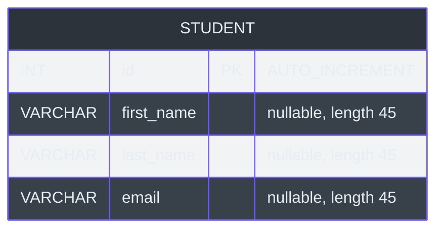
<!-- Sources: ../00-starter-sql-scripts/00-starter-sql-scripts/02-student-tracker.sql:10, src/main/java/com/example/cruddemo/entity/Student.java:9 -->

### 4.2 Mapping table

| Java member | Database column | Notes | Source |
|---|---|---|---|
| `Student` | `student` | `@Table` makes the physical table name explicit. | [`Student.java:5`](src/main/java/com/example/cruddemo/entity/Student.java#L5) |
| `id` | `id` | Primary key; generated by MySQL `AUTO_INCREMENT`. | [`Student.java:9`](src/main/java/com/example/cruddemo/entity/Student.java#L9), [`02-student-tracker.sql:11`](../00-starter-sql-scripts/00-starter-sql-scripts/02-student-tracker.sql#L11) |
| `firstName` | `first_name` | Explicit mapping bridges Java camel case and SQL snake case. | [`Student.java:14`](src/main/java/com/example/cruddemo/entity/Student.java#L14) |
| `lastName` | `last_name` | Explicit mapping remains stable if the Java field is renamed. | [`Student.java:17`](src/main/java/com/example/cruddemo/entity/Student.java#L17) |
| `email` | `email` | Names already match, but the mapping is explicit for consistency. | [`Student.java:20`](src/main/java/com/example/cruddemo/entity/Student.java#L20) |

Useful Workbench checks:

```sql
USE student_tracker;
SHOW TABLES;
DESCRIBE student;
```

These checks confirm the physical schema. The current `contextLoads()` test confirms connectivity and JPA startup but does not execute CRUD against the `student` table. (`src/test/java/com/example/cruddemo/CruddemoApplicationTests.java:6`)

## 5. Every annotation in `Student`

### 5.1 At-a-glance annotation reference

| Annotation | Layer | Meaning in this class | Source |
|---|---|---|---|
| `@Entity` | Jakarta Persistence | Declares `Student` as a persistent entity. | [`Student.java:5`](src/main/java/com/example/cruddemo/entity/Student.java#L5) |
| `@Table(name = "student")` | Jakarta Persistence | Maps the entity to the physical `student` table. | [`Student.java:6`](src/main/java/com/example/cruddemo/entity/Student.java#L6) |
| `@Id` | Jakarta Persistence | Marks the entity identifier and table primary key mapping. | [`Student.java:9`](src/main/java/com/example/cruddemo/entity/Student.java#L9) |
| `@GeneratedValue(strategy = IDENTITY)` | Jakarta Persistence | Says that the database identity/auto-increment column supplies the ID. | [`Student.java:10`](src/main/java/com/example/cruddemo/entity/Student.java#L10) |
| `@Column(name = "...")` | Jakarta Persistence | Connects a persistent field to a named physical column. | [`Student.java:11`](src/main/java/com/example/cruddemo/entity/Student.java#L11) |
| `@Override` | Java | Lets the compiler verify that `toString()` overrides `Object.toString()`. It is not a JPA annotation. | [`Student.java:63`](src/main/java/com/example/cruddemo/entity/Student.java#L63) |

Official Jakarta Persistence references: [`@Entity`](https://jakarta.ee/specifications/persistence/3.2/apidocs/jakarta.persistence/jakarta/persistence/entity), [`@Table`](https://jakarta.ee/specifications/persistence/3.2/apidocs/jakarta.persistence/jakarta/persistence/table), [`@Id`](https://jakarta.ee/specifications/persistence/3.2/apidocs/jakarta.persistence/jakarta/persistence/id), [`@GeneratedValue`](https://jakarta.ee/specifications/persistence/3.2/apidocs/jakarta.persistence/jakarta/persistence/generatedvalue), and [`@Column`](https://jakarta.ee/specifications/persistence/3.2/apidocs/jakarta.persistence/jakarta/persistence/column).

### 5.2 `@Entity` is not `@Component`

`@Entity` makes the class part of the persistence model. It does not register each `Student` row as a singleton Spring bean. Hibernate creates, loads, tracks, and persists entity instances through a persistence context. The class is discovered because it sits under the application's scan root. (`src/main/java/com/example/cruddemo/entity/Student.java:1`, `src/main/java/com/example/cruddemo/CruddemoApplication.java:1`)

### 5.3 Why the no-argument constructor exists

The public no-argument constructor allows the persistence provider to instantiate the entity when reading a database row. The three-argument constructor is an application convenience for creating a new student without manually assigning the generated ID. (`src/main/java/com/example/cruddemo/entity/Student.java:23`)

```java
Student student = new Student("John", "Doe", "john@example.com");
```

### 5.4 Field-based access

Because `@Id` is placed on the `id` field, the entity uses field access: Hibernate reads and writes persistent fields directly. Placing mapping annotations on getters would select property access instead. (`src/main/java/com/example/cruddemo/entity/Student.java:9`)

The getters and setters remain useful to ordinary application code, even though field access does not require Hibernate to call them for persistence. (`src/main/java/com/example/cruddemo/entity/Student.java:31`)

## 6. Explicit column names and refactoring safety

### 6.1 Default versus explicit mapping

| Choice | Example | Coupling | Tradeoff |
|---|---|---|---|
| Implicit column name | `private String firstName;` | Mapping depends on the Java property name and provider naming strategy. | Less annotation code, but refactors and provider changes can affect the physical name. |
| Explicit column name | `@Column(name = "first_name")` | Java name is decoupled from the existing physical column name. | More annotation code, but the database contract is visible. |

Jakarta Persistence defines the default `@Column` name as the mapped field or property name. Hibernate can then apply implicit and physical naming strategies. The current explicit annotations avoid relying on that conversion. [Official `@Column` defaults](https://jakarta.ee/specifications/persistence/3.2/apidocs/jakarta.persistence/jakarta/persistence/column) and [Hibernate naming strategies](https://docs.hibernate.org/orm/7.4/userguide/html_single/#naming).

### 6.2 Refactoring example

Current mapping:

```java
@Column(name = "first_name")
private String firstName;
```

If Java later renames the field while the database remains unchanged:

```java
@Column(name = "first_name")
private String givenName;
```

the physical mapping still targets `first_name`. Without the explicit mapping, a naming strategy could derive `given_name`, while the existing database still contains `first_name`.

**Conclusion:** the instructor's guidance is correct. Explicit names are especially useful for pre-existing, shared, or migration-managed schemas. They are not mandatory when conventions are intentionally accepted, and they do not replace database migrations when the physical schema itself changes.

## 7. Primary-key generation strategies

### 7.1 Strategy comparison

Jakarta Persistence 3.2 defines five strategies. The older four-strategy explanation usually predates standard `UUID` support. [Official `GenerationType`](https://jakarta.ee/specifications/persistence/3.2/apidocs/jakarta.persistence/jakarta/persistence/generationtype).

| Strategy | Who supplies the value? | When is the ID known? | Main tradeoff | Current project? |
|---|---|---|---|---|
| `IDENTITY` | Database identity/auto-increment column | After the insert produces a generated key | Simple, but Hibernate cannot freely batch those inserts. | **Yes** |
| `SEQUENCE` | Database sequence, or provider-specific sequence-style backing | Before the row insert | Efficient allocation and batching; needs a sequence or supported emulation. | No |
| `TABLE` | A separate generator table | Before the entity insert | Portable but adds reads, updates, and locking on the generator row. | No |
| `UUID` | Persistence provider generates an RFC 4122 UUID | Before the insert | Distributed generation, but larger keys and indexes. | No |
| `AUTO` | Persistence provider chooses | Depends on the chosen mechanism | Portable declaration, but less predictable across providers and databases. | No |

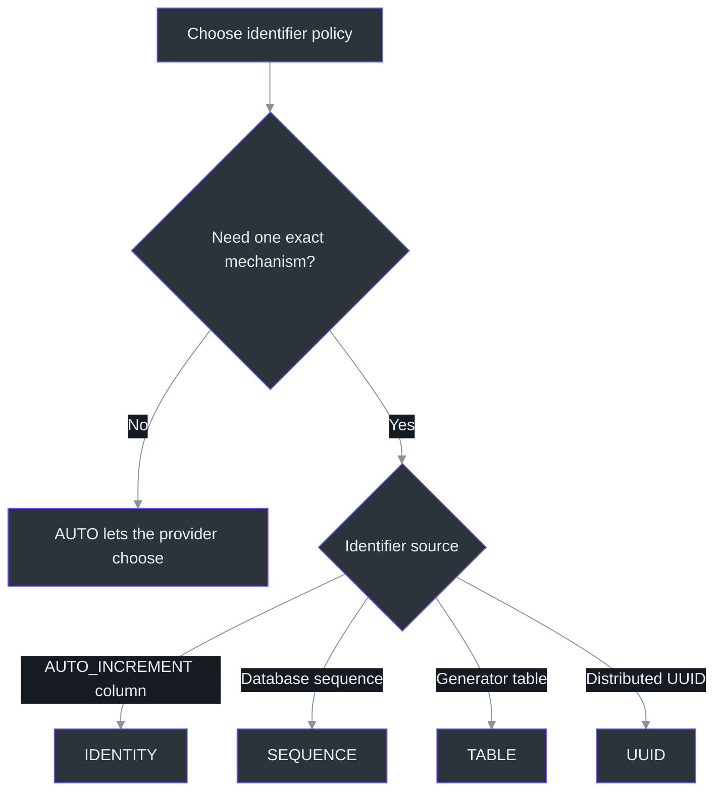
<!-- Sources: src/main/java/com/example/cruddemo/entity/Student.java:9, ../00-starter-sql-scripts/00-starter-sql-scripts/02-student-tracker.sql:11, Jakarta Persistence 3.2 GenerationType -->

### 7.2 `IDENTITY`: the current mechanism

```java
@Id
@GeneratedValue(strategy = GenerationType.IDENTITY)
private int id;
```

The MySQL table uses `AUTO_INCREMENT`, so the database generates the ID as part of the insert. Hibernate retrieves the generated key and places it into the entity. (`src/main/java/com/example/cruddemo/entity/Student.java:9`, `../00-starter-sql-scripts/00-starter-sql-scripts/02-student-tracker.sql:11`)

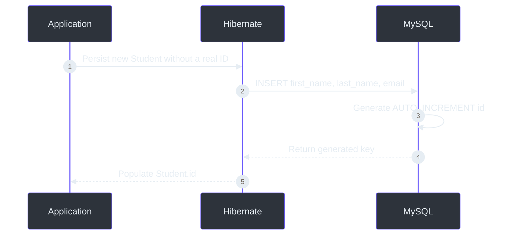
<!-- Sources: src/main/java/com/example/cruddemo/entity/Student.java:9, ../00-starter-sql-scripts/00-starter-sql-scripts/02-student-tracker.sql:10 -->

### 7.3 `AUTO` is delegation, not another auto-increment keyword

`AUTO` means “let the provider select an appropriate strategy.” `IDENTITY` means “use a database identity column.” They can occasionally lead to similar behavior, but their contracts differ.

For a numeric ID, Jakarta Persistence permits `AUTO` to resolve to `TABLE`, `SEQUENCE`, or `IDENTITY`. Hibernate 7.4 documents that its numeric `AUTO` handling uses a sequence-style generator, choosing a native sequence when supported and a table-backed form otherwise. Therefore, changing this project from `IDENTITY` to `AUTO` should not be assumed to preserve MySQL `AUTO_INCREMENT` behavior. [Hibernate 7.4 generated identifiers](https://docs.hibernate.org/orm/7.4/userguide/html_single/#identifiers-generators).

### 7.4 `SEQUENCE`

A sequence is a database object whose job is to produce numbers. Hibernate can request a value before inserting the entity, which makes the identifier available earlier and supports efficient insert batching.

Alternative, not implemented here:

```java
@SequenceGenerator(
        name = "student_sequence",
        sequenceName = "student_sequence",
        allocationSize = 50
)
@GeneratedValue(
        strategy = GenerationType.SEQUENCE,
        generator = "student_sequence"
)
private Long id;
```

`@SequenceGenerator` describes the sequence resource and allocation policy. It does not independently execute DDL merely because the annotation exists. Schema generation or a migration must supply the resource when the provider/database does not create or emulate it.

### 7.5 `TABLE`

`TABLE` identifier generation uses an additional table that stores generator state. That generator table is **not** the entity's `student` table and is unrelated to the class-level `@Table(name = "student")` annotation.

Alternative, not implemented here:

```java
@TableGenerator(
        name = "student_generator",
        table = "id_generator",
        pkColumnName = "generator_name",
        valueColumnName = "next_value",
        pkColumnValue = "student",
        allocationSize = 50
)
@GeneratedValue(
        strategy = GenerationType.TABLE,
        generator = "student_generator"
)
private Long id;
```

The provider reserves IDs by reading and updating the generator row, often with locking. This is portable but adds overhead and can create contention compared with native sequences.

### 7.6 `UUID`

Alternative, not implemented here:

```java
@Id
@GeneratedValue(strategy = GenerationType.UUID)
private UUID id;
```

UUIDs can be generated without coordinating with one central auto-increment counter, which is useful across distributed systems. They require a `UUID` or `String` Java identifier and an appropriate database mapping; they are not compatible with the current `int AUTO_INCREMENT` field without changing both Java and SQL.

### 7.7 Manually assigned IDs

Omitting `@GeneratedValue` leaves identifier assignment to application code:

```java
@Id
private String id;
```

This is not a `GenerationType`. The application must assign a unique ID before persistence and must prevent collisions.

## 8. Do sequence and generator-table resources appear automatically?

### 8.1 Annotation metadata versus DDL execution

| Concern | Controls it | Current state |
|---|---|---|
| Mapping Java to an existing table/sequence | JPA annotations | Present for `Student` |
| Automatically creating or modifying schema | `spring.jpa.hibernate.ddl-auto` or Jakarta schema-generation settings | Not configured |
| Repeatable production schema changes | Migration tooling such as Flyway/Liquibase or controlled SQL scripts | Course SQL scripts are currently used manually |

An annotation says **what resource Hibernate should use**. Whether Hibernate creates that resource is a separate schema-generation decision.

| `ddl-auto` value | Behavior | Suitability |
|---|---|---|
| `none` | Does not create, modify, or validate the schema. | Safe when scripts/migrations own schema creation. |
| `validate` | Fails startup if mappings and schema disagree; does not modify schema. | Useful for deployment verification. |
| `update` | Attempts to bring the schema toward the mapping without dropping everything. | Convenient for local learning; not a replacement for reviewed migrations. |
| `create` | Recreates the schema at startup. | Disposable development/test data only. |
| `create-drop` | Creates at startup and drops at shutdown. | Disposable tests/demos. |

The current external MySQL application does not set `spring.jpa.hibernate.ddl-auto`. Spring Boot only creates JPA databases by default for supported embedded databases, so the course's manual MySQL scripts remain authoritative. [Spring Boot 4.1.1 SQL database initialization](https://docs.spring.io/spring-boot/reference/data/sql.html#data.sql.jpa-and-spring-data.creating-and-dropping-jpa-databases).

**Practical answer:** with the current configuration, create required tables or sequences in advance. Enabling `create`, `create-drop`, or `update` can let Hibernate generate supported objects, but production applications normally use versioned migrations.

## 9. `allocationSize` and JDBC batch size are different

### 9.1 Comparison

| Setting | What it groups | Goal | Current project? |
|---|---|---|---|
| Generator `allocationSize` | A block of future identifier values | Reduce sequence/generator-table round trips. | No |
| `hibernate.jdbc.batch_size` | Several SQL insert/update/delete statements sent through JDBC | Reduce statement/network overhead. | No |

### 9.2 Identifier allocation example

With `allocationSize = 50`, a provider can reserve a range and assign IDs from memory instead of contacting the generator for every new entity.

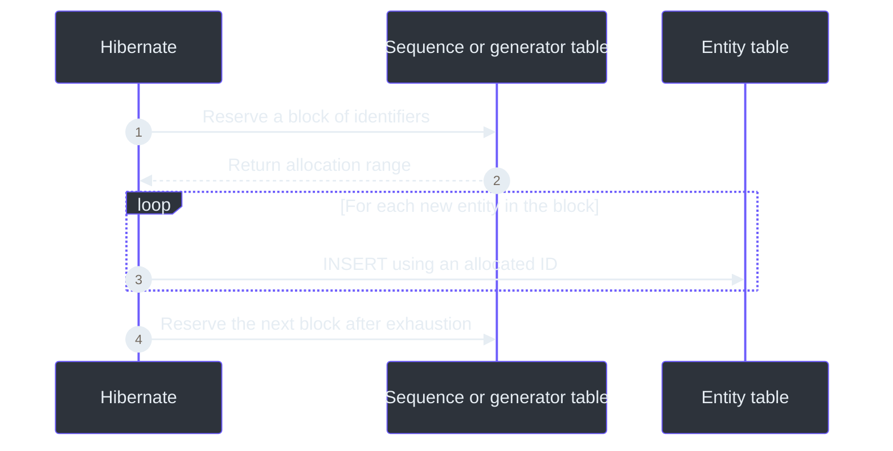
<!-- Sources: Jakarta Persistence SequenceGenerator and TableGenerator alternatives; current project does not configure allocationSize -->

Reserved but unused values can produce gaps after a crash or restart. Primary keys guarantee identity, not gap-free business numbering.

### 9.3 JDBC batching example

Alternative, not implemented here:

```properties
spring.jpa.properties.hibernate.jdbc.batch_size=50
```

This asks Hibernate to group compatible SQL statements into JDBC batches. It does not reserve IDs. `IDENTITY` generation can limit insert batching because Hibernate must execute each insert to learn its database-generated key. [Hibernate 7.4 IDENTITY behavior](https://docs.hibernate.org/orm/7.4/userguide/html_single/#identifiers-generators-identity).

## 10. `int`, `Integer`, and `Long` for generated IDs

### 10.1 Comparison

| Java type | Unsaved default | Meaning before persistence | Database pairing |
|---|---:|---|---|
| `int` | `0` | Works, but cannot directly express “no value.” | Current SQL `INT` |
| `Integer` | `null` | Clearly represents “no generated ID assigned yet.” | SQL `INT` |
| `Long` | `null` | Same clear unsaved state and a much larger range. | Usually SQL `BIGINT` |

The current `int` field is valid and works with the course schema. (`src/main/java/com/example/cruddemo/entity/Student.java:12`, `../00-starter-sql-scripts/00-starter-sql-scripts/02-student-tracker.sql:11`)

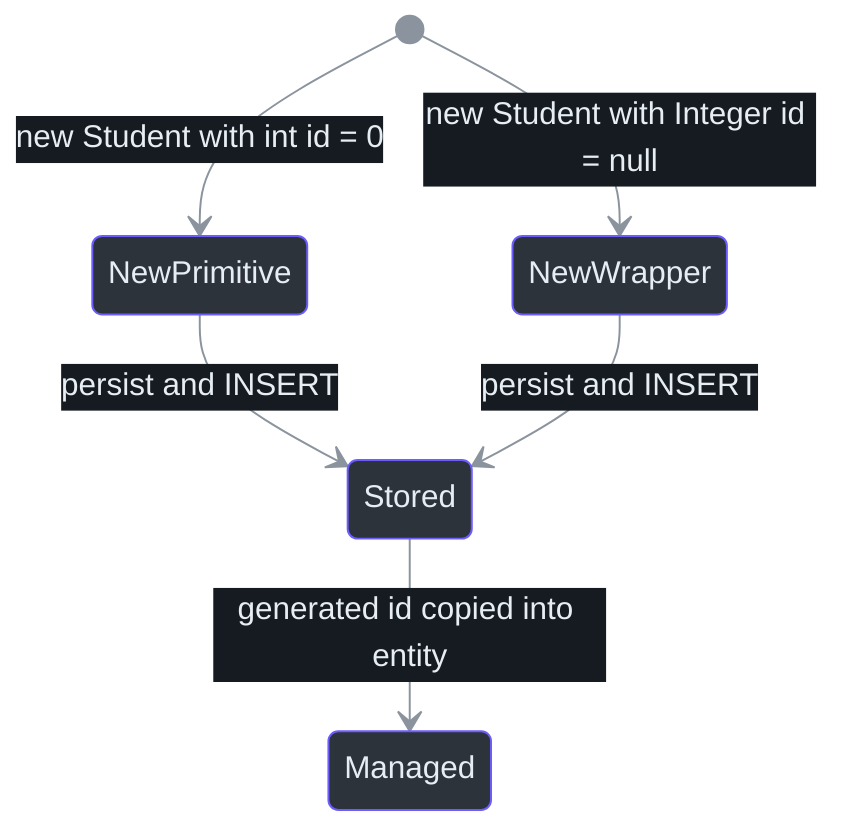
<!-- Sources: src/main/java/com/example/cruddemo/entity/Student.java:12, src/main/java/com/example/cruddemo/entity/Student.java:23, ../00-starter-sql-scripts/00-starter-sql-scripts/02-student-tracker.sql:11 -->

The important point is not that `int` is broken. It is that `Integer` can represent two states naturally:

```text
null  -> no database ID assigned yet
1     -> database ID assigned
```

With primitive `int`, a new object contains `0` because Java primitives cannot be null. In this schema, auto-increment values start at 1, so `0` is effectively an unsaved sentinel, but that meaning is a convention rather than a type-level distinction.

If the current field changes to `Integer`, update the getter and setter types as well. If it changes to `Long`, the database column should normally change from `INT` to `BIGINT` through a schema migration. These are suggested alternatives, not current implementation changes.

## 11. Configuration reference

| Property | Active value or state | Effect | Source |
|---|---|---|---|
| `spring.application.name` | `cruddemo` | Logical application name used in logging and application identity. | [`application.properties:1`](src/main/resources/application.properties#L1) |
| `spring.datasource.url` | Local MySQL `student_tracker` URL | Selects server, port, and database catalog. | [`application.properties:2`](src/main/resources/application.properties#L2) |
| `spring.datasource.username` | Training user | Authenticates the datasource. | [`application.properties:3`](src/main/resources/application.properties#L3) |
| `spring.datasource.password` | Present in the source file | Authenticates the datasource; intentionally not repeated in these notes. | [`application.properties:4`](src/main/resources/application.properties#L4) |
| `spring.main.banner-mode` | `off` | Suppresses the Spring Boot banner. | [`application.properties:6`](src/main/resources/application.properties#L6) |
| `logging..level.root` | `debug` | Contains an extra dot; correct documented key is `logging.level.root`. | [`application.properties:9`](src/main/resources/application.properties#L9) |
| `spring.jpa.hibernate.ddl-auto` | Not configured | External MySQL defaults to no automatic schema creation in this setup. | [`application.properties:1`](src/main/resources/application.properties#L1) |

The logging typo does not block datasource or JPA startup, but it should be corrected before relying on the setting:

```properties
logging.level.root=debug
```

## 12. Observed verification on 2026-09-19

| Check | Result | What it proves |
|---|---|---|
| `mvn dependency:tree` | **Passed** | Resolved Boot 4.1.1, Jakarta Persistence 3.2.0, Hibernate 7.4.5.Final, and MySQL Connector/J 9.7.0. |
| `mvn test -q "-Dlogging.level.root=INFO"` | **Passed** — 1 test, 0 failures/errors | Spring created the context, opened a MySQL connection, and initialized the JPA `EntityManagerFactory`. |
| Startup repository scan | Found 0 JPA repository interfaces | Expected at this lesson stage; none exists in source yet. |
| `CommandLineRunner` | Printed `Hello World` | The runner executed after context startup. (`src/main/java/com/example/cruddemo/CruddemoApplication.java:15`) |
| Maven Wrapper | Failed before Maven with `Cannot index into a null array` | Local wrapper-launch problem; installed Maven 3.9.16 was the verified fallback. (`.mvn/wrapper/maven-wrapper.properties:1`) |
| Database compatibility log | Warned that MySQL 5.7.19 is below Hibernate's supported minimum of 8.0 | Connectivity works, but upgrade MySQL before relying on full Hibernate 7.4 behavior. |

The test is deliberately limited:

```java
@SpringBootTest
class CruddemoApplicationTests {
    @Test
    void contextLoads() {
    }
}
```

It proves context and datasource/JPA startup. It does **not** prove that `student` CRUD works, that column values round-trip correctly, or that generated IDs are returned. A later focused persistence test or runner operation should verify those behaviors. (`src/test/java/com/example/cruddemo/CruddemoApplicationTests.java:6`)

## 13. Common mistakes

| Symptom or belief | Cause | Correction |
|---|---|---|
| “`AUTO` means auto-increment.” | `AUTO` delegates the strategy choice to the provider. | Use `IDENTITY` when the schema contract is specifically an identity/`AUTO_INCREMENT` column. |
| “`@SequenceGenerator` creates the sequence.” | Mapping metadata and schema generation are separate concerns. | Create resources through migrations/scripts or deliberately enable schema generation. |
| “`GenerationType.TABLE` uses my `student` table.” | It needs a separate table that stores generator state. | Distinguish entity tables from ID-generator tables. |
| “`allocationSize = 50` inserts 50 rows together.” | Identifier allocation is being confused with JDBC batching. | Allocation reserves IDs; `hibernate.jdbc.batch_size` groups SQL statements. |
| “An ID must never have gaps.” | Allocated, rolled-back, deleted, or failed transactions can leave gaps. | Treat primary keys as identifiers, not business sequence numbers. |
| “Primitive `int` is invalid for an entity ID.” | Wrapper guidance was interpreted as a requirement. | `int` works here; `Integer` merely represents the unsaved state more clearly. |
| “No `@Column` means no persistence.” | Basic fields are persistent by default. | `@Column` is optional when defaults and naming conventions match. |
| “Explicit names remove the need for migrations.” | An annotation maps to a schema; it does not rename production columns safely. | Change the database through a migration and keep mappings synchronized. |
| “Passing `contextLoads()` proves CRUD.” | The test executes no persistence operation. | Add focused insert/read/update/delete verification later. |
| “The startup warning can be ignored forever.” | MySQL 5.7.19 is below Hibernate 7.4's stated support floor. | Plan a MySQL 8.0+ upgrade for reliable compatibility. |

## 14. Active-recall questions

1. **What is the difference between JPA and Hibernate?**
   JPA defines the persistence standard; Hibernate implements it.

2. **What does Spring Data JPA add?**
   Repository abstractions and generated implementations that reduce data-access boilerplate.

3. **Does `@Entity` make each student a Spring bean?**
   No. It makes `Student` part of the JPA persistence model.

4. **Why does `Student` need a no-argument constructor?**
   The persistence provider needs a supported way to instantiate the entity when loading data.

5. **What determines field versus property access?**
   The placement of mapping annotations, especially `@Id`; here they are on fields.

6. **What does `@Table(name = "student")` name?**
   The physical entity table, not an identifier-generator table.

7. **What does `@Id` mean?**
   The annotated field or property identifies each entity row uniquely.

8. **Why does `IDENTITY` fit this project?**
   The SQL schema declares `id INT AUTO_INCREMENT`.

9. **What is the shortest difference between `AUTO` and `IDENTITY`?**
   `AUTO` delegates; `IDENTITY` specifies.

10. **Can `AUTO` choose a generator table?**
    Yes. For numeric IDs, the provider may choose table-, sequence-, or identity-based generation.

11. **What additional database object does `SEQUENCE` use?**
    A database sequence or provider-supported sequence-style backing resource.

12. **What additional database object does `TABLE` use?**
    A generator table that stores the next value or allocation state.

13. **Do the annotations alone create those objects?**
    No. Schema generation or external migrations/scripts control creation.

14. **What does `ddl-auto=validate` do?**
    It checks mapping/schema compatibility without modifying the database.

15. **Why avoid relying on `ddl-auto=update` for production evolution?**
    It does not provide the reviewed, versioned, reversible history of a migration tool.

16. **What does `allocationSize = 50` optimize?**
    Identifier-generator round trips by reserving a block of IDs.

17. **Does `allocationSize` guarantee consecutive IDs?**
    No. Reserved values, rollbacks, crashes, and deletions can create gaps.

18. **What does `hibernate.jdbc.batch_size` optimize?**
    It groups compatible SQL statements into JDBC batches.

19. **Why can `IDENTITY` interfere with insert batching?**
    Hibernate must execute an insert to obtain that row's database-generated ID.

20. **What is a new entity's `int id` before persistence?**
    `0`, Java's primitive default.

21. **What is a new entity's `Integer id` before persistence?**
    `null`, which clearly communicates that no generated value exists yet.

22. **Is `int` wrong in the current entity?**
    No. It is valid; `Integer` is an optional clarity improvement.

23. **When changing from `Integer` to `Long`, what database change is normally paired with it?**
    Change `INT` to `BIGINT` through a schema migration.

24. **Why keep explicit `@Column` names?**
    They document and stabilize the Java-to-database contract across Java refactors and naming-strategy changes.

25. **What did today's test actually verify?**
    Spring context startup, MySQL connectivity, entity discovery, and JPA `EntityManagerFactory` initialization—not CRUD.

## 15. Official references

- [Spring Boot 4.1.1 — SQL databases and JPA](https://docs.spring.io/spring-boot/reference/data/sql.html)
- [Jakarta Persistence 3.2 — `@Entity`](https://jakarta.ee/specifications/persistence/3.2/apidocs/jakarta.persistence/jakarta/persistence/entity)
- [Jakarta Persistence 3.2 — `@Table`](https://jakarta.ee/specifications/persistence/3.2/apidocs/jakarta.persistence/jakarta/persistence/table)
- [Jakarta Persistence 3.2 — `@Id`](https://jakarta.ee/specifications/persistence/3.2/apidocs/jakarta.persistence/jakarta/persistence/id)
- [Jakarta Persistence 3.2 — `@GeneratedValue`](https://jakarta.ee/specifications/persistence/3.2/apidocs/jakarta.persistence/jakarta/persistence/generatedvalue)
- [Jakarta Persistence 3.2 — `GenerationType`](https://jakarta.ee/specifications/persistence/3.2/apidocs/jakarta.persistence/jakarta/persistence/generationtype)
- [Jakarta Persistence 3.2 — `@Column`](https://jakarta.ee/specifications/persistence/3.2/apidocs/jakarta.persistence/jakarta/persistence/column)
- [Jakarta Persistence 3.2 — `@SequenceGenerator`](https://jakarta.ee/specifications/persistence/3.2/apidocs/jakarta.persistence/jakarta/persistence/sequencegenerator)
- [Jakarta Persistence 3.2 — `@TableGenerator`](https://jakarta.ee/specifications/persistence/3.2/apidocs/jakarta.persistence/jakarta/persistence/tablegenerator)
- [Hibernate ORM 7.4 — user guide](https://docs.hibernate.org/orm/7.4/userguide/html_single/)

## 16. Lesson update — 2026-09-19: DAO operations, transactions, MySQL counters, and custom queries

> **History note:** Sections 1–15 describe the project at its initial entity-mapping stage. The source has since progressed: it now contains a manual DAO, `EntityManager` persistence and lookup operations, HQL/JPQL retrieval methods, and runner methods for observing query output. The earlier snapshot remains useful as the record of what had been implemented at that point.

### 16.1 Quick revision for this lesson

| Question | Short answer | Source |
|---|---|---|
| What does the DAO interface provide? | A persistence contract that callers can depend on without coupling themselves to `StudentDAOImpl`. | [`StudentDAO.java:7`](src/main/java/com/example/cruddemo/dao/StudentDAO.java#L7) |
| Why is the implementation marked `@Repository`? | It becomes a scanned Spring bean, communicates that it belongs to the data-access layer, and is eligible for persistence-exception translation. | [`StudentDAOImpl.java:12`](src/main/java/com/example/cruddemo/dao/StudentDAOImpl.java#L12) |
| What does `@Transactional` do on `save()`? | It creates or joins a transaction so `persist()` can be synchronized with the database and committed as one unit of work. | [`StudentDAOImpl.java:23`](src/main/java/com/example/cruddemo/dao/StudentDAOImpl.java#L23) |
| Why does `findById()` not require `@Transactional` here? | A normal lookup without a lock may execute without an explicit transaction. It still uses JPA and can still query the database. | [`StudentDAOImpl.java:29`](src/main/java/com/example/cruddemo/dao/StudentDAOImpl.java#L29) |
| Why did lowering `AUTO_INCREMENT` from `1000` to `1` not reuse IDs? | Existing rows had IDs through `1002`; MySQL cannot make the next generated value lower than the current maximum row ID. | User-observed result; schema: [`02-student-tracker.sql:11`](../00-starter-sql-scripts/00-starter-sql-scripts/02-student-tracker.sql#L11) |
| What is the shortest difference between JPQL and HQL? | JPQL is the Jakarta Persistence standard; HQL is Hibernate's query language and includes Hibernate-specific capabilities. | Current examples: [`StudentDAOImpl.java:34`](src/main/java/com/example/cruddemo/dao/StudentDAOImpl.java#L34), [`StudentDAOImpl.java:52`](src/main/java/com/example/cruddemo/dao/StudentDAOImpl.java#L52) |
| Why is the type `TypedQuery<Student>` instead of `TypedQuery<List<Student>>`? | The generic type describes one result item. `getResultList()` wraps those items in `List<Student>`. | [`StudentDAOImpl.java:35`](src/main/java/com/example/cruddemo/dao/StudentDAOImpl.java#L35) |
| Why do the two concatenated last-name queries fail? | They produce query text such as `lastName = lastName B`; the value is neither quoted as a string literal nor bound as a parameter. | [`StudentDAOImpl.java:70`](src/main/java/com/example/cruddemo/dao/StudentDAOImpl.java#L70) |
| What is the rule for dynamic query values? | Bind them with `setParameter()`; do not concatenate untrusted or variable text into the query. | [`StudentDAOImpl.java:82`](src/main/java/com/example/cruddemo/dao/StudentDAOImpl.java#L82) |

### 16.2 Updated project map

| File or class | Current responsibility | Source |
|---|---|---|
| `StudentDAO` | Declares save, primary-key lookup, ordered list, and last-name query operations. | [`StudentDAO.java:7`](src/main/java/com/example/cruddemo/dao/StudentDAO.java#L7) |
| `StudentDAOImpl` | Implements the DAO with a Spring-injected `EntityManager`. | [`StudentDAOImpl.java:12`](src/main/java/com/example/cruddemo/dao/StudentDAOImpl.java#L12) |
| `CruddemoApplication` | Injects the DAO interface and runs one or more lesson demonstrations through `CommandLineRunner`. | [`CruddemoApplication.java:22`](src/main/java/com/example/cruddemo/CruddemoApplication.java#L22) |
| `Student` | Remains the JPA entity mapped to the physical `student` table. | [`Student.java:5`](src/main/java/com/example/cruddemo/entity/Student.java#L5) |
| `application.properties` | Configures MySQL, disables the banner, and currently enables root-level DEBUG logging. | [`application.properties:1`](src/main/resources/application.properties#L1) |
| `CruddemoApplicationTests` | Starts the full Spring context; therefore it also executes the active `CommandLineRunner`. | [`CruddemoApplicationTests.java:6`](src/test/java/com/example/cruddemo/CruddemoApplicationTests.java#L6), [`CruddemoApplication.java:28`](src/main/java/com/example/cruddemo/CruddemoApplication.java#L28) |

The current dependency is the interface:

```java
private final StudentDAO studentDAO;

public CruddemoApplication(StudentDAO studentDAO) {
    this.studentDAO = studentDAO;
}
```

Spring injects `StudentDAOImpl` because it is the single scanned bean implementing `StudentDAO`. If another `StudentDAO` implementation is added later, candidate selection will need `@Qualifier`, `@Primary`, or another explicit rule. (`src/main/java/com/example/cruddemo/CruddemoApplication.java:22`, `src/main/java/com/example/cruddemo/dao/StudentDAOImpl.java:12`)

### 16.3 Logging hierarchy: root versus one package

Logger names form a hierarchy. The root logger supplies the fallback level, while a package-specific setting overrides that fallback for the named package and its descendants.

| Property | Scope | Example effect |
|---|---|---|
| `logging.level.root=DEBUG` | All application and dependency loggers unless a more specific rule overrides it | Includes `com.example`, Spring, Hibernate, HikariCP, and the MySQL driver. |
| `logging.level.org.springframework=DEBUG` | Only `org.springframework` and its descendant loggers | Does not by itself enable DEBUG for Hibernate or `com.example.cruddemo`. |
| `logging.level.com.example.cruddemo=DEBUG` | Only this application's package tree | Useful when application logs are needed without every framework DEBUG message. |

Example:

```properties
logging.level.root=INFO
logging.level.org.springframework=DEBUG
```

General loggers use `INFO`; Spring loggers use `DEBUG`. A still more specific setting such as `logging.level.org.springframework.web=TRACE` overrides both for that subtree. The current project now has the correctly spelled `logging.level.root=debug`; the earlier typo recorded in section 11 has been corrected in source. (`src/main/resources/application.properties:10`)

### 16.4 DAO, `EntityManager`, and the new annotations

#### The interface and implementation serve different jobs

```text
StudentDAO       -> what persistence operations are available
StudentDAOImpl   -> how those operations are implemented with JPA
```

The interface has no Spring annotation because it is only a Java contract in this manual DAO exercise. `StudentDAOImpl` is the object Spring actually creates and injects. (`src/main/java/com/example/cruddemo/dao/StudentDAO.java:7`, `src/main/java/com/example/cruddemo/dao/StudentDAOImpl.java:12`)

| Item | Layer | Purpose in the current class | Source |
|---|---|---|---|
| `@Repository` | Spring | Registers the implementation through component scanning and marks it as a persistence component eligible for exception translation. | [`StudentDAOImpl.java:12`](src/main/java/com/example/cruddemo/dao/StudentDAOImpl.java#L12) |
| `@Autowired` | Spring | Requests constructor injection of the managed `EntityManager`. It is optional here because there is only one constructor. | [`StudentDAOImpl.java:17`](src/main/java/com/example/cruddemo/dao/StudentDAOImpl.java#L17) |
| `@Transactional` | Spring | Applies transaction semantics around `save()`. | [`StudentDAOImpl.java:23`](src/main/java/com/example/cruddemo/dao/StudentDAOImpl.java#L23) |
| `@Override` | Java | Lets the compiler verify that an implementation method matches the DAO contract. It is not a Spring or JPA annotation. | [`StudentDAOImpl.java:22`](src/main/java/com/example/cruddemo/dao/StudentDAOImpl.java#L22) |
| `EntityManager` | Jakarta Persistence | Central API used here to persist and retrieve entities and create typed queries. | [`StudentDAOImpl.java:15`](src/main/java/com/example/cruddemo/dao/StudentDAOImpl.java#L15) |

`@Repository` and `@Component` are injected in the same way because `@Repository` is a specialized component stereotype. The meaningful differences are intent and persistence-specific exception translation:

| Concern | `@Component` | `@Repository` |
|---|---|---|
| Component scanning | Yes | Yes |
| Constructor injection | Same normal bean rules | Same normal bean rules |
| Communicates data-access role | No | Yes |
| Eligible for automatic persistence-exception translation | Not by its generic meaning | Yes |
| Automatically supplies CRUD methods | No | No; this class still implements each DAO method manually |

The observed query failure demonstrates translation: Hibernate throws `org.hibernate.query.SyntaxException`, while the caller receives Spring's `InvalidDataAccessApiUsageException`. The stack passes through `PersistenceExceptionTranslationInterceptor`, which is associated with repository exception translation. (`src/main/java/com/example/cruddemo/dao/StudentDAOImpl.java:12`)

### 16.5 Save path and transaction boundary

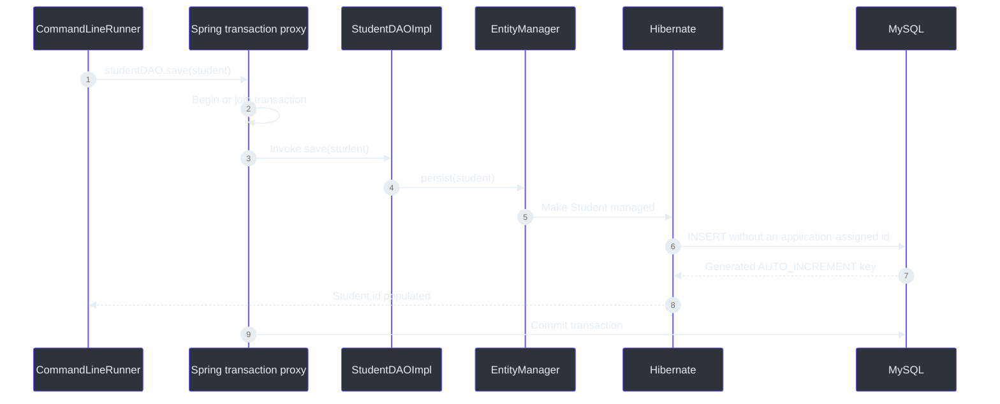
<!-- Sources: src/main/java/com/example/cruddemo/CruddemoApplication.java:64, src/main/java/com/example/cruddemo/dao/StudentDAOImpl.java:22, src/main/java/com/example/cruddemo/entity/Student.java:9, ../00-starter-sql-scripts/00-starter-sql-scripts/02-student-tracker.sql:11 -->

`persist()` changes a new entity into a managed entity and causes an insert when the persistence context is synchronized. A transaction-scoped persistence context needs a transaction for writes. With `IDENTITY`, Hibernate must execute the insert to obtain the database-generated key, so `student.getId()` contains the generated value after `save()` returns successfully. (`src/main/java/com/example/cruddemo/dao/StudentDAOImpl.java:23`, `src/main/java/com/example/cruddemo/CruddemoApplication.java:68`)

The runner intentionally logs the entity before and after saving:

```java
logger.info("Student before save = {}", student);
studentDAO.save(student);
logger.info("Student after save = {}", student);
```

Before persistence, primitive `id` is `0`. After the `IDENTITY` insert, Hibernate copies MySQL's generated ID into the same Java object. (`src/main/java/com/example/cruddemo/CruddemoApplication.java:64`, `src/main/java/com/example/cruddemo/entity/Student.java:12`)

### 16.6 MySQL `AUTO_INCREMENT`: why lowering the counter did not work

The observed sequence was:

```text
Existing rows:                    1, 2, 3, ...
Set AUTO_INCREMENT to 1000:       next rows became 1000, 1001, 1002
Attempt to set it back to 1:      next rows became 1003, 1004, 1005
```

`ALTER TABLE student AUTO_INCREMENT = 1` controls a future generated value; it does not rewrite existing primary keys. Because `1002` still existed, MySQL could not generate `1` without moving below the table's maximum and eventually risking collisions. The effective next value remained greater than the maximum existing ID.

**Primary keys are identifiers, not guaranteed gap-free counters.** Deletes, rollbacks, failed transactions, manually increased counters, and allocation strategies can all create gaps.

#### `DELETE`, `TRUNCATE`, and `DROP`

| Command | Rows | Table definition | `AUTO_INCREMENT` | Filtering | MySQL caution |
|---|---|---|---|---|---|
| `DELETE FROM student WHERE ...` | Deletes matching rows | Kept | Normally continues from the existing counter | `WHERE` allowed | Transactional for InnoDB and can often be rolled back before commit. |
| `DELETE FROM student` | Deletes every row individually | Kept | Normally not reset automatically | No filter in this form | Can be expensive for a large table. |
| `TRUNCATE TABLE student` | Removes every row | Kept/recreated as an empty table | Reset for the empty table | No `WHERE` | DDL-style operation with an implicit commit; use only when all rows may be lost. Foreign keys can prevent it. |
| `DROP TABLE student` | Removes every row | Removed | Counter disappears with the table | No `WHERE` | The table must be recreated before the application can use it. |

`TRUNCATE` was useful only as a local learning-database reset. It is not a normal production technique for reclaiming old primary-key values.

### 16.7 Finding one entity by primary key

The current implementation is correct:

```java
@Override
public Student findById(int id) {
    return entityManager.find(Student.class, id);
}
```

`Student.class` tells JPA which entity type to load, and `id` supplies its primary key. `find()` returns the entity or `null` when no matching row exists. (`src/main/java/com/example/cruddemo/dao/StudentDAOImpl.java:28`)

The call still travels through JPA and Hibernate even though the method lacks `@Transactional`. A basic retrieval without an explicit lock is allowed outside an active transaction. `@Transactional` defines a unit-of-work boundary; it is not the switch that determines whether JPA is used.

Add a read transaction when the use case needs one consistent unit of work, multiple coordinated reads, lazy relationship traversal, read-then-update behavior, or a non-`NONE` lock mode. A common service-layer declaration is:

```java
@Transactional(readOnly = true)
public Student findById(int id) {
    return entityManager.find(Student.class, id);
}
```

That is an alternative design, not the current implementation.

### 16.8 Current runner experiments

`CruddemoApplication` contains one wrapper method for every DAO retrieval method and a shared `logStudents()` helper. Each wrapper logs the operation name, count, and each returned `Student`. (`src/main/java/com/example/cruddemo/CruddemoApplication.java:75`, `src/main/java/com/example/cruddemo/CruddemoApplication.java:139`)

| Runner method | DAO method exercised | Current source state |
|---|---|---|
| `retrieveAllStudentsUsingHql` | `findAllHql` | Commented out |
| `retrieveAllStudentsByLastNameAscendingUsingHql` | `findAllByLastNameAscHql` | Commented out |
| `retrieveAllStudentsByLastNameDescendingUsingHql` | `findAllByLastNameDescHql` | Commented out |
| `retrieveAllStudentsUsingJpql` | `findAllJpql` | Commented out |
| `retrieveAllStudentsByLastNameAscendingUsingJpql` | `findAllByLastNameAscJpql` | Commented out |
| `retrieveAllStudentsByLastNameDescendingUsingJpql` | `findAllByLastNameDescJpql` | Commented out |
| `retrieveByLastNameWithoutSettingParameterUsingHql` | Concatenated HQL | **Active; fails first** |
| `retrieveByLastNameWithoutSettingParameterUsingJpql` | Concatenated JPQL | Active, but not reached after the HQL exception |
| `retrieveByLastNameWithSettingParameterUsingHql` | Named-parameter HQL | Commented out |
| `retrieveByLastNameWithSettingParameterUsingJpql` | Named-parameter JPQL | Commented out |

Although the comment says to activate one retrieval method at a time, two methods are currently active. Because `CommandLineRunner` executes sequentially, the malformed HQL call throws before the malformed JPQL call can run. Commenting out the first experiment is necessary to observe the second experiment independently. (`src/main/java/com/example/cruddemo/CruddemoApplication.java:34`, `src/main/java/com/example/cruddemo/CruddemoApplication.java:41`)

### 16.9 HQL, JPQL, and SQL

| Language | Owner or standard | Queries | Portability | Example in this project |
|---|---|---|---|---|
| JPQL | Jakarta Persistence | Entities, attributes, and mapped relationships | Portable across compliant providers | `select s from Student s` |
| HQL | Hibernate | The same object model plus Hibernate extensions | Tied to Hibernate extensions when those features are used | `from Student` |
| SQL | Database | Physical tables and columns | Database dialect-specific | `select * from student` |

JPQL and HQL are not written against `student.last_name`. They use the entity name `Student` and Java attribute `lastName`; Hibernate translates that object-oriented query into SQL for the mapped `student` table and `last_name` column. (`src/main/java/com/example/cruddemo/entity/Student.java:5`, `src/main/java/com/example/cruddemo/entity/Student.java:17`)

Current HQL shorthand:

```java
From Student order by lastName asc
```

Current explicit JPQL style:

```java
Select s from Student s order by s.lastName asc
```

For clear, portable custom queries, prefer the explicit form:

```java
select s
from Student s
where s.lastName = :lastName
order by s.lastName asc
```

**Interview answer:** JPQL is the standard Jakarta Persistence query language. HQL is Hibernate's query language and supports JPQL-like syntax plus Hibernate-specific capabilities. Prefer JPQL when provider portability matters; use HQL extensions deliberately when the application is committed to Hibernate.

In Spring Data JPA lessons, simple operations may later become derived repository methods such as `findByLastName(...)`; custom `@Query` declarations use the JPA query language unless explicitly marked native.

### 16.10 Why `TypedQuery<Student>` returns `List<Student>`

The generic type describes one result element:

```text
TypedQuery<Student>
        |
        | getResultList()
        v
List<Student>
```

For `select s from Student s`, each result row is represented by one `Student`, so the query is `TypedQuery<Student>`. `getResultList()` gathers those result elements into `List<Student>`. `TypedQuery<List<Student>>` would mean that every result element is itself a list and would conceptually produce `List<List<Student>>`, which is not what the query selects. (`src/main/java/com/example/cruddemo/dao/StudentDAOImpl.java:52`)

| Query selection | Correct query result type | `getResultList()` type |
|---|---|---|
| `select s from Student s` | `TypedQuery<Student>` | `List<Student>` |
| `select s.lastName from Student s` | `TypedQuery<String>` | `List<String>` |
| `select count(s) from Student s` | `TypedQuery<Long>` | `List<Long>`; normally one element |
| `select s.firstName, s.email from Student s` | `TypedQuery<Object[]>` or a matching DTO projection | `List<Object[]>` or `List<DtoType>` |

`getResultList()` returns an empty list when nothing matches, not `null`. The `logStudents()` helper therefore checks `isEmpty()` instead of checking for a null collection. (`src/main/java/com/example/cruddemo/CruddemoApplication.java:139`)

### 16.11 Query parameters and the observed syntax failure

The two failing methods concatenate the Java argument directly:

```java
"From Student where lastName = " + lastName
```

When `lastName` contains `lastName B`, Hibernate receives:

```text
From Student where lastName = lastName B
```

`lastName B` is not a quoted string literal. The parser treats `lastName` after `=` as an identifier and then reports `B` as an unexpected token:

```text
At 1:39 and token 'B', extraneous input 'B' expecting <EOF>
```

This failure happens while Hibernate parses the HQL; no SQL lookup is executed. The JPQL concatenation has the same underlying problem. (`src/main/java/com/example/cruddemo/dao/StudentDAOImpl.java:70`, `src/main/java/com/example/cruddemo/dao/StudentDAOImpl.java:76`)

A fixed string literal is valid query syntax:

```java
select s from Student s where s.lastName = 'Smith'
```

Concatenating a Java value with manual quotes can be made syntactically valid:

```java
"select s from Student s where s.lastName = '" + lastName + "'"
```

but it is fragile and unsafe. Apostrophes require escaping, types must be formatted correctly, and untrusted text can alter query meaning.

The current parameterized methods show the correct pattern:

```java
TypedQuery<Student> query = entityManager.createQuery(
        "Select s From Student s where s.lastName=:lastNamePlaceholder",
        Student.class);

query.setParameter("lastNamePlaceholder", lastName);
return query.getResultList();
```

The placeholder name in the query and `setParameter()` must match. Hibernate receives query structure separately from the value, preserves the Java type, and handles quoting safely. (`src/main/java/com/example/cruddemo/dao/StudentDAOImpl.java:89`)

**Rule:** a `where` clause does not always require a parameter. Hard-coded literals, `is null`, comparisons, and other fixed expressions can be written directly. A value coming from Java input should normally be bound with a named or positional parameter.

### 16.12 Practical custom-query checklist

1. Prefer JPQL for ordinary JPA queries; use HQL-specific syntax only when its extra capability is intentional.
2. Query entity names and Java attributes, not physical table and column names.
3. Use an explicit alias such as `s` and qualify fields as `s.lastName`.
4. Bind dynamic values with named parameters; never build a query from untrusted concatenated text.
5. Match `TypedQuery<T>` to one selected result element, not to the outer collection.
6. Use `getResultList()` for zero-to-many results and expect an empty list when no rows match.
7. Use DTO projections when only a subset of fields is required instead of loading full entities unnecessarily.
8. Apply limits or pagination instead of loading an unbounded table into memory.
9. Keep query code in the repository/DAO layer and place wider business transaction boundaries in a service layer as the application grows.
10. Add focused integration tests and inspect generated SQL; compilation cannot prove that a string query is valid.

### 16.13 Observed verification on 2026-09-19

| Check | Result | What it proves |
|---|---|---|
| `mvn -q -DskipTests compile` | **Passed** after adding DAO runner methods | Interface signatures, implementation methods, typed-query declarations, and runner calls compile. It does not parse every query string. |
| `mvn test -q "-Dlogging.level.root=INFO"` | **Expected failure** — 1 test, 1 error | The context reaches MySQL and initializes Hibernate, then `CommandLineRunner` executes the active malformed HQL and prevents context startup from completing. |
| Runtime exception | Spring `InvalidDataAccessApiUsageException` wrapping Hibernate `SyntaxException` | Confirms repository exception translation and identifies the final malformed query text. |
| Generated query text | `From Student where lastName = lastName B` | Confirms that Java string concatenation failed to create a query-language string literal. |
| Database connection | Connected to local MySQL 5.7.19 | Data source and JPA initialization still work before the runner fails. Hibernate again warned that this database is below its supported MySQL 8.0 minimum. |
| Maven Wrapper | Still fails before Maven with `Cannot index into a null array` | Installed Maven remains the verified fallback for this local launcher problem. |

The failing test is now more informative than a simple compilation check: `@SpringBootTest` executes the application runner, so an active lesson experiment can make `contextLoads()` fail even when all beans were constructed successfully. (`src/test/java/com/example/cruddemo/CruddemoApplicationTests.java:6`, `src/main/java/com/example/cruddemo/CruddemoApplication.java:28`)

### 16.14 Common mistakes and corrections

| Mistake | Why it fails or misleads | Correction |
|---|---|---|
| Injecting `StudentDAOImpl` when a `StudentDAO` contract exists | Couples the caller to one implementation. | Inject `StudentDAO`; let Spring supply the implementation. |
| Assuming `@Repository` injects differently from `@Component` | Both become normal Spring beans. | Remember the difference is semantic role and persistence-exception translation. |
| Assuming `@Repository` generates CRUD methods | That behavior belongs to Spring Data repository interfaces, not this stereotype alone. | Implement the manual DAO methods or later extend a Spring Data repository. |
| Removing `@Transactional` from `save()` | A transaction-scoped JPA write requires a transaction. | Keep a write transaction around `persist()`. |
| Assuming all reads must have `@Transactional` | Basic retrieval without locking is permitted outside an explicit transaction. | Add a read transaction when the unit of work needs consistency, lazy loading, or locking. |
| Expecting `AUTO_INCREMENT = 1` to reuse IDs while `1002` exists | The counter cannot move below the maximum existing ID. | Delete/reset data deliberately in a disposable environment or continue from the higher value. |
| Treating `TRUNCATE`, `DELETE`, and `DROP` as synonyms | They differ in filtering, schema retention, counter behavior, and transaction semantics. | Choose based on whether rows, counter, or table definition should remain. |
| Writing `where lastName = ` plus a Java string | Produces an identifier-like token instead of a quoted/bound string value. | Use `:lastName` and `setParameter("lastName", value)`. |
| Using `TypedQuery<List<Student>>` for a list result | Confuses one result element with the outer result container. | Use `TypedQuery<Student>` and receive `List<Student>`. |
| Using SQL column names in JPQL/HQL | Those languages operate over the entity model. | Use `Student` and `lastName`, not `student` and `last_name`. |
| Activating several runner experiments while debugging one | The first exception stops later calls. | Activate one runner method at a time and label the observed result. |

### 16.15 Active-recall questions

1. **Why create `StudentDAO` when `StudentDAOImpl` contains the real code?**  
   The interface defines a stable contract so callers do not depend on one persistence implementation.

2. **Does Spring inject `@Repository` differently from `@Component`?**  
   No. Both are beans. `@Repository` adds data-access meaning and eligibility for exception translation.

3. **Is `@Autowired` required on the current DAO constructor?**  
   No. A Spring bean with one constructor can have it injected without the annotation.

4. **What does `EntityManager.persist()` do?**  
   It makes a new entity managed and causes an insert when the persistence context is synchronized.

5. **Why does `save()` need `@Transactional`?**  
   The write must execute inside a transaction that can flush and commit or roll back atomically.

6. **Why can `find()` run without an explicit transaction?**  
   JPA permits an ordinary retrieval with no lock outside an active transaction.

7. **When is a read transaction still valuable?**  
   For a consistent multi-operation unit of work, lazy relationships, read-then-write work, or locking.

8. **Why did the next generated ID remain above `1002`?**  
   MySQL would not lower the next generated value below the maximum existing primary key.

9. **Which command removes rows but normally keeps the current counter?**  
   `DELETE`.

10. **Which command removes all rows and resets the empty table's counter?**  
    `TRUNCATE TABLE`.

11. **Which command removes the table definition too?**  
    `DROP TABLE`.

12. **What does JPQL query: table names or entity names?**  
    Entity names and their mapped Java attributes and relationships.

13. **What is HQL?**  
    Hibernate's object-oriented query language, compatible with JPQL-style queries and extended with Hibernate features.

14. **Why is `TypedQuery<Student>` correct for many students?**  
    Each result element is a `Student`; `getResultList()` supplies the outer `List<Student>`.

15. **What would `TypedQuery<List<Student>>` imply?**  
    Each individual result is a list, leading conceptually to `List<List<Student>>`.

16. **Does every `where` clause require `setParameter()`?**  
    No. Fixed literals and fixed expressions are valid. Dynamic Java values should normally be bound.

17. **Why does `lastName = lastName B` fail?**  
    `lastName B` is not a quoted string literal or a bound parameter; `B` becomes an unexpected parser token.

18. **What must match when using a named parameter?**  
    The name after `:` in the query and the name passed to `setParameter()`.

19. **Why does the outer exception mention Spring while the inner one mentions Hibernate?**  
    The `@Repository` proxy translated the provider-specific persistence exception into Spring's data-access hierarchy.

20. **Why does `contextLoads()` currently fail even though compilation passes?**  
    Query strings are parsed at runtime, and the full context test executes the active `CommandLineRunner` query.

### 16.16 Official references for this update

- [Spring Boot logging levels](https://docs.spring.io/spring-boot/reference/features/logging.html#features.logging.log-levels)
- [Spring Framework DAO support and `@Repository`](https://docs.spring.io/spring-framework/reference/data-access/dao.html)
- [Spring Framework constructor injection with `@Autowired`](https://docs.spring.io/spring-framework/reference/core/beans/annotation-config/autowired.html)
- [Spring Framework transaction management](https://docs.spring.io/spring-framework/reference/data-access/transaction.html)
- [Jakarta Persistence 3.2 `EntityManager`](https://jakarta.ee/specifications/persistence/3.2/apidocs/jakarta.persistence/jakarta/persistence/entitymanager)
- [Jakarta Persistence 3.2 `TypedQuery`](https://jakarta.ee/specifications/persistence/3.2/apidocs/jakarta.persistence/jakarta/persistence/typedquery)
- [Jakarta Persistence 3.2 query language specification](https://jakarta.ee/specifications/persistence/3.2/jakarta-persistence-spec-3.2)
- [Hibernate HQL guide](https://docs.hibernate.org/stable/orm/querylanguage/html_single/)
- [Spring Data JPA query methods](https://docs.spring.io/spring-data/jpa/reference/jpa/query-methods.html)
- [MySQL 5.7 `AUTO_INCREMENT`](https://dev.mysql.com/doc/refman/5.7/en/example-auto-increment.html)
- [MySQL 5.7 `TRUNCATE TABLE`](https://dev.mysql.com/doc/refman/5.7/en/truncate-table.html)

## Related pages

| Page | Relationship |
|---|---|
| [Course README](../../README.md) | Course order, progress, and project navigation |
| [Cumulative course review](../../COURSE_REVIEW.md) | Compact cross-module revision rules |
| [Spring Core notes](../../02-spring-boot-core/coach/notes.md) | Explains Spring beans, injection, lifecycle, and configuration used before the data layer |

## 17. Lesson update — 2026-09-19: updating and deleting entities

> **History note:** Section 16 records the earlier retrieval-query experiments, including the malformed concatenated query failure. The current source has moved forward: all retrieval demonstrations and `updateStudent()` are commented out, while `deleteAllStudents()` is the active `CommandLineRunner` operation. This section describes the source as it exists after the break.

### 17.1 Quick revision

| Question | Short answer | Source |
|---|---|---|
| What does `merge()` do? | It copies the state of a new or detached object into a managed entity and returns that managed instance. | [`StudentDAOImpl.java:97`](src/main/java/com/example/cruddemo/dao/StudentDAOImpl.java#L97) |
| Must every update call `merge()`? | No. Changes to an entity that is already managed inside the active persistence context are detected automatically and flushed to the database. | Current alternative explained below |
| Why does the current update check the ID first? | It makes the DAO behave as “update only if this row already exists” instead of relying on `merge()` to decide whether the object is new or detached. | [`StudentDAOImpl.java:98`](src/main/java/com/example/cruddemo/dao/StudentDAOImpl.java#L98) |
| Why does `deleteById()` find the entity before removing it? | `EntityManager.remove()` expects a managed entity. The `find()` performed inside the delete transaction supplies one. | [`StudentDAOImpl.java:106`](src/main/java/com/example/cruddemo/dao/StudentDAOImpl.java#L106) |
| How does `deleteAll()` differ? | It issues one JPQL bulk delete without loading and removing every `Student` individually. | [`StudentDAOImpl.java:115`](src/main/java/com/example/cruddemo/dao/StudentDAOImpl.java#L115) |
| What does `executeUpdate()` return? | The number of entities affected by the bulk update or delete. | [`StudentDAO.java:34`](src/main/java/com/example/cruddemo/dao/StudentDAO.java#L34) |
| Does JPQL `delete from Student` reset MySQL `AUTO_INCREMENT`? | No. It has SQL `DELETE` semantics, not `TRUNCATE TABLE` semantics. | [`StudentDAOImpl.java:116`](src/main/java/com/example/cruddemo/dao/StudentDAOImpl.java#L116) |
| What currently runs at startup? | `deleteAllStudents(studentDAO)`, so application or full-context test startup deletes every student row. | [`CruddemoApplication.java:56`](src/main/java/com/example/cruddemo/CruddemoApplication.java#L56) |

### 17.2 Current CRUD contract

The DAO now exposes all four CRUD categories:

| CRUD category | DAO operation | JPA mechanism | Transaction required here? | Source |
|---|---|---|---|---|
| Create | `save(Student)` | `EntityManager.persist()` | Yes | [`StudentDAO.java:9`](src/main/java/com/example/cruddemo/dao/StudentDAO.java#L9) |
| Read | `findById(int)` and typed queries | `find()` and `TypedQuery` | Not for the current basic, unlocked reads | [`StudentDAO.java:12`](src/main/java/com/example/cruddemo/dao/StudentDAO.java#L12) |
| Update | `update(Student)` | Existence check followed by `merge()` | Yes | [`StudentDAO.java:30`](src/main/java/com/example/cruddemo/dao/StudentDAO.java#L30) |
| Delete one | `deleteById(int)` | `find()` followed by `remove()` | Yes | [`StudentDAO.java:32`](src/main/java/com/example/cruddemo/dao/StudentDAO.java#L32) |
| Delete all | `deleteAll()` | JPQL bulk delete and `executeUpdate()` | Yes | [`StudentDAO.java:34`](src/main/java/com/example/cruddemo/dao/StudentDAO.java#L34) |

`@Transactional` is correctly present on every DAO write method. Spring invokes these public methods through a transaction-aware proxy, begins or joins a transaction, lets the DAO use the transaction-bound `EntityManager`, and commits after the method returns successfully. (`src/main/java/com/example/cruddemo/dao/StudentDAOImpl.java:22`, `src/main/java/com/example/cruddemo/dao/StudentDAOImpl.java:96`, `src/main/java/com/example/cruddemo/dao/StudentDAOImpl.java:104`, `src/main/java/com/example/cruddemo/dao/StudentDAOImpl.java:113`)

### 17.3 Entity lifecycle states needed for update and delete

| State | Meaning | Relevant operation |
|---|---|---|
| New | Java object has not become persistent yet. | `persist()` or `merge()` can make persistent state from it. |
| Managed | Object belongs to the active persistence context; Hibernate tracks changes. | Setters plus transaction flush are enough for an update. |
| Detached | Object has database identity but is no longer associated with the active persistence context. | `merge()` can copy its state into a managed object. |
| Removed | Managed object is scheduled for deletion at flush/commit. | `remove()` creates this state. |

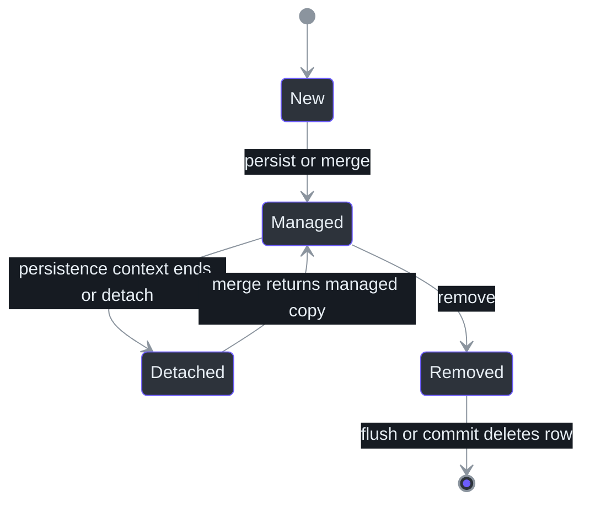
<!-- Sources: src/main/java/com/example/cruddemo/dao/StudentDAOImpl.java:22, src/main/java/com/example/cruddemo/dao/StudentDAOImpl.java:97, src/main/java/com/example/cruddemo/dao/StudentDAOImpl.java:106 -->

**Memory aid:** setters change a Java object; JPA writes those changes automatically only while the object is managed, or after detached state is merged into a managed instance.

### 17.4 Current update path

The runner experiment performs these steps:

```java
Student student = studentDAO.findById(studentId);
student.setFirstName("firstName E");
student.setLastName("lastName E");
studentDAO.update(student);
```

(`src/main/java/com/example/cruddemo/CruddemoApplication.java:164`)

The first `findById()` is a separate DAO call outside an explicit write transaction. With a transaction-scoped persistence context, the returned object should be treated as detached after that call finishes. The setters therefore change the Java object in memory; they are not, by themselves, the database update in this flow.

The DAO then performs:

```java
@Transactional
public void update(Student student) {
    Student retrievedStudent = findById(student.getId());
    if (retrievedStudent != null) {
        entityManager.merge(student);
    }
}
```

(`src/main/java/com/example/cruddemo/dao/StudentDAOImpl.java:95`)

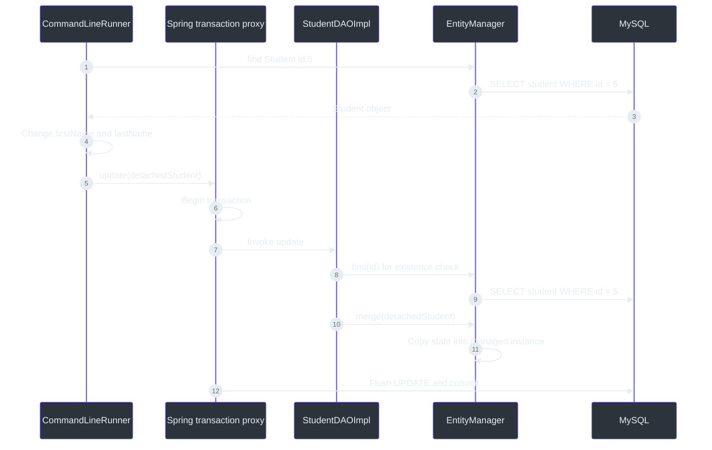
<!-- Sources: src/main/java/com/example/cruddemo/CruddemoApplication.java:164, src/main/java/com/example/cruddemo/dao/StudentDAOImpl.java:95 -->

Important `merge()` rules:

1. The argument does not become the managed object merely because it was passed to `merge()`.
2. `merge()` returns the managed object containing the copied state.
3. Ignoring the return value is acceptable in this method because it makes no further changes after merging.
4. If later code must continue changing the entity inside the transaction, use the returned managed instance.
5. `merge()` also accepts a new entity, which can lead to an insert. The current preliminary lookup expresses the narrower intention “update only if this ID already exists.”

Example when the managed return value is needed:

```java
Student managedStudent = entityManager.merge(student);
```

That is a suggested refinement, not a current source change.

### 17.5 Managed-entity updates and dirty checking

`merge()` is appropriate when state arrives on a detached object. It is not required when the entity is loaded and modified inside the same transaction:

```java
@Transactional
public void updateStudentName(int id, String firstName, String lastName) {
    Student managedStudent = entityManager.find(Student.class, id);

    if (managedStudent != null) {
        managedStudent.setFirstName(firstName);
        managedStudent.setLastName(lastName);
    }
}
```

There is no explicit `merge()` or SQL `UPDATE` call in that alternative. Hibernate detects changes to the managed entity and synchronizes them during flush/commit. This behavior is commonly called **dirty checking**.

| Situation | Normal approach |
|---|---|
| Entity is already managed in the current transaction | Change its persistent fields; dirty checking handles the update. |
| Entity is detached and its state should be copied back | Call `merge()` and use its managed return value if further work is required. |
| Operation must update only an existing row | Find first and handle the not-found result explicitly. |

### 17.6 Current update caveat: the caller can fail before the DAO check

The DAO's existence check does not protect the current runner when ID `5` is absent:

```text
studentDAO.findById(5) returns null
        ↓
student.setFirstName(...) is invoked
        ↓
NullPointerException occurs
        ↓
studentDAO.update(student) is never called
```

The current lesson succeeds only when ID `5` exists. A production-style caller would handle the missing entity before invoking setters, normally by returning a not-found result or throwing an application-specific exception. This is documented as a caveat; the source remains unchanged. (`src/main/java/com/example/cruddemo/CruddemoApplication.java:167`)

### 17.7 Deleting one student

The single-entity delete is correctly implemented:

```java
@Transactional
public void deleteById(int id) {
    Student retrievedStudent = findById(id);
    if (retrievedStudent != null) {
        entityManager.remove(retrievedStudent);
    }
}
```

(`src/main/java/com/example/cruddemo/dao/StudentDAOImpl.java:104`)

Execution order:

1. Spring begins the transaction around `deleteById()`.
2. `findById(id)` uses the transaction-bound persistence context and returns a managed `Student`, or `null`.
3. If found, `remove()` marks that managed object as removed.
4. Flush/commit issues SQL similar to `DELETE FROM student WHERE id = ?`.
5. If not found, the method performs no delete and returns normally.

The runner logs that the delete operation completed, but because `deleteById()` returns `void`, that message means the DAO call returned successfully—not necessarily that a row existed. A future API could return `boolean` or an affected-row count when the caller must distinguish “deleted” from “not found.” (`src/main/java/com/example/cruddemo/CruddemoApplication.java:178`)

### 17.8 Deleting all students with a JPQL bulk delete

```java
@Transactional
public int deleteAll() {
    return entityManager
            .createQuery("delete from Student")
            .executeUpdate();
}
```

The current source writes the same valid JPQL with an extra harmless space between `from` and `Student`. (`src/main/java/com/example/cruddemo/dao/StudentDAOImpl.java:113`)

`Student` is the entity name, not the physical table name `student`. Hibernate translates the JPQL bulk operation into database SQL. `executeUpdate()` executes the delete and returns the number of affected entities.

The runner now preserves and logs that count:

```java
logger.info("Requesting deletion of all students");
int deletedStudentCount = studentDAO.deleteAll();
logger.info("Deleted {} student(s)", deletedStudentCount);
```

(`src/main/java/com/example/cruddemo/CruddemoApplication.java:186`)

If the table had six rows, the final message should report:

```text
Deleted 6 student(s)
```

### 17.9 Delete-one versus bulk-delete semantics

| Concern | `deleteById(id)` | `deleteAll()` |
|---|---|---|
| Entity loading | Loads one `Student` first | Does not load every student |
| JPA operation | `EntityManager.remove(managedStudent)` | JPQL `delete from Student` |
| Typical SQL shape | `SELECT`, then `DELETE ... WHERE id = ?` | One bulk `DELETE FROM student` |
| Missing data | Quiet no-op when that ID is absent | Returns `0` when no rows are deleted |
| Return value | `void` | Number of affected entities |
| Persistence-context behavior | Normal entity lifecycle tracking | Bulk result is not synchronized into already-managed `Student` objects |
| JPA relationship cascade | `cascade=REMOVE` can apply | JPQL bulk delete does not cascade to related entities |
| Current entity safety | Safe; `Student` has no relationships | Simple here, but important when relationships are added later |

Because bulk delete bypasses entity-by-entity lifecycle handling, use it when that behavior is intentional. In a longer transaction, clear or avoid reusing previously managed affected entities after the bulk operation; otherwise Java objects in the persistence context can disagree with the database.

### 17.10 `DELETE` still does not mean `TRUNCATE`

The JPQL statement:

```jpql
delete from Student
```

removes rows but leaves the table definition and normally leaves MySQL's `AUTO_INCREMENT` progression in place. A later insert may therefore receive an ID higher than the deleted maximum. `TRUNCATE TABLE student` is a different MySQL operation that empties the table and resets its auto-increment state; it is not portable JPQL and should only be used deliberately in disposable data environments.

### 17.11 Logging and expected terminal evidence

The application-level logs explain intent and result:

| Operation | Before call | After call |
|---|---|---|
| Update | Student ID and state before/after field changes | Updated student state |
| Delete one | Requested student ID | Operation completed for that ID |
| Delete all | Request to delete all students | Number of deleted students |

When SQL logging is temporarily enabled, the important shapes are:

```text
Update:      SELECT ... WHERE id=?
             SELECT ... WHERE id=?
             UPDATE student SET ... WHERE id=?

Delete one:  SELECT ... WHERE id=?
             DELETE FROM student WHERE id=?

Delete all:  DELETE FROM student
```

The update normally shows two selects because the runner first loads the detached input and the DAO performs a second existence check inside the write transaction. Provider caching and persistence-context details can affect exact SQL, so generated SQL remains the evidence to inspect.

### 17.12 Current runner and test safety

Only `deleteAllStudents(studentDAO)` is currently active. (`src/main/java/com/example/cruddemo/CruddemoApplication.java:56`)

This affects both ordinary startup and the existing test:

```text
SpringApplication.run(...) or @SpringBootTest
        ↓
Application context starts
        ↓
CommandLineRunner.run(...) executes
        ↓
deleteAllStudents(...) executes
        ↓
Every Student row is deleted
```

`contextLoads()` is therefore not a harmless context-only check with the current runner. It starts the complete application and triggers the destructive lesson operation. Do not run it against data that must be preserved. A later test design should disable lesson runners under tests or use an isolated test database. (`src/test/java/com/example/cruddemo/CruddemoApplicationTests.java:6`)

### 17.13 Observed verification on 2026-09-19

| Check | Result | What it proves |
|---|---|---|
| Source review | Update, delete-one, and delete-all signatures agree across the DAO interface and implementation | The implementation fulfills the current contract. |
| `mvn -q -DskipTests compile` | **Passed** after the update/delete runner and logging changes | Java signatures, `merge()`, `remove()`, bulk query construction, returned count, and log statements compile. |
| Application/test execution | **Intentionally not run during final review** | Avoided triggering the active `deleteAllStudents()` operation against the local MySQL data. |
| Maven Wrapper | Existing launcher still fails before Maven in this environment | Installed Maven remains the compile-check fallback; this is separate from the JPA code. |

Compilation cannot prove that the runtime database contains ID `5`, that an update changes one row, or that a delete count matches expected seed data. Those require a deliberately prepared database and runtime integration test.

### 17.14 Common mistakes and corrections

| Mistake | Why it is wrong or misleading | Better rule |
|---|---|---|
| Assuming every update must call `merge()` | Managed entities are updated through dirty checking. | Use `merge()` for detached state; modify managed state directly. |
| Continuing to modify the original object after `merge()` | `merge()` returns the managed copy; the argument can remain detached. | Continue with the returned object when further transactional changes are needed. |
| Assuming the DAO's existence check prevents every null failure | The current runner dereferences a missing student before calling `update()`. | Handle “not found” before invoking setters. |
| Passing a detached entity directly to `remove()` | `remove()` expects a managed entity and can reject detached input. | Find it inside the transaction, then remove the managed result. |
| Reading “delete completed” as proof that a row existed | The current `deleteById()` returns `void` and silently ignores a missing ID. | Return a result when the caller needs confirmation. |
| Writing `delete from student` in JPQL | JPQL uses entity names, not table names. | Use `delete from Student`. |
| Ignoring `executeUpdate()` | Loses the affected-entity count. | Capture and log or return the count. |
| Treating bulk delete like repeated `remove()` | Bulk JPQL bypasses normal per-entity state synchronization and JPA cascades. | Use bulk operations deliberately and manage persistence-context state. |
| Expecting `deleteAll()` to reset `AUTO_INCREMENT` | `DELETE` and `TRUNCATE` have different database semantics. | Expect later generated IDs to continue from the database counter. |
| Running `contextLoads()` with a destructive runner enabled | `@SpringBootTest` executes `CommandLineRunner`. | Isolate tests or disable destructive lesson operations first. |

### 17.15 Active-recall questions

1. **What is the difference between managed and detached entities?**  
   Managed entities belong to an active persistence context and are tracked; detached entities have persistent identity but are no longer tracked by that context.

2. **What exactly does `merge()` do?**  
   It copies new or detached state into a managed entity and returns that managed instance.

3. **Does `merge()` turn the argument itself into the managed object?**  
   Do not assume so; use the returned instance.

4. **When is no explicit `merge()` needed?**  
   When the entity is loaded and changed while managed inside the same transaction.

5. **What is dirty checking?**  
   Hibernate detects changes to managed persistent fields and writes them at flush/commit.

6. **Why does the current update perform an existence check?**  
   To express update-only behavior for an existing primary key.

7. **What happens if ID `5` is absent in the current runner?**  
   `findById()` returns `null`, and the first setter causes a `NullPointerException` before DAO `update()` runs.

8. **Why find before calling `remove()`?**  
   `find()` obtains a managed entity; `remove()` expects managed state.

9. **When is the SQL delete normally issued after `remove()`?**  
   During persistence-context flush, at or before transaction commit.

10. **What does `executeUpdate()` return for a JPQL delete?**  
    The number of affected entities.

11. **Why is `Student` capitalized in `delete from Student`?**  
    JPQL refers to the entity name, not the lowercase physical table name.

12. **What major warning applies to bulk JPQL delete?**  
    The persistence context is not synchronized with its result, and JPA relationship cascades are not applied.

13. **Does deleting all students reset MySQL `AUTO_INCREMENT`?**  
    No; a later generated ID normally continues from the existing counter.

14. **Why is `contextLoads()` currently destructive?**  
    It starts the application, executes `CommandLineRunner`, and the active runner calls `deleteAllStudents()`.

### 17.16 Official references for this update

- [Jakarta Persistence 3.2 `EntityManager`: states, dirty checking, `merge()`, and `remove()`](https://jakarta.ee/specifications/persistence/3.2/apidocs/jakarta.persistence/jakarta/persistence/entitymanager)
- [Jakarta Persistence 3.2 specification: entity lifecycle and bulk update/delete](https://jakarta.ee/specifications/persistence/3.2/jakarta-persistence-spec-3.2)
- [Jakarta Persistence 3.2 `Query.executeUpdate()`](https://jakarta.ee/specifications/persistence/3.2/apidocs/jakarta.persistence/jakarta/persistence/query)
- [Spring Framework transaction management](https://docs.spring.io/spring-framework/reference/data-access/transaction.html)
- [Spring declarative transaction implementation](https://docs.spring.io/spring-framework/reference/data-access/transaction/declarative/tx-decl-explained.html)
- [MySQL 5.7 `AUTO_INCREMENT`](https://dev.mysql.com/doc/mysql-tutorial-excerpt/5.7/en/example-auto-increment.html)
- [MySQL 5.7 `TRUNCATE TABLE`](https://dev.mysql.com/doc/refman/5.7/en/truncate-table.html)

### 17.17 Course links

| Page | Relationship |
|---|---|
| [Course README](../../README.md) | Course order, progress, and project navigation |
| [Cumulative course review](../../COURSE_REVIEW.md) | Compact update/delete mental models for fast revision |
| [Earlier DAO and query lesson](#16-lesson-update--2026-09-19-dao-operations-transactions-mysql-counters-and-custom-queries) | Save, read, HQL/JPQL, parameters, and prior troubleshooting history |

## 18. Lesson update — 2026-09-19: Hibernate SQL logging and automatic schema management

This section records the final lectures completed after the CRUD lessons. It preserves the earlier sections as exercise history, but updates the **current-state** description: the active runner now calls `createAndSaveStudent(studentDAO)`, not `deleteAllStudents()`.

### 18.1 Lesson snapshot

| Item | Current project state |
|---|---|
| Spring Boot | `4.1.1`, declared in [`pom.xml`](pom.xml#L8) |
| Java target | `25`, declared in [`pom.xml`](pom.xml#L30) |
| Database | External MySQL database named `student_tracker` |
| SQL statement logging | `logging.level.org.hibernate.SQL=DEBUG` |
| JDBC bind-value logging | `logging.level.org.hibernate.orm.jdbc.bind=TRACE` |
| Root logging | `logging.level.root=debug` |
| Schema action | `spring.jpa.hibernate.ddl-auto=update` |
| Active startup operation | `createAndSaveStudent(studentDAO)` creates and persists one `Student` |

The relevant settings are in [`application.properties`](src/main/resources/application.properties), while the startup path begins in [`CruddemoApplication.run()`](src/main/java/com/example/cruddemo/CruddemoApplication.java#L29).

### 18.2 Mental model: three separate responsibilities

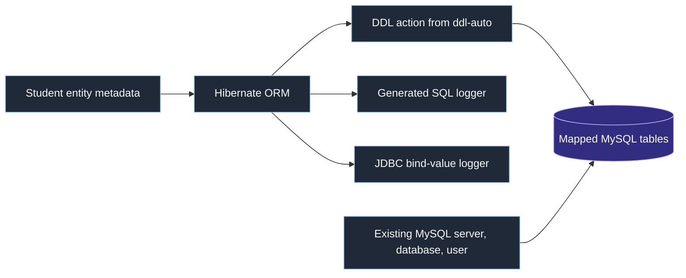

- Entity annotations describe the object-to-table mapping.
- `ddl-auto` tells Hibernate what, if anything, to do to mapped schema objects when persistence starts.
- Logging properties reveal generated SQL and bound values; they do not change the query or schema.
- The MySQL server, `student_tracker` database, account, and permissions remain external prerequisites. `ddl-auto` is not a MySQL user/database provisioning tool.

### 18.3 Current logging properties

| Property | Current value | Effect | Practical guidance |
|---|---|---|---|
| [`logging.level.root`](src/main/resources/application.properties#L10) | `debug` | Sets the fallback threshold for the application and libraries unless a more specific logger overrides it. | Useful temporarily, but normally too noisy for everyday use. |
| [`logging.level.org.hibernate.SQL`](src/main/resources/application.properties#L13) | `DEBUG` | Displays SQL generated by Hibernate. | Useful when checking what database work an entity operation causes. |
| [`logging.level.org.hibernate.orm.jdbc.bind`](src/main/resources/application.properties#L14) | `TRACE` | Displays values Hibernate binds to JDBC placeholders such as `?`. | Use only for local troubleshooting because values can contain sensitive data. |

Logger names form a hierarchy. The most specific configured logger wins, so the two Hibernate settings can remain detailed even if `logging.level.root` is later returned to `INFO`.

Conceptually, an insert can appear as two parts:

```text
Hibernate SQL: insert into student (email, first_name, last_name) values (?, ?, ?)
JDBC bind log: parameter 1 = ..., parameter 2 = ..., parameter 3 = ...
```

The SQL log shows the command shape. The bind log explains which runtime values replace the placeholders.

### 18.4 What `spring.jpa.hibernate.ddl-auto` controls

`spring.jpa.hibernate.ddl-auto` controls Hibernate's automatic schema action for managed entities. In this project, [`Student`](src/main/java/com/example/cruddemo/entity/Student.java#L5) is mapped to the `student` table, so Hibernate derives schema expectations from mappings such as `@Table`, `@Id`, `@GeneratedValue`, and `@Column`.

It does **not** create the MySQL server, the `student_tracker` database named in the JDBC URL, or the configured database account. That account must possess any DDL privileges needed by the selected action.

### 18.5 The five `ddl-auto` values

| Value | Startup behavior | Shutdown behavior | Typical use |
|---|---|---|---|
| `none` | Performs no automatic schema creation, validation, or update. | Nothing. | Production when migrations or a DBA own the schema. |
| `validate` | Compares entity mappings with the existing schema and fails startup on an incompatible mismatch. | Nothing. | Production/staging check after versioned migrations. |
| `update` | Attempts to adjust mapped schema objects while preserving existing data. | Does not drop the schema. | Convenient local development; risky as a production migration strategy. |
| `create` | Recreates the mapped schema when the application starts. Existing mapped data can be lost. | Keeps the new schema. | Disposable demos or tests needing a fresh schema. |
| `create-drop` | Recreates the mapped schema at startup. | Drops it during orderly application-context shutdown. | Isolated tests and demos with disposable data. |

Spring Boot's default depends on the environment: it can choose `create-drop` for an embedded database when no schema-management tool is detected, but generally uses `none` for an external database such as MySQL. An explicit project property overrides that default.

### 18.6 What the current `update` value means

The active value is [`spring.jpa.hibernate.ddl-auto=update`](src/main/resources/application.properties#L17). Hibernate may create missing mapped objects and attempt compatible schema adjustments during startup. It does not intentionally erase and recreate the whole schema, and it does not drop the schema at shutdown.

The preceding comment currently says "create and drop table automatically at application start and end." That describes `create-drop`, not `update`. The executable property controls behavior; comments have no effect. The mismatch is documented here rather than silently changing the lesson configuration.

`update` is convenient, but it is not a complete migration system. A Java rename might look like a new column instead of a data-preserving rename, and complex data transformations, reviewed ordering, rollback planning, and migration history are outside its purpose.

### 18.7 Why the property exists, and common enterprise use

| Environment | Common choice | Reason |
|---|---|---|
| Learning and prototypes | `update`, `create`, or `create-drop` | Fast feedback with minimal setup. |
| Isolated automated tests | `create` or `create-drop` | Each environment can begin with disposable schema state. |
| Shared development database | Often migrations; sometimes controlled `update` | Multiple developers need predictable shared state. |
| Staging and production | Flyway/Liquibase migrations plus `validate` or `none` | Changes are versioned, reviewed, repeatable, and auditable. |

Automatic schema generation is valuable for learning, prototypes, test fixtures, and mapping validation. The production warning exists because automatic DDL can cause data loss, table locks, startup delays, provider-specific results, or a partial deployment. It can also require schema-changing privileges that a production runtime account may not need.

**Production memory rule:** use a migration tool to change important schemas; use Hibernate to validate them.

### 18.8 Current startup and test flow

The source has moved forward since Section 17:

1. Spring starts the application and creates the JPA infrastructure.
2. Because `ddl-auto=update`, Hibernate can inspect and adjust mapped schema objects.
3. Spring invokes [`CruddemoApplication.run()`](src/main/java/com/example/cruddemo/CruddemoApplication.java#L29).
4. The active line calls [`createAndSaveStudent(studentDAO)`](src/main/java/com/example/cruddemo/CruddemoApplication.java#L32).
5. That method creates a student and calls [`studentDAO.save(student)`](src/main/java/com/example/cruddemo/CruddemoApplication.java#L63), which inserts a row.

The test class uses [`@SpringBootTest`](src/test/java/com/example/cruddemo/CruddemoApplicationTests.java#L6), so even an empty `contextLoads()` starts the full context and executes the runner. A test can therefore update the schema and insert a student into the configured MySQL database. Use an isolated test database or disable lesson runner operations before treating this as a harmless startup test.

### 18.9 Observed verification

Verified on **2026-09-19**:

| Check | Result |
|---|---|
| `mvn -q -DskipTests compile` from the project directory | Passed with exit code `0`. |
| Runtime application or full `@SpringBootTest` | Deliberately not run because current startup can alter the schema and insert a row in external MySQL. |
| Documentation inspection | Confirmed the active logging properties, `ddl-auto=update`, entity mapping, and insert runner path. |

Compilation proves that the current Java source compiles. It cannot prove the exact DDL generated against a particular existing database; that depends on its current schema and should be observed in a disposable environment.

### 18.10 Common mistakes and corrections

| Mistake | Correction |
|---|---|
| Reading the property comment instead of the value | `update` is active; comments do not configure Spring. |
| Thinking `ddl-auto` creates the MySQL user and database | It manages mapped schema objects after connecting to an existing database. |
| Treating `update` as a safe production migration system | Use versioned migrations for important data and `validate` or `none` at runtime. |
| Assuming `create-drop` guarantees cleanup after every failure | Drop is tied to orderly shutdown; abnormal termination may prevent cleanup. |
| Leaving bind logging enabled everywhere | Bound values may expose names, emails, tokens, or other sensitive data. |
| Enabling root `DEBUG` only to inspect SQL | Prefer targeted Hibernate logger categories for persistence diagnostics. |
| Running `contextLoads()` without checking startup runners | Full context startup currently inserts a student and may adjust schema. |

### 18.11 Active-recall questions

1. **What does `org.hibernate.SQL=DEBUG` show?** SQL statements generated by Hibernate.

2. **What does `org.hibernate.orm.jdbc.bind=TRACE` add?** Runtime values bound to JDBC placeholders.

3. **Why is bind logging a security concern?** It can expose sensitive application data in log files.

4. **What is the difference between `update` and `create-drop`?** `update` attempts incremental adjustment and retains the schema; `create-drop` recreates it and drops it on orderly shutdown.

5. **Which value checks mappings without changing the schema?** `validate`.

6. **Does `ddl-auto` create `student_tracker` or the MySQL account?** No. The server, database, account, and suitable permissions must already exist.

7. **Why are migrations preferred for production?** They provide explicit, versioned, reviewed, repeatable changes and controlled data transformations.

8. **What happens during current application startup?** Hibernate can update mapped schema objects, then the runner creates and saves one student.

9. **Why can the current `contextLoads()` mutate the database?** `@SpringBootTest` starts the whole context, including `CommandLineRunner` and JPA schema handling.

### 18.12 Official references

- [Spring Boot 4.1.1: logging levels and logger-specific configuration](https://docs.spring.io/spring-boot/reference/features/logging.html)
- [Spring Boot 4.1.1: SQL databases and JPA schema creation](https://docs.spring.io/spring-boot/reference/data/sql.html)
- [Spring Boot configuration metadata: supported `ddl-auto` values](https://docs.spring.io/spring-boot/specification/configuration-metadata/manual-hints.html)
- [Hibernate ORM 7.0 logging: JDBC bind logger](https://docs.hibernate.org/orm/7.0/logging/logging.html)

### 18.13 Course links

| Page | Relationship |
|---|---|
| [Course README](../../README.md) | Course order, progress, and project navigation |
| [Cumulative course review](../../COURSE_REVIEW.md) | Compact logging and schema-management rules for fast revision |
| [Update and delete lesson](#17-lesson-update--2026-09-19-jpa-update-entity-state-and-delete-operations) | Previous entity-state, update, and delete notes |
