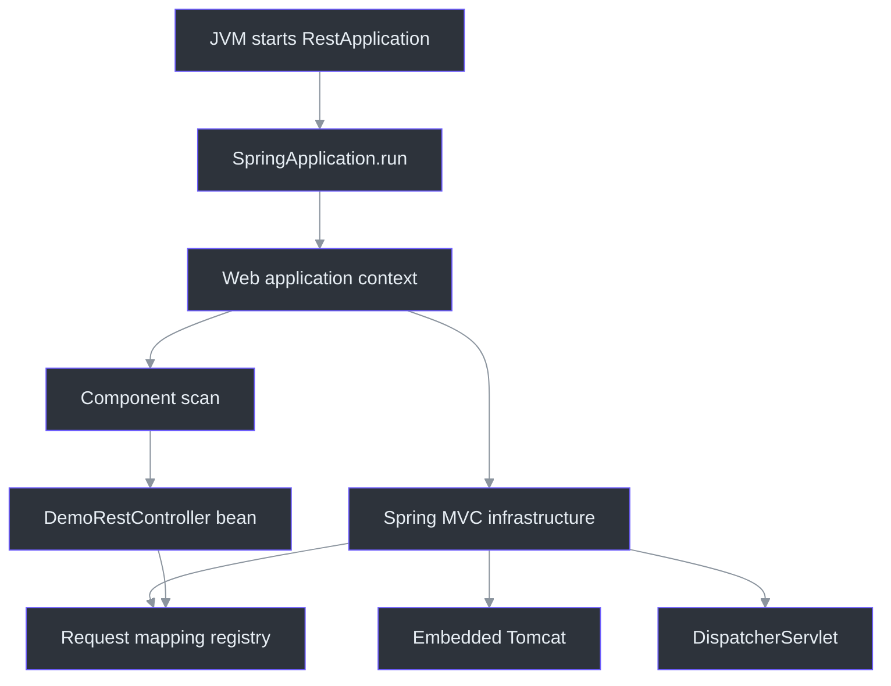
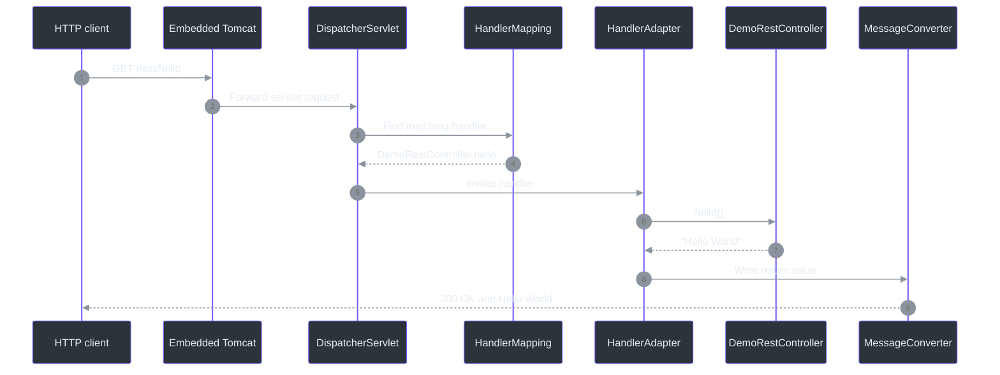
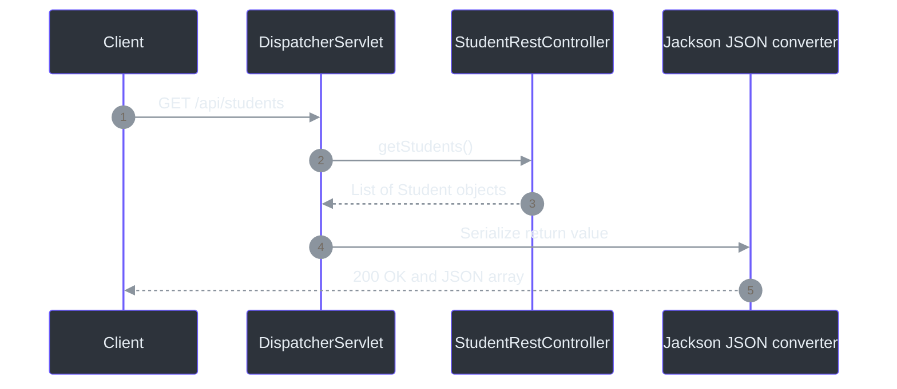
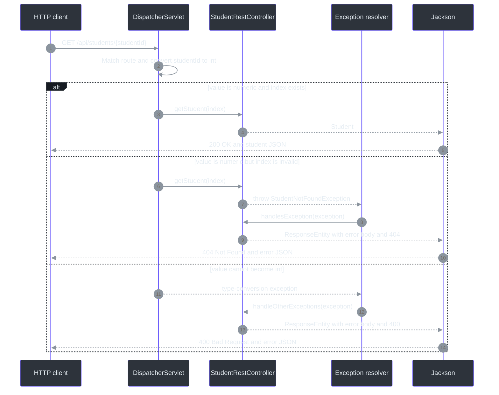
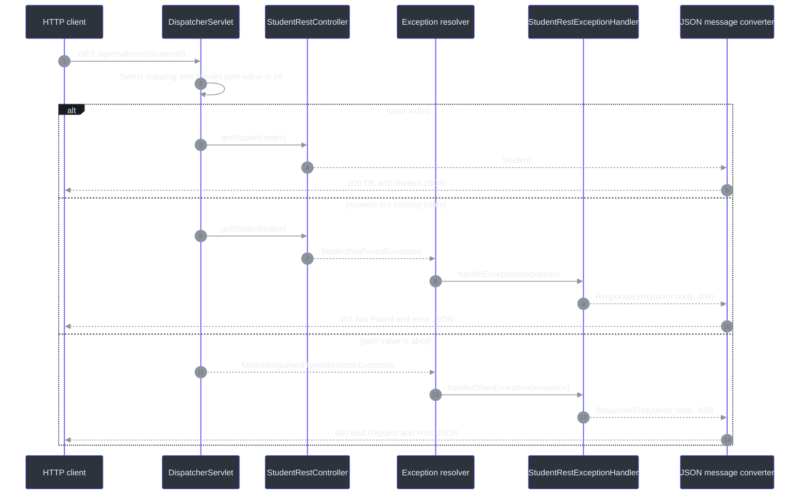

# Spring REST foundations, path variables, and exception handling

These notes preserve the first Spring REST lessons from **2026-09-19** and append the student-list, `@PostConstruct`, `@GetMapping`, `@PathVariable`, and REST exception-handling lessons discussed on **2026-09-20**. The earlier sections intentionally preserve the learning sequence from the original `Hello World` endpoint. [Section 16](#16-lesson-update-2026-09-20-student-json-getmapping-and-path-variables) explains routing and path-variable conversion; [Section 17](#17-lesson-update-2026-09-20-rest-exception-handling) records the original controller-local handler stage; [Section 18](#18-lesson-update-2026-09-20-global-exception-handling) explains the current global advice design and status-setting alternatives.

Course navigation: [repository README](../../README.md) | [cumulative course review](../../COURSE_REVIEW.md) | [previous JPA notes](../../03-spring-boot-hibernate-jpa-crud/01-cruddemo-student/notes.md)

## Quick revision

| Question | Short answer | Source |
|---|---|---|
| Which URL paths are implemented? | `/test/hello`, `/api/students`, and `/api/students/{studentId}`. | [`DemoRestController.java:7`](src/main/java/com/example/rest/controller/DemoRestController.java#L7), [`StudentRestController.java:15`](src/main/java/com/example/rest/controller/StudentRestController.java#L15), [`StudentRestController.java:27`](src/main/java/com/example/rest/controller/StudentRestController.java#L27), [`StudentRestController.java:32`](src/main/java/com/example/rest/controller/StudentRestController.java#L32) |
| Why is the path not just `/hello`? | The class-level `/test` mapping and method-level `/hello` mapping combine. | [`DemoRestController.java:7`](src/main/java/com/example/rest/controller/DemoRestController.java#L7) |
| What does `@RestController` mean? | It identifies a request-handling controller and gives its handler methods `@ResponseBody` behavior by default. | [`DemoRestController.java:6`](src/main/java/com/example/rest/controller/DemoRestController.java#L6) |
| What handles the incoming request first inside Spring MVC? | The `DispatcherServlet`, Spring MVC's front controller. | [`pom.xml:35`](pom.xml#L35) |
| What does the original hello endpoint return? | A Java `String` containing `Hello World`, written as the HTTP response body. | [`DemoRestController.java:11`](src/main/java/com/example/rest/controller/DemoRestController.java#L11) |
| Does the current method handle only GET? | No. Its `@RequestMapping` has no HTTP-method restriction. Prefer `@GetMapping` when the endpoint should be GET-only. | [`DemoRestController.java:10`](src/main/java/com/example/rest/controller/DemoRestController.java#L10) |
| What is serialization? | Converting a Java object into a transport representation such as JSON; `/api/students` now demonstrates it. | [`StudentRestController.java:27`](src/main/java/com/example/rest/controller/StudentRestController.java#L27), [`Student.java:15`](src/main/java/com/example/rest/entity/Student.java#L15) |
| What is deserialization? | Converting JSON request data into a Java object; no `@RequestBody` endpoint is implemented yet. | Current source has no `@RequestBody` |
| What does `@GetMapping` add? | It maps a handler specifically to HTTP `GET`, unlike an unrestricted `@RequestMapping`. | [`StudentRestController.java:27`](src/main/java/com/example/rest/controller/StudentRestController.java#L27) |
| When does `loadData()` run? | After dependency injection and before the controller bean is placed into service. | [`StudentRestController.java:20`](src/main/java/com/example/rest/controller/StudentRestController.java#L20) |
| What does `{studentId}` mean? | It captures one URL path segment so `@PathVariable` can bind and convert it. | [`StudentRestController.java:32`](src/main/java/com/example/rest/controller/StudentRestController.java#L32) |
| What happens for an out-of-range index? | The controller throws `StudentNotFoundException`; the global advice returns HTTP `404` with a `StudentErrorResponse` JSON body. | [`StudentRestController.java:35`](src/main/java/com/example/rest/controller/StudentRestController.java#L35), [`StudentRestExceptionHandler.java:13`](src/main/java/com/example/rest/controller/StudentRestExceptionHandler.java#L13) |
| How is a non-numeric path value handled? | Conversion fails before `getStudent()` runs; the global `Exception` handler currently returns HTTP `400`. | [`StudentRestExceptionHandler.java:23`](src/main/java/com/example/rest/controller/StudentRestExceptionHandler.java#L23) |
| What does `ResponseEntity<StudentErrorResponse>` mean? | The response body type is `StudentErrorResponse`; `ResponseEntity` also controls the real HTTP status and may carry headers. | [`StudentRestExceptionHandler.java:14`](src/main/java/com/example/rest/controller/StudentRestExceptionHandler.java#L14) |
| What does `@ControllerAdvice` do here? | It registers shared controller-related advice; its `@ExceptionHandler` methods can handle matching failures from controllers across the application. | [`StudentRestExceptionHandler.java:10`](src/main/java/com/example/rest/controller/StudentRestExceptionHandler.java#L10) |
| Is `@RestControllerAdvice` an automatic error-body generator? | No. It is `@ControllerAdvice` plus response-body semantics; application code must still create a DTO, `ProblemDetail`, map, string, or another body value. | Alternative discussed in Section 18 |
| Can `@ResponseStatus` replace the status on `ResponseEntity`? | Yes for a fixed method-level status when returning the body directly. It sets the HTTP status, but it does not populate the DTO's own `status` field. | Alternative discussed in Section 18 |
| Was Jackson added directly? | No. `spring-boot-starter-webmvc` brings Jackson transitively in this Spring Boot 4.1.1 project. | [`pom.xml:35`](pom.xml#L35); observed dependency tree |
| Does the current `String` response require Jackson? | No. Spring can write a string directly; Jackson becomes important when Java objects are represented as JSON. | [`DemoRestController.java:11`](src/main/java/com/example/rest/controller/DemoRestController.java#L11) |

## 1. Lesson snapshot

| Item | Current project | Source |
|---|---|---|
| Learning goal | Trace Spring MVC requests, return POJOs as JSON, bind URL values, and translate exceptions globally into structured HTTP error responses. | [`RestApplication.java:10`](src/main/java/com/example/rest/RestApplication.java#L10), [`StudentRestController.java:20`](src/main/java/com/example/rest/controller/StudentRestController.java#L20), [`StudentRestController.java:32`](src/main/java/com/example/rest/controller/StudentRestController.java#L32), [`StudentRestExceptionHandler.java:10`](src/main/java/com/example/rest/controller/StudentRestExceptionHandler.java#L10) |
| Spring Boot parent | `4.1.1` | [`pom.xml:8`](pom.xml#L8) |
| Java compilation target | `25` | [`pom.xml:30`](pom.xml#L30) |
| Verification runtime | Java `26.0.1` | Observed on 2026-09-19 with installed Maven |
| Spring Framework | `7.0.9` | Observed with `mvn dependency:tree` on 2026-09-19 |
| Jackson | Jackson 3 `3.1.5` | Observed transitively with `mvn dependency:tree` on 2026-09-19 |
| Web stack | Spring MVC with embedded Tomcat | [`pom.xml:35`](pom.xml#L35) |
| Development support | Spring Boot DevTools, runtime and optional | [`pom.xml:40`](pom.xml#L40) |
| Test support | Spring MVC test starter | [`pom.xml:46`](pom.xml#L46) |
| Current configuration | Only `spring.application.name=rest` | [`application.properties:1`](src/main/resources/application.properties#L1) |
| Implemented endpoints | `/test/hello`, `/api/students`, and `/api/students/{studentId}` | [`DemoRestController.java:7`](src/main/java/com/example/rest/controller/DemoRestController.java#L7), [`StudentRestController.java:27`](src/main/java/com/example/rest/controller/StudentRestController.java#L27), [`StudentRestController.java:32`](src/main/java/com/example/rest/controller/StudentRestController.java#L32) |
| Current automated test | Full context startup only; it does not call the endpoint. | [`RestApplicationTests.java:6`](src/test/java/com/example/rest/RestApplicationTests.java#L6), [`RestApplicationTests.java:10`](src/test/java/com/example/rest/RestApplicationTests.java#L10) |

## 2. Big picture: routing and representation are separate jobs

The REST endpoints demonstrate two different responsibilities:

1. **Routing:** Spring MVC decides which Java method should handle an HTTP request.
2. **Representation:** Spring MVC converts the method's return value into the HTTP response body.

The initial lesson proved routing and a plain-text response. The current project also proves POJO-to-JSON serialization through the student endpoints. JSON-to-POJO deserialization remains a next-step concept because the source still has no `@RequestBody` endpoint.

| Concern | Framework responsibility | Current evidence | Source |
|---|---|---|---|
| Application startup | Build the Spring context and start the embedded web server. | `SpringApplication.run(...)` | [`RestApplication.java:10`](src/main/java/com/example/rest/RestApplication.java#L10) |
| Component discovery | Find the controller below the `com.example.rest` root package. | Main class is in `com.example.rest`; controller is in its `controller` subpackage. | [`RestApplication.java:1`](src/main/java/com/example/rest/RestApplication.java#L1), [`DemoRestController.java:1`](src/main/java/com/example/rest/controller/DemoRestController.java#L1) |
| Request mapping | Combine class and method mappings into a handler route. | `/test` + `/hello` | [`DemoRestController.java:7`](src/main/java/com/example/rest/controller/DemoRestController.java#L7), [`DemoRestController.java:10`](src/main/java/com/example/rest/controller/DemoRestController.java#L10) |
| Handler invocation | Invoke `DemoRestController.hello()`. | Method has no parameters and returns `String`. | [`DemoRestController.java:11`](src/main/java/com/example/rest/controller/DemoRestController.java#L11) |
| Response writing | Place `Hello World` in the HTTP response body. | `@RestController` gives response-body semantics. | [`DemoRestController.java:6`](src/main/java/com/example/rest/controller/DemoRestController.java#L6), [`DemoRestController.java:12`](src/main/java/com/example/rest/controller/DemoRestController.java#L12) |
| JSON binding | Convert POJOs to or from JSON through a message converter. | The student endpoints demonstrate outbound serialization; inbound `@RequestBody` conversion is not implemented yet. | [`pom.xml:35`](pom.xml#L35), [`StudentRestController.java:27`](src/main/java/com/example/rest/controller/StudentRestController.java#L27) |


<!-- Sources: src/main/java/com/example/rest/RestApplication.java:6, src/main/java/com/example/rest/RestApplication.java:10, src/main/java/com/example/rest/controller/DemoRestController.java:6, pom.xml:35 -->

## 3. Project map

| File | Responsibility | Source |
|---|---|---|
| `pom.xml` | Selects Spring Boot 4.1.1, Java 25, Spring MVC, DevTools, and MVC test support. | [`pom.xml:8`](pom.xml#L8) |
| `RestApplication.java` | Contains the application entry point and the root component-scan package. | [`RestApplication.java:6`](src/main/java/com/example/rest/RestApplication.java#L6) |
| `DemoRestController.java` | Declares the controller, route, handler method, and response value. | [`DemoRestController.java:6`](src/main/java/com/example/rest/controller/DemoRestController.java#L6) |
| `StudentRestController.java` | Initializes the demonstration list, exposes the GET endpoints, validates indexes, and throws the domain-specific exception. | [`StudentRestController.java:14`](src/main/java/com/example/rest/controller/StudentRestController.java#L14) |
| `StudentRestExceptionHandler.java` | Applies shared exception-to-HTTP translation through global `@ControllerAdvice`. | [`StudentRestExceptionHandler.java:10`](src/main/java/com/example/rest/controller/StudentRestExceptionHandler.java#L10) |
| `Student.java` | Defines the POJO that Jackson serializes for the student responses. | [`Student.java:3`](src/main/java/com/example/rest/entity/Student.java#L3) |
| `StudentNotFoundException.java` | Defines the unchecked application exception used when the requested list index does not exist. | [`StudentNotFoundException.java:3`](src/main/java/com/example/rest/entity/StudentNotFoundException.java#L3) |
| `StudentErrorResponse.java` | Defines the current JSON error-body shape: numeric status, message, and timestamp. | [`StudentErrorResponse.java:3`](src/main/java/com/example/rest/entity/StudentErrorResponse.java#L3) |
| `application.properties` | Gives the application the logical name `rest`; it does not currently change the port or context path. | [`application.properties:1`](src/main/resources/application.properties#L1) |
| `RestApplicationTests.java` | Uses `@SpringBootTest` to verify that the application context can start. | [`RestApplicationTests.java:6`](src/test/java/com/example/rest/RestApplicationTests.java#L6) |
| `.mvn/wrapper/maven-wrapper.properties` | Records Maven `3.9.16` for the project wrapper. | [`.mvn/wrapper/maven-wrapper.properties:3`](.mvn/wrapper/maven-wrapper.properties#L3) |

## 4. Startup path: how Spring discovers the controller

### 4.1 Java enters through `main()`

The JVM invokes `RestApplication.main()`, which calls:

```java
SpringApplication.run(RestApplication.class, args);
```

Source: [`RestApplication.java:9`](src/main/java/com/example/rest/RestApplication.java#L9)

### 4.2 `@SpringBootApplication` enables three major features

`@SpringBootApplication` combines:

| Feature | Job in this project |
|---|---|
| `@SpringBootConfiguration` | Marks the main class as Boot configuration. |
| `@EnableAutoConfiguration` | Configures MVC, embedded Tomcat, message converters, and other infrastructure based on the classpath. |
| `@ComponentScan` | Searches `com.example.rest` and its subpackages for application components. |

The application class is in `com.example.rest`, while the controller is in `com.example.rest.controller`. The controller is therefore inside the default scan tree. (`src/main/java/com/example/rest/RestApplication.java:1`, `src/main/java/com/example/rest/controller/DemoRestController.java:1`)

### 4.3 Spring registers the controller and mapping

During context creation, Spring detects `@RestController`, creates one singleton controller bean by default, and registers its request mappings. Because there is no explicit constructor, Java supplies an implicit no-argument constructor.

The controller is normally created during startup and reused. The `hello()` handler is invoked per matching request; creating a request does not normally construct a new controller object. (`src/main/java/com/example/rest/controller/DemoRestController.java:6`)

### 4.4 Boot starts the web infrastructure

`spring-boot-starter-webmvc` supplies the servlet-based MVC stack and embedded Tomcat. Boot configures a `DispatcherServlet`, handler mappings, handler adapters, and message converters. (`pom.xml:33`)

The server currently uses port `8080` and context path `/` because no active property overrides either value. `spring.application.name=rest` names the application but does not add `/rest` to the URL. (`src/main/resources/application.properties:1`)

## 5. Request path: how `/test/hello` reaches `hello()`

The runtime route is assembled from two mappings:

```text
class mapping     /test
method mapping  + /hello
                 ------
final path        /test/hello
```

The complete local URL is:

```text
http://localhost:8080/test/hello
```

| URL part | Current value | Why | Source |
|---|---|---|---|
| Scheme | `http` | Embedded server is serving ordinary HTTP locally. | Observed startup log, 2026-09-19 |
| Host | `localhost` | The request is sent to the local machine. | Runtime command |
| Port | `8080` | Boot default; no `server.port` override exists. | [`application.properties:1`](src/main/resources/application.properties#L1) |
| Context path | `/` | No `server.servlet.context-path` override exists. | [`application.properties:1`](src/main/resources/application.properties#L1) |
| Controller mapping | `/test` | Class-level path prefix. | [`DemoRestController.java:7`](src/main/java/com/example/rest/controller/DemoRestController.java#L7) |
| Handler mapping | `/hello` | Method-level path. | [`DemoRestController.java:10`](src/main/java/com/example/rest/controller/DemoRestController.java#L10) |


<!-- Sources: src/main/java/com/example/rest/controller/DemoRestController.java:6, src/main/java/com/example/rest/controller/DemoRestController.java:7, src/main/java/com/example/rest/controller/DemoRestController.java:10, src/main/java/com/example/rest/controller/DemoRestController.java:12, pom.xml:35 -->

### Detailed request sequence

1. The client sends a request to `http://localhost:8080/test/hello`.
2. Embedded Tomcat accepts the TCP/HTTP request.
3. Tomcat passes the servlet request to Spring MVC's `DispatcherServlet`.
4. The dispatcher asks a handler mapping to find a controller method matching the path and HTTP conditions.
5. Spring finds `DemoRestController.hello()`.
6. A handler adapter invokes the method.
7. The method returns the Java string `Hello World`.
8. Because the class is a `@RestController`, Spring writes the return value to the response body instead of treating it as a view name.
9. The client receives HTTP status `200` and body `Hello World`.

## 6. The annotations in the current code

| Annotation | Location | Meaning here | Source |
|---|---|---|---|
| `@SpringBootApplication` | `RestApplication` | Enables Boot configuration, auto-configuration, and component scanning. | [`RestApplication.java:6`](src/main/java/com/example/rest/RestApplication.java#L6) |
| `@RestController` | `DemoRestController` | Registers a controller stereotype whose handler return values use response-body semantics. | [`DemoRestController.java:6`](src/main/java/com/example/rest/controller/DemoRestController.java#L6) |
| `@RequestMapping("/test")` | Controller class | Supplies the common path prefix inherited by handler methods. | [`DemoRestController.java:7`](src/main/java/com/example/rest/controller/DemoRestController.java#L7) |
| `@RequestMapping("/hello")` | `hello()` | Adds the handler path but currently does not restrict the HTTP method. | [`DemoRestController.java:10`](src/main/java/com/example/rest/controller/DemoRestController.java#L10) |
| `@SpringBootTest` | Test class | Starts a full Spring Boot application context for the test. | [`RestApplicationTests.java:6`](src/test/java/com/example/rest/RestApplicationTests.java#L6) |
| `@Test` | `contextLoads()` | Marks one JUnit test method. | [`RestApplicationTests.java:9`](src/test/java/com/example/rest/RestApplicationTests.java#L9) |

### 6.1 `@RestController` versus `@Controller`

`@RestController` is effectively `@Controller` plus `@ResponseBody` for all handler methods.

| Annotation style | Typical interpretation of a returned `String` |
|---|---|
| `@Controller` only | Treat the string as a logical view name unless response-body behavior is added. |
| `@Controller` plus `@ResponseBody` | Write the string into the HTTP response body. |
| `@RestController` | Apply response-body behavior to controller handler methods by default. |

That is why the current return value becomes the body `Hello World` rather than causing a search for a view named `Hello World`. (`src/main/java/com/example/rest/controller/DemoRestController.java:6`, `src/main/java/com/example/rest/controller/DemoRestController.java:12`)

### 6.2 `@RequestMapping` and HTTP methods

`@RequestMapping` can narrow a handler by path, HTTP method, parameters, headers, consumed media type, produced media type, and API version. The current code supplies only paths, so no HTTP verb is explicitly selected. (`src/main/java/com/example/rest/controller/DemoRestController.java:7`, `src/main/java/com/example/rest/controller/DemoRestController.java:10`)

A clearer future form for a read-only endpoint would be:

```java
// Suggested alternative; not currently implemented.
@GetMapping("/hello")
public String hello() {
    return "Hello World";
}
```

`@GetMapping` is a composed annotation equivalent to `@RequestMapping(method = RequestMethod.GET)` with the supplied path.

## 7. HTTP message conversion

Controller methods work with Java values, while HTTP carries bytes and text. Spring MVC bridges those two worlds through `HttpMessageConverter` implementations.

| Direction | Java side | HTTP side | Converter job |
|---|---|---|---|
| Response | Handler return value | Response body | Write the Java value in an acceptable representation. |
| Request | Handler parameter | Request body | Read the body and create the required Java value. |

The current `hello()` method returns a `String`, so Spring can use its string conversion support to write plain text. Jackson is not needed for this particular response. (`src/main/java/com/example/rest/controller/DemoRestController.java:11`)

When a handler returns a POJO and JSON is selected, Spring's JSON message converter delegates object mapping to Jackson. The student endpoints now demonstrate this path.

## 8. Data binding, serialization, and deserialization

### 8.1 Vocabulary

| Term | Direction | Meaning | Memory aid |
|---|---|---|---|
| **POJO** | N/A | Plain Old Java Object: a normal Java class used to carry application data. | “The Java shape.” |
| **JSON** | N/A | A text data-interchange format containing objects, arrays, strings, numbers, booleans, and null. | “The wire shape.” |
| **Serialization** | Java -> JSON | Convert an in-memory Java object into JSON for a response or storage. | “Object goes out.” |
| **Deserialization** | JSON -> Java | Parse JSON and create/populate a Java object. | “Object comes in.” |
| **Marshalling** | Object -> transport representation | A broader term often used similarly to serialization. | “Prepare to transport.” |
| **Unmarshalling** | Transport representation -> object | The reverse of marshalling. | “Rebuild after transport.” |
| **Data binding** | Both directions | Match external data names and values with Java properties and types. | “Connect wire fields to Java fields.” |

In REST discussions, **serialization/deserialization** are the most common JSON terms. **Marshalling/unmarshalling** express the same broad direction and are also common in XML-oriented APIs.

### 8.2 Outbound flow: POJO to JSON


<!-- Sources: pom.xml:35, src/main/java/com/example/rest/controller/StudentRestController.java:27, src/main/java/com/example/rest/entity/Student.java:15 -->

For example, a future Java object such as:

```text
Student(firstName="John", lastName="Doe")
```

could be serialized as:

```json
{
  "firstName": "John",
  "lastName": "Doe"
}
```

### 8.3 Inbound flow: JSON to POJO

A future `@RequestBody Student student` parameter would tell Spring to read the HTTP request body and convert it into a `Student`.

```text
Content-Type: application/json
        |
        v
JSON request body
        |
        v
Spring JSON message converter
        |
        v
Jackson deserialization
        |
        v
Student method argument
```

The request's `Content-Type` describes what the client sent. The target method parameter tells Spring the Java type it must produce. Malformed JSON or an incompatible value can cause a client error before the controller method executes.

### 8.4 JSON binding is not every kind of Spring conversion

Spring also binds path variables, query parameters, headers, and form values. Those often begin as strings and use Spring's conversion service, for example converting `"42"` to `int`. JSON request-body binding instead uses an HTTP message converter and a JSON mapper such as Jackson.

**Memory rule:** simple request values use conversion; structured JSON bodies use message conversion plus object mapping.

## 9. What Jackson is and why no direct dependency was required

Jackson is a Java data-binding library. It can parse JSON, generate JSON, serialize Java objects, and deserialize JSON into Java objects.

The project declares only `spring-boot-starter-webmvc` directly for the web stack. (`pom.xml:33`)

The observed Spring Boot 4.1.1 dependency path is:

```text
spring-boot-starter-webmvc:4.1.1
  -> spring-boot-starter-jackson:4.1.1
     -> spring-boot-jackson:4.1.1
        -> tools.jackson.core:jackson-databind:3.1.5
  -> spring-boot-webmvc:4.1.1
     -> spring-webmvc:7.0.9
```

This is a **transitive dependency**: the application requests the web starter, and that starter requests the libraries needed for its normal web/JSON behavior. Adding Jackson a second time is unnecessary for the standard setup.

Spring Boot 4.1.1 prefers Jackson 3 and auto-configures a `JsonMapper` when Jackson is on the classpath. Older course material may mention Jackson 2's `ObjectMapper` and `com.fasterxml.jackson.databind` packages. The central idea remains the same, but this project's current Jackson 3 classes use the `tools.jackson` package family.

### What Jackson typically uses

For ordinary Java objects, Jackson can discover properties from fields, accessor methods, records, or supported constructors. Traditional JavaBean-style course examples usually provide private fields, getters/setters, and a no-argument constructor. Constructor- and record-based binding are also possible, so “Jackson always requires setters” is too broad.

Jackson performs structural conversion; it does not by itself apply business validation, authorize a request, or save an object to a database. Those are separate application responsibilities.

## 10. Original concept previews

These examples were written during the first lesson. Returning POJOs is now implemented in list and single-object form by `StudentRestController`; receiving a POJO with `@RequestBody` is still a future lesson.

### 10.1 Returning a POJO

```java
// Concept preview only.
@GetMapping("/student")
public Student getStudent() {
    return new Student("John", "Doe");
}
```

With response-body handling and JSON selected, Spring would ask Jackson to serialize the returned `Student`.

### 10.2 Receiving a POJO

```java
// Concept preview only.
@PostMapping("/student")
public Student createStudent(@RequestBody Student student) {
    return student;
}
```

For a request with `Content-Type: application/json`, Spring would ask Jackson to deserialize the JSON body into the `Student` argument. Returning the same object would then serialize it back to JSON.

### 10.3 Request and response are separate conversions

```text
JSON request --deserialization--> Student parameter
Student return value --serialization--> JSON response
```

One endpoint can therefore perform both operations during a single request.

## 11. Configuration reference

| Property | Current value | Effect | State | Source |
|---|---|---|---|---|
| `spring.application.name` | `rest` | Supplies a logical application name used by Boot and logs. It does not alter the HTTP path. | Active | [`application.properties:1`](src/main/resources/application.properties#L1) |
| `server.port` | Not configured | Boot uses its default; runtime verification observed port `8080`. | Default behavior | [`application.properties:1`](src/main/resources/application.properties#L1) |
| `server.servlet.context-path` | Not configured | The application uses root context path `/`. | Default behavior | [`application.properties:1`](src/main/resources/application.properties#L1) |

No Jackson customization properties are currently configured. The project uses Boot's auto-configured defaults. (`src/main/resources/application.properties:1`)

## 12. Commands and expected results

Run from:

```powershell
Set-Location '.\04-springboot-rest-crud\01-spring-boot-rest-crud'
```

### Run the tests

```powershell
.\mvnw.cmd test
```

The wrapper currently hits a local PowerShell launcher problem in this checkout. The installed Maven fallback used for verification was:

```powershell
mvn -q test
```

### Run the application

```powershell
mvn spring-boot:run
```

### Call the endpoint

Browser or client URL:

```text
http://localhost:8080/test/hello
```

PowerShell:

```powershell
$response = Invoke-WebRequest -UseBasicParsing `
    -Uri 'http://localhost:8080/test/hello' `
    -Method Get

$response.StatusCode
$response.Content
```

Expected result:

```text
200
Hello World
```

## 13. Testing boundaries and observed verification

### What the current test proves

`RestApplicationTests` uses `@SpringBootTest` and an empty `contextLoads()` method. It proves that Spring can find the Boot configuration and construct the application context with the current dependencies and beans. (`src/test/java/com/example/rest/RestApplicationTests.java:6`)

It does **not** prove:

- that `/test/hello` is mapped;
- that the endpoint accepts GET;
- that the response status is `200`;
- that the response body equals `Hello World`;
- that future JSON serialization or deserialization works for a specific POJO.

Those require a focused MVC test or a live HTTP smoke test.

### Observed on 2026-09-19

| Check | Result |
|---|---|
| `mvn dependency:tree` with an explicit local repository | Passed; resolved Spring MVC `7.0.9` and Jackson Databind `3.1.5`. |
| `mvn -q test` | Passed with exit code `0`; the full Spring context started. |
| `mvn spring-boot:run` | Application reached successful startup on port `8080`, context path `/`. |
| `GET http://localhost:8080/test/hello` | Returned HTTP `200` with body `Hello World`. |
| `git status --short` before documentation changes | The new `04-springboot-rest-crud/` section was untracked. |

### Wrapper troubleshooting observation

`./mvnw.cmd test` produced the local launcher error `Cannot index into a null array` followed by `Cannot start maven from wrapper`. This was a wrapper-launch problem, not a Java compilation or Spring context failure: installed Maven `3.9.16` successfully ran the test and dependency tree.

## 14. Common mistakes and corrections

| Symptom or misunderstanding | Cause | Correction |
|---|---|---|
| Calling `/hello` returns 404 | The class-level `/test` prefix was omitted. | Call `/test/hello` or intentionally change the mapping. |
| Expecting `spring.application.name=rest` to create `/rest` | Application identity is not an HTTP context path. | Configure `server.servlet.context-path` when an application-wide URL prefix is required. |
| Thinking `@RequestMapping("/hello")` means GET-only | No `method` restriction was supplied. | Prefer `@GetMapping("/hello")` for a GET endpoint. |
| Thinking the controller is constructed for every request | Controllers are singleton beans by default. | Separate bean creation at startup from handler-method invocation per request. |
| Treating `Hello World` as JSON serialization | The handler returns a Java `String`, which Spring can write directly. | Return a POJO to observe object-to-JSON serialization. |
| Adding Jackson manually because it is absent from the project POM | The web starter brings Jackson transitively. | Inspect the dependency tree before adding duplicate dependencies. |
| Assuming `@RestController` performs routing by itself | Routing also needs handler mappings and a matching mapping annotation. | Think `@RestController` for controller/response semantics and mapping annotations for route conditions. |
| Assuming `@RequestBody` saves data | It only asks Spring to convert the request body into a Java value. | Persistence requires a separate service/repository/DAO operation. |
| Assuming JSON binding validates all business rules | Jackson focuses on structural conversion. | Apply Bean Validation and application rules separately in later layers. |
| Treating `contextLoads()` as an endpoint test | It does not send an HTTP request or assert a response. | Add MockMvc or live HTTP verification for endpoint behavior. |

## 15. Active-recall questions

1. **What is the complete original hello endpoint URL?**  
   `http://localhost:8080/test/hello`.

2. **Why do `/test` and `/hello` both appear in the final path?**  
   The class-level mapping is the controller prefix, and the method-level mapping narrows it to one handler.

3. **What does `@RestController` combine conceptually?**  
   Controller discovery/handling plus default response-body semantics: effectively `@Controller` and `@ResponseBody`.

4. **What is the role of the `DispatcherServlet`?**  
   It is Spring MVC's front controller: it coordinates handler lookup, invocation, response handling, and exception resolution.

5. **When is the controller created, and when is `hello()` called?**  
   The singleton controller is normally created during startup; `hello()` is called for each matching request.

6. **Why is the current mapping not GET-only?**  
   Neither `@RequestMapping` declares a `method` condition.

7. **What annotation would clearly make the method GET-only?**  
   `@GetMapping("/hello")`.

8. **What converts controller values to and from HTTP bodies?**  
   Spring MVC `HttpMessageConverter` implementations.

9. **What is serialization?**  
   Converting a Java object into JSON or another transport representation.

10. **What is deserialization?**  
    Parsing JSON and constructing/populating the target Java object.

11. **How do marshalling and unmarshalling relate?**  
    Marshalling moves an object into a transport representation; unmarshalling reconstructs it.

12. **Does `Hello World` prove Jackson serialization?**  
    No. It is a direct string response.

13. **Why is Jackson available without a direct dependency?**  
    `spring-boot-starter-webmvc` brings the Jackson starter and Databind transitively.

14. **Which Jackson generation does this project use?**  
    Jackson 3; dependency verification resolved `tools.jackson.core:jackson-databind:3.1.5`.

15. **What is the main mapper name in this Boot 4/Jackson 3 setup?**  
    `JsonMapper`; older Jackson 2 lessons commonly use `ObjectMapper`.

16. **What does `@RequestBody` do?**  
    It tells Spring to read the request body and convert it into the declared Java parameter type.

17. **What do `Content-Type` and `Accept` communicate?**  
    `Content-Type` describes the representation sent by the client; `Accept` describes representations the client can receive.

18. **What does the current `contextLoads()` test prove?**  
    That the Spring application context can start, not that an endpoint returns the correct response.

## 16. Lesson update 2026-09-20: student JSON, `@GetMapping`, and path variables

### 16.1 Current implementation at a glance

| Component or endpoint | Current responsibility | Source |
|---|---|---|
| `Student` | POJO containing `firstName` and `lastName`, constructors, getters, setters, and `toString()`. | [`Student.java:3`](src/main/java/com/example/rest/entity/Student.java#L3) |
| `StudentRestController` | Owns the demonstration list and exposes the student GET endpoints. | [`StudentRestController.java:14`](src/main/java/com/example/rest/controller/StudentRestController.java#L14) |
| `loadData()` | Adds three students after Spring creates and injects the controller bean. | [`StudentRestController.java:20`](src/main/java/com/example/rest/controller/StudentRestController.java#L20) |
| `GET /api/students` | Returns the entire `List<Student>`, which Spring and Jackson write as a JSON array. | [`StudentRestController.java:27`](src/main/java/com/example/rest/controller/StudentRestController.java#L27) |
| `GET /api/students/{studentId}` | Captures one path segment, converts it to `int`, and uses it as a list index. | [`StudentRestController.java:32`](src/main/java/com/example/rest/controller/StudentRestController.java#L32) |

The controller-level `/api` mapping combines with each method-level mapping:

| Class mapping | Method mapping | Effective GET path |
|---|---|---|
| `/api` | `/students` | `/api/students` |
| `/api` | `/students/{studentId}` | `/api/students/{studentId}` |

Source: [`StudentRestController.java:15`](src/main/java/com/example/rest/controller/StudentRestController.java#L15)

### 16.2 `@PostConstruct` and demonstration data

`@PostConstruct` marks an initialization callback. The container calls it after dependency injection has completed and before the bean is placed into service. The method must take no parameters and return `void`; the current `loadData()` method satisfies those requirements. The callback still runs even though this controller currently has no injected dependencies. ([Jakarta Annotations 3.0 specification](https://jakarta.ee/specifications/annotations/3.0/apidocs/jakarta.annotation/jakarta/annotation/postconstruct))

The current sequence is:

1. Spring constructs the singleton `StudentRestController` bean.
2. Spring would inject any dependencies.
3. Spring invokes `loadData()` because it is marked `@PostConstruct`.
4. Three `Student` objects are added to the in-memory list.
5. The controller is ready to handle requests.

Because the controller is a singleton by default, `loadData()` normally runs once per application context. A restart, including a DevTools restart, creates a new context and therefore a new controller and list. This is suitable for a lesson demonstration, but it is not persistent storage: the data disappears when the application stops. (`src/main/java/com/example/rest/controller/StudentRestController.java:18-25`)

### 16.3 Returning `List<Student>` as JSON

`@GetMapping("/students")` restricts the handler to HTTP `GET`. It is a composed shortcut for `@RequestMapping(method = RequestMethod.GET)`. ([Spring Framework 7.0.9 `@GetMapping`](https://docs.spring.io/spring-framework/docs/current/javadoc-api/org/springframework/web/bind/annotation/GetMapping.html))

The method returns `List<Student>`, not JSON text written by application code:

```java
@GetMapping("/students")
public List<Student> getStudents() {
    return students;
}
```

Spring sees the return value of a `@RestController` method, selects a JSON message converter, and delegates object mapping to Jackson. Jackson serializes the Java list as a JSON array and each `Student` as a JSON object. The getter names expose the JSON properties `firstName` and `lastName`. (`src/main/java/com/example/rest/controller/StudentRestController.java:27-30`, `src/main/java/com/example/rest/entity/Student.java:15-29`)


<!-- Sources: src/main/java/com/example/rest/controller/StudentRestController.java:15, src/main/java/com/example/rest/controller/StudentRestController.java:27, src/main/java/com/example/rest/entity/Student.java:15 -->

Observed response:

```json
[
  {
    "firstName": "firstName A",
    "lastName": "lastName A"
  },
  {
    "firstName": "firstName B",
    "lastName": "lastName B"
  },
  {
    "firstName": "firstName C",
    "lastName": "lastName C"
  }
]
```

The no-argument constructor is not what causes this outbound serialization. The getters are sufficient for the current response. The no-argument constructor plus setters follows the conventional JavaBean shape and will also support straightforward JSON-to-POJO deserialization in later lessons. (`src/main/java/com/example/rest/entity/Student.java:8`, `src/main/java/com/example/rest/entity/Student.java:15-29`)

### 16.4 URI templates and `@PathVariable`

In this mapping:

```java
@GetMapping("/students/{studentId}")
public Student getStudent(@PathVariable int studentId) {
    // Range validation is shown in Section 17.
    return students.get(studentId);
}
```

`{studentId}` is a **URI template variable**. It matches and captures one path segment. For `/api/students/1`, the captured text is initially `"1"`. `@PathVariable` binds that captured value to the Java method parameter, and Spring converts it to the declared `int` type before invoking the method. ([Spring Framework 7.0.9 request mappings](https://docs.spring.io/spring-framework/reference/web/webmvc/mvc-controller/ann-requestmapping.html))

| Piece | Meaning | Must match what? |
|---|---|---|
| `{studentId}` | Name of the captured URI variable. | The explicit annotation name, or the inferred Java parameter name. |
| `@PathVariable("studentId")` | Explicitly selects the URI variable named `studentId`. | The name inside `{}`. |
| `id` in `int id` | Java parameter identifier used inside the method. | It may differ when the annotation explicitly names the URI variable. |
| `int` | Target Java type for conversion. | The captured text must be convertible to `int`; the type does not select the route. |

#### Allowed binding forms

These three explicit forms are equivalent:

```java
@PathVariable("studentId") int id
@PathVariable(name = "studentId") int id
@PathVariable(value = "studentId") int id
```

`value` and `name` are aliases. `value` enables the short annotation syntax, while `name` is more descriptive. They are not competing strategies and neither has precedence over the other. Supplying both is redundant; if both are supplied, they must agree. ([Spring Framework 7.0.9 `@PathVariable`](https://docs.spring.io/spring-framework/docs/current/javadoc-api/org/springframework/web/bind/annotation/PathVariable.html))

The Java parameter name can also remain `studentId`:

```java
@PathVariable("studentId") int studentId
```

When no annotation name is supplied, Spring infers it from the Java parameter name:

```java
@PathVariable int studentId
```

This shorthand works when the parameter name is discoverable and matches `{studentId}`. The official documentation specifically notes the need for matching names and compilation with `-parameters`. The current endpoint was observed working with this shorthand. By contrast, this is unsafe for the current mapping:

```java
// Mapping contains {studentId}, but inference sees the Java name abcd.
@PathVariable int abcd
```

This explicit form is valid, although `abcd` would be a poor descriptive name:

```java
@PathVariable("studentId") int abcd
```

**Memory rule:** the name inside `{}` identifies the captured URL value; an explicit `@PathVariable` name connects that value to any valid Java parameter name.

### 16.5 Route matching happens before type conversion

Every path segment arrives through HTTP as text. Spring first selects a handler from the HTTP method and mapping conditions, then resolves and converts method arguments, and only then invokes the controller method.


<!-- Sources: src/main/java/com/example/rest/controller/StudentRestController.java:32, src/main/java/com/example/rest/controller/StudentRestController.java:33, src/main/java/com/example/rest/controller/StudentRestController.java:37 -->

| Declared parameter | Request segment | Result before method invocation |
|---|---|---|
| `int studentId` | `1` | Converts to integer `1`; the method runs. |
| `int studentId` | `abcd` | Conversion fails; the current application returns HTTP `400`. |
| `String studentId` | `1` | The method receives `"1"`. |
| `String studentId` | `abcd` | The method receives `"abcd"`. |

Changing the Java type does not create a different endpoint. Therefore, these two handlers cannot coexist under the same effective GET mapping:

```java
// Invalid pair: same HTTP method and effective URL pattern.
@GetMapping("/students/{studentId}")
public Student getByNumber(@PathVariable("studentId") int id) { /* ... */ }

@GetMapping("/students/{studentId}")
public Student getByText(@PathVariable("studentId") String id) { /* ... */ }
```

The same conflict occurs if the methods are placed in different controller classes, because their mappings enter one application-wide handler registry. Spring detects handler methods during context initialization and requires a unique mapping; registering another method under the same mapping causes an `IllegalStateException`. ([Spring Framework `AbstractHandlerMethodMapping`](https://docs.spring.io/spring-framework/docs/current/javadoc-api/org/springframework/web/servlet/handler/AbstractHandlerMethodMapping.html))

### 16.6 Using regex-constrained path variables

Two methods can coexist when their mapping patterns are genuinely different and non-overlapping. Spring supports the convention `{variableName:regex}`:

```java
// Alternative example only; not implemented in this project.
@GetMapping("/students/{studentId:\\d+}")
public Student getByNumericId(@PathVariable("studentId") int id) {
    // ...
}

@GetMapping("/students/{studentCode:[A-Za-z]+}")
public Student getByCode(@PathVariable("studentCode") String code) {
    // ...
}
```

The Java source needs `\\d+` because the backslash must be escaped inside a Java string. The runtime regex is `\d+`.

| Request | Matching pattern | Conversion |
|---|---|---|
| `/api/students/123` | `{studentId:\d+}` | `"123"` becomes `int 123`. |
| `/api/students/abcd` | `{studentCode:[A-Za-z]+}` | The method receives `String "abcd"`. |
| `/api/students/123abc` | Neither example | No matching handler. |

The regex pattern selects the route; the Java type conversion still happens afterward. Distinct semantic paths such as `/students/id/{id}` and `/students/code/{code}` are often even clearer.

### 16.7 `studentId` is currently a list index

The current method executes `students.get(studentId)`. It is therefore using the value as a zero-based `ArrayList` index, not as a durable student identifier. (`src/main/java/com/example/rest/controller/StudentRestController.java:37`)

| Request | Current result |
|---|---|
| `/api/students/0` | First student: `firstName A`. |
| `/api/students/1` | Second student: `firstName B`. |
| `/api/students/2` | Third student: `firstName C`. |
| `/api/students/3` | Index is outside the three-element list; the current custom handler returns HTTP `404`. Before exception handling was added, this produced `500`. |
| `/api/students/abcd` | Cannot convert `abcd` to `int`; currently returns HTTP `400`. |

For the current lesson, `{studentIndex}` would describe the behavior more precisely. A later database-backed endpoint will normally use a real identifier such as `Long id`, search through a service/repository, and return a controlled `404 Not Found` when no student exists.

### 16.8 Observed verification on 2026-09-20

| Check | Observed result |
|---|---|
| `.\\mvnw.cmd test` | Wrapper launcher failed locally with `Cannot index into a null array`; this is the known wrapper-launch issue in this checkout. |
| `mvn -q test` | Passed with exit code `0` using Java `26.0.1`; Spring Boot `4.1.1` created the full application context. |
| Default-port live run | Could not start because port `8080` was already occupied by another process. |
| Temporary verification run | `mvn -q spring-boot:run '-Dspring-boot.run.arguments=--server.port=18080'` started successfully without changing project configuration. |
| `GET /api/students` | HTTP `200`; returned the expected three-element JSON array. |
| `GET /api/students/0` | HTTP `200`; returned student A. |
| `GET /api/students/1` | HTTP `200`; returned student B. |
| `GET /api/students/abcd` | HTTP `400`; path matched, but `String` to `int` conversion failed before the handler ran. |
| `GET /api/students/3` before custom handling | HTTP `500`; `ArrayList.get(3)` threw `IndexOutOfBoundsException`. This historical result was replaced by the explicit validation and `404` response recorded in Section 17. |

The temporary server was stopped after the checks. The application source and `application.properties` were not changed for the alternate port.

### 16.9 Common mistakes and corrections

| Misunderstanding | Correct mental model |
|---|---|
| `{studentId}` itself is a Java variable. | It is a named placeholder in the URL pattern. `@PathVariable` binds it to a Java parameter. |
| The Java parameter must always be named `studentId`. | It must match only when relying on implicit name inference. Explicit `@PathVariable("studentId")` permits another Java name. |
| `name` and `value` provide different behavior. | They are aliases for the same annotation attribute. |
| Spring chooses between duplicate routes by trying `int` and then `String`. | Parameter type is not a route condition. Identical mappings conflict during startup. |
| Any two regex routes are automatically safe. | Their accepted values should be disjoint, or matching can still become ambiguous. |
| `/students/1` means database ID `1`. | In the current code it means list index `1`, which is the second element. |
| Returning `List<Student>` requires manually writing JSON. | The controller returns Java objects; Spring's message conversion and Jackson produce JSON. |
| `@PostConstruct` makes the data persistent. | It seeds a new in-memory list for each application context; restart loses the data. |

### 16.10 Active recall for this lesson

1. What does `@GetMapping` add compared with path-only `@RequestMapping`?
2. When does the current `loadData()` callback run?
3. Why does returning `List<Student>` produce a JSON array?
4. Which `Student` methods expose the current JSON property names?
5. What does `{studentId}` capture from `/api/students/1`?
6. Why can `@PathVariable int studentId` omit the annotation name?
7. How does `@PathVariable("studentId") int id` connect the URL and Java names?
8. What is the relationship between `name` and `value` in `@PathVariable`?
9. Does `int` versus `String` participate in route selection?
10. Why do two methods with the same GET mapping but different parameter types fail at startup?
11. What does `{studentId:\d+}` add to a URI template?
12. Why is the current `studentId` actually an index?
13. Why does `abcd` produce `400`, while index `3` now produces `404`?
14. Which controller check and exception handler changed the old out-of-range `500` into a controlled `404`?

## 17. Lesson update 2026-09-20: REST exception handling

> **Historical lesson stage:** this section records the first implementation, when the handlers were local to `StudentRestController`. The current source has moved those methods to `StudentRestExceptionHandler`; see [Section 18](#18-lesson-update-2026-09-20-global-exception-handling). Preserving both stages makes the refactoring and its purpose easier to revise.

### 17.1 The pattern implemented in this lesson

A REST API should not force every client to understand Java stack traces or framework-default error pages. At this lesson stage, the project translated failures into a predictable HTTP response by separating three jobs:

| Part | Job | Current implementation | Source |
|---|---|---|---|
| Detection | Recognize that the requested student index is invalid. | `studentId < 0 || studentId >= students.size()` | [`StudentRestController.java:35`](src/main/java/com/example/rest/controller/StudentRestController.java#L35) |
| Exception | Represent the application-specific failure in Java. | `StudentNotFoundException extends RuntimeException` | [`StudentNotFoundException.java:3`](src/main/java/com/example/rest/entity/StudentNotFoundException.java#L3) |
| Translation | Convert the exception into an HTTP status and body. | Two local `@ExceptionHandler` methods at this historical stage | Later moved to [`StudentRestExceptionHandler.java:13`](src/main/java/com/example/rest/controller/StudentRestExceptionHandler.java#L13) |
| Error contract | Give clients a stable JSON structure. | `StudentErrorResponse` with `status`, `message`, and `timeStamp` | [`StudentErrorResponse.java:3`](src/main/java/com/example/rest/entity/StudentErrorResponse.java#L3) |

The general industry pattern is therefore:

```text
failure detected -> exception thrown -> matching handler selected
                 -> error body created -> HTTP response returned
```

The classes and exact fields vary between projects. This lesson first kept the handlers inside `StudentRestController` so the complete flow was visible in one class. The next lesson performs the common refactoring into global advice.

### 17.2 Current success and failure flow


<!-- Sources: src/main/java/com/example/rest/controller/StudentRestController.java:32-57, src/main/java/com/example/rest/entity/StudentErrorResponse.java:3-39, Spring Framework 7.0.9 exception-handler documentation -->

An important ordering detail is visible here: `abcd` cannot be converted to `int`, so Spring never invokes `getStudent()`. The MVC exception-resolution mechanism can still select the broader handler declared in the controller.

### 17.3 The custom exception

`StudentNotFoundException` extends `RuntimeException`, so it is an unchecked exception. The controller can throw it without adding `throws StudentNotFoundException` to the method signature. Its constructors delegate to the corresponding superclass constructors, preserving a message and, when supplied, the original cause. (`src/main/java/com/example/rest/entity/StudentNotFoundException.java:3-15`)

The current range check is correct for a three-element zero-based list:

```java
if (studentId < 0 || studentId >= students.size()) {
    throw new StudentNotFoundException("Student not found with id " + studentId);
}
```

Both boundaries matter:

- `studentId < 0` rejects negative indexes.
- `studentId >= students.size()` rejects `3` and above when the size is `3`.
- Only `0`, `1`, and `2` reach `students.get(studentId)`.

The message says `id`, but the current value is technically a list index. This is acceptable for the lesson; a database-backed version would normally search by a real entity ID.

### 17.4 The error response class is the JSON contract

`StudentErrorResponse` is an ordinary POJO. Jackson uses its getters to serialize the object:

```json
{
  "status": 404,
  "message": "Student not found with id 3",
  "timeStamp": 1789893269298
}
```

| Field | Current meaning | Source |
|---|---|---|
| `status` | A copy of the numeric status placed inside the JSON body. | [`StudentErrorResponse.java:5`](src/main/java/com/example/rest/entity/StudentErrorResponse.java#L5) |
| `message` | Human-readable details copied from `ex.getMessage()`. | [`StudentErrorResponse.java:6`](src/main/java/com/example/rest/entity/StudentErrorResponse.java#L6) |
| `timeStamp` | Epoch milliseconds recorded when the handler creates the response. | [`StudentErrorResponse.java:7`](src/main/java/com/example/rest/entity/StudentErrorResponse.java#L7) |

The body field named `status` and the real HTTP status are separate values. This line changes only the Java object that becomes JSON:

```java
response.setStatus(HttpStatus.NOT_FOUND.value());
```

This line sets the actual HTTP response status:

```java
return new ResponseEntity<>(response, HttpStatus.NOT_FOUND);
```

Keeping them equal gives clients a convenient self-describing body, but the network-level status is controlled by `ResponseEntity`, not by the POJO field name.

### 17.5 What `@ExceptionHandler` does

`@ExceptionHandler` marks a controller method that Spring MVC may invoke when request handling raises a matching exception. The current methods rely on type inference from their exception parameters:

```java
@ExceptionHandler
public ResponseEntity<StudentErrorResponse> handlesException(
        StudentNotFoundException ex) {
    // ...
}
```

This means: handle `StudentNotFoundException` because that is the declared exception argument. An explicit equivalent is:

```java
@ExceptionHandler(StudentNotFoundException.class)
public ResponseEntity<StudentErrorResponse> handlesException(
        StudentNotFoundException ex) {
    // ...
}
```

The exception does **not** need to be declared in both places. Use the method parameter when the body needs the exception message or cause. If the annotation explicitly declares the exception and the method does not need exception details, the exception parameter may be omitted.

#### Single and multiple exception mappings

| Form | Meaning | Guidance |
|---|---|---|
| `@ExceptionHandler` plus `handle(A ex)` | Infer `A` from the method parameter. | Concise and used by the current project. |
| `@ExceptionHandler(A.class)` plus `handle(A ex)` | Explicitly map `A` and make it available to the method. | Clear and common. |
| `@ExceptionHandler(A.class)` plus `handle()` | Map `A` without receiving its details. | Valid when details are unnecessary. |
| `@ExceptionHandler({A.class, B.class})` plus `handle(Exception ex)` | One method handles either listed type. | Use a common parent type that can receive every listed exception. |
| Separate handlers for `A` and `B` | Each failure can have its own body or status. | Usually clearest when failures mean different things. |

The Java annotation syntax for more than one type uses braces:

```java
// Alternative example; not implemented in this project.
@ExceptionHandler({IllegalArgumentException.class, IllegalStateException.class})
public ResponseEntity<StudentErrorResponse> handleClientErrors(RuntimeException ex) {
    // ...
}
```

`RuntimeException` works in that example because both listed exceptions extend it. `Exception` is another common parent but is broader than necessary.

These forms do not express alternatives correctly:

```java
// Invalid Java: multi-catch syntax is only for catch clauses.
handle(IllegalArgumentException | IllegalStateException ex)

// Two parameters do not mean "either exception".
handle(IllegalArgumentException first, IllegalStateException second)
```

When one annotation lists unrelated exception classes, do not declare a method parameter that can receive only one of them. Either use a shared parent parameter, omit the exception parameter, or create separate handlers. Spring recommends specific handler signatures where practical because they are easier to reason about.

An exception argument is the most important parameter for this lesson, but Spring MVC supports other handler-method arguments when needed:

| Optional argument | Why a handler might use it |
|---|---|
| A specific exception or `Exception` | Read the message, cause, or exception-specific details. |
| `WebRequest` or `NativeWebRequest` | Read request and session attributes without depending directly on the Servlet API. |
| `HttpServletRequest` or `HttpServletResponse` | Access servlet-specific request or response details. |
| `HandlerMethod` | Inspect which controller method raised the exception. |
| `HttpMethod`, `Locale`, or authenticated `Principal` | Include request method, locale, or caller context in handling decisions. |

These are supporting inputs, not alternative exception slots. The method still has one exception occurrence to handle. Common supported return choices include `ResponseEntity<?>`, a response body written through message conversion, `ProblemDetail`, `ErrorResponse`, or `void` when the method writes the servlet response itself. `ResponseEntity` is the clearest fit for the current lesson because the handler explicitly controls body and status together.

### 17.6 `ResponseEntity<T>` and the handler method signature

`ResponseEntity<T>` represents the complete HTTP response: body, headers, and status. Its type parameter `T` is the body type, so:

```java
ResponseEntity<StudentErrorResponse>
```

means that this response carries a `StudentErrorResponse` body. It does **not** mean a list, and it does not describe the exception being handled.

The current method signature has three distinct parts:

```java
public ResponseEntity<StudentErrorResponse> handlesException(
        StudentNotFoundException ex)
```

| Part | Purpose |
|---|---|
| `StudentNotFoundException ex` | Receives the raised exception and also tells Spring which type this method handles when the annotation is empty. |
| `StudentErrorResponse` | Declares the type of response body placed inside the `ResponseEntity`. |
| `ResponseEntity<...>` | Lets the method control the real HTTP status, optional headers, and body. |

The constructor form used by the lesson is correct:

```java
return new ResponseEntity<>(response, HttpStatus.NOT_FOUND);
```

A builder is an equivalent alternative, not currently implemented:

```java
return ResponseEntity.status(HttpStatus.NOT_FOUND).body(response);
```

Jackson serializes the `StudentErrorResponse` body in the same general way that it serializes `Student`; `ResponseEntity` supplies the surrounding HTTP metadata.

### 17.7 `HttpStatus`: choosing the response status

`HttpStatus` is Spring's enum of standard HTTP status codes. Calling `.value()` returns the integer code, while passing the enum to `ResponseEntity` sets the actual response status.

| Status | Typical meaning | Example |
|---|---|---|
| `200 OK` | Request succeeded. | A student was found and returned. |
| `400 Bad Request` | The request cannot be processed because the input is malformed or invalid. | `studentId=abcd` cannot become `int`. |
| `401 Unauthorized` | Authentication is missing or invalid. | A protected API receives no valid credentials. |
| `403 Forbidden` | Identity is known but is not allowed to perform the action. | A normal user requests an administrator operation. |
| `404 Not Found` | The requested resource does not exist. | No student exists for the requested index or ID. |
| `409 Conflict` | The request conflicts with current resource state. | Creating a record with a unique value that already exists. |
| `500 Internal Server Error` | An unexpected server-side problem occurred. | A programming bug or unavailable internal dependency not caused by client input. |

Choose the status from the meaning of the failure from the client's perspective, not simply from the Java exception class name.

### 17.8 Local handlers, global advice, and the broad catch-all

At this historical lesson stage, the handlers lived in `StudentRestController`, so they were local to exceptions raised while handling requests through that controller. This is useful for errors that genuinely belong to only one controller.

In a larger application, repeated API error rules are commonly centralized:

```java
// Design preview from this lesson; global advice is implemented in Section 18.
@RestControllerAdvice
public class GlobalExceptionHandler {

    @ExceptionHandler(StudentNotFoundException.class)
    public ResponseEntity<StudentErrorResponse> handleStudentNotFound(
            StudentNotFoundException ex) {
        // ...
    }
}
```

`@RestControllerAdvice` combines controller-advice behavior with response-body semantics, allowing handlers to apply across selected or all controllers. The current project uses the closely related `@ControllerAdvice` because its handlers return `ResponseEntity` values.

The current fallback is deliberately broad:

```java
@ExceptionHandler
public ResponseEntity<StudentErrorResponse> handleOtherExceptions(Exception ex)
```

It successfully converts the path-variable conversion failure into `400`, but it would also turn many unrelated programming or server failures into `400`. That can incorrectly blame the client and hide defects. A production design normally uses narrower handlers for expected client errors and a final unexpected-error handler that returns `500`, logs the full internal exception, and sends a safe generic message instead of exposing `ex.getMessage()`.

Spring Framework 7 also supports standardized RFC 9457 responses through `ProblemDetail`, `ErrorResponse`, and `ResponseEntityExceptionHandler`. Those are useful future alternatives; the custom DTO remains a valid way to learn and control an application-specific response format.

### 17.9 Observed verification on 2026-09-20

| Check | Observed result |
|---|---|
| `.\mvnw.cmd test` | Failed in the local wrapper launcher with `Cannot index into a null array`; no project compilation failure was reported. |
| `mvn -q test` | Passed with exit code `0` on Java `26.0.1`; Spring Boot `4.1.1` created the application context. |
| `GET /api/students/0` on temporary port `18081` | HTTP `200`; returned the first student. |
| `GET /api/students/3` | HTTP `404`; returned `status: 404` and `Student not found with id 3`. |
| `GET /api/students/-1` | HTTP `404`; returned the custom missing-student error body. |
| `GET /api/students/abcd` | HTTP `400`; the broad handler returned the path-variable conversion error body. |

The temporary server used for the HTTP checks was stopped afterward. The project configuration was not changed to use that port.

The existing `contextLoads()` test still proves only application-context creation. It does not send these requests or assert their status/body. Focused MVC tests would be the next step for automated verification.

### 17.10 Common mistakes and corrections

| Misunderstanding | Correct mental model |
|---|---|
| Setting `response.status` changes the HTTP status. | That changes only the JSON body. `ResponseEntity` sets the actual HTTP status. |
| Every exception should return `400`. | Expected invalid client input may be `400`; missing resources are commonly `404`; unexpected server failures are generally `500`. |
| An exception type must appear in both the annotation and parameter. | Either location can declare the mapping; keep the parameter when the method needs the exception object. |
| Multiple exception classes are comma-separated method parameters. | List types in annotation braces and use one compatible exception parameter, or separate handlers. |
| `A | B` works in a method parameter. | Java permits that syntax only in a multi-catch clause. |
| A local handler automatically applies to every controller. | Move shared handling to `@ControllerAdvice` or `@RestControllerAdvice`. |
| A broad `Exception` handler returning `400` is production-ready. | It can misclassify server bugs and leak internal messages; use narrower mappings plus a safe `500` fallback. |
| `ResponseEntity<StudentErrorResponse>` describes the caught exception. | Its generic argument describes the response body type. |

### 17.11 Active recall for exception handling

1. What four responsibilities are separated by validation, a custom exception, an exception handler, and an error DTO?
2. Why does `StudentNotFoundException` not require a `throws` declaration?
3. Which two checks protect `ArrayList.get(studentId)`?
4. How does `@ExceptionHandler` infer a type when its parentheses are empty?
5. Must the same exception type be declared in both the annotation and method parameter?
6. What syntax lists multiple exceptions in `@ExceptionHandler`?
7. Why can one method parameter not be written as `A | B ex`?
8. When a handler lists unrelated exceptions, what parameter type can safely receive all of them?
9. What does the generic argument in `ResponseEntity<StudentErrorResponse>` describe?
10. Which line sets the JSON `status` field, and which line sets the actual HTTP status?
11. Why is `404` appropriate for an out-of-range requested student?
12. Why is `400` appropriate when `abcd` cannot become an `int`?
13. What danger comes from returning `400` for every `Exception`?
14. When should handlers move from a controller to `@RestControllerAdvice`?
15. What do `ProblemDetail` and `ResponseEntityExceptionHandler` offer as future alternatives?

## 18. Lesson update 2026-09-20: global exception handling

### 18.1 What changed in the current source

The controller still detects an invalid index and throws `StudentNotFoundException`, but it no longer contains the exception-handler methods. Those methods now live in `StudentRestExceptionHandler`, which is annotated with `@ControllerAdvice`.

| Responsibility | Current location | Source |
|---|---|---|
| Receive `/api/students/{studentId}` | `StudentRestController.getStudent(...)` | [`StudentRestController.java:32`](src/main/java/com/example/rest/controller/StudentRestController.java#L32) |
| Detect an invalid index | Range check in `getStudent(...)` | [`StudentRestController.java:35`](src/main/java/com/example/rest/controller/StudentRestController.java#L35) |
| Represent the expected failure | `StudentNotFoundException` | [`StudentNotFoundException.java:3`](src/main/java/com/example/rest/entity/StudentNotFoundException.java#L3) |
| Translate expected missing-student failures | `handleException(...)` | [`StudentRestExceptionHandler.java:13`](src/main/java/com/example/rest/controller/StudentRestExceptionHandler.java#L13) |
| Translate all other failures | `handleOtherException(...)` | [`StudentRestExceptionHandler.java:23`](src/main/java/com/example/rest/controller/StudentRestExceptionHandler.java#L23) |
| Define the JSON error shape | `StudentErrorResponse` | [`StudentErrorResponse.java:3`](src/main/java/com/example/rest/entity/StudentErrorResponse.java#L3) |

The important separation is:

```text
controller detects and throws
              ↓
global advice translates the exception at the web boundary
              ↓
Spring/Jackson writes the HTTP status and JSON body
```

The name `StudentRestExceptionHandler` is descriptive only. The class is global because of `@ControllerAdvice`, not because its name contains `ExceptionHandler`.

### 18.2 What “global exception handler” means

A global exception handler is a shared place where matching exceptions from multiple controllers can be converted into HTTP responses. Spring's controller-advice mechanism can share three kinds of controller support:

- `@ExceptionHandler` methods for exception translation;
- `@InitBinder` methods for shared request-data binding configuration;
- `@ModelAttribute` methods for shared model attributes in MVC applications.

This project uses only the first capability.

`@ControllerAdvice` is meta-annotated with `@Component`, so component scanning discovers `StudentRestExceptionHandler` and registers it as a Spring bean while the application context starts. Registration happens at startup; its `@ExceptionHandler` methods run only if request processing raises a compatible exception.

Therefore, advice is not a filter that executes for every successful request. For `GET /api/students/0`, no exception handler is invoked. For `GET /api/students/3`, the exception-resolution phase selects the `StudentNotFoundException` handler.

### 18.3 Current request and exception flow


<!-- Sources: src/main/java/com/example/rest/controller/StudentRestController.java:32-39, src/main/java/com/example/rest/controller/StudentRestExceptionHandler.java:10-32, Spring Framework 7.0.9 controller-advice documentation -->

The conversion failure occurs before `getStudent(...)` starts because Spring must turn the captured path text into an `int` before invoking the method. The global handler can still translate that MVC exception.

### 18.4 Local handlers versus global advice

| Design | Scope | Good fit | Tradeoff |
|---|---|---|---|
| `@ExceptionHandler` inside a controller | That controller | A rule that truly belongs to one controller | Repeated rules can be duplicated across controllers. |
| `@ControllerAdvice` | All or selected controllers | Shared MVC behavior; handlers may return views, bodies, or `ResponseEntity` | Body semantics are not automatically applied to every return value. |
| `@RestControllerAdvice` | All or selected controllers | Shared REST/JSON exception responses | Still requires deliberate DTO/status design; it does not manufacture the application's error contract. |

When both a controller-local handler and global advice could handle the same exception, Spring checks local `@ExceptionHandler` methods first. This allows a controller to override a general application rule when it has a genuinely special response.

“Global” describes scope, not file size. A large application can have several focused advice classes, for example:

```text
StudentExceptionAdvice      -> student-specific failures
ValidationExceptionAdvice   -> request-validation failures
SecurityExceptionAdvice     -> API authorization failures
FallbackExceptionAdvice     -> safe final 500 response
```

Avoid overlapping handlers with the same scope and priority. If several advice beans can match, `@Order` can define precedence, but clear, non-overlapping responsibilities are easier to maintain.

### 18.5 `@ControllerAdvice` versus `@RestControllerAdvice`

`@RestControllerAdvice` is a composed annotation equivalent to:

```java
@ControllerAdvice
@ResponseBody
```

The `@ResponseBody` part tells Spring that handler return values should be written to the HTTP body instead of being interpreted as MVC view names.

The current project can use plain `@ControllerAdvice` because each handler returns `ResponseEntity<StudentErrorResponse>`. `ResponseEntity` is already a complete HTTP-response return type, so Spring writes its body and status correctly.

The direct translation of the current class to REST advice is therefore small:

```java
import org.springframework.web.bind.annotation.RestControllerAdvice;

@RestControllerAdvice
public class StudentRestExceptionHandler {

    @ExceptionHandler(StudentNotFoundException.class)
    public ResponseEntity<StudentErrorResponse> handleException(
            StudentNotFoundException ex) {

        StudentErrorResponse response = new StudentErrorResponse();
        response.setStatus(HttpStatus.NOT_FOUND.value());
        response.setMessage(ex.getMessage());
        response.setTimeStamp(System.currentTimeMillis());

        return ResponseEntity.status(HttpStatus.NOT_FOUND).body(response);
    }
}
```

Only the advice annotation and import need to change; keeping `ResponseEntity` is valid. This is an **alternative example**, not a source change made in the project.

### 18.6 Does `@RestControllerAdvice` create the error object automatically?

No. It supplies response-body semantics; it does not know which fields the application wants in its error contract. The handler must still return a body value, such as:

- the current `StudentErrorResponse` DTO;
- Spring's RFC 9457 `ProblemDetail`;
- a dedicated application-wide error DTO;
- a `Map` for a very small experiment, although a typed DTO is safer for a stable API contract;
- a `String`, when plain text is intentionally desired.

For the current custom format, this construction is still necessary:

```java
StudentErrorResponse response = new StudentErrorResponse();
response.setStatus(HttpStatus.NOT_FOUND.value());
response.setMessage(ex.getMessage());
response.setTimeStamp(System.currentTimeMillis());
```

### 18.7 Three different “status” concerns

This is the most important distinction in this lesson:

| Location | What it controls | Does it affect the real HTTP status? |
|---|---|---|
| `response.setStatus(404)` | The numeric `status` property inside the JSON body | No |
| `ResponseEntity.status(HttpStatus.NOT_FOUND)` | The actual HTTP response status line | Yes |
| `@ResponseStatus(HttpStatus.NOT_FOUND)` | A fixed HTTP status associated with a handler method or exception class | Yes |

For example, this body field:

```json
{
  "status": 404
}
```

is ordinary JSON data. A client can receive that body with an actual HTTP `200` if the handler fails to set the HTTP status separately. Conversely, an HTTP response can correctly be `404` even when its body has no `status` property.

In the current DTO, `status` is a primitive `int`. If the handler creates the DTO but never sets this field, Java leaves it at `0`, and Jackson will normally serialize `"status": 0`. Therefore either:

1. continue setting both the body field and the HTTP status;
2. remove the body field if clients do not need duplicated status data; or
3. redesign it as nullable `Integer` and configure/handle omission deliberately.

### 18.8 Returning the body directly with `@ResponseStatus`

With `@RestControllerAdvice`, a handler can return the DTO directly and put a fixed status on the method:

```java
@RestControllerAdvice
public class StudentRestExceptionHandler {

    @ResponseStatus(HttpStatus.NOT_FOUND)
    @ExceptionHandler(StudentNotFoundException.class)
    public StudentErrorResponse handleException(StudentNotFoundException ex) {
        return new StudentErrorResponse(
                HttpStatus.NOT_FOUND.value(),
                ex.getMessage(),
                System.currentTimeMillis()
        );
    }
}
```

Here:

- `@ResponseStatus` sets the real HTTP response to `404`;
- `@RestControllerAdvice` gives the returned DTO response-body semantics;
- Jackson serializes the DTO;
- the constructor argument still separately populates the JSON `status` field.

If the body should omit status entirely, the DTO must be redesigned; `@ResponseStatus` does not add or remove DTO properties.

With plain `@ControllerAdvice`, add `@ResponseBody` to a direct-body method:

```java
@ControllerAdvice
public class StudentRestExceptionHandler {

    @ResponseBody
    @ResponseStatus(HttpStatus.NOT_FOUND)
    @ExceptionHandler(StudentNotFoundException.class)
    public StudentErrorResponse handleException(StudentNotFoundException ex) {
        return new StudentErrorResponse(
                HttpStatus.NOT_FOUND.value(),
                ex.getMessage(),
                System.currentTimeMillis()
        );
    }
}
```

Without `@ResponseBody` or `@RestControllerAdvice`, a plain returned object does not automatically have REST-body semantics under ordinary `@ControllerAdvice`.

### 18.9 `ResponseEntity` versus `@ResponseStatus`

| Capability | `ResponseEntity` | `@ResponseStatus` |
|---|---|---|
| Choose status dynamically at runtime | Yes | No; the annotation declares a fixed status |
| Set response headers | Yes | Not directly |
| Return a body | Yes | The method still returns the body separately |
| Good for one fixed status | Yes | Yes, often concise |
| Good for several outcomes from one method | Yes | No |

Do not normally place both on the same handler. Spring documents that a status explicitly set through `ResponseEntity` takes precedence over `@ResponseStatus`, so using both creates redundant and potentially confusing declarations.

`@ResponseStatus` may also be placed on an exception class:

```java
@ResponseStatus(HttpStatus.NOT_FOUND)
public class StudentNotFoundException extends RuntimeException {
    // constructors
}
```

That is concise, but it couples the exception type directly to HTTP. Method-level translation in advice keeps web concerns at the web boundary and is often easier to vary between APIs.

Avoid the `reason` attribute for REST response bodies. Spring's documentation warns that using a reason can invoke the servlet container's `sendError` mechanism, which can produce an HTML error page and make the handler's body unsuitable for a REST API.

### 18.10 Limiting which controllers an advice applies to

With no selector attributes, the current `@ControllerAdvice` applies to all controllers discovered by the application:

```java
@ControllerAdvice
public class StudentRestExceptionHandler {
}
```

The available selector styles include:

| Selector | Example | Meaning |
|---|---|---|
| `value` | `@RestControllerAdvice("com.example.rest.controller")` | Shorthand alias for `basePackages` |
| `basePackages` | `@RestControllerAdvice(basePackages = "com.example.rest.controller")` | Controllers in the named packages |
| `basePackageClasses` | `@RestControllerAdvice(basePackageClasses = StudentRestController.class)` | Controllers in the packages of the listed marker classes; type-safe against package renames |
| `assignableTypes` | `@RestControllerAdvice(assignableTypes = StudentRestController.class)` | The listed controller types and assignable types |
| `annotations` | `@RestControllerAdvice(annotations = RestController.class)` | Controllers carrying the listed annotation |
| `name` | `@RestControllerAdvice(name = "studentAdvice")` | Gives the advice bean an explicit component name; this names the bean rather than selecting controllers |

Examples:

```java
// Package string
@RestControllerAdvice(basePackages = "com.example.rest.controller")

// Type-safe package marker
@RestControllerAdvice(basePackageClasses = StudentRestController.class)

// One exact controller family
@RestControllerAdvice(assignableTypes = StudentRestController.class)

// REST controllers only
@RestControllerAdvice(annotations = RestController.class)
```

If multiple selector attributes are present, Spring combines them with **OR**, not AND: a controller matching any selector is included. Selector checks occur at runtime, so use only the scoping needed for a clear design.

`@Order` is separate from those selectors:

```java
@Order(1)
@RestControllerAdvice
public class StudentRestExceptionHandler {
}
```

It controls precedence among multiple advice beans; it does not decide which controllers are in scope.

### 18.11 A caution about the current broad fallback

Because the advice has no selector, this method can handle exceptions from any controller in the application:

```java
@ExceptionHandler(Exception.class)
public ResponseEntity<StudentErrorResponse> handleOtherException(Exception ex)
```

It is useful for the current lesson because it catches `MethodArgumentTypeMismatchException` for `abcd`. However, it can also catch an unexpected programming error from `DemoRestController` or a future controller and incorrectly return:

- HTTP `400`, which blames the request;
- a student-shaped response, even when the failure is unrelated to students;
- the raw exception message, which may reveal internal details.

A stronger production design uses a narrow conversion/validation handler for expected `400` errors and a final `Exception` handler that logs internal details, returns `500`, and sends a safe generic message. Standard `ProblemDetail` responses are another option.

### 18.12 Observed verification on 2026-09-20

| Check | Observed result |
|---|---|
| `.\mvnw.cmd test` | The local wrapper launcher failed with `Cannot index into a null array`; this was a wrapper-launch issue, not a reported project test failure. |
| `mvn -q test` | Passed with exit code `0` using Java `26.0.1`; Spring Boot `4.1.1` created the application context. |
| `GET /api/students/0` on temporary port `18082` | HTTP `200`; returned `firstName A` and `lastName A`. |
| `GET /api/students/3` | HTTP `404`; returned the custom body with `status: 404`. |
| `GET /api/students/-1` | HTTP `404`; returned the custom missing-student body. |
| `GET /api/students/abcd` | HTTP `400`; returned the path-variable conversion message through the global fallback. |

The temporary server was stopped after the checks. No application port or source-code behavior was changed for verification.

### 18.13 Common mistakes and corrections

| Misunderstanding | Correct mental model |
|---|---|
| `@ControllerAdvice` runs its handler methods for every request. | The advice bean is registered at startup; a handler method runs only after a matching exception. |
| `@ControllerAdvice` is only for HTML error pages. | It supports shared MVC concerns. It can return views, bodies with `@ResponseBody`, or complete `ResponseEntity` responses. |
| `@RestControllerAdvice` creates the error DTO automatically. | It supplies response-body semantics; the handler still chooses and creates the body. |
| Changing the class name limits its scope to students. | Scope comes from advice selector attributes, not the Java class name. |
| Setting the DTO's `status` field sets HTTP status. | It only changes JSON data; use `ResponseEntity` or `@ResponseStatus` for HTTP status. |
| `@ResponseStatus` fills the DTO's `status` field. | It affects HTTP metadata only. Populate or remove the DTO field separately. |
| Plain `@ControllerAdvice` always serializes a directly returned POJO. | Use `@ResponseBody`, `@RestControllerAdvice`, or return `ResponseEntity`. |
| All handlers must be kept in one global file. | Split advice by domain or concern while keeping scopes and exception mappings clear. |
| Multiple selector attributes narrow scope with AND. | Spring combines advice selectors with OR. |
| A broad global `Exception` handler returning `400` is safe. | It can hide server bugs and misclassify failures; use narrow handlers and a safe `500` fallback. |

### 18.14 Active recall for global advice

1. What makes `StudentRestExceptionHandler` global: its class name or its annotation?
2. When is the advice bean registered, and when is an individual handler invoked?
3. Does a successful request execute an `@ExceptionHandler` method?
4. Which wins first for a matching exception: a controller-local handler or global advice?
5. What two annotations are effectively combined by `@RestControllerAdvice`?
6. Why does the current plain `@ControllerAdvice` still return JSON correctly?
7. Does `@RestControllerAdvice` construct `StudentErrorResponse` automatically?
8. What is the difference between `response.setStatus(404)` and `ResponseEntity.status(NOT_FOUND)`?
9. What value does an unset primitive `int status` contain?
10. What additional annotation is needed when plain `@ControllerAdvice` directly returns a DTO?
11. When is `@ResponseStatus` simpler than `ResponseEntity`?
12. Why is `ResponseEntity` better when a status or headers must be dynamic?
13. What happens when several controller-advice selectors are declared together?
14. What does `@Order` control?
15. Why is the current global `Exception.class` fallback risky?

## 19. Official references

- [Spring Boot 4.1.1: `@SpringBootApplication`](https://docs.spring.io/spring-boot/reference/using/using-the-springbootapplication-annotation.html)
- [Spring Boot 4.1.1: servlet web applications and Spring MVC](https://docs.spring.io/spring-boot/reference/web/servlet.html)
- [Spring Boot 4.1.1: JSON support and Jackson 3](https://docs.spring.io/spring-boot/reference/features/json.html)
- [Spring Framework 7.0.9: `DispatcherServlet`](https://docs.spring.io/spring-framework/reference/web/webmvc/mvc-servlet.html)
- [Spring Framework 7.0.9: request-processing sequence](https://docs.spring.io/spring-framework/reference/web/webmvc/mvc-servlet/sequence.html)
- [Spring Framework 7.0.9: `@RestController`](https://docs.spring.io/spring-framework/docs/current/javadoc-api/org/springframework/web/bind/annotation/RestController.html)
- [Spring Framework 7.0.9: `@RequestMapping`](https://docs.spring.io/spring-framework/docs/current/javadoc-api/org/springframework/web/bind/annotation/RequestMapping.html)
- [Spring Framework 7.0.9: `@GetMapping`](https://docs.spring.io/spring-framework/docs/current/javadoc-api/org/springframework/web/bind/annotation/GetMapping.html)
- [Spring Framework 7.0.9: request mappings, URI variables, type conversion, and regex patterns](https://docs.spring.io/spring-framework/reference/web/webmvc/mvc-controller/ann-requestmapping.html)
- [Spring Framework 7.0.9: `@PathVariable`](https://docs.spring.io/spring-framework/docs/current/javadoc-api/org/springframework/web/bind/annotation/PathVariable.html)
- [Spring Framework 7.0.9: unique handler-method mappings](https://docs.spring.io/spring-framework/docs/current/javadoc-api/org/springframework/web/servlet/handler/AbstractHandlerMethodMapping.html)
- [Spring Framework 7.0.9: `@RequestBody`](https://docs.spring.io/spring-framework/reference/web/webmvc/mvc-controller/ann-methods/requestbody.html)
- [Spring Framework 7.0.9: `@ResponseBody`](https://docs.spring.io/spring-framework/reference/web/webmvc/mvc-controller/ann-methods/responsebody.html)
- [Spring Framework 7.0.9: exception handling in Spring MVC](https://docs.spring.io/spring-framework/reference/web/webmvc/mvc-controller/ann-exceptionhandler.html)
- [Spring Framework 7.0.9: controller advice](https://docs.spring.io/spring-framework/reference/web/webmvc/mvc-controller/ann-advice.html)
- [Spring Framework 7.0.9: `@ExceptionHandler`](https://docs.spring.io/spring-framework/docs/current/javadoc-api/org/springframework/web/bind/annotation/ExceptionHandler.html)
- [Spring Framework 7.0.9: `@ControllerAdvice`](https://docs.spring.io/spring-framework/docs/current/javadoc-api/org/springframework/web/bind/annotation/ControllerAdvice.html)
- [Spring Framework 7.0.9: `ResponseEntity`](https://docs.spring.io/spring-framework/docs/current/javadoc-api/org/springframework/http/ResponseEntity.html)
- [Spring Framework 7.0.9: `HttpStatus`](https://docs.spring.io/spring-framework/docs/current/javadoc-api/org/springframework/http/HttpStatus.html)
- [Spring Framework 7.0.9: `@RestControllerAdvice`](https://docs.spring.io/spring-framework/docs/current/javadoc-api/org/springframework/web/bind/annotation/RestControllerAdvice.html)
- [Spring Framework 7.0.9: `@ResponseStatus`](https://docs.spring.io/spring-framework/docs/current/javadoc-api/org/springframework/web/bind/annotation/ResponseStatus.html)
- [Spring Framework 7.0.9: `ProblemDetail`](https://docs.spring.io/spring-framework/docs/current/javadoc-api/org/springframework/http/ProblemDetail.html)
- [Spring Framework 7.0.9: `ResponseEntityExceptionHandler` and RFC 9457 error responses](https://docs.spring.io/spring-framework/docs/current/javadoc-api/org/springframework/web/servlet/mvc/method/annotation/ResponseEntityExceptionHandler.html)
- [Jakarta Annotations 3.0: `@PostConstruct`](https://jakarta.ee/specifications/annotations/3.0/apidocs/jakarta.annotation/jakarta/annotation/postconstruct)

## 20. Related pages

| Page | Relationship |
|---|---|
| [Course README](../../README.md) | Course order, project navigation, and progress status |
| [Cumulative course review](../../COURSE_REVIEW.md) | Compact cross-section mental models and recall questions |
| [Spring Boot Basics notes](../../01-spring-boot-basics/springBootApp/notes.md) | Earlier application startup, URL composition, configuration, and endpoint fundamentals |
| [Spring Core notes](../../02-spring-boot-core/coach/notes.md) | Component scanning, bean creation, controller lifecycle, and existing REST controller examples |
| [JPA CRUD notes](../../03-spring-boot-hibernate-jpa-crud/01-cruddemo-student/notes.md) | Previous module's persistence concepts and completed lesson history |
| [Employee REST + JPA notes](../02-spring-boot-rest-crud-employee/notes.md) | Continues the REST lessons with persistent employees, service transactions, and JSON request bodies |
