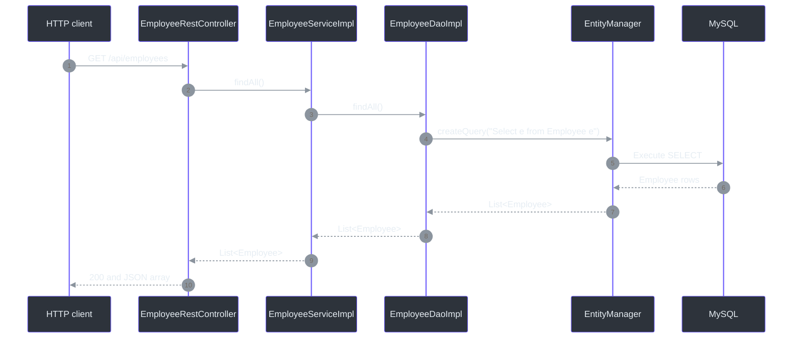
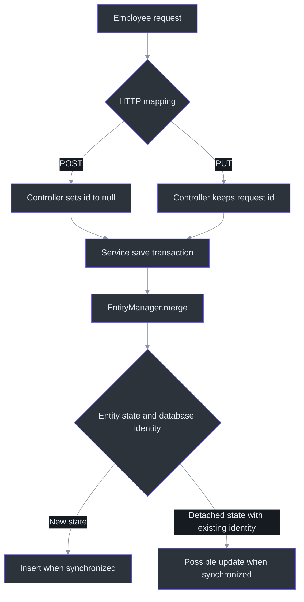
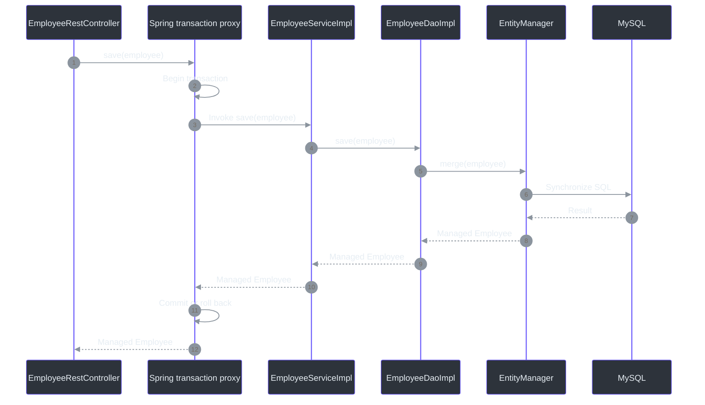

# Employee REST CRUD with JPA and a service layer

These notes capture the employee REST + JPA lessons discussed on **2026-09-20**. The project currently implements list, find-by-ID, create, full-update-style PUT, partial PATCH, and DELETE endpoints through a controller-service-DAO architecture. The newest lesson adds an injected Jackson 3 `JsonMapper`, map-based partial updates, and an ID-based delete contract whose DAO obtains a managed entity before removal.

Course navigation: [repository README](../../README.md) | [cumulative course review](../../COURSE_REVIEW.md) | [earlier REST foundations](../01-spring-boot-rest-crud/notes.md) | [earlier JPA CRUD notes](../../03-spring-boot-hibernate-jpa-crud/01-cruddemo-student/notes.md)

## Quick revision

| Question | Short answer | Source |
|---|---|---|
| What is the main architecture? | REST controller → service → DAO → `EntityManager` → MySQL. | [`EmployeeRestController.java:14`](src/main/java/com/example/cruddemo/rest/EmployeeRestController.java#L14), [`EmployeeServiceImpl.java:13`](src/main/java/com/example/cruddemo/service/EmployeeServiceImpl.java#L13), [`EmployeeDaoImpl.java:13`](src/main/java/com/example/cruddemo/dao/EmployeeDaoImpl.java#L13) |
| What does `@Service` do? | It specializes `@Component`, making `EmployeeServiceImpl` discoverable as a service-layer Spring bean. It does not automatically start transactions. | [`EmployeeServiceImpl.java:10`](src/main/java/com/example/cruddemo/service/EmployeeServiceImpl.java#L10) |
| Where are write transactions defined? | On `EmployeeServiceImpl.save()` and `deleteById()`. PATCH reuses transactional `save()`; DELETE uses transactional `deleteById(int)`. | [`EmployeeServiceImpl.java:28`](src/main/java/com/example/cruddemo/service/EmployeeServiceImpl.java#L28), [`EmployeeServiceImpl.java:33`](src/main/java/com/example/cruddemo/service/EmployeeServiceImpl.java#L33) |
| Why is the service layer a useful transaction boundary? | One service operation can coordinate one or several DAO calls as one atomic unit of work. The DAO remains focused on persistence mechanics. | [`EmployeeServiceImpl.java:28`](src/main/java/com/example/cruddemo/service/EmployeeServiceImpl.java#L28), [`EmployeeDaoImpl.java:33`](src/main/java/com/example/cruddemo/dao/EmployeeDaoImpl.java#L33) |
| What does `@RequestBody` do? | It asks Spring MVC to convert the HTTP request body into the declared Java parameter through an HTTP message converter. | [`EmployeeRestController.java:35`](src/main/java/com/example/cruddemo/rest/EmployeeRestController.java#L35), [`EmployeeRestController.java:46`](src/main/java/com/example/cruddemo/rest/EmployeeRestController.java#L46) |
| May POST omit `id` even though `Employee` has four fields? | Yes. `id` is nullable `Integer`; an omitted JSON property remains `null`, and the current code has no Bean Validation constraint requiring it. | [`Employee.java:12`](src/main/java/com/example/cruddemo/entity/Employee.java#L12), [`EmployeeRestController.java:36`](src/main/java/com/example/cruddemo/rest/EmployeeRestController.java#L36) |
| What if POST supplies an ID? | The controller explicitly sets it to `null`, so the client value is ignored. | [`EmployeeRestController.java:36`](src/main/java/com/example/cruddemo/rest/EmployeeRestController.java#L36) |
| Is the ID generated by a sequence? | No. `GenerationType.IDENTITY` matches the MySQL `AUTO_INCREMENT` column in the course script. | [`Employee.java:10`](src/main/java/com/example/cruddemo/entity/Employee.java#L10), [`employee-directory.sql:11`](../spring-boot-employee-sql-script/employee-directory.sql#L11) |
| Why do POST and PUT call the same `save()` method? | The application method delegates to `EntityManager.merge()`, which accepts new or detached entity state. The HTTP method selects the controller route; JPA does not inspect POST versus PUT. | [`EmployeeRestController.java:34`](src/main/java/com/example/cruddemo/rest/EmployeeRestController.java#L34), [`EmployeeRestController.java:40`](src/main/java/com/example/cruddemo/rest/EmployeeRestController.java#L40), [`EmployeeDaoImpl.java:33`](src/main/java/com/example/cruddemo/dao/EmployeeDaoImpl.java#L33) |
| What happens when find-by-ID has no row? | `getSingleResult()` throws; the current application returns HTTP `500` because no employee exception handler translates it to `404`. | [`EmployeeDaoImpl.java:29`](src/main/java/com/example/cruddemo/dao/EmployeeDaoImpl.java#L29) |
| What is PATCH used for? | It applies only the supplied changes to the employee identified by the URL; PUT conventionally represents replacement of the target state. | [`EmployeeRestController.java:45`](src/main/java/com/example/cruddemo/rest/EmployeeRestController.java#L45) |
| Why is PATCH received as `Map<String, Object>` here? | The map preserves which JSON keys were present, allowing omitted fields to remain unchanged. | [`EmployeeRestController.java:46`](src/main/java/com/example/cruddemo/rest/EmployeeRestController.java#L46) |
| What is the difference between `{}` and `{"email": null}`? | `{}` contains no requested changes; the second body explicitly supplies `email` with a null value. `Map.containsKey("email")` can distinguish them. | [`EmployeeRestController.java:46`](src/main/java/com/example/cruddemo/rest/EmployeeRestController.java#L46) |
| Why is `id` rejected in the PATCH body? | The path identifies the target employee, and the generated primary key is not treated as mutable employee data. | [`EmployeeRestController.java:53`](src/main/java/com/example/cruddemo/rest/EmployeeRestController.java#L53) |
| Is `JsonMapper` managed by Spring? | Yes. Jackson supplies the class; Spring Boot auto-configures a Jackson 3 `JsonMapper` bean and Spring injects it through the controller constructor. | [`EmployeeRestController.java:17`](src/main/java/com/example/cruddemo/rest/EmployeeRestController.java#L17), [`EmployeeRestController.java:19`](src/main/java/com/example/cruddemo/rest/EmployeeRestController.java#L19) |
| How does DELETE work now? | The integer ID travels through controller, service, and DAO. Inside the service transaction, the DAO finds a managed entity and passes it to `remove()`. | [`EmployeeRestController.java:68`](src/main/java/com/example/cruddemo/rest/EmployeeRestController.java#L68), [`EmployeeServiceImpl.java:33`](src/main/java/com/example/cruddemo/service/EmployeeServiceImpl.java#L33), [`EmployeeDaoImpl.java:38`](src/main/java/com/example/cruddemo/dao/EmployeeDaoImpl.java#L38) |

## 1. Lesson snapshot

| Item | Current project | Source |
|---|---|---|
| Learning goal | Combine Spring MVC and JPA through controller, service, and DAO layers; retrieve employees; accept JSON for POST/PUT/PATCH; delete by ID; and place write transactions at the service boundary. | [`EmployeeRestController.java:24`](src/main/java/com/example/cruddemo/rest/EmployeeRestController.java#L24), [`EmployeeRestController.java:45`](src/main/java/com/example/cruddemo/rest/EmployeeRestController.java#L45), [`EmployeeRestController.java:62`](src/main/java/com/example/cruddemo/rest/EmployeeRestController.java#L62), [`EmployeeServiceImpl.java:28`](src/main/java/com/example/cruddemo/service/EmployeeServiceImpl.java#L28) |
| Spring Boot parent | `4.1.1` | [`pom.xml:8`](pom.xml#L8) |
| Java compilation target | `25` | [`pom.xml:30`](pom.xml#L30) |
| Verification runtime | Java `26.0.1` on 2026-09-20 | Observed test output |
| Maven Wrapper distribution | Maven `3.9.16` | [`.mvn/wrapper/maven-wrapper.properties:3`](.mvn/wrapper/maven-wrapper.properties#L3) |
| Spring Framework | `7.0.9` | Observed dependency tree on 2026-09-20 |
| Hibernate ORM | `7.4.5.Final` | Observed dependency tree and startup output on 2026-09-20 |
| Jackson | Jackson 3 `3.1.5` | Observed dependency tree on 2026-09-20 |
| MySQL driver | MySQL Connector/J `9.7.0` | Observed dependency tree on 2026-09-20 |
| Database | Local `employee_directory` MySQL database | [`application.properties:3`](src/main/resources/application.properties#L3), [`employee-directory.sql:1`](../spring-boot-employee-sql-script/employee-directory.sql#L1) |
| Automated test | One full-context `contextLoads()` test | [`CruddemoApplicationTests.java:6`](src/test/java/com/example/cruddemo/CruddemoApplicationTests.java#L6) |

The POM combines Spring MVC, Spring Data JPA, MySQL Connector/J, DevTools, and separate Boot 4 MVC/JPA test starters. [`pom.xml:32`](pom.xml#L32)

## 2. Mental model: each layer owns a different decision

| Layer | Primary responsibility | Current class | Source |
|---|---|---|---|
| REST/web | Map HTTP requests, bind URL/body data, and return Java values for HTTP serialization. | `EmployeeRestController` | [`EmployeeRestController.java:12`](src/main/java/com/example/cruddemo/rest/EmployeeRestController.java#L12) |
| Service/application | Define application operations and transaction boundaries. | `EmployeeServiceImpl` | [`EmployeeServiceImpl.java:10`](src/main/java/com/example/cruddemo/service/EmployeeServiceImpl.java#L10) |
| DAO/persistence | Express JPQL and `EntityManager` operations. | `EmployeeDaoImpl` | [`EmployeeDaoImpl.java:10`](src/main/java/com/example/cruddemo/dao/EmployeeDaoImpl.java#L10) |
| Entity model | Map Java state to the `employee` table. | `Employee` | [`Employee.java:5`](src/main/java/com/example/cruddemo/entity/Employee.java#L5) |
| Database | Store rows and generate identity values. | MySQL `employee` table | [`employee-directory.sql:10`](../spring-boot-employee-sql-script/employee-directory.sql#L10) |


<!-- Sources: src/main/java/com/example/cruddemo/rest/EmployeeRestController.java:14, src/main/java/com/example/cruddemo/service/EmployeeServiceImpl.java:13, src/main/java/com/example/cruddemo/dao/EmployeeDaoImpl.java:13, src/main/java/com/example/cruddemo/entity/Employee.java:5 -->

The service currently delegates directly to the DAO. That is still useful: it establishes a stable boundary where business validation, coordination across several DAOs, DTO mapping, authorization rules, and transaction policy can be added without making the controller or DAO responsible for all concerns.

## 3. Project map

| File | Responsibility | Source |
|---|---|---|
| `CruddemoApplication.java` | Application entry point and root package for component scanning. | [`CruddemoApplication.java:6`](src/main/java/com/example/cruddemo/CruddemoApplication.java#L6) |
| `Employee.java` | JPA entity and JSON request/response model used in this lesson. | [`Employee.java:5`](src/main/java/com/example/cruddemo/entity/Employee.java#L5) |
| `EmployeeDao.java` | Persistence contract for list, find, save, and ID-based delete operations. | [`EmployeeDao.java:7`](src/main/java/com/example/cruddemo/dao/EmployeeDao.java#L7) |
| `EmployeeDaoImpl.java` | JPQL and `EntityManager` implementation. | [`EmployeeDaoImpl.java:10`](src/main/java/com/example/cruddemo/dao/EmployeeDaoImpl.java#L10) |
| `EmployeeService.java` | Application/service contract exposed to the controller. | [`EmployeeService.java:7`](src/main/java/com/example/cruddemo/service/EmployeeService.java#L7) |
| `EmployeeServiceImpl.java` | Service bean, delegation, and current write transaction boundaries. | [`EmployeeServiceImpl.java:10`](src/main/java/com/example/cruddemo/service/EmployeeServiceImpl.java#L10) |
| `EmployeeRestController.java` | REST mappings for GET, POST, PUT, PATCH, and DELETE. | [`EmployeeRestController.java:12`](src/main/java/com/example/cruddemo/rest/EmployeeRestController.java#L12) |
| `application.properties` | Logical application name and MySQL connection settings. | [`application.properties:1`](src/main/resources/application.properties#L1) |
| `CruddemoApplicationTests.java` | Full-context startup test only. | [`CruddemoApplicationTests.java:6`](src/test/java/com/example/cruddemo/CruddemoApplicationTests.java#L6) |
| `employee-directory.sql` | Creates the database/table and inserts five course rows. | [`employee-directory.sql:1`](../spring-boot-employee-sql-script/employee-directory.sql#L1) |

## 4. Startup, component scanning, and constructor injection

`CruddemoApplication` is in `com.example.cruddemo`, while the controller, service, DAO, and entity packages are below that root. `@SpringBootApplication` therefore scans the Spring stereotypes in the subpackages. [`CruddemoApplication.java:1`](src/main/java/com/example/cruddemo/CruddemoApplication.java#L1)

| Annotation | Current role | What it does not imply | Source |
|---|---|---|---|
| `@RestController` | Registers a web controller whose return values use response-body semantics. | It does not execute database work itself. | [`EmployeeRestController.java:12`](src/main/java/com/example/cruddemo/rest/EmployeeRestController.java#L12) |
| `@Service` | Specializes `@Component` for the service/application layer and makes the class discoverable as a bean. | It does not automatically make every method transactional. | [`EmployeeServiceImpl.java:10`](src/main/java/com/example/cruddemo/service/EmployeeServiceImpl.java#L10) |
| `@Repository` | Marks the DAO as a persistence component and allows persistence exception translation. | It does not choose the application's transaction boundary by itself. | [`EmployeeDaoImpl.java:10`](src/main/java/com/example/cruddemo/dao/EmployeeDaoImpl.java#L10) |
| `@Entity` | Adds `Employee` to the JPA persistence model. | It does not make each employee row a Spring bean. | [`Employee.java:5`](src/main/java/com/example/cruddemo/entity/Employee.java#L5) |

The controller injects the `EmployeeService` interface, and the service injects the `EmployeeDao` interface. Spring finds the single implementations and supplies them through their only constructors. Neither constructor needs `@Autowired`. [`EmployeeRestController.java:19`](src/main/java/com/example/cruddemo/rest/EmployeeRestController.java#L19), [`EmployeeServiceImpl.java:15`](src/main/java/com/example/cruddemo/service/EmployeeServiceImpl.java#L15)

**Recall rule:** controller speaks HTTP, service defines the use case and transaction, DAO speaks persistence, and the entity describes stored state.

## 5. Database and entity mapping

### 5.1 Current schema contract

| Java field | Java type | Database column | Database rule | Source |
|---|---|---|---|---|
| `id` | `Integer` | `id` | Primary key, non-null, `AUTO_INCREMENT` | [`Employee.java:9`](src/main/java/com/example/cruddemo/entity/Employee.java#L9), [`employee-directory.sql:11`](../spring-boot-employee-sql-script/employee-directory.sql#L11) |
| `firstName` | `String` | `first_name` | Nullable in the course script | [`Employee.java:14`](src/main/java/com/example/cruddemo/entity/Employee.java#L14), [`employee-directory.sql:12`](../spring-boot-employee-sql-script/employee-directory.sql#L12) |
| `lastName` | `String` | `last_name` | Nullable in the course script | [`Employee.java:17`](src/main/java/com/example/cruddemo/entity/Employee.java#L17), [`employee-directory.sql:13`](../spring-boot-employee-sql-script/employee-directory.sql#L13) |
| `email` | `String` | `email` | Nullable in the course script | [`Employee.java:20`](src/main/java/com/example/cruddemo/entity/Employee.java#L20), [`employee-directory.sql:14`](../spring-boot-employee-sql-script/employee-directory.sql#L14) |

`GenerationType.IDENTITY` tells JPA that insertion obtains the identifier through a database identity mechanism. In this project, that mechanism is MySQL `AUTO_INCREMENT`; it is not a sequence. [`Employee.java:10`](src/main/java/com/example/cruddemo/entity/Employee.java#L10), [`employee-directory.sql:11`](../spring-boot-employee-sql-script/employee-directory.sql#L11)

Using `Integer` instead of primitive `int` gives a new unsaved object a meaningful `null` ID state. [`Employee.java:12`](src/main/java/com/example/cruddemo/entity/Employee.java#L12)

### 5.2 Current configuration

| Property | Current purpose | State | Source |
|---|---|---|---|
| `spring.application.name` | Logical application name `cruddemo`. | Active | [`application.properties:1`](src/main/resources/application.properties#L1) |
| `spring.datasource.url` | Connects to local `employee_directory`. | Active | [`application.properties:3`](src/main/resources/application.properties#L3) |
| `spring.datasource.username` and password | Local course database credentials. Do not use committed plaintext secrets for real environments. | Active | [`application.properties:4`](src/main/resources/application.properties#L4) |
| `logging.level.root` | Application-wide logging baseline. | Active at `info` | [`application.properties:7`](src/main/resources/application.properties#L7) |
| `spring.jpa.hibernate.ddl-auto` | No explicit value is present in this project. The course SQL script supplies the current database and table. | Not configured | [`application.properties:1`](src/main/resources/application.properties#L1), [`employee-directory.sql:1`](../spring-boot-employee-sql-script/employee-directory.sql#L1) |

## 6. Current REST endpoint reference

The controller-level `/api` mapping combines with each method mapping. [`EmployeeRestController.java:13`](src/main/java/com/example/cruddemo/rest/EmployeeRestController.java#L13)

| HTTP method | Path | Controller method | Current behavior | Source |
|---|---|---|---|---|
| GET | `/api/employees` | `findAll()` | Returns every employee. | [`EmployeeRestController.java:24`](src/main/java/com/example/cruddemo/rest/EmployeeRestController.java#L24) |
| GET | `/api/employees/{employeeId}` | `findById(...)` | Returns one employee when found; currently returns `500` when absent. | [`EmployeeRestController.java:29`](src/main/java/com/example/cruddemo/rest/EmployeeRestController.java#L29) |
| POST | `/api/employees` | `save(...)` | Clears any client ID and delegates to `merge()` for insertion. | [`EmployeeRestController.java:34`](src/main/java/com/example/cruddemo/rest/EmployeeRestController.java#L34) |
| PUT | `/api/employees` | `update(...)` | Delegates the request body's entity state to the same `save()`/`merge()` path. | [`EmployeeRestController.java:40`](src/main/java/com/example/cruddemo/rest/EmployeeRestController.java#L40) |
| PATCH | `/api/employees/{employeeId}` | `patch(...)` | Applies only supplied map entries to the existing employee and saves the result. | [`EmployeeRestController.java:45`](src/main/java/com/example/cruddemo/rest/EmployeeRestController.java#L45) |
| DELETE | `/api/employees/{employeeId}` | `delete(...)` | Passes the ID through the layers; the DAO finds and removes the managed entity. | [`EmployeeRestController.java:62`](src/main/java/com/example/cruddemo/rest/EmployeeRestController.java#L62), [`EmployeeDaoImpl.java:38`](src/main/java/com/example/cruddemo/dao/EmployeeDaoImpl.java#L38) |

## 7. GET request paths

### 7.1 Retrieving all employees


<!-- Sources: src/main/java/com/example/cruddemo/rest/EmployeeRestController.java:24, src/main/java/com/example/cruddemo/service/EmployeeServiceImpl.java:20, src/main/java/com/example/cruddemo/dao/EmployeeDaoImpl.java:20 -->

The JPQL query uses the entity name `Employee`, not the physical SQL table name. `TypedQuery<Employee>` describes one result item; `getResultList()` therefore returns `List<Employee>`. [`EmployeeDaoImpl.java:21`](src/main/java/com/example/cruddemo/dao/EmployeeDaoImpl.java#L21)

### 7.2 Retrieving one employee

The URL variable name and Java variable name are deliberately different:

```java
@GetMapping("/employees/{employeeId}")
public Employee findById(@PathVariable(name = "employeeId") int id)
```

`name = "employeeId"` connects the `{employeeId}` URL segment to the Java parameter named `id`. [`EmployeeRestController.java:29`](src/main/java/com/example/cruddemo/rest/EmployeeRestController.java#L29)

The DAO binds the changing ID as a named parameter instead of concatenating it into JPQL:

```java
TypedQuery<Employee> query = entityManager.createQuery(
        "From Employee where id=:employeeId", Employee.class);
query.setParameter("employeeId", id);
return query.getSingleResult();
```

Source: [`EmployeeDaoImpl.java:26`](src/main/java/com/example/cruddemo/dao/EmployeeDaoImpl.java#L26)

The current failure behavior is important: Jakarta Persistence specifies that `getSingleResult()` throws `NoResultException` when there is no row. Spring translated the observed exception to `EmptyResultDataAccessException`; without an employee-specific exception handler, the request became HTTP `500` instead of `404`.

## 8. `@RequestBody`: JSON into an `Employee`

### 8.1 What it does

`@RequestBody` marks a controller method parameter whose value should come from the HTTP request body. Spring selects an `HttpMessageConverter` using the request content type; for JSON, the Boot MVC/Jackson stack deserializes JSON properties into the `Employee` object. [`EmployeeRestController.java:35`](src/main/java/com/example/cruddemo/rest/EmployeeRestController.java#L35), [`pom.xml:37`](pom.xml#L37)


<!-- Sources: src/main/java/com/example/cruddemo/rest/EmployeeRestController.java:35, src/main/java/com/example/cruddemo/entity/Employee.java:23, pom.xml:39 -->

The current syntax is:

```java
public Employee save(@RequestBody Employee employee)
```

The annotation is applied to the parameter, not the class. The body is required by default. That is different from one missing JSON property: a present JSON object may omit `id`, but a completely absent request body is rejected before the controller method runs.

### 8.2 Missing properties versus validation

The POJO having four fields does not make four JSON properties mandatory. The current entity has no `@NotNull`, `@NotBlank`, or other Bean Validation constraints. [`Employee.java:9`](src/main/java/com/example/cruddemo/entity/Employee.java#L9)

| Request situation | Current binding result | Why |
|---|---|---|
| JSON contains first name, last name, and email but no `id` | `Employee.id == null` | `id` is nullable `Integer`; the property was not supplied. |
| JSON contains an `id` on POST | It is initially bound, then overwritten with `null`. | The POST method calls `employee.setId(null)`. |
| JSON omits another `String` property | That Java field remains `null`. | No request-validation constraint currently rejects it. |
| Request body is completely absent | Rejected before the method by default. | `@RequestBody.required` defaults to `true`. |

The course SQL columns for first name, last name, and email are also nullable. [`employee-directory.sql:12`](../spring-boot-employee-sql-script/employee-directory.sql#L12)

**Future alternative, not implemented:** add validation annotations to a request DTO or entity and place `@Valid` beside `@RequestBody` when the API must reject missing or malformed fields.

## 9. POST: creating an employee and ignoring a client ID

The POST method deliberately enforces create semantics at the web boundary:

```java
@PostMapping("/employees")
public Employee save(@RequestBody Employee employee) {
    employee.setId(null);
    return employeeService.save(employee);
}
```

Source: [`EmployeeRestController.java:34`](src/main/java/com/example/cruddemo/rest/EmployeeRestController.java#L34)

If the client sends `"id": 999`, Jackson may initially populate `999`, but `setId(null)` discards it before the service call. If the client omits `id`, it is already `null`; the explicit assignment preserves the same create-only rule.

Example request:

```http
POST /api/employees
Content-Type: application/json
```

```json
{
  "firstName": "John",
  "lastName": "Smith",
  "email": "john@example.com"
}
```

The DAO calls `merge()`. Because the supplied state represents a new entity, synchronization results in an insert, and MySQL supplies the `AUTO_INCREMENT` ID. The DAO correctly returns the managed instance produced by `merge()`. [`EmployeeDaoImpl.java:33`](src/main/java/com/example/cruddemo/dao/EmployeeDaoImpl.java#L33)

## 10. PUT and POST share `save()`: how insert versus update is chosen

Spring MVC distinguishes the HTTP operations through `@PostMapping` and `@PutMapping`. JPA never sees the HTTP method; it receives an `Employee` object through `merge()`. [`EmployeeRestController.java:34`](src/main/java/com/example/cruddemo/rest/EmployeeRestController.java#L34), [`EmployeeRestController.java:40`](src/main/java/com/example/cruddemo/rest/EmployeeRestController.java#L40)


<!-- Sources: src/main/java/com/example/cruddemo/rest/EmployeeRestController.java:34, src/main/java/com/example/cruddemo/rest/EmployeeRestController.java:40, src/main/java/com/example/cruddemo/service/EmployeeServiceImpl.java:28, src/main/java/com/example/cruddemo/dao/EmployeeDaoImpl.java:33 -->

| Input to current `save()` path | Intended meaning | Important caution |
|---|---|---|
| POST, any client ID | Create | Controller always clears the ID. |
| PUT, existing non-null ID | Update detached state | `merge()` copies state into a managed instance and may update at flush/commit. |
| PUT, omitted/null ID | New state | It can follow insert behavior rather than update-only behavior. |
| PUT, non-null ID that does not exist | Ambiguous API intent | The current code does not check existence; do not rely on ID presence alone to guarantee update-only semantics. |

Jakarta Persistence defines `merge()` as copying new or detached state into the current persistence context and returning the managed instance. The argument and returned object may have different Java identities. Returning `entityManager.merge(employee)` is therefore correct; returning the original request object would discard the most authoritative managed result. [`EmployeeDaoImpl.java:34`](src/main/java/com/example/cruddemo/dao/EmployeeDaoImpl.java#L34)

**Production-style alternative, not implemented:** use `PUT /api/employees/{employeeId}`, check that the path ID exists, ensure any body ID agrees with it, and return `404` when the target row is absent.

## 11. Service-layer transaction boundaries

### 11.1 Why transactions live in the service here

The current source places `@Transactional` on service write methods, not DAO methods. [`EmployeeServiceImpl.java:28`](src/main/java/com/example/cruddemo/service/EmployeeServiceImpl.java#L28)


<!-- Sources: src/main/java/com/example/cruddemo/rest/EmployeeRestController.java:37, src/main/java/com/example/cruddemo/service/EmployeeServiceImpl.java:28, src/main/java/com/example/cruddemo/dao/EmployeeDaoImpl.java:33 -->

| Transaction placement | Strength | Tradeoff |
|---|---|---|
| Service method, current design | One business operation may cover several DAO calls atomically; transaction policy stays outside persistence mechanics. | Requires calls to enter through the Spring-managed service proxy. |
| DAO method | Can work for a small one-call operation. | Several DAO calls made by one service operation may otherwise become separate units of work. |
| Controller method | Technically possible but mixes HTTP concerns with persistence policy and can hold transactions open across web work. | Poor separation of responsibilities. |

Service-level demarcation is a widespread Spring application pattern, not a rule that every codebase must follow. Spring Data repository methods also have transactional behavior, but an application service remains the natural place to define the complete business unit of work when several persistence operations must succeed or fail together.

### 11.2 What `@Transactional` actually adds

`@Transactional` is separate from `@Service`. `@Service` registers the bean and describes its architectural role; `@Transactional` supplies transaction metadata that Spring applies through a proxy around eligible method calls.

The current controller calls the injected service from another bean, so the `save()` invocation crosses the Spring proxy boundary. [`EmployeeRestController.java:37`](src/main/java/com/example/cruddemo/rest/EmployeeRestController.java#L37)

The current service leaves `findAll()` and `findById()` unannotated. Jakarta Persistence does not require ordinary result queries to run inside a transaction unless a transaction-requiring lock mode is used. A read-only service transaction can still be useful for a larger consistent read operation, but it is not required merely to prove that JPA is being used.

### 11.3 Method-level versus class-level

| Placement | Meaning |
|---|---|
| `@Transactional` on `save()` | Only that public service operation receives those transaction settings. |
| `@Transactional` on `EmployeeServiceImpl` | Supplies default transaction settings to public methods in the class. |
| Method annotation plus class annotation | The more specific method settings override the class defaults. |

The current method-level style is explicit and easy to learn. [`EmployeeServiceImpl.java:28`](src/main/java/com/example/cruddemo/service/EmployeeServiceImpl.java#L28)

## 12. Current implementation review

### 12.1 Correctly implemented pieces

| Item | Assessment | Source |
|---|---|---|
| Controller depends on service interface | Correct separation from DAO implementation. | [`EmployeeRestController.java:14`](src/main/java/com/example/cruddemo/rest/EmployeeRestController.java#L14) |
| Service depends on DAO interface | Correct abstraction boundary. | [`EmployeeServiceImpl.java:13`](src/main/java/com/example/cruddemo/service/EmployeeServiceImpl.java#L13) |
| Required dependencies are constructor-injected and `final` | Correct for mandatory collaborators. | [`EmployeeRestController.java:14`](src/main/java/com/example/cruddemo/rest/EmployeeRestController.java#L14), [`EmployeeDaoImpl.java:13`](src/main/java/com/example/cruddemo/dao/EmployeeDaoImpl.java#L13) |
| ID field is lower-camel-case `id` | Corrects the earlier JSON property issue; observed JSON now contains `"id"`. | [`Employee.java:12`](src/main/java/com/example/cruddemo/entity/Employee.java#L12) |
| JPQL value is parameterized | Correctly avoids concatenating a dynamic ID into the query string. | [`EmployeeDaoImpl.java:27`](src/main/java/com/example/cruddemo/dao/EmployeeDaoImpl.java#L27) |
| DAO returns `merge()` result | Correctly returns the managed instance. | [`EmployeeDaoImpl.java:34`](src/main/java/com/example/cruddemo/dao/EmployeeDaoImpl.java#L34) |
| Write transaction is on service | Correct current transaction boundary. | [`EmployeeServiceImpl.java:28`](src/main/java/com/example/cruddemo/service/EmployeeServiceImpl.java#L28) |
| PATCH separates target identity from changed fields | The path supplies `employeeId`; the body supplies only field changes. | [`EmployeeRestController.java:45`](src/main/java/com/example/cruddemo/rest/EmployeeRestController.java#L45) |
| DELETE passes the ID consistently | `deleteById(int)` now matches its name across service and DAO contracts. | [`EmployeeService.java:15`](src/main/java/com/example/cruddemo/service/EmployeeService.java#L15), [`EmployeeDao.java:15`](src/main/java/com/example/cruddemo/dao/EmployeeDao.java#L15) |
| DAO removes a managed entity | The DAO calls `find(Employee.class, id)` inside the delete transaction before `remove()`. | [`EmployeeServiceImpl.java:33`](src/main/java/com/example/cruddemo/service/EmployeeServiceImpl.java#L33), [`EmployeeDaoImpl.java:38`](src/main/java/com/example/cruddemo/dao/EmployeeDaoImpl.java#L38) |

### 12.2 Current limitations and unfinished work

| Finding | Current effect | Future correction | Source |
|---|---|---|---|
| `getSingleResult()` on a missing ID | Throws and currently becomes HTTP `500`. | Translate absence into an employee-not-found exception and HTTP `404`, or use a null/optional lookup strategy. | [`EmployeeDaoImpl.java:29`](src/main/java/com/example/cruddemo/dao/EmployeeDaoImpl.java#L29) |
| PUT does not verify existence | Missing/null ID can follow create behavior; unknown ID is not translated into update-not-found. | Validate the target before saving when update-only semantics are required. | [`EmployeeRestController.java:40`](src/main/java/com/example/cruddemo/rest/EmployeeRestController.java#L40) |
| No request validation | Missing names/email are not rejected by the web layer. | Add a request DTO or validation annotations plus `@Valid` when taught. | [`Employee.java:14`](src/main/java/com/example/cruddemo/entity/Employee.java#L14) |
| PATCH accepts an untyped map | The allowed property names and value types are not expressed by a dedicated request type. | Add a validated PATCH DTO or an explicit allowlist as the API grows. | [`EmployeeRestController.java:46`](src/main/java/com/example/cruddemo/rest/EmployeeRestController.java#L46) |
| DELETE performs a controller lookup and a DAO lookup | Existing IDs are queried once for the controller check and again inside the transactional DAO delete. | Later move not-found handling into the transactional service operation if desired. | [`EmployeeRestController.java:64`](src/main/java/com/example/cruddemo/rest/EmployeeRestController.java#L64), [`EmployeeDaoImpl.java:39`](src/main/java/com/example/cruddemo/dao/EmployeeDaoImpl.java#L39) |
| Unused `EmployeeDao` import in controller | No runtime failure; it is dead code. | Remove during cleanup. | [`EmployeeRestController.java:3`](src/main/java/com/example/cruddemo/rest/EmployeeRestController.java#L3) |
| Missing `@Override` on three service methods | No runtime failure; compiler checking/readability is weaker. | Add `@Override` to methods implementing the interface. | [`EmployeeServiceImpl.java:24`](src/main/java/com/example/cruddemo/service/EmployeeServiceImpl.java#L24) |

## 13. Safe request examples

### Retrieve all

```powershell
curl.exe http://localhost:8080/api/employees
```

Expected shape:

```json
[
  {
    "id": 1,
    "firstName": "Leslie",
    "lastName": "Andrews",
    "email": "leslie@luv2code.com"
  }
]
```

### Retrieve one

```powershell
curl.exe http://localhost:8080/api/employees/1
```

### Create — example only, mutates the database

```powershell
curl.exe -X POST `
  -H "Content-Type: application/json" `
  -d '{"firstName":"John","lastName":"Smith","email":"john@example.com"}' `
  http://localhost:8080/api/employees
```

The request intentionally omits `id`; the server/database owns ID generation.

### Update — example only, mutates the database

```powershell
curl.exe -X PUT `
  -H "Content-Type: application/json" `
  -d '{"id":1,"firstName":"Leslie","lastName":"Andrews","email":"leslie.updated@example.com"}' `
  http://localhost:8080/api/employees
```

The current PUT endpoint expects identity in the body because its route has no `{employeeId}` segment. [`EmployeeRestController.java:40`](src/main/java/com/example/cruddemo/rest/EmployeeRestController.java#L40)

## 14. Observed verification on 2026-09-20

| Check | Observed result |
|---|---|
| `mvn dependency:tree` with the installed Maven fallback | Resolved Spring Framework `7.0.9`, Hibernate `7.4.5.Final`, Jackson Databind `3.1.5`, and MySQL Connector/J `9.7.0`. |
| `.\mvnw.cmd test` | Wrapper launcher failed with the known local `Cannot index into a null array` symptom; no project test result was produced by the wrapper. |
| Installed Maven `test` with the existing user repository | Passed: one test, zero failures/errors/skips; context connected to MySQL. |
| `GET /api/employees` on temporary port `18084` after introducing the service | HTTP `200`; returned the five course employees with lower-case `id`. |
| `GET /api/employees/1` on temporary port `18085` | HTTP `200`; returned Leslie Andrews. |
| `GET /api/employees/9999` | HTTP `500`; `getSingleResult()` produced a no-result failure translated to `EmptyResultDataAccessException`. |
| POST and PUT live requests | Not executed during review because they would mutate the local database. Their behavior above is derived from current source and the JPA contract. |

The temporary servers were stopped and their ports were verified free. No application source behavior was changed during review.

Two startup warnings remain separate from the service/REST design:

- Hibernate `7.4.5.Final` reported that the observed MySQL `5.7.19` database is below its supported minimum of MySQL `8.0`.
- Spring Boot reported that Open EntityManager in View is enabled because `spring.jpa.open-in-view` is not explicitly disabled.

## 15. Common mistakes and corrections

| Misunderstanding | Correct mental model |
|---|---|
| A POJO with four fields requires four JSON properties. | Java fields define possible state. Validation rules decide which request properties are mandatory. |
| `Integer id` is automatically required because it is the primary key. | A new request object may have `id == null`; the database assigns it during insertion. |
| POST uses a sequence in this project. | It uses MySQL identity/`AUTO_INCREMENT`, matching `GenerationType.IDENTITY`. |
| JPA sees POST and PUT. | Spring MVC chooses the HTTP handler; JPA only receives entity state. |
| Any non-null ID guarantees an update. | The current code must still verify that the row exists when update-only semantics are required. |
| `merge()` modifies and returns the exact request object. | It copies state into a managed instance and returns that managed instance. |
| `@Service` starts a transaction. | `@Service` registers/describes the bean; `@Transactional` defines transaction metadata. |
| Transactions always belong in the DAO. | Service-level transaction boundaries are common because one business operation may coordinate several DAO calls. |
| A completely absent request body is the same as an omitted `id` property. | The body is required by default; a present JSON object may omit individual unconstrained properties. |
| `getSingleResult()` returns `null` when no row exists. | It throws `NoResultException`; the current API exposes that as `500`. |
| `EntityManager.remove(id)` deletes by ID. | `remove()` expects an entity instance; the current DAO first resolves the ID with `find()` and then removes the managed entity. |
| `contextLoads()` verifies CRUD endpoints. | It verifies context startup only; focused HTTP/MVC tests must assert routes, statuses, and bodies. |

## 16. Active recall

1. What responsibility belongs to the controller, service, and DAO respectively?
2. Why does the controller inject `EmployeeService` instead of `EmployeeDaoImpl`?
3. What makes `EmployeeServiceImpl` discoverable as a Spring bean?
4. Does `@Service` automatically make every method transactional?
5. Why are write transactions placed on the current service methods?
6. What does `@RequestBody Employee employee` ask Spring MVC to do?
7. What request header tells Spring that the body contains JSON?
8. Why may a JSON body omit `id` even though the POJO has an ID field?
9. What is the difference between a missing JSON property and a missing request body?
10. What happens if a POST client sends an ID?
11. Does this project use an identity column or a sequence?
12. Which database schema feature matches `GenerationType.IDENTITY`?
13. Why do POST and PUT both call `employeeService.save()`?
14. Does JPA inspect the HTTP method to select INSERT or UPDATE?
15. Why should code use the instance returned by `merge()`?
16. What can happen if PUT omits the ID?
17. Why should update-only behavior verify that the row exists?
18. Why does a missing employee currently produce `500`?
19. What result would `getSingleResultOrNull()` provide when no row exists?
20. Why does the DAO resolve an ID to an `Employee` before calling `remove()`?
21. What does the current `contextLoads()` test prove, and what does it not prove?
22. Why were POST and PUT not live-tested during this review?

## 17. Official references

- [Spring Framework 7: classpath scanning and managed component stereotypes](https://docs.spring.io/spring-framework/reference/core/beans/classpath-scanning.html)
- [Spring Framework 7.0.9: `@Service`](https://docs.spring.io/spring-framework/docs/current/javadoc-api/org/springframework/stereotype/Service.html)
- [Spring Framework 7.0.9: `@Transactional`](https://docs.spring.io/spring-framework/docs/current/javadoc-api/org/springframework/transaction/annotation/Transactional.html)
- [Spring Framework 7: declarative transaction implementation](https://docs.spring.io/spring-framework/reference/data-access/transaction/declarative/tx-decl-explained.html)
- [Spring Framework 7: `@RequestBody`](https://docs.spring.io/spring-framework/reference/web/webmvc/mvc-controller/ann-methods/requestbody.html)
- [Spring Framework 7.0.9: `@RequestBody` Javadoc](https://docs.spring.io/spring-framework/docs/current/javadoc-api/org/springframework/web/bind/annotation/RequestBody.html)
- [Spring Framework 7.0.9: `@PatchMapping`](https://docs.spring.io/spring-framework/docs/current/javadoc-api/org/springframework/web/bind/annotation/PatchMapping.html)
- [Spring Framework 7.0.9: `@DeleteMapping`](https://docs.spring.io/spring-framework/docs/current/javadoc-api/org/springframework/web/bind/annotation/DeleteMapping.html)
- [Spring Boot 4.1.1: Jackson 3 and the auto-configured `JsonMapper`](https://docs.spring.io/spring-boot/reference/features/json.html)
- [Jackson Databind 3: `ObjectMapper.updateValue()`](https://javadoc.io/doc/tools.jackson.core/jackson-databind/3.1.5/tools.jackson.databind/tools/jackson/databind/ObjectMapper.html)
- [Jakarta Persistence 3.2: `EntityManager`](https://jakarta.ee/specifications/persistence/3.2/apidocs/jakarta.persistence/jakarta/persistence/entitymanager)
- [Jakarta Persistence 3.2: `TypedQuery`](https://jakarta.ee/specifications/persistence/3.2/apidocs/jakarta.persistence/jakarta/persistence/typedquery)
- [Jakarta Persistence 3.2: `NoResultException`](https://jakarta.ee/specifications/persistence/3.2/apidocs/jakarta.persistence/jakarta/persistence/noresultexception)
- [Jakarta Persistence 3.2 specification](https://jakarta.ee/specifications/persistence/3.2/jakarta-persistence-spec-3.2)
- [RFC 9110: HTTP PUT semantics](https://www.rfc-editor.org/rfc/rfc9110.html#name-put)
- [RFC 5789: HTTP PATCH](https://www.rfc-editor.org/rfc/rfc5789)
- [RFC 7396: JSON Merge Patch](https://www.rfc-editor.org/rfc/rfc7396)

## 18. Lesson update — 2026-09-20: PATCH, `JsonMapper`, and DELETE

### 18.1 What was added

| Addition | Current implementation | Why it exists | Source |
|---|---|---|---|
| Partial update route | `PATCH /api/employees/{employeeId}` | Change selected fields without sending a complete replacement representation. | [`EmployeeRestController.java:45`](src/main/java/com/example/cruddemo/rest/EmployeeRestController.java#L45) |
| Patch document type | `Map<String, Object>` | Preserve which JSON property names were actually supplied. | [`EmployeeRestController.java:46`](src/main/java/com/example/cruddemo/rest/EmployeeRestController.java#L46) |
| Jackson updater | Constructor-injected `JsonMapper` | Apply supplied map entries to the existing `Employee`. | [`EmployeeRestController.java:17`](src/main/java/com/example/cruddemo/rest/EmployeeRestController.java#L17), [`EmployeeRestController.java:56`](src/main/java/com/example/cruddemo/rest/EmployeeRestController.java#L56) |
| ID protection | Reject a patch map containing `id` | Keep URL identity authoritative and prevent primary-key mutation. | [`EmployeeRestController.java:53`](src/main/java/com/example/cruddemo/rest/EmployeeRestController.java#L53) |
| Delete route | `DELETE /api/employees/{employeeId}` | Remove the identified employee. | [`EmployeeRestController.java:62`](src/main/java/com/example/cruddemo/rest/EmployeeRestController.java#L62) |
| ID-based delete contract | `deleteById(int id)` in controller-facing service and DAO | Make the method name, parameter, and responsibility agree across layers. | [`EmployeeService.java:15`](src/main/java/com/example/cruddemo/service/EmployeeService.java#L15), [`EmployeeDao.java:15`](src/main/java/com/example/cruddemo/dao/EmployeeDao.java#L15) |
| Managed removal | DAO `find()` followed by `remove()` | JPA `remove()` operates on an entity instance, so the DAO resolves the ID inside the transaction. | [`EmployeeDaoImpl.java:38`](src/main/java/com/example/cruddemo/dao/EmployeeDaoImpl.java#L38) |

### 18.2 PUT versus PATCH

| Question | PUT | PATCH |
|---|---|---|
| Main intent | Create or replace the state of the target resource with the supplied representation. | Apply a set of changes to the target resource. |
| Typical body | Complete desired representation. | Only requested changes. |
| Omitted property | Can be interpreted as absent from the replacement state; in this project's `Employee` binding it becomes Java `null`. | Remains unchanged when it is absent from the patch map. |
| Idempotence | Defined as idempotent: repeating the same PUT has the same intended result. | Not guaranteed by the method itself, although this project's simple field assignments are normally idempotent when repeated. |
| Current route | `PUT /api/employees` | `PATCH /api/employees/{employeeId}` |
| Source | [`EmployeeRestController.java:40`](src/main/java/com/example/cruddemo/rest/EmployeeRestController.java#L40) | [`EmployeeRestController.java:45`](src/main/java/com/example/cruddemo/rest/EmployeeRestController.java#L45) |

The same Java operations could mechanically be placed behind PUT, but then clients could not rely on conventional HTTP meaning. PUT communicates replacement; PATCH communicates partial modification. That distinction tells a client whether omitted properties are intended to disappear/change or remain untouched. The standards-based definitions are in [RFC 9110 PUT](https://www.rfc-editor.org/rfc/rfc9110.html#name-put) and [RFC 5789 PATCH](https://www.rfc-editor.org/rfc/rfc5789).

**Recall rule:** PUT describes the desired resource state; PATCH describes changes to the current state.

### 18.3 Why PATCH has both a path variable and a request body

The current method has two inputs with different jobs:

```java
public Employee patch(
        @PathVariable(value = "employeeId") int id,
        @RequestBody Map<String, Object> patchPayload)
```

Source: [`EmployeeRestController.java:46`](src/main/java/com/example/cruddemo/rest/EmployeeRestController.java#L46)

| Input | Example | Responsibility |
|---|---|---|
| Path variable | `/api/employees/5` | Select employee `5`. |
| Request body | `{"email":"new@example.com"}` | Describe the field changes for employee `5`. |

PATCH does not universally require this exact Java signature. An API could put identity in a request body, but using the resource URI as the authoritative identity avoids contradictory requests such as URL employee `5` with body ID `8`. In this project, the controller explicitly rejects the `id` key before applying changes. [`EmployeeRestController.java:53`](src/main/java/com/example/cruddemo/rest/EmployeeRestController.java#L53)

### 18.4 Why the lesson uses a map instead of an `Employee`

Jackson creates a new Java object when Spring binds `@RequestBody Employee changes`. Every omitted reference-type property receives its Java default, `null`. Consequently, these bodies can produce the same observable `changes.getEmail() == null` state:

```json
{}
```

```json
{
  "email": null
}
```

Their meanings are different:

| JSON body | `Map.containsKey("email")` | Intended partial-update meaning |
|---|---:|---|
| `{}` | `false` | The client did not request an email change. |
| `{"email": null}` | `true` | The client explicitly supplied email with a null value. |
| `{"email": "new@example.com"}` | `true` | The client explicitly supplied a replacement email value. |

That presence information is why this lesson receives `Map<String, Object>`. [`EmployeeRestController.java:46`](src/main/java/com/example/cruddemo/rest/EmployeeRestController.java#L46)

An `Employee` request body can still be used for PATCH if code manually checks every property. The tradeoff is that a simple `if (value != null)` strategy cannot distinguish “omitted” from “explicitly clear this property.” Alternatives for larger APIs include a dedicated PATCH DTO with presence tracking, a Jackson `JsonNode`, JSON Merge Patch, or JSON Patch.

**Important boundary:** the current `Map` plus `updateValue()` approach resembles a merge-style partial object, but it is not a complete RFC 7396 JSON Merge Patch implementation and does not use the `application/merge-patch+json` media type. It also is not JSON Patch's array of operations.

### 18.5 What `JsonMapper` is and why it is injected

`JsonMapper` is Jackson 3's JSON-focused data-binding mapper. It belongs to Jackson, while Spring Boot manages the instance used by this application. Boot auto-configures a `JsonMapper` bean when Jackson 3 is on the classpath; the MVC starter supplies the JSON stack transitively. The controller receives that bean through constructor injection. [`pom.xml:37`](pom.xml#L37), [`EmployeeRestController.java:17`](src/main/java/com/example/cruddemo/rest/EmployeeRestController.java#L17), [`EmployeeRestController.java:19`](src/main/java/com/example/cruddemo/rest/EmployeeRestController.java#L19)

The same mapper participates in two related but separate activities:

| Activity | Who initiates it? | Current result |
|---|---|---|
| Request-body deserialization | Spring MVC's Jackson HTTP message converter | JSON becomes `Map<String, Object>`. |
| Partial object update | Controller explicitly calls `jsonMapper.updateValue(...)` | Map entries are applied to the existing `Employee`. |
| Response serialization | Spring MVC's Jackson HTTP message converter | Returned `Employee` becomes JSON. |

Creating `new JsonMapper()` manually is unnecessary here and would bypass Spring Boot's centrally configured mapper settings and modules. [Spring Boot's JSON documentation](https://docs.spring.io/spring-boot/reference/features/json.html) describes the auto-configured bean.

### 18.6 What `updateValue()` does

The controller first retrieves the existing employee and then overlays the patch map:

```java
Employee employee = employeeService.findById(id);
Employee updatedEmployee = jsonMapper.updateValue(employee, patchPayload);
return employeeService.save(updatedEmployee);
```

Source: [`EmployeeRestController.java:47`](src/main/java/com/example/cruddemo/rest/EmployeeRestController.java#L47), [`EmployeeRestController.java:56`](src/main/java/com/example/cruddemo/rest/EmployeeRestController.java#L56)

Given an existing employee:

```json
{
  "id": 5,
  "firstName": "John",
  "lastName": "Smith",
  "email": "old@example.com"
}
```

and this patch map:

```json
{
  "email": "new@example.com"
}
```

`updateValue()` applies the supplied `email` property to the existing object while leaving absent first-name and last-name properties alone. It performs Java object mapping only; it does not write SQL or save to MySQL. Persistence happens in the next call to transactional `employeeService.save(updatedEmployee)`, which reaches `EntityManager.merge()`. [`EmployeeRestController.java:58`](src/main/java/com/example/cruddemo/rest/EmployeeRestController.java#L58), [`EmployeeServiceImpl.java:28`](src/main/java/com/example/cruddemo/service/EmployeeServiceImpl.java#L28), [`EmployeeDaoImpl.java:33`](src/main/java/com/example/cruddemo/dao/EmployeeDaoImpl.java#L33)

Jackson documents `updateValue()` as a shallow update by default: immediate properties are updated, while nested-object merge behavior requires additional configuration or annotations. It returns the updated target value. [Jackson `updateValue()` Javadoc](https://javadoc.io/doc/tools.jackson.core/jackson-databind/3.1.5/tools.jackson.databind/tools/jackson/databind/ObjectMapper.html)

### 18.7 PATCH execution order

1. Spring MVC matches `PATCH /api/employees/{employeeId}`. [`EmployeeRestController.java:45`](src/main/java/com/example/cruddemo/rest/EmployeeRestController.java#L45)
2. `@PathVariable` converts the URL segment to `int id`; `@RequestBody` and Jackson convert the JSON object into a map. [`EmployeeRestController.java:46`](src/main/java/com/example/cruddemo/rest/EmployeeRestController.java#L46)
3. The service and DAO retrieve the existing employee. [`EmployeeRestController.java:47`](src/main/java/com/example/cruddemo/rest/EmployeeRestController.java#L47), [`EmployeeDaoImpl.java:26`](src/main/java/com/example/cruddemo/dao/EmployeeDaoImpl.java#L26)
4. The controller rejects `id` if it appears in the patch document. [`EmployeeRestController.java:53`](src/main/java/com/example/cruddemo/rest/EmployeeRestController.java#L53)
5. `JsonMapper.updateValue()` applies the supplied properties. [`EmployeeRestController.java:56`](src/main/java/com/example/cruddemo/rest/EmployeeRestController.java#L56)
6. Transactional `save()` delegates to `EntityManager.merge()`. [`EmployeeServiceImpl.java:28`](src/main/java/com/example/cruddemo/service/EmployeeServiceImpl.java#L28), [`EmployeeDaoImpl.java:33`](src/main/java/com/example/cruddemo/dao/EmployeeDaoImpl.java#L33)
7. Spring MVC serializes the returned employee as JSON.

### 18.8 DELETE execution order and the ID-through-layers correction

The first delete attempt passed an `Employee` through a method called `deleteById`, which made the name and parameter disagree and risked handing `remove()` a detached object. The corrected contracts all receive the integer ID:

```java
void deleteById(int id);
```

Sources: [`EmployeeService.java:15`](src/main/java/com/example/cruddemo/service/EmployeeService.java#L15), [`EmployeeDao.java:15`](src/main/java/com/example/cruddemo/dao/EmployeeDao.java#L15)

The current execution order is:

1. `DELETE /api/employees/{employeeId}` supplies the target ID. [`EmployeeRestController.java:62`](src/main/java/com/example/cruddemo/rest/EmployeeRestController.java#L62)
2. The controller retains the lesson's existing pre-delete lookup/check, then calls `employeeService.deleteById(id)`. [`EmployeeRestController.java:64`](src/main/java/com/example/cruddemo/rest/EmployeeRestController.java#L64), [`EmployeeRestController.java:68`](src/main/java/com/example/cruddemo/rest/EmployeeRestController.java#L68)
3. Spring starts the service transaction. [`EmployeeServiceImpl.java:33`](src/main/java/com/example/cruddemo/service/EmployeeServiceImpl.java#L33)
4. The service passes the ID to the DAO. [`EmployeeServiceImpl.java:34`](src/main/java/com/example/cruddemo/service/EmployeeServiceImpl.java#L34)
5. The DAO calls `entityManager.find(Employee.class, id)` inside that transaction, obtaining a managed entity. [`EmployeeDaoImpl.java:38`](src/main/java/com/example/cruddemo/dao/EmployeeDaoImpl.java#L38)
6. `entityManager.remove(employee)` marks that managed entity for deletion; transaction completion synchronizes the deletion with MySQL. [`EmployeeDaoImpl.java:40`](src/main/java/com/example/cruddemo/dao/EmployeeDaoImpl.java#L40)

This design no longer depends on an entity loaded in one method remaining managed until a separate delete method runs. The ID crosses layer boundaries; the DAO resolves it to an entity where the persistence operation happens.

The controller's not-found check was intentionally left as lesson code. Because the current query-based `findById()` calls `getSingleResult()`, an absent row throws before returning `null`, so this check does not yet produce the intended custom error. [`EmployeeRestController.java:65`](src/main/java/com/example/cruddemo/rest/EmployeeRestController.java#L65), [`EmployeeDaoImpl.java:29`](src/main/java/com/example/cruddemo/dao/EmployeeDaoImpl.java#L29)

### 18.9 Request examples

These examples mutate the database and were documented but not executed during this review.

Partial email update:

```powershell
curl.exe -X PATCH `
  -H "Content-Type: application/json" `
  -d '{"email":"new@example.com"}' `
  http://localhost:8080/api/employees/5
```

Empty patch document—valid JSON object with no requested field changes:

```powershell
curl.exe -X PATCH `
  -H "Content-Type: application/json" `
  -d '{}' `
  http://localhost:8080/api/employees/5
```

Delete employee `5`:

```powershell
curl.exe -X DELETE http://localhost:8080/api/employees/5
```

### 18.10 Verification and current boundary

| Check | Result on 2026-09-20 |
|---|---|
| Installed Maven `test` after PATCH implementation | Passed: one test, zero failures/errors/skips. |
| Installed Maven `test` after ID-based DELETE correction | Passed: one test, zero failures/errors/skips. |
| `git diff --check` | Passed. |
| Live PATCH request | Not executed because it would modify the course database. |
| Live DELETE request | Not executed because deletion is destructive. |

The only automated test remains `contextLoads()`, so these passing runs prove compilation and application-context startup, including injection of `JsonMapper`; they do not prove PATCH field semantics, DELETE SQL execution, response bodies, or HTTP status codes. [`CruddemoApplicationTests.java:6`](src/test/java/com/example/cruddemo/CruddemoApplicationTests.java#L6)

### 18.11 Common mistakes

| Misunderstanding | Correct mental model |
|---|---|
| PATCH must always receive a map. | A map is one convenient choice. An entity, DTO, `JsonNode`, JSON Merge Patch, or JSON Patch can be used with appropriate semantics. |
| `{}` means every property is null. | It is an object containing zero properties; in this PATCH implementation it requests no field changes. |
| `{}` and `{"email": null}` are identical. | The first omits `email`; the second explicitly includes it with a null value. |
| `JsonMapper.updateValue()` saves to the database. | It updates Java object state; `employeeService.save()` performs persistence afterward. |
| `JsonMapper` is a Spring class. | It is a Jackson class; Spring Boot auto-configures and manages the bean used here. |
| The PATCH body should repeat the employee ID. | The URL already identifies the employee, and current code rejects `id` in the body. |
| `EntityManager.remove(id)` deletes by primary key. | `remove()` takes an entity; the DAO uses the ID to find a managed `Employee`, then removes it. |
| Passing an `Employee` to a method named `deleteById` is clear. | `deleteById(int id)` makes the method name and contract agree. |

### 18.12 Active recall

1. What intent does PATCH communicate that differs from PUT?
2. Why can a partial update implemented as PUT surprise API clients?
3. What does the PATCH path variable identify?
4. What does the PATCH request body describe?
5. Why does this implementation reject `id` in `patchPayload`?
6. Must every PATCH controller use `Map<String, Object>`?
7. Why is a normal `Employee` request object unable to distinguish an omitted field from an explicit null without extra presence tracking?
8. What does `{}` mean as a JSON object?
9. How does `{}` differ from `{"email": null}`?
10. Which library defines `JsonMapper`, and which framework manages the current mapper bean?
11. What automatic work does Spring MVC's Jackson message converter perform?
12. What manual work does `jsonMapper.updateValue()` perform?
13. Does `updateValue()` itself execute SQL?
14. Why does the ID travel through the delete service and DAO rather than passing the controller-loaded entity?
15. Why must `EntityManager.remove()` receive an entity instead of an integer ID?
16. Why is the DAO's employee managed when it is removed?
17. What does the current context test prove about PATCH and DELETE, and what remains unverified?

## 19. Related pages

| Page | Relationship |
|---|---|
| [Course README](../../README.md) | Course order, project navigation, and progress status |
| [Cumulative course review](../../COURSE_REVIEW.md) | Compact cross-section mental models and recall questions |
| [REST foundations notes](../01-spring-boot-rest-crud/notes.md) | Earlier routing, JSON, path-variable, and exception-handler lessons |
| [JPA CRUD notes](../../03-spring-boot-hibernate-jpa-crud/01-cruddemo-student/notes.md) | Entity mapping, generated IDs, JPQL, transactions, merge, and delete foundations |
