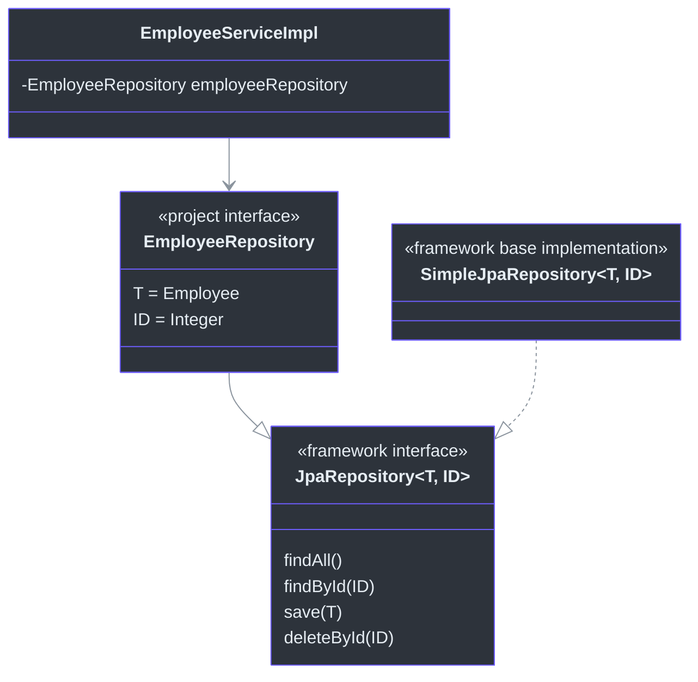
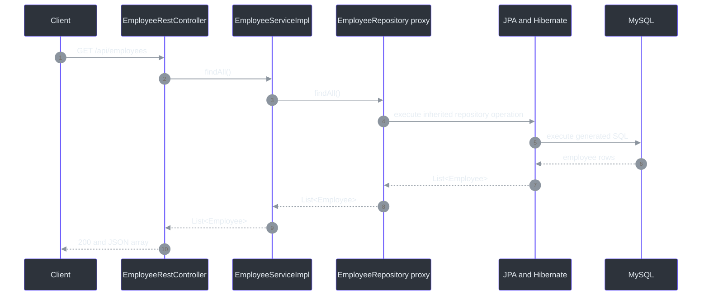
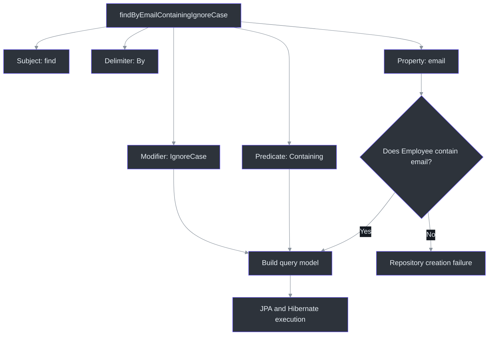

# Employee REST CRUD with Spring Data JPA

These notes capture the Spring Data JPA and `JpaRepository` lesson discussed on **2026-09-20**. The project replaces the hand-written employee DAO with a Spring Data repository interface while retaining the REST controller, service layer, JPA entity, and MySQL database.

Course navigation: [repository README](../../README.md) | [cumulative course review](../../COURSE_REVIEW.md) | [previous manual-DAO project](../02-spring-boot-rest-crud-employee/notes.md) | [earlier JPA CRUD notes](../../03-spring-boot-hibernate-jpa-crud/01-cruddemo-student/notes.md)

## Quick revision

| Question | Short answer | Source |
|---|---|---|
| What is `JpaRepository`? | A Spring Data JPA interface that exposes standard CRUD, paging, sorting, query-by-example, flush, and batch-oriented repository operations. | [`EmployeeRepository.java:4`](src/main/java/com/example/cruddemo/repository/EmployeeRepository.java#L4), [official API](https://docs.spring.io/spring-data/jpa/reference/api/java/org/springframework/data/jpa/repository/JpaRepository.html) |
| Why does an empty repository interface work? | Spring Data scans it and creates a runtime proxy whose standard methods are routed to the JPA base repository implementation. | [`EmployeeRepository.java:6`](src/main/java/com/example/cruddemo/repository/EmployeeRepository.java#L6), [repository definitions](https://docs.spring.io/spring-data/jpa/reference/repositories/definition.html) |
| What do `<Employee, Integer>` mean? | `Employee` is the managed domain type and `Integer` is its identifier type. Inherited generic signatures become employee-specific signatures. | [`EmployeeRepository.java:6`](src/main/java/com/example/cruddemo/repository/EmployeeRepository.java#L6), [`Employee.java:9`](src/main/java/com/example/cruddemo/entity/Employee.java#L9) |
| Why is `findById()` available without declaring it? | It is already inherited from the repository hierarchy. With these generic arguments it behaves as `Optional<Employee> findById(Integer id)`. | [`EmployeeServiceImpl.java:25`](src/main/java/com/example/cruddemo/service/EmployeeServiceImpl.java#L25), [official API](https://docs.spring.io/spring-data/jpa/reference/api/java/org/springframework/data/jpa/repository/JpaRepository.html) |
| Why must `findByEmail()` be declared? | Email is specific to `Employee`; it is not part of the generic CRUD contract. Declaring the signature gives Java a method and gives Spring Data a query description to parse. | [`Employee.java:20`](src/main/java/com/example/cruddemo/entity/Employee.java#L20), [`EmployeeRepository.java:6`](src/main/java/com/example/cruddemo/repository/EmployeeRepository.java#L6) |
| Is a derived method name ordinary English? | No. It is a small grammar made from entity property names and reserved keywords such as `By`, `And`, `Containing`, and `IgnoreCase`. | [JPA query methods](https://docs.spring.io/spring-data/jpa/reference/jpa/query-methods.html) |
| Does `JpaRepository` have a separate `update()` method? | No. `save()` uses JPA persistence rules: a new entity is persisted and an existing entity is merged. | [`EmployeeServiceImpl.java:33`](src/main/java/com/example/cruddemo/service/EmployeeServiceImpl.java#L33), [persisting entities](https://docs.spring.io/spring-data/jpa/reference/jpa/entity-persistence.html) |
| Are `findByEmail` examples active in this project? | No. The current `EmployeeRepository` body is empty. Those methods are documented as suggested derived-query examples, not current behavior. | [`EmployeeRepository.java:6`](src/main/java/com/example/cruddemo/repository/EmployeeRepository.java#L6) |
| What did the current verification prove? | A clean full-context test passed, startup found one JPA repository interface, and read-only GET requests returned `200`. It did not test custom derived methods because none are currently declared. | [`CruddemoApplicationTests.java:6`](src/test/java/com/example/cruddemo/CruddemoApplicationTests.java#L6) |

## 1. Lesson snapshot

| Item | Current project | Source |
|---|---|---|
| Learning goal | Replace repetitive `EntityManager` DAO code with Spring Data JPA repository infrastructure and understand what Spring creates at runtime. | [`EmployeeRepository.java:6`](src/main/java/com/example/cruddemo/repository/EmployeeRepository.java#L6), [previous DAO implementation](../02-spring-boot-rest-crud-employee/src/main/java/com/example/cruddemo/dao/EmployeeDaoImpl.java#L10) |
| Spring Boot parent | `4.1.1` | [`pom.xml:8`](pom.xml#L8) |
| Java compilation target | `25` | [`pom.xml:30`](pom.xml#L30) |
| Verification runtime | Java `26.0.1` on 2026-09-20 | Observed `mvn -v` and test output |
| Maven Wrapper distribution | Maven `3.9.16`; wrapper script version `3.3.4` | [`.mvn/wrapper/maven-wrapper.properties:1`](.mvn/wrapper/maven-wrapper.properties#L1) |
| Spring Data JPA | `4.1.1` | Observed dependency tree on 2026-09-20 |
| Hibernate ORM | `7.4.5.Final` | Observed dependency tree and startup output on 2026-09-20 |
| Jackson | Jackson 3 `3.1.5` | Observed dependency tree on 2026-09-20 |
| MySQL Connector/J | `9.7.0` | Observed dependency tree on 2026-09-20 |
| Database | Local `employee_directory` MySQL database | [`application.properties:3`](src/main/resources/application.properties#L3) |
| Automated test | One full-context `contextLoads()` test | [`CruddemoApplicationTests.java:6`](src/test/java/com/example/cruddemo/CruddemoApplicationTests.java#L6) |

The POM explicitly requests Spring Data JPA, Spring MVC, MySQL Connector/J, and the Boot 4 test starters. The JPA starter supplies the repository infrastructure and Hibernate integration; the MVC starter supplies the REST stack. [`pom.xml:32`](pom.xml#L32)

## 2. Mental model: the code did not disappear

The hand-written persistence logic was not abolished. Responsibility moved from project-specific DAO code into reusable Spring Data infrastructure.

| Layer or technology | Responsibility in this project | Evidence |
|---|---|---|
| REST controller | Maps HTTP requests, binds JSON/path data, and returns Java values. | [`EmployeeRestController.java:11`](src/main/java/com/example/cruddemo/rest/EmployeeRestController.java#L11) |
| Service | Defines application operations and current write-transaction boundaries. | [`EmployeeServiceImpl.java:11`](src/main/java/com/example/cruddemo/service/EmployeeServiceImpl.java#L11) |
| Spring Data JPA repository | Provides the employee-specific data-access contract and a runtime implementation. | [`EmployeeRepository.java:6`](src/main/java/com/example/cruddemo/repository/EmployeeRepository.java#L6) |
| Jakarta Persistence | Defines `@Entity`, `@Id`, mappings, and persistence contracts. | [`Employee.java:3`](src/main/java/com/example/cruddemo/entity/Employee.java#L3) |
| Hibernate | Implements JPA, tracks entity state, and generates provider-specific SQL. | Observed Hibernate `7.4.5.Final` during startup |
| JDBC driver and MySQL | Carry commands and store employee rows. | [`application.properties:3`](src/main/resources/application.properties#L3), [`pom.xml:48`](pom.xml#L48) |


<!-- Sources: src/main/java/com/example/cruddemo/rest/EmployeeRestController.java:11, src/main/java/com/example/cruddemo/service/EmployeeServiceImpl.java:11, src/main/java/com/example/cruddemo/repository/EmployeeRepository.java:6, src/main/java/com/example/cruddemo/entity/Employee.java:5, src/main/resources/application.properties:3 -->

**Memory aid:** Spring Data removes repository boilerplate, not persistence work. The work still occurs through JPA, Hibernate, JDBC, and MySQL.

## 3. Project map

| File | Current responsibility | Source |
|---|---|---|
| `CruddemoApplication.java` | Starts Spring Boot from the parent `com.example.cruddemo` package, allowing application and repository scanning to reach the subpackages. | [`CruddemoApplication.java:6`](src/main/java/com/example/cruddemo/CruddemoApplication.java#L6) |
| `Employee.java` | Maps Java employee state to the `employee` table and marks `id` as the generated primary key. | [`Employee.java:5`](src/main/java/com/example/cruddemo/entity/Employee.java#L5) |
| `EmployeeRepository.java` | Specializes the Spring Data JPA repository contract for `Employee` and `Integer`. | [`EmployeeRepository.java:6`](src/main/java/com/example/cruddemo/repository/EmployeeRepository.java#L6) |
| `EmployeeService.java` | Preserves the application-facing employee operations independently of the persistence implementation. | [`EmployeeService.java:7`](src/main/java/com/example/cruddemo/service/EmployeeService.java#L7) |
| `EmployeeServiceImpl.java` | Injects the generated repository bean and delegates CRUD operations. | [`EmployeeServiceImpl.java:14`](src/main/java/com/example/cruddemo/service/EmployeeServiceImpl.java#L14) |
| `EmployeeRestController.java` | Exposes list, lookup, create, update, patch, and delete routes. | [`EmployeeRestController.java:23`](src/main/java/com/example/cruddemo/rest/EmployeeRestController.java#L23) |
| `application.properties` | Selects the local MySQL database and root logging threshold. | [`application.properties:1`](src/main/resources/application.properties#L1) |
| `CruddemoApplicationTests.java` | Loads the full application context; it does not issue HTTP requests or assert repository results. | [`CruddemoApplicationTests.java:6`](src/test/java/com/example/cruddemo/CruddemoApplicationTests.java#L6) |

## 4. What changed from the manual DAO project

The previous project defined both `EmployeeDao` and `EmployeeDaoImpl`. The implementation explicitly created JPQL queries and called `EntityManager.merge()`, `find()`, and `remove()`. [Previous `EmployeeDaoImpl`](../02-spring-boot-rest-crud-employee/src/main/java/com/example/cruddemo/dao/EmployeeDaoImpl.java#L10)

| Operation | Previous project | Current project |
|---|---|---|
| Find all | Build a `TypedQuery<Employee>` and call `getResultList()`. | Call inherited `employeeRepository.findAll()`. |
| Find by ID | Write JPQL, bind `employeeId`, and call `getSingleResult()`. | Call inherited `employeeRepository.findById(id)` and receive `Optional<Employee>`. |
| Save | Call `entityManager.merge(employee)`. | Call inherited `employeeRepository.save(employee)`. |
| Delete | Find a managed entity and call `entityManager.remove(employee)`. | Call inherited `employeeRepository.deleteById(id)`. |
| Implementation owner | Project code in `EmployeeDaoImpl`. | Spring Data JPA base implementation behind a repository proxy. |

The service dependency changed from `EmployeeDao` to `EmployeeRepository`, but the controller still depends on `EmployeeService`. Compare the previous injection at [`EmployeeServiceImpl.java:13`](../02-spring-boot-rest-crud-employee/src/main/java/com/example/cruddemo/service/EmployeeServiceImpl.java#L13) with the current injection at [`EmployeeServiceImpl.java:14`](src/main/java/com/example/cruddemo/service/EmployeeServiceImpl.java#L14).

**Architectural result:** the service layer remains a stable application boundary while the persistence adapter changes.

## 5. What `JpaRepository<Employee, Integer>` means

`JpaRepository<T, ID>` is generic. The current declaration substitutes:

```text
T  = Employee
ID = Integer
```

That specialization turns inherited generic signatures into employee-specific signatures conceptually like these:

```java
List<Employee> findAll();
Optional<Employee> findById(Integer id);
Employee save(Employee employee);
void deleteById(Integer id);
boolean existsById(Integer id);
long count();
```

The exact inherited declarations remain generic in the framework API, but Java applies the current type arguments when compiling calls through `EmployeeRepository`. [`EmployeeRepository.java:6`](src/main/java/com/example/cruddemo/repository/EmployeeRepository.java#L6)

`JpaRepository` currently extends list-oriented CRUD and paging/sorting contracts plus query-by-example support. It also adds JPA-oriented operations such as `flush()`, `saveAndFlush()`, `getReferenceById()`, and batch delete methods. [Official `JpaRepository` API](https://docs.spring.io/spring-data/jpa/reference/api/java/org/springframework/data/jpa/repository/JpaRepository.html)



<!-- Sources: src/main/java/com/example/cruddemo/repository/EmployeeRepository.java:6, src/main/java/com/example/cruddemo/service/EmployeeServiceImpl.java:14, https://docs.spring.io/spring-data/jpa/reference/api/java/org/springframework/data/jpa/repository/JpaRepository.html -->

### Why there is no separate `update()` method

Spring Data JPA's `save()` delegates to JPA persistence semantics. For the default entity-state detection strategy, a nullable ID that is `null` indicates a new entity; a non-null ID indicates an existing entity unless the entity supplies another new-state strategy. A new entity is persisted, while an existing entity is merged. [Persisting entities](https://docs.spring.io/spring-data/jpa/reference/jpa/entity-persistence.html)

In this project:

- POST explicitly sets `id` to `null` before calling `save()`. [`EmployeeRestController.java:33`](src/main/java/com/example/cruddemo/rest/EmployeeRestController.java#L33)
- PUT passes the request's entity state directly to `save()`. [`EmployeeRestController.java:39`](src/main/java/com/example/cruddemo/rest/EmployeeRestController.java#L39)
- `Employee.id` is a nullable `Integer` generated with `GenerationType.IDENTITY`. [`Employee.java:9`](src/main/java/com/example/cruddemo/entity/Employee.java#L9)

The HTTP method does not instruct JPA to insert or update. Spring MVC chooses the controller method; entity state guides persistence afterward.

## 6. What Spring creates at startup

The Java compiler accepts calls such as `employeeRepository.findAll()` because the method is inherited through the repository interface hierarchy. Java still cannot instantiate an interface directly.

At runtime, Spring Boot and Spring Data perform the missing assembly:

1. `spring-boot-starter-data-jpa` places the Spring Data JPA and Hibernate infrastructure on the classpath. [`pom.xml:33`](pom.xml#L33)
2. `@SpringBootApplication` starts auto-configuration from `com.example.cruddemo`. [`CruddemoApplication.java:1`](src/main/java/com/example/cruddemo/CruddemoApplication.java#L1)
3. Boot's JPA repository auto-configuration is activated when its required JPA and `DataSource` infrastructure is present; it is equivalent to enabling JPA repository scanning. [Boot JPA repository auto-configuration](https://docs.spring.io/spring-boot/api/java/org/springframework/boot/data/jpa/autoconfigure/DataJpaRepositoriesAutoConfiguration.html)
4. Scanning finds `EmployeeRepository` under the main package tree. [`EmployeeRepository.java:1`](src/main/java/com/example/cruddemo/repository/EmployeeRepository.java#L1)
5. A repository factory reads the interface and generic metadata and creates a proxy implementing `EmployeeRepository`. [Repository factory API](https://docs.spring.io/spring-data/commons/docs/current/api/org/springframework/data/repository/core/support/RepositoryFactorySupport.html)
6. Standard CRUD methods are routed to the JPA base repository implementation; derived-query methods, if declared, are handled by query infrastructure. [Repository definitions](https://docs.spring.io/spring-data/jpa/reference/repositories/definition.html)
7. Spring constructor-injects the generated bean into `EmployeeServiceImpl`. [`EmployeeServiceImpl.java:16`](src/main/java/com/example/cruddemo/service/EmployeeServiceImpl.java#L16)

Observed startup output on 2026-09-20 confirmed:

```text
Bootstrapping Spring Data JPA repositories in DEFAULT mode.
Finished Spring Data repository scanning ... Found 1 JPA repository interface.
```

**Important distinction:** Spring normally creates a runtime proxy and composes framework implementations. It does not add an `EmployeeRepositoryImpl.java` source file to this project.

## 7. Current request and repository flow

The current `GET /api/employees` path executes in this order:



<!-- Sources: src/main/java/com/example/cruddemo/rest/EmployeeRestController.java:23, src/main/java/com/example/cruddemo/service/EmployeeServiceImpl.java:20, src/main/java/com/example/cruddemo/repository/EmployeeRepository.java:6, src/main/java/com/example/cruddemo/entity/Employee.java:5 -->

The controller does not know whether persistence is implemented through a manual DAO, repository proxy, or another adapter because it depends on `EmployeeService`. [`EmployeeRestController.java:15`](src/main/java/com/example/cruddemo/rest/EmployeeRestController.java#L15)

### Current service delegation

| Service operation | Repository call | Current result behavior | Source |
|---|---|---|---|
| `findAll()` | `findAll()` | Returns `List<Employee>`. | [`EmployeeServiceImpl.java:20`](src/main/java/com/example/cruddemo/service/EmployeeServiceImpl.java#L20) |
| `findById(int)` | `findById(id)` | Receives `Optional<Employee>`; returns its value or throws `RuntimeException`. | [`EmployeeServiceImpl.java:25`](src/main/java/com/example/cruddemo/service/EmployeeServiceImpl.java#L25) |
| `save(Employee)` | `save(employee)` | Returns the entity supplied by Spring Data's save operation. | [`EmployeeServiceImpl.java:33`](src/main/java/com/example/cruddemo/service/EmployeeServiceImpl.java#L33) |
| `deleteById(int)` | `deleteById(id)` | Delegates ID-based deletion. | [`EmployeeServiceImpl.java:38`](src/main/java/com/example/cruddemo/service/EmployeeServiceImpl.java#L38) |

## 8. Transactions: repository defaults and the service boundary

Spring Data's inherited CRUD methods obtain transaction settings from the base repository implementation: reads are configured read-only, while write operations use ordinary transactional behavior. [Spring Data JPA transactionality](https://docs.spring.io/spring-data/jpa/reference/jpa/transactions.html)

The current service additionally marks `save()` and `deleteById()` with `@Transactional`. [`EmployeeServiceImpl.java:33`](src/main/java/com/example/cruddemo/service/EmployeeServiceImpl.java#L33)

| Boundary | Meaning |
|---|---|
| Repository transaction | Sufficient for one ordinary inherited repository operation. |
| Service transaction | Can make several repository calls participate in one application-level unit of work. |

When an outer service transaction exists, repository operations participate in that transaction. Keeping a service boundary therefore remains useful even though the repository methods already have transactional defaults.

## 9. Why `findById()` is inherited but `findByEmail()` is declared

`findById()` is part of the generic repository contract because every repository has an identifier type. The second generic argument, `Integer`, tells the inherited method which ID type to accept. [`EmployeeRepository.java:6`](src/main/java/com/example/cruddemo/repository/EmployeeRepository.java#L6)

`email` is not universal. A product, invoice, or sports team entity may not have an email property. Spring Data therefore cannot place `findByEmail()` in the generic parent interface.

To request that query, the project would declare a method in its employee-specific repository:

```java
// Suggested example; not currently implemented in EmployeeRepository.
Optional<Employee> findByEmail(String email);
```

The declaration serves two audiences:

1. Java sees that the method exists, knows its parameter type, and knows its return type.
2. Spring Data sees a query-method signature whose name can be parsed into a query.

No method body is written because the repository proxy handles the call.

## 10. Derived query names are a controlled grammar

Spring Data is not understanding arbitrary English. It parses a method name using recognized subject words, the `By` delimiter, entity property paths, predicate keywords, and modifiers.



<!-- Sources: src/main/java/com/example/cruddemo/entity/Employee.java:20, src/main/java/com/example/cruddemo/repository/EmployeeRepository.java:6, https://docs.spring.io/spring-data/jpa/reference/jpa/query-methods.html -->

### Grammar template

```text
[subject][Distinct/Top/First]By
[Property][Predicate]
[And/Or][Property][Predicate]
[OrderByPropertyAsc/Desc]
```

For this method:

```java
List<Employee> findByFirstNameAndLastName(String firstName, String lastName);
```

Spring Data recognizes:

```text
find       -> retrieve results
By         -> begin the predicate
FirstName  -> Employee.firstName
And        -> logical conjunction
LastName   -> Employee.lastName
```

Conceptually, it represents:

```jpql
select e
from Employee e
where e.firstName = ?1
  and e.lastName = ?2
```

For this method:

```java
List<Employee> findByEmailContainingIgnoreCase(String text);
```

Spring Data recognizes `email` as the property, `Containing` as a contains-style `LIKE` predicate, and `IgnoreCase` as a case-insensitive modifier. Conceptually, the predicate resembles a case-insensitive `LIKE '%value%'`; Hibernate determines the actual SQL appropriate for the database. [JPA query methods](https://docs.spring.io/spring-data/jpa/reference/jpa/query-methods.html)

## 11. Derived-query keyword cheat sheet

These are the most useful Spring Data JPA words for ordinary entity queries. Some repository keywords are store-specific; consult the current JPA documentation before relying on a less common keyword.

### Query subjects

| Word or pattern | Purpose | Employee example |
|---|---|---|
| `find...By`, `read...By`, `get...By`, `query...By`, `search...By` | Retrieve matching data. | `findByEmail(...)` |
| `stream...By` | Return a stream-shaped result when the declared return type and transaction usage support it. | `streamByLastName(...)` |
| `exists...By` | Return whether a match exists. | `existsByEmail(...)` |
| `count...By` | Return the number of matches. | `countByLastName(...)` |
| `delete...By`, `remove...By` | Delete matching entities. | `deleteByEmail(...)` |
| `Distinct` | Request distinct results. | `findDistinctByLastName(...)` |
| `First`, `Top`, `First<number>`, `Top<number>` | Limit the result count. | `findTop3ByOrderByLastNameAsc()` |

### Logical and equality predicates

| Keyword | Meaning | Example |
|---|---|---|
| no suffix, `Is`, `Equals` | Equality | `findByEmail(...)` |
| `And` | Both predicates must match. | `findByFirstNameAndLastName(...)` |
| `Or` | Either predicate may match. | `findByFirstNameOrLastName(...)` |
| `Not`, `IsNot` | Negated equality or predicate. | `findByLastNameNot(...)` |

### Comparisons and ranges

| Keyword | Meaning | Example |
|---|---|---|
| `Between`, `IsBetween` | Between two argument values. | `findByIdBetween(low, high)` |
| `LessThan`, `IsLessThan` | `<` | `findByIdLessThan(id)` |
| `LessThanEqual`, `IsLessThanEqual` | `<=` | `findByIdLessThanEqual(id)` |
| `GreaterThan`, `IsGreaterThan` | `>` | `findByIdGreaterThan(id)` |
| `GreaterThanEqual`, `IsGreaterThanEqual` | `>=` | `findByIdGreaterThanEqual(id)` |
| `Before`, `IsBefore` | Earlier than a comparable temporal value. | `findByCreatedAtBefore(time)` if such a field exists |
| `After`, `IsAfter` | Later than a comparable temporal value. | `findByCreatedAtAfter(time)` if such a field exists |

### Text matching

| Keyword | Conceptual match | Example |
|---|---|---|
| `Like`, `IsLike` | Use the supplied `LIKE` pattern. | `findByEmailLike(pattern)` |
| `NotLike`, `IsNotLike` | Negated `LIKE`. | `findByEmailNotLike(pattern)` |
| `Containing`, `IsContaining`, `Contains` | `%value%` | `findByEmailContaining(text)` |
| `StartingWith`, `IsStartingWith`, `StartsWith` | `value%` | `findByFirstNameStartingWith(prefix)` |
| `EndingWith`, `IsEndingWith`, `EndsWith` | `%value` | `findByEmailEndingWith(suffix)` |
| `IgnoreCase`, `IgnoringCase` | Ignore case for the suitable preceding property. | `findByEmailIgnoreCase(email)` |
| `AllIgnoreCase`, `AllIgnoringCase` | Ignore case for all suitable properties in the predicate. | `findByFirstNameAndLastNameAllIgnoreCase(...)` |

### Null, collection, boolean, and ordering words

| Keyword | Meaning | Example |
|---|---|---|
| `IsNull`, `Null` | Property is null. | `findByEmailIsNull()` |
| `IsNotNull`, `NotNull` | Property is not null. | `findByEmailIsNotNull()` |
| `In`, `IsIn` | Property belongs to a supplied collection or array. | `findByIdIn(ids)` |
| `NotIn`, `IsNotIn` | Property does not belong to the supplied values. | `findByIdNotIn(ids)` |
| `True`, `IsTrue` | Boolean property is true. | `findByActiveTrue()` if `active` exists |
| `False`, `IsFalse` | Boolean property is false. | `findByActiveFalse()` if `active` exists |
| `OrderBy<Property>Asc` | Static ascending sort. | `findByLastNameOrderByFirstNameAsc(...)` |
| `OrderBy<Property>Desc` | Static descending sort. | `findByLastNameOrderByFirstNameDesc(...)` |

Official sources: [JPA query methods and translations](https://docs.spring.io/spring-data/jpa/reference/jpa/query-methods.html) and [repository query keywords](https://docs.spring.io/spring-data/jpa/reference/repositories/query-keywords-reference.html).

## 12. Property names, column names, and nested paths

Derived query names use Java entity properties, not SQL column names.

| Entity mapping | Correct method segment | Incorrect method segment |
|---|---|---|
| `firstName` mapped to `first_name` | `FirstName` | `First_name` |
| `lastName` mapped to `last_name` | `LastName` | `Last_name` |
| `email` mapped to `email` | `Email` | A spelling such as `Emali` |

Sources: [`Employee.java:14`](src/main/java/com/example/cruddemo/entity/Employee.java#L14), [`Employee.java:17`](src/main/java/com/example/cruddemo/entity/Employee.java#L17), [`Employee.java:20`](src/main/java/com/example/cruddemo/entity/Employee.java#L20)

Spring validates property paths while creating repository queries. A misspelled property normally prevents repository creation instead of silently querying the wrong database column.

For relationships or embedded objects, property paths can traverse nested properties. When parsing is ambiguous, `_` can mark a traversal boundary, for example `findByAddress_City(...)`; underscores should not be used as ordinary Java property-name separators. [Property expressions](https://docs.spring.io/spring-data/jpa/reference/repositories/query-methods-details.html#repositories.query-methods.query-property-expressions)

## 13. Return type communicates expected cardinality

The method name describes the predicate; the declared return type tells Spring Data and callers how results should be shaped.

| Return type | Meaning | Suitable example |
|---|---|---|
| `Optional<Employee>` | Zero or one expected result. | Exact email lookup when email is uniquely constrained. |
| `Employee` | At most one expected; absence is represented as `null` for supported single-result repository queries. | Simple code that intentionally accepts null. |
| `List<Employee>` | Zero to many results. | Last-name or containing-text search. |
| `boolean` | Existence projection. | `existsByEmail(...)` |
| `long` | Count projection. | `countByLastName(...)` |
| `Page<Employee>` | One page plus count/paging metadata. | Search with a `Pageable` parameter. |
| `Slice<Employee>` | One slice with next-page knowledge but without requiring full total-count metadata. | Scrolling-style pages where the total is unnecessary. |

The Java return type does not create a database uniqueness rule. If `findByEmail()` returns a single value but duplicate emails exist, the query can fail because more than one row matched. When the business rule says email is unique, enforce it in the database and validate it in application behavior as well. [Repository return types](https://docs.spring.io/spring-data/jpa/reference/repositories/query-return-types-reference.html)

## 14. Suggested examples versus current implementation

The current repository has no custom methods:

```java
public interface EmployeeRepository extends JpaRepository<Employee, Integer> {
}
```

The following is a **suggested future example**, not current source:

```java
public interface EmployeeRepository extends JpaRepository<Employee, Integer> {

    Optional<Employee> findByEmail(String email);

    List<Employee> findByFirstNameAndLastName(
            String firstName,
            String lastName);

    List<Employee> findByEmailContainingIgnoreCase(String text);

    boolean existsByEmail(String email);
}
```

If one of these methods becomes application behavior, add a service method, decide the HTTP contract if it is exposed, and add a focused repository or endpoint test. Do not assume that documenting an example makes it active.

## 15. When to stop extending the method name

Derived names work best for short, stable predicates. They become difficult to review when they mix many properties, `And`/`Or`, nested paths, ordering, projections, and optional filters.

| Query shape | Preferred tool |
|---|---|
| One or two clear fixed predicates | Derived query method |
| Moderately complex fixed JPQL | `@Query` |
| Native-database feature or carefully controlled SQL | `@NativeQuery` or `@Query(nativeQuery = true)` |
| Many optional filters built dynamically | JPA `Specification`, Criteria API, or Querydsl |
| Reusable behavior outside Spring Data's standard implementation | Custom repository fragment |

Example of an explicit query:

```java
// Suggested example; not implemented in this project.
@Query("""
        select e
        from Employee e
        where e.firstName = :firstName
          and lower(e.email) like lower(concat('%', :text, '%'))
        order by e.lastName
        """)
List<Employee> search(String firstName, String text);
```

The query still uses entity and Java property names—`Employee`, `firstName`, `email`, and `lastName`—because this is JPQL rather than table-oriented SQL. [Using `@Query`](https://docs.spring.io/spring-data/jpa/reference/jpa/query-methods.html#jpa.query-methods.at-query)

**Readability rule:** when a reviewer must decode a long method name like a puzzle, write the query explicitly or use a dynamic-query abstraction.

## 16. Configuration reference

| Property | Active value | Effect | Source |
|---|---|---|---|
| `spring.application.name` | `cruddemo` | Sets the logical application name. | [`application.properties:1`](src/main/resources/application.properties#L1) |
| `spring.datasource.url` | Local `employee_directory` JDBC URL | Selects the MySQL catalog and driver protocol. | [`application.properties:3`](src/main/resources/application.properties#L3) |
| `spring.datasource.username` | Local course account | Authenticates the configured `DataSource`; the credential value is intentionally not repeated in these notes. | [`application.properties:4`](src/main/resources/application.properties#L4) |
| `spring.datasource.password` | Local course password | Authenticates the configured `DataSource`; never reuse or commit real credentials. | [`application.properties:5`](src/main/resources/application.properties#L5) |
| `logging.level.root` | `info` | Sets the fallback logging threshold. | [`application.properties:7`](src/main/resources/application.properties#L7) |

No explicit `server.port` or context path is configured, so normal runs use Boot's default port and root context unless command-line arguments override them. The verification run deliberately used `--server.port=18083` to avoid colliding with other lessons.

## 17. Current URLs and commands

From the project directory:

```powershell
Set-Location .\04-springboot-rest-crud\03-spring-boot-rest-crud-employee-with-jpa-repository

.\mvnw.cmd test

# Current Windows fallback when the wrapper script shows the recorded launcher error:
mvn clean test

# Temporary-port run used for read-only verification:
mvn spring-boot:run "-Dspring-boot.run.arguments=--server.port=18083"
```

Read-only endpoint checks:

```powershell
Invoke-WebRequest -UseBasicParsing http://localhost:18083/api/employees
Invoke-WebRequest -UseBasicParsing http://localhost:18083/api/employees/1
```

Current endpoint map:

| HTTP method | URL | Controller operation | Database effect |
|---|---|---|---|
| GET | `/api/employees` | `findAll()` | Read only |
| GET | `/api/employees/{employeeId}` | `findById(int)` | Read only |
| POST | `/api/employees` | `save(Employee)` after forcing a null ID | Inserts or persists new state |
| PUT | `/api/employees` | `update(Employee)` | Saves supplied state; not guaranteed update-only |
| PATCH | `/api/employees/{employeeId}` | `patch(int, Map<String,Object>)` | Applies supplied changes and saves |
| DELETE | `/api/employees/{employeeId}` | `delete(int)` | Deletes matching employee |

Sources: [`EmployeeRestController.java:23`](src/main/java/com/example/cruddemo/rest/EmployeeRestController.java#L23), [`EmployeeRestController.java:28`](src/main/java/com/example/cruddemo/rest/EmployeeRestController.java#L28), [`EmployeeRestController.java:33`](src/main/java/com/example/cruddemo/rest/EmployeeRestController.java#L33), [`EmployeeRestController.java:39`](src/main/java/com/example/cruddemo/rest/EmployeeRestController.java#L39), [`EmployeeRestController.java:44`](src/main/java/com/example/cruddemo/rest/EmployeeRestController.java#L44), [`EmployeeRestController.java:61`](src/main/java/com/example/cruddemo/rest/EmployeeRestController.java#L61)

## 18. Observed verification on 2026-09-20

| Check | Observed result |
|---|---|
| `mvn clean test` using installed Maven `3.9.16` | Passed: 1 test, 0 failures, 0 errors, 0 skipped. |
| Repository startup scanning | Passed: log reported `Found 1 JPA repository interface`. |
| Dependency tree | Spring Data JPA `4.1.1`, Hibernate `7.4.5.Final`, Jackson Databind `3.1.5`, and MySQL Connector/J `9.7.0`. |
| `GET /api/employees` on temporary port `18083` | HTTP `200`; deserialized response contained 5 employees. |
| `GET /api/employees/1` on temporary port `18083` | HTTP `200`; returned employee ID `1`. |
| Write endpoints | Not executed because POST, PUT, PATCH, and DELETE mutate the course database. |
| Derived methods such as `findByEmail` | Not tested because they are not declared in the current repository. |
| Server cleanup | Application stopped gracefully; port `18083` confirmed free. |
| Maven Wrapper | `mvnw.cmd` failed before Maven launch with `Cannot index into a null array`; installed Maven was used as the documented fallback. |

The context test proves that the current application context, database connection, entity manager factory, and repository bean can initialize together. It does not prove every HTTP route, response body, write behavior, derived-query example, or not-found status. [`CruddemoApplicationTests.java:6`](src/test/java/com/example/cruddemo/CruddemoApplicationTests.java#L6)

Startup also warned that the connected MySQL server is `5.7.19`, while this Hibernate version reports a minimum supported MySQL version of `8.0.0`. The verified reads succeeded, but the warning should not be treated as compatibility certification for every feature. Upgrade the local database when practical rather than hiding the warning.

## 19. Common mistakes and fixes

| Symptom or misunderstanding | Cause | Fix |
|---|---|---|
| “The empty interface contains no code, so nothing should happen.” | The source interface is a contract; Spring Data supplies a runtime proxy and base implementation. | Separate compile-time method inheritance from runtime bean creation. |
| `findById()` works without declaration but `findByEmail()` does not compile. | `findById()` is inherited; `findByEmail()` is employee-specific and absent until declared. | Add the derived method signature to `EmployeeRepository`. |
| Repository creation fails with a property-reference error. | A method segment does not match an entity property, for example `Emali`. | Compare the method with Java property names in `Employee`, not SQL columns. |
| `findByFirst_name(...)` fails. | Derived queries use `firstName`; `first_name` is only the physical column name. | Write `findByFirstName(...)`. |
| A single-result method fails when duplicates exist. | The return type expects at most one result, but the database permits several matches. | Return a collection when duplicates are valid, or enforce uniqueness when one result is a real invariant. |
| `findByEmailContaining(...)` is treated like exact equality. | `Containing` intentionally means a contains-style `LIKE` predicate. | Use `findByEmail(...)` for equality. |
| A very long method is technically valid but hard to understand. | Too much query logic was encoded in the name. | Move to `@Query`, Specifications, Querydsl, or a custom fragment. |
| `Optional<Employee>` is assumed to prevent duplicate rows. | `Optional` represents absence/presence, not a uniqueness constraint. | Add an appropriate database constraint and test the invariant. |
| `save()` is assumed to mean insert only. | Spring Data distinguishes new and existing state. | Remember: new state is persisted; existing state is merged. |
| `contextLoads()` is treated as endpoint coverage. | It starts the context but sends no HTTP request and asserts no body. | Add repository tests, MVC tests, or focused live HTTP checks. |
| The wrapper failure is mistaken for an application failure. | The Windows wrapper launcher fails before Maven runs. | Record the launcher issue and use installed Maven `3.9.16` as the current fallback. |

## 20. Active recall

Try answering before expanding the answer key.

1. What work did Spring Data remove from the project, and what work still happens?
2. What do `Employee` and `Integer` mean in `JpaRepository<Employee, Integer>`?
3. Why can Java compile `employeeRepository.findById(id)` even though the project interface body is empty?
4. What object is injected into `EmployeeServiceImpl` at runtime?
5. Why does the current project not need `EmployeeRepositoryImpl.java`?
6. Why is `findById()` inherited but `findByEmail()` not inherited?
7. What two audiences does a custom repository method declaration serve?
8. Is `findByEmailContainingIgnoreCase` arbitrary English?
9. How is `findByFirstNameAndLastName` divided into property and keyword segments?
10. Which names belong in derived methods: `firstName` or `first_name`?
11. What does `Containing` add to a text comparison?
12. What does `IgnoreCase` modify?
13. What return type fits a zero-or-one unique email lookup?
14. Does `Optional<Employee>` make the database email column unique?
15. What return type fits a last-name search that may return many rows?
16. Why is there normally no separate repository `update()` method?
17. What happens conceptually when `save()` receives a new entity? An existing entity?
18. When should a derived query become an explicit `@Query`?
19. What did the clean context test prove?
20. Which repository examples in these notes are not implemented in current source?

### Answer key

1. It removed hand-written generic DAO operations; JPA/Hibernate/JDBC/database work still occurs.
2. They are the repository's domain type and identifier type.
3. The method is inherited through the `JpaRepository` hierarchy.
4. A Spring Data-created repository proxy implementing `EmployeeRepository`.
5. The repository factory supplies the standard implementation at runtime.
6. Every repository has an ID, but not every domain type has email.
7. Java's compiler/type system and Spring Data's query parser.
8. No; it is a controlled keyword and property-name grammar.
9. `find` subject, `By` delimiter, `FirstName` property, `And` operator, `LastName` property.
10. Java entity property names such as `firstName`.
11. A contains-style pattern comparable to `%value%`.
12. Case handling for a suitable string predicate.
13. Usually `Optional<Employee>`, paired with a real uniqueness rule if email must be unique.
14. No; uniqueness belongs in database and application constraints.
15. `List<Employee>` or another multi-result type.
16. `save()` chooses JPA persist-or-merge behavior according to entity state.
17. New state is persisted; existing state is merged under the default strategy.
18. When the name becomes hard to read, grouping is unclear, or the query needs more control.
19. The application context, database connection, JPA infrastructure, and one repository bean initialized; it did not prove all routes or examples.
20. All custom derived methods—such as `findByEmail`, `findByFirstNameAndLastName`, and `findByEmailContainingIgnoreCase`—are suggested examples only.

## 21. Official references

| Topic | Reference |
|---|---|
| Spring Boot JPA and repository setup | [Spring Boot SQL databases — JPA and Spring Data JPA](https://docs.spring.io/spring-boot/reference/data/sql.html#data.sql.jpa-and-spring-data) |
| `JpaRepository` hierarchy and methods | [`JpaRepository` 4.1.1 API](https://docs.spring.io/spring-data/jpa/reference/api/java/org/springframework/data/jpa/repository/JpaRepository.html) |
| Repository interface definitions and base implementation routing | [Defining repository interfaces](https://docs.spring.io/spring-data/jpa/reference/repositories/definition.html) |
| Repository proxy factory | [`RepositoryFactorySupport` API](https://docs.spring.io/spring-data/commons/docs/current/api/org/springframework/data/repository/core/support/RepositoryFactorySupport.html) |
| `save()` persist/merge behavior | [Persisting entities](https://docs.spring.io/spring-data/jpa/reference/jpa/entity-persistence.html) |
| Derived query creation and JPA keywords | [JPA query methods](https://docs.spring.io/spring-data/jpa/reference/jpa/query-methods.html) |
| General subject, predicate, and modifier keywords | [Repository query keywords](https://docs.spring.io/spring-data/jpa/reference/repositories/query-keywords-reference.html) |
| Query return types | [Repository query return types](https://docs.spring.io/spring-data/jpa/reference/repositories/query-return-types-reference.html) |
| Repository and service transaction boundaries | [Spring Data JPA transactionality](https://docs.spring.io/spring-data/jpa/reference/jpa/transactions.html) |
| Custom repository fragments and base implementations | [Custom repository implementations](https://docs.spring.io/spring-data/jpa/reference/repositories/custom-implementations.html) |

## 22. Related pages

| Page | Relationship |
|---|---|
| [Course README](../../README.md) | Course order, project navigation, and progress status |
| [Cumulative course review](../../COURSE_REVIEW.md) | Compact cross-section mental models and recall questions |
| [Manual employee DAO project](../02-spring-boot-rest-crud-employee/notes.md) | Shows the `EntityManager` code replaced by repository infrastructure |
| [REST foundations](../01-spring-boot-rest-crud/notes.md) | Covers request mappings, JSON conversion, and exception handling used by this project |
| [Earlier JPA CRUD project](../../03-spring-boot-hibernate-jpa-crud/01-cruddemo-student/notes.md) | Covers entities, `EntityManager`, transactions, merge, delete, SQL logging, and schema behavior |
