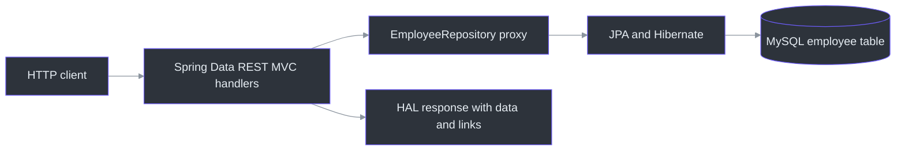
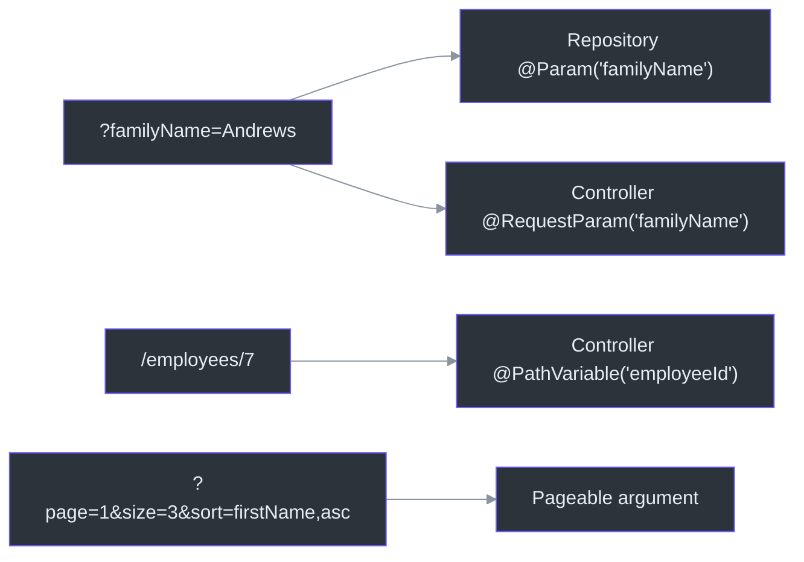

# Employee CRUD with Spring Data REST

2026-09-21 lesson. This project exposes a Spring Data JPA repository through Spring Data REST. Its earlier `notes.md` was an exact copy of the preceding JPA repository project's notes and incorrectly described a controller and service that do not exist here. The original lesson remains at [the Spring Data JPA project](../03-spring-boot-rest-crud-employee-with-jpa-repository/notes.md); this file records the distinct Spring Data REST lesson.

[Course map](../../README.md) | [Cumulative review](../../COURSE_REVIEW.md) | [Manual DAO project](../02-spring-boot-rest-crud-employee/notes.md) | [REST controller foundations](../01-spring-boot-rest-crud/notes.md)

## Quick revision card

| Question | Answer |
|---|---|
| Why do endpoints exist without a controller class? | The Data REST starter registers Spring MVC handlers around exported Spring Data repositories at startup. |
| What is the current collection URL? | `/rest/members`: `/rest` comes from a property; `members` comes from `@RepositoryRestResource(path = "members")`. |
| Does Data REST require JPA? | No. It exports Spring Data repositories; this project happens to use Spring Data JPA. A manual `EntityManager` or `JdbcTemplate` DAO alone is not an exported repository. |
| Where do custom read queries go? | Exported repository query methods are GET resources under `/rest/members/search/{method-or-custom-path}`. |
| Do custom delete/update methods become DELETE/PATCH URLs? | No. Use a deliberately mapped controller for commands; keep mutating repository methods out of GET search exposure. |
| What are HAL and HATEOAS? | HATEOAS is link-guided API navigation; HAL is the JSON format with `_links` and `_embedded`. |
| How is page position calculated? | `offset = page × size`, with page numbers starting at `0`. Sorting happens before that window is selected. |
| `@Param` versus `@RequestParam` versus `@PathVariable`? | Repository query input; controller request parameter; controller URL path segment, respectively. |

## 1. Lesson snapshot and project map

| Item | Current state | Source |
|---|---|---|
| Spring Boot / Java | Boot `4.1.1`; Java compilation target `25`; test runtime observed as Java `26.0.1`. | [`pom.xml`](pom.xml#L8), [`pom.xml`](pom.xml#L30) |
| Dependencies | Spring Data JPA, Spring Data REST, Spring MVC, MySQL driver. | [`pom.xml`](pom.xml#L32) |
| Application entry | `@SpringBootApplication` in parent package `com.example.cruddemo`. | [`CruddemoApplication.java`](src/main/java/com/example/cruddemo/CruddemoApplication.java#L6) |
| Entity | `Employee` maps to table `employee`; Java properties include `id`, `firstName`, `lastName`, and `email`. | [`Employee.java`](src/main/java/com/example/cruddemo/entity/Employee.java#L5) |
| Repository | Empty `JpaRepository<Employee, Integer>` interface annotated with `@RepositoryRestResource(path="members")`. | [`EmployeeRepository.java`](src/main/java/com/example/cruddemo/repository/EmployeeRepository.java#L9) |
| Configuration | Data REST base path `/rest`, default page size `2`; no application context path is configured. | [`application.properties`](src/main/resources/application.properties#L9) |
| Test | One `@SpringBootTest` `contextLoads()` method; no endpoint assertions. | [`CruddemoApplicationTests.java`](src/test/java/com/example/cruddemo/CruddemoApplicationTests.java#L6) |

There is **no** application `EmployeeRestController` or service implementation in this project. The separate [previous JPA repository project](../03-spring-boot-rest-crud-employee-with-jpa-repository/notes.md) has those layers. In this project, Spring Data JPA supplies the repository implementation and Spring Data REST supplies the HTTP handling.

## 2. Mental model and execution path

Why this exists: for simple CRUD over a Spring Data repository, the framework can provide repetitive HTTP mappings. The application still owns the entity, repository contract, configuration, and database.



<!-- Sources: pom.xml:32, src/main/java/com/example/cruddemo/CruddemoApplication.java:6, src/main/java/com/example/cruddemo/repository/EmployeeRepository.java:9, src/main/java/com/example/cruddemo/entity/Employee.java:5, https://docs.spring.io/spring-data/rest/reference/introduction/getting-started.html -->

Startup order: Boot starts from `CruddemoApplication`; Spring Data JPA finds `EmployeeRepository` and creates a repository proxy; Spring Data REST finds an exportable Spring Data repository, registers collection/item handlers, and applies the `/rest` base path and `members` resource path. For `GET /rest/members`, Data REST invokes repository `findAll(Pageable)` and formats the returned page as HAL. [Repository resources](https://docs.spring.io/spring-data/rest/reference/repository-resources.html)

`JpaRepository` inherits CRUD, paging, and sorting methods, so this interface does not declare `findAll`, `findById`, `save`, or `deleteById`. Data REST does **not** inspect arbitrary `@Repository` beans and invent routes. It needs Spring Data repository metadata. Other Spring Data stores can be used, but their store-specific dependency and repository implementation must exist. [Getting started](https://docs.spring.io/spring-data/rest/reference/introduction/getting-started.html)

| Data access choice | Data REST behavior | How to expose it |
|---|---|---|
| Current `JpaRepository` | Exported as `/rest/members`. | Already active. |
| Manual `EntityManager` DAO | Invisible to Data REST as a repository resource. | Write a controller that calls a service/DAO. |
| Manual `JdbcTemplate` DAO | Same: no generated Data REST resource. | Write a controller, or adopt a suitable Spring Data repository module. |
| No Spring Data JPA dependency but still extend `JpaRepository` | Interface cannot compile because its type is missing. | Use a compatible store module/repository, or your own controller. |

## 3. Generated URLs and the two path prefixes

| HTTP request | Purpose | Repository operation behind it |
|---|---|---|
| `GET /rest/members` | Collection, normally paged. | `findAll(Pageable)` |
| `GET /rest/members/{id}` | One employee. | `findById(id)` |
| `POST /rest/members` | Create employee. | `save(...)` |
| `PUT /rest/members/{id}` | Replace employee state. | `save(...)` |
| `PATCH /rest/members/{id}` | Partial update. | `save(...)` |
| `DELETE /rest/members/{id}` | Delete employee. | Repository delete operation |
| `GET /rest/profile/members` | Resource description. | Data REST/ALPS metadata |

These routes are framework behavior derived from the current repository; only read endpoints were exercised in the verification below. The collection and item HTTP methods are documented in [Repository resources](https://docs.spring.io/spring-data/rest/reference/repository-resources.html).

Path composition:

```text
http://localhost:8080 + [application context path] + /rest + /members + [/{id}]
                        (none here)                  Data REST base   repository path
```

`spring.data.rest.base-path=/rest` applies to Data REST routes. `server.servlet.context-path=/app`, if configured later, would prefix the whole servlet application; the collection would become `/app/rest/members`. A normal `@RestController` is not automatically given `/rest`. The repository annotation changes the URL from `employees` to `members`; it does not rename the Java entity/table or the HAL relation. In the current response, the API root link is still named `employees`. To rename the collection relation too, set `collectionResourceRel = "members"` in `@RepositoryRestResource`; `itemResourceRel` controls the item relation separately. These are suggested settings, not active here. [URL path customization](https://docs.spring.io/spring-data/rest/reference/customizing/configuring-the-rest-url-path.html)

## 4. HAL and HATEOAS in the response

HATEOAS is the design idea that responses carry links to related resources or next steps. HAL is one JSON representation of that idea. Data REST uses HAL by default. This response is for clients to consume, so it is more verbose than a custom controller returning a plain list. [Repository resources](https://docs.spring.io/spring-data/rest/reference/repository-resources.html)

| Part | Meaning |
|---|---|
| `_embedded.employees` | Employee data in the collection; the relation remains `employees` despite the `/members` URL. |
| `_links.self` | Link to the current resource/page. |
| `_links.first`, `next`, `prev`, `last` | Page navigation; links appear when applicable. |
| `_links.profile` | Link to ALPS metadata describing the resource. |
| Item `self` and `employee` relations | Current item response has both; different link meanings point to the same item URL. |
| `page` | Number, size, total elements, and total pages. |

The value of links becomes clearer with collections, pages, searches, and associations: a client can follow `next` rather than construct the next URL. They are optional as an API design choice. Enterprises use HAL selectively; many APIs use custom JSON and published API contracts instead. For an exact plain DTO response, use a controller. Data REST has [representation configuration](https://docs.spring.io/spring-data/rest/reference/api/java/org/springframework/data/rest/core/config/RepositoryRestConfiguration.html), including `useHalAsDefaultJsonMediaType(false)`, but that does not turn its response into an arbitrary controller DTO shape. This project does **not** contain such configuration.

## 5. Paging and sorting: the current exercise

Active configuration: `spring.data.rest.default-page-size=2`. It is a fallback when the client omits `size`; it is not a limit. Thus `?size=5` asks for five, and the client can change `page` and `size` on every request. A separate suggested setting, **not active here**, is `spring.data.rest.max-page-size=50`, which caps large page requests. [Getting started: Data REST properties](https://docs.spring.io/spring-data/rest/reference/introduction/getting-started.html)

```text
offset = pageNumber × pageSize
first position in human counting = offset + 1
```

Assuming five rows and no filtering, the windows are:

| Request | Offset | Returned positions | Total pages |
|---|---:|---|---:|
| `?page=0&size=2` | 0 | 1–2 | 3 |
| `?page=1&size=2` | 2 | 3–4 | 3 |
| `?page=2&size=2` | 4 | 5 | 3 |
| `?page=1&size=3` | 3 | 4–5 | 2 |
| `?page=0&size=5` | 0 | 1–5 | 1 |

The server does not remember an earlier request's size. `page=1&size=3` begins after the first three rows of **that request's** ordering. `page=1@` is a malformed page value; use `page=1`. [Paging and sorting](https://docs.spring.io/spring-data/rest/reference/paging-and-sorting.html)

```mermaid
%%{init: {"theme":"base","themeVariables":{"primaryColor":"#2d333b","primaryBorderColor":"#6d5dfc","primaryTextColor":"#e6edf3","lineColor":"#8b949e"}}}%%
sequenceDiagram
    autonumber
    participant Client
    participant REST as Data REST
    participant Repository as EmployeeRepository
    participant DB as MySQL
    Client->>REST: GET /rest/members?page=1&size=2&sort=firstName,desc
    REST->>Repository: findAll(Pageable)
    Repository->>DB: sort, offset 2, limit 2; count rows
    DB-->>Repository: second window and total count
    Repository-->>REST: Page<Employee>
    REST-->>Client: employees, page metadata, navigation links
```

<!-- Sources: src/main/java/com/example/cruddemo/repository/EmployeeRepository.java:10, src/main/resources/application.properties:9, https://docs.spring.io/spring-data/rest/reference/paging-and-sorting.html -->

`sort=firstName,desc` uses the **Java property** `firstName`, not database column `first_name`; sort is applied before pagination. You can repeat it, for example `?sort=lastName,asc&sort=firstName,desc`. Add a unique tie-breaker such as `&sort=id,asc` when repeatable page order matters. In Postman, use the Params tab with keys `page`, `size`, and `sort`, or paste the complete URL. In PowerShell, quote a URL containing `&`. [Paging and sorting](https://docs.spring.io/spring-data/rest/reference/paging-and-sorting.html)

The observed five-row, size-two response has `first` and `self` at page 0, `next` at page 1, and `last` at page 2. There is no `prev` on the first page and no `next` on the last. The `page.number` field is zero-based; `page.totalPages` is a count, so a three-page result has last index `2`. [Paging and sorting](https://docs.spring.io/spring-data/rest/reference/paging-and-sorting.html)

**Suggested, not active:** Data REST names can be changed with `spring.data.rest.page-param-name=pageNumber`, `spring.data.rest.limit-param-name=pageSize`, and `spring.data.rest.sort-param-name=orderBy`. After that, a Data REST URL would use `?pageNumber=0&pageSize=2&orderBy=firstName,desc`. Note the property is called `limit-param-name` although the current default HTTP key is `size`. These settings concern Data REST's generated handlers; a separately written controller has its own argument binding. [Getting started: configurable properties](https://docs.spring.io/spring-data/rest/reference/introduction/getting-started.html)

## 6. Custom read queries and `/search`

The current `EmployeeRepository` has **no** declared custom query methods. Everything in this section is a copyable design example, not an observed route.

```java
// Suggested example; not in the current repository.
@RestResource(path = "by-last-name", rel = "by-last-name")
Page<Employee> findByLastNameContainingIgnoreCase(
        @Param("lastName") String text,
        Pageable pageable);
```

Imports: `org.springframework.data.domain.Page`, `org.springframework.data.domain.Pageable`, `org.springframework.data.repository.query.Param`, and `org.springframework.data.rest.core.annotation.RestResource`.

Request:

```text
GET /rest/members/search/by-last-name?lastName=son&page=0&size=2&sort=firstName,asc
```

| Piece | Source and purpose |
|---|---|
| `/rest/members` | Current base path and repository path. |
| `/search` | Data REST location for exported repository query methods. |
| `by-last-name` | `@RestResource(path = ...)` changes the URL segment. Without it, the Java method name is used. |
| `rel = "by-last-name"` | Changes the HAL link relation label, not the request path. |
| `?lastName=son` | Name from `@Param("lastName")`; Java variable `text` may differ. |
| `page`, `size`, `sort` | Framework inputs combined into `Pageable`; there are no three separate Java parameters. |

`Page<Employee>` plus `Pageable` enables normal page metadata and navigation. `Slice<Employee>` plus `Pageable` gives next-slice navigation without requiring a total-page count. A `List<Employee>` method without `Pageable` returns a list of matches, not a paged search resource with total counts. `Page` may require an additional count query. [Paging and sorting](https://docs.spring.io/spring-data/rest/reference/paging-and-sorting.html)

Derived query names are a grammar over Java entity properties: `findByFirstNameAndLastName`, `findByEmailContainingIgnoreCase`, `findByIdGreaterThan`, and `findByIdLessThan` are possible examples for the current entity. `firstName` is a property; `first_name` is a SQL column. More complex fixed queries can use `@Query` or a named JPA query behind a declared repository method; Data REST sees the method, while JPA chooses how to execute it. [Spring Data JPA query methods](https://docs.spring.io/spring-data/jpa/reference/jpa/query-methods.html)

## 7. Parameter annotations: where each name must match

| Input | Annotation or argument | Naming rule |
|---|---|---|
| Repository query argument | `@Param("familyName") String name` | URL query key for Data REST is `familyName`. For an explicit named `@Query`, `@Param("familyName")` must also match `:familyName` in JPQL/SQL. Java variable may differ. |
| Controller query argument | `@RequestParam(name = "familyName") String name` | URL query key is `familyName`; Java variable may differ. Required by default; `required=false` or `defaultValue` changes that. |
| Controller path argument | `@PathVariable("employeeId") Integer id` | Must match `{employeeId}` in the controller route; Java variable may differ. |
| Repository or controller paging argument | `Pageable pageable` | Framework resolves page/size/sort; variable need not be named `page`, `size`, or `sort`. |



<!-- Sources: https://docs.spring.io/spring-data/rest/reference/paging-and-sorting.html, https://docs.spring.io/spring-framework/reference/web/webmvc/mvc-controller/ann-methods/requestparam.html, https://docs.spring.io/spring-framework/reference/web/webmvc/mvc-controller/ann-requestmapping.html -->

Examples, **not implemented in this project**:

```java
@Query("select e from Employee e where e.lastName = :familyName")
List<Employee> search(@Param("familyName") String javaVariable);
// Data REST request: ?familyName=Andrews

@GetMapping("/employees/{employeeId}")
Employee getOne(@PathVariable("employeeId") Integer id) { /* ... */ }
// GET /employees/7: id receives 7

@GetMapping("/employees")
List<Employee> search(@RequestParam(name = "familyName") String lastName) { /* ... */ }
// GET /employees?familyName=Andrews: lastName receives "Andrews"
```

`@RequestParam("name")`, `@RequestParam(name="name")`, and `@RequestParam(value="name")` specify the same external name. The same name/value alias convention applies to `@PathVariable`. `@PathParam` belongs to the JAX-RS API; in a Spring MVC controller, the ordinary annotation for `{id}` is `@PathVariable`. [Spring MVC request parameters](https://docs.spring.io/spring-framework/reference/web/webmvc/mvc-controller/ann-methods/requestparam.html), [Spring MVC path variables](https://docs.spring.io/spring-framework/reference/web/webmvc/mvc-controller/ann-requestmapping.html)

## 8. CRUD versus custom commands

Built-in repository CRUD maps to the fixed collection/item routes in section 3. Exported repository query methods live below `/search` and support `GET`. A name like `deleteByLastName` or `@Modifying` does **not** tell Data REST to create a `DELETE` URL. Making a mutating operation reachable through GET would violate the read-only expectation for GET. Keep such methods out of Data REST exposure, for example with `@RestResource(exported = false)`, and map a suitable HTTP verb in a controller. [Repository resources](https://docs.spring.io/spring-data/rest/reference/repository-resources.html), [URL path customization](https://docs.spring.io/spring-data/rest/reference/customizing/configuring-the-rest-url-path.html)

`@Modifying` is a **Spring Data JPA** annotation for a declared `@Query` that updates or deletes rows. It changes how JPA executes that query; it does not choose the HTTP verb. Use transaction handling for the write. [Spring Data JPA modifying queries](https://docs.spring.io/spring-data/jpa/reference/jpa/query-methods.html#jpa.modifying-queries)

| Need | Suitable approach |
|---|---|
| Generic CRUD and simple read queries | Current Data REST setup. |
| Special action such as archive/promote/delete by criterion | Service plus controller with deliberate `POST`, `PATCH`, or `DELETE` mapping. |
| Custom path under Data REST's `/rest` prefix | `@RepositoryRestController` and a non-conflicting route, such as method mapping `/members/by-last-name/{name}`. |
| Separate custom API | Ordinary `@RestController`, for example `/api/members/...`; it is outside Data REST's automatic base path. |
| Hide an entire repository | `@RepositoryRestResource(exported = false)`. |
| Hide one exported query method | `@RestResource(exported = false)` on that method. |

If a custom controller uses the exact same path **and** HTTP verb as a generated route, mappings compete. Choose a distinct route or disable the generated exposure intentionally. A repository with many exported query methods may produce many `/search/{name}` routes; Spring Data REST does not turn every Java method into a separate POST/PUT/PATCH/DELETE route. [Custom Data REST controllers](https://docs.spring.io/spring-data/rest/reference/customizing/overriding-sdr-response-handlers.html)

## 9. Configuration reference and commands

| Property | State | Effect |
|---|---|---|
| `spring.data.rest.base-path=/rest` | Active | Prefixes Data REST routes. |
| `spring.data.rest.default-page-size=2` | Active | Fallback size when `size` is omitted. |
| `server.port` | Not configured | Defaults to `8080`; verification used temporary `18086`. |
| `server.servlet.context-path` | Not configured | No application-wide URL prefix. |
| `spring.data.rest.max-page-size=50` | Suggested only | Example client page-size cap. |
| Data REST page/limit/sort parameter-name properties | Suggested only | Rename external keys for generated routes. |

The file also contains local MySQL connection settings and `logging.level.root=info`. Do not copy database credentials into documentation or public examples. [`application.properties`](src/main/resources/application.properties#L1)

From the project directory:

```powershell
Set-Location '.\04-springboot-rest-crud\04-spring-boot-rest-crud-employee-with-spring-rest'
.\mvnw.cmd test
# If the wrapper shows the recorded Windows launcher error, use installed Maven:
mvn test

# Check that port 8080 is free before starting a default-port server:
Get-NetTCPConnection -LocalPort 8080 -State Listen -ErrorAction SilentlyContinue
mvn org.springframework.boot:spring-boot-maven-plugin:4.1.1:run

Invoke-WebRequest -UseBasicParsing 'http://localhost:8080/rest/members?page=0&size=2&sort=firstName,desc'
```

Use `Ctrl+C` to stop the server. The `mvn` fallback is environmental: the wrapper currently fails before Maven starts with `Cannot index into a null array`.

### Observed verification — 2026-09-21

| Check | Result |
|---|---|
| `mvnw.cmd test` | Failed before Maven launch with the existing Windows wrapper error. |
| `mvn test` | Passed: one `contextLoads()` test, no failures. Startup found one JPA repository and connected to local MySQL. |
| `GET /rest/members` on temporary port `18086` | `200`, `application/vnd.hal+json`; `_embedded.employees` had 2 employees; page `0`, size `2`, total elements `5`, total pages `3`; `first`, `self`, `next`, `last`, `profile` links. |
| `GET /rest/members?page=1&size=3` | `200`, 2 employees; page `1`, size `3`, total pages `2`; `prev` present and `next` absent. |
| `GET /rest/members?page=0&size=5&sort=firstName,desc` | `200`, 5 employees; page `0`, size `5`, total pages `1`. |
| `GET /rest` and `GET /rest/members/1` | Both `200`; root link relation is `employees`, and item links are `self` and `employee`. |
| `GET /rest/profile/members` and `GET /rest/employees` | Profile returned `200` with `application/alps+json`; old collection path returned `404`. |
| Write operations and example query methods | Not executed; no custom query method exists in the current interface. |
| Temporary server cleanup | Server stopped; port `18086` no longer listening. |

`contextLoads()` proves application context initialization, not that the generated URLs or response bodies are correct. Hibernate warned that the connected MySQL `5.7.19` server is below its supported `8.0.0` minimum; the passing startup test alone does not certify all SQL operations.

## 10. Common mistakes and quick fixes

| Mistake | Correction |
|---|---|
| Requesting `/employees` or `/rest/employees` after renaming the resource | Use `/rest/members`. |
| Treating `default-page-size=2` as a maximum | It is only a fallback; configure `max-page-size` for a cap. |
| Thinking `page=1&size=3` starts after the first two results | It starts after the first three of that request's ordering. |
| Sorting on `first_name` | Use Java property `firstName`. |
| Assuming `List<Employee>` gives a paginated custom search | Accept `Pageable` and return `Page<Employee>` or `Slice<Employee>`. |
| Expecting `@RestResource(path=...)` to remove `/search` | It renames the final query-method segment; `/search` remains. |
| Expecting `@Modifying` or `deleteBy...` to generate HTTP `DELETE` | Map a controller command explicitly. |
| Confusing `@Param("x")` with Java variable `y` | The annotation value is the external query key; for explicit named queries it matches `:x`. |
| Using `@PathParam` in a Spring MVC controller | Use `@PathVariable` for `{id}`, `@RequestParam` for `?name=value`. |

## 11. Active recall

Answer without looking above, then check the key.

1. Which two pieces form `/rest/members`?
2. What interface does Data REST export here, and who implements it?
3. Why is a manual `EntityManager` DAO not exported automatically?
4. Which routes accept `POST` and `DELETE` by default?
5. Where does a declared, exported read query appear?
6. What do `path`, `rel`, and `exported` on `@RestResource` control?
7. Does `@Modifying` set an HTTP verb?
8. What do `_embedded`, `_links.next`, and `page.totalPages` describe?
9. With five rows, what does `page=1&size=3` return?
10. Why can a client ask for `size=5` despite default size 2?
11. Which property name sorts employees: `firstName` or `first_name`?
12. What method signature enables a paged custom query?
13. Which name must match `:familyName` in a JPQL `@Query`?
14. Which controller annotation reads `/employees/7`? Which reads `?email=x`?
15. Does `spring.data.rest.base-path` prefix a normal `@RestController`?

### Answer key

1. Data REST base path `/rest` and repository path `members`.
2. `EmployeeRepository extends JpaRepository<Employee, Integer>`; Spring Data JPA provides a runtime proxy/base implementation.
3. Data REST looks for Spring Data repository metadata, not arbitrary DAO beans.
4. `POST /rest/members`; `DELETE /rest/members/{id}`.
5. `GET /rest/members/search/{method-or-path}`.
6. URL segment, HAL link name, and whether it is exposed.
7. No; it affects JPA execution of a modifying `@Query`.
8. Returned data, next-page URL, and number of pages.
9. Positions 4–5; each request uses its own size.
10. The configured value is a default, not a maximum.
11. `firstName`.
12. For example `Page<Employee> findByLastNameContaining(String name, Pageable pageable)`.
13. `@Param("familyName")`.
14. `@PathVariable`; `@RequestParam`.
15. No; it is for Data REST routes.

## 12. Official references and related course notes

| Topic | Reference |
|---|---|
| Data REST auto-configuration, store support, properties | [Spring Data REST getting started](https://docs.spring.io/spring-data/rest/reference/introduction/getting-started.html) |
| CRUD resource mapping, search method GET, HAL | [Repository resources](https://docs.spring.io/spring-data/rest/reference/repository-resources.html) |
| Page, size, sort, query-method pagination | [Paging and sorting](https://docs.spring.io/spring-data/rest/reference/paging-and-sorting.html) |
| Repository and method path/rel/export settings | [Configuring URL paths](https://docs.spring.io/spring-data/rest/reference/customizing/configuring-the-rest-url-path.html) |
| Custom controllers under the Data REST base path | [Overriding Data REST response handlers](https://docs.spring.io/spring-data/rest/reference/customizing/overriding-sdr-response-handlers.html) |
| JPA named/native/derived/modifying queries | [Spring Data JPA query methods](https://docs.spring.io/spring-data/jpa/reference/jpa/query-methods.html) |
| MVC query and path binding | [Spring MVC `@RequestParam`](https://docs.spring.io/spring-framework/reference/web/webmvc/mvc-controller/ann-methods/requestparam.html), [request mapping](https://docs.spring.io/spring-framework/reference/web/webmvc/mvc-controller/ann-requestmapping.html) |

| Course page | Relationship |
|---|---|
| [Course README](../../README.md) | Course order and progress. |
| [Cumulative review](../../COURSE_REVIEW.md) | Short cross-project mental models. |
| [Previous JPA repository notes](../03-spring-boot-rest-crud-employee-with-jpa-repository/notes.md) | How the repository proxy and derived queries work. |
| [Manual DAO notes](../02-spring-boot-rest-crud-employee/notes.md) | The manual `EntityManager` alternative. |
| [REST foundations](../01-spring-boot-rest-crud/notes.md) | Controller mappings and path variables. |
