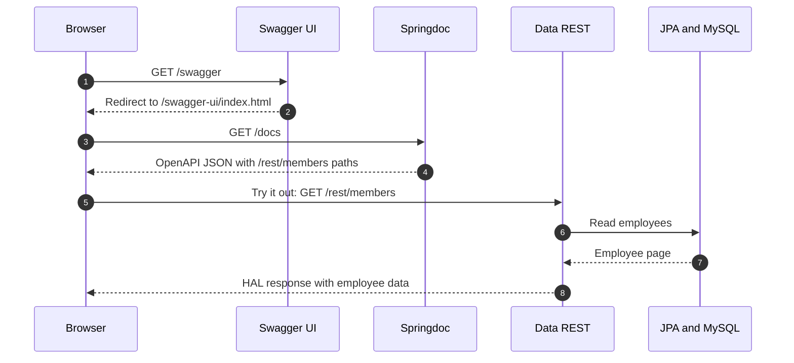
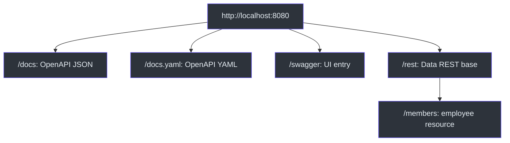

# Springdoc OpenAPI and Swagger UI — employee project

## 1. Lesson snapshot (2026-09-21)

This project adds `org.springdoc:springdoc-openapi-starter-webmvc-ui:3.1.1` to the preceding Spring Data REST employee application. Spring Boot is `4.1.1`; the Maven Java target is `25` (the local verification ran on JDK `26.0.1`). The learning goal is to see how an existing HTTP API gains a machine-readable description and an interactive browser page without writing an application controller. Sources: [`pom.xml:8`](pom.xml), [`pom.xml:30`](pom.xml), [`pom.xml:33`](pom.xml), [`EmployeeRepository.java:9`](src/main/java/com/example/cruddemo/repository/EmployeeRepository.java).

`springdoc-openapi` is a community-maintained library, not an official Spring Framework or Spring Boot module. The Springdoc 3.x line is intended for Spring Boot 4. OpenAPI is the **specification** describing HTTP operations and schemas; Springdoc generates that description from the running Spring application; Swagger UI renders it in a browser and provides **Try it out**. See the [Springdoc project README](https://github.com/springdoc/springdoc-openapi) and the [OpenAPI specification](https://spec.openapis.org/oas/latest.html).

| Part | What it supplies in this project | Source |
|---|---|---|
| Spring Data JPA | A runtime implementation of the repository contract and database persistence | [`pom.xml:38`](pom.xml), [`EmployeeRepository.java:10`](src/main/java/com/example/cruddemo/repository/EmployeeRepository.java) |
| Spring Data REST | HTTP CRUD resources around that repository | [`pom.xml:42`](pom.xml), [`EmployeeRepository.java:9`](src/main/java/com/example/cruddemo/repository/EmployeeRepository.java) |
| Springdoc | OpenAPI JSON/YAML routes and the Swagger UI | [`pom.xml:33`](pom.xml), [`application.properties:12`](src/main/resources/application.properties) |

The rule to remember: **Data REST creates `/rest/members`; Springdoc describes it; Swagger UI displays and can call it.** Adding Springdoc alone to a project with no HTTP routes does not create an employee CRUD API.


<!-- Sources: src/main/java/com/example/cruddemo/repository/EmployeeRepository.java:9, src/main/resources/application.properties:9, src/main/resources/application.properties:12, pom.xml:33 -->

## 2. Project map and startup path

| File | Role | Source |
|---|---|---|
| `CruddemoApplication.java` | `@SpringBootApplication` starts Boot auto-configuration and the web application | [`CruddemoApplication.java:6`](src/main/java/com/example/cruddemo/CruddemoApplication.java) |
| `EmployeeRepository.java` | Extends `JpaRepository<Employee, Integer>`; `@RepositoryRestResource(path="members")` selects the repository resource path | [`EmployeeRepository.java:9`](src/main/java/com/example/cruddemo/repository/EmployeeRepository.java) |
| `Employee.java` | Maps the `employee` table and exposes `id`, `firstName`, `lastName`, and `email` as Java properties | [`Employee.java:5`](src/main/java/com/example/cruddemo/entity/Employee.java), [`Employee.java:32`](src/main/java/com/example/cruddemo/entity/Employee.java) |
| `pom.xml` | Adds Spring Data JPA, Spring Data REST, Spring MVC, MySQL driver, and Springdoc's Web MVC UI starter | [`pom.xml:33`](pom.xml), [`pom.xml:38`](pom.xml), [`pom.xml:42`](pom.xml), [`pom.xml:46`](pom.xml) |
| `application.properties` | Sets the Data REST base path/page size and the two Springdoc paths | [`application.properties:9`](src/main/resources/application.properties), [`application.properties:12`](src/main/resources/application.properties) |
| `CruddemoApplicationTests.java` | Empty `@SpringBootTest` context-start test | [`CruddemoApplicationTests.java:6`](src/test/java/com/example/cruddemo/CruddemoApplicationTests.java) |

On startup, Boot discovers the repository, Spring Data JPA supplies its implementation, and Spring Data REST registers the repository's HTTP routes. The Springdoc starter registers documentation/UI support and generates an OpenAPI description from the application's HTTP mappings and models. There is currently no application-written controller or service class in this project. The OpenAPI document therefore lists the exported Data REST paths rather than custom controller paths. Source: [`CruddemoApplication.java:10`](src/main/java/com/example/cruddemo/CruddemoApplication.java), [`EmployeeRepository.java:10`](src/main/java/com/example/cruddemo/repository/EmployeeRepository.java), [`pom.xml:33`](pom.xml), [Springdoc README](https://github.com/springdoc/springdoc-openapi).


<!-- Sources: src/main/resources/application.properties:9, src/main/resources/application.properties:12, src/main/java/com/example/cruddemo/repository/EmployeeRepository.java:9, src/main/java/com/example/cruddemo/entity/Employee.java:5 -->

The UI's **Try it out** sends real HTTP requests. `GET` reads; `POST`, `PUT`, `PATCH`, and `DELETE` can change database contents. The documentation page does not simulate or isolate those operations.

## 3. Configuration and exact URLs

The project has no active `server.port` or `server.servlet.context-path` override, so its normal local URLs use port `8080` and the root context. `spring.data.rest.base-path=/rest` prefixes Data REST repository resources; it does **not** prefix Springdoc's UI or OpenAPI endpoints. Source: [`application.properties:9`](src/main/resources/application.properties), [`application.properties:12`](src/main/resources/application.properties).

| Setting/state | Value or usual default | Effect here | Source |
|---|---|---|---|
| Active `spring.data.rest.base-path` | `/rest` | Data REST prefix | [`application.properties:9`](src/main/resources/application.properties) |
| Active `@RepositoryRestResource(path=...)` | `members` | Repository collection at `/rest/members` | [`EmployeeRepository.java:9`](src/main/java/com/example/cruddemo/repository/EmployeeRepository.java) |
| Active `spring.data.rest.default-page-size` | `2` | Default collection page size; clients can request another `size` | [`application.properties:10`](src/main/resources/application.properties) |
| Active `springdoc.swagger-ui.path` | `/swagger` | UI entry URL; currently redirects to `/swagger-ui/index.html` | [`application.properties:12`](src/main/resources/application.properties) |
| Active `springdoc.api-docs.path` | `/docs` | OpenAPI JSON at `/docs`; YAML at `/docs.yaml` | [`application.properties:13`](src/main/resources/application.properties) |
| Springdoc's documented defaults, **overridden here** | `/swagger-ui.html`, `/v3/api-docs`, `/v3/api-docs.yaml` | Useful when these path properties are absent | [Springdoc README](https://github.com/springdoc/springdoc-openapi) |

Read-only requests for this configuration:

```powershell
# Run from this project directory after checking whether port 8080 is already in use.
.\mvnw.cmd spring-boot:run

# In another terminal:
curl.exe -i http://localhost:8080/swagger
curl.exe -i http://localhost:8080/docs
curl.exe -i http://localhost:8080/docs.yaml
curl.exe -i http://localhost:8080/rest/members
```

Expected: `/swagger` redirects to the UI, `/docs` returns JSON describing the API, `/docs.yaml` returns the same description in YAML, and `/rest/members` returns employee data in HAL format. A browser may **download** the YAML document because of its response media type. That does not mean the route failed.

With these active properties, `/v3/api-docs` and `/v3/api-docs/yaml` are not valid endpoints in this project; the verified YAML route is `/docs.yaml`. The older `/v3/api-docs` JSON path has moved to `/docs`. A hypothetical `server.servlet.context-path=/app` would add `/app` ahead of all these application paths, for example `/app/swagger`, `/app/docs`, and `/app/rest/members`. The context-path example is **not implemented** here.


<!-- Sources: src/main/resources/application.properties:9, src/main/resources/application.properties:12, src/main/resources/application.properties:13, src/main/java/com/example/cruddemo/repository/EmployeeRepository.java:9 -->

## 4. What the OpenAPI document contains

The live `/docs` response was OpenAPI `3.1.0` with the default title `OpenAPI definition` and these path keys: `/rest/members`, `/rest/members/{id}`, `/rest/profile`, and `/rest/profile/members`. It describes HTTP operations, parameters, response types, and component schemas; it does **not** contain the current employee rows. `GET /rest/members` is the separate data request. In Swagger UI, choosing an operation and clicking **Try it out** sends that request and displays its real response.

Springdoc can also describe Spring MVC controller methods if this application later gains `@RestController` mappings. That is a general Springdoc capability, **not code currently implemented in this project**. It discovers registered HTTP routes; it does not publish arbitrary service methods, repository methods, or `EntityManager` queries as HTTP endpoints. A service operation appears in the documentation only after an HTTP mapping exposes it. See [Springdoc README](https://github.com/springdoc/springdoc-openapi) and [Spring Data REST repository resources](https://docs.spring.io/spring-data/rest/reference/repository-resources.html).

For simple APIs, the generated descriptions can be enough to explore the routes. Larger APIs often add OpenAPI annotations for summaries, examples, response codes, or security descriptions because source signatures alone cannot express every business rule. The current project adds no such annotations; the title is still the generated default.

| Concept | Question it answers | Current example | Source |
|---|---|---|---|
| Data REST API | Where do I fetch employee data? | `GET /rest/members` | [`application.properties:9`](src/main/resources/application.properties), [`EmployeeRepository.java:9`](src/main/java/com/example/cruddemo/repository/EmployeeRepository.java) |
| OpenAPI document | What HTTP operations and schemas exist? | `GET /docs` or `/docs.yaml` | [`application.properties:13`](src/main/resources/application.properties) |
| Swagger UI | Where do I browse and execute documented operations? | `GET /swagger` | [`application.properties:12`](src/main/resources/application.properties) |

## 5. Verification and troubleshooting

**Observed on 2026-09-21 in this project:** Installed Maven ran `mvn test` successfully: one test, zero failures/errors/skips. The empty test proved application context startup with the configured MySQL connection, but did not assert the docs or UI response. For the live check, the app ran with temporary `--server.port=18087` to avoid taking over port `8080`; it was stopped afterward. The HTTP checks found:

| Temporary-port request | Observed result | Meaning |
|---|---|---|
| `GET /swagger` | `302`, `Location: /swagger-ui/index.html` | Custom UI entry works |
| `GET /swagger-ui/index.html` | `200`, `text/html` | UI files are served |
| `GET /docs` | `200`, `application/json` | Generated JSON document works |
| `GET /docs.yaml` | `200`, `application/vnd.oai.openapi` | Generated YAML document works |
| `GET /docs/yaml` | `404` | YAML uses `.yaml`, not `/yaml` |
| `GET /v3/api-docs` and `/v3/api-docs/yaml` | `404` | Old/default JSON path is replaced; slash-`yaml` is not the YAML path |

The check read the four path keys listed above from `/docs`; it did not exercise write requests, browser rendering, or authentication. The existing [`contextLoads()` test](src/test/java/com/example/cruddemo/CruddemoApplicationTests.java) remains a startup check only. MySQL `5.7.19` also produced Hibernate's warning that it is below this Hibernate dialect's supported minimum of `8.0.0`; the documentation endpoints nevertheless returned the statuses above.

| Symptom | Check or correction |
|---|---|
| `/v3/api-docs` returns 404 | This project changes the JSON path to `/docs`. |
| `/docs/yaml` returns 404 | Use `/docs.yaml`. |
| `/swagger` redirects | Follow the redirect; the UI is served from `/swagger-ui/index.html`. |
| Swagger UI lists no expected controller endpoint | Check whether the controller is actually registered with Spring MVC, whether its mapping exists, and whether security permits access. Merely writing a service method does not register an HTTP route. |
| API route appears but its description is unclear | Consider explicit OpenAPI annotations and verify the resulting `/docs` output. This is a future enhancement, not current code. |
| `contextLoads()` passes but UI is broken | Add a focused HTTP test or live check; context startup cannot verify rendered UI or generated document content. |

## 6. Recall prompts

1. Which library creates `/rest/members`, and which one describes it? **Spring Data REST** creates it; **Springdoc** generates its OpenAPI description.
2. Is Springdoc an official Spring dependency? **No.** It is a community library maintained outside the Spring Framework project.
3. What is the difference between OpenAPI and Swagger UI? **OpenAPI** is the API description format; **Swagger UI** is a browser interface that reads that description.
4. What URL returns employee data? **`/rest/members`**. What URL returns the API description? **`/docs`** or **`/docs.yaml`**.
5. Why does `/swagger` redirect? It is the configured UI entry point; the HTML is served at `/swagger-ui/index.html`.
6. Does `spring.data.rest.base-path=/rest` turn `/docs` into `/rest/docs`? **No.** That property scopes Data REST resources.
7. Why can `/docs.yaml` download in a browser? The server returns YAML with an OpenAPI media type; the browser may treat it as a download.
8. If you add a custom service method, will it automatically appear in Swagger UI? **No.** First expose it through an HTTP route, then check the generated document.
9. Is clicking **Try it out** for `DELETE` harmless? **No.** Swagger UI sends a real `DELETE` request.
10. What does the current `contextLoads()` test prove? The Spring context starts; it does not verify `/docs`, `/swagger`, or response content.

## 7. Official references and related course pages

| Reference | Use |
|---|---|
| [Springdoc OpenAPI README](https://github.com/springdoc/springdoc-openapi) | Boot 4 compatibility, starter coordinates, documented default and custom paths, and project ownership |
| [OpenAPI specification](https://spec.openapis.org/oas/latest.html) | Meaning of an OpenAPI document, operations, and schemas |
| [Spring Data REST repository resources](https://docs.spring.io/spring-data/rest/reference/repository-resources.html) | Where the actual repository HTTP resources come from |

| Course page | Relationship |
|---|---|
| [Course README](../../README.md) | Course navigation and progress |
| [Cumulative review](../../COURSE_REVIEW.md) | Short recall rules across projects |
| [Previous Spring Data REST notes](../04-spring-boot-rest-crud-employee-with-spring-rest/notes.md) | Generated repository CRUD, HAL, and pagination |
| [Spring Data JPA repository notes](../03-spring-boot-rest-crud-employee-with-jpa-repository/notes.md) | Repository proxy and derived queries |
| [REST controller foundations](../01-spring-boot-rest-crud/notes.md) | How application-written controller mappings work |
