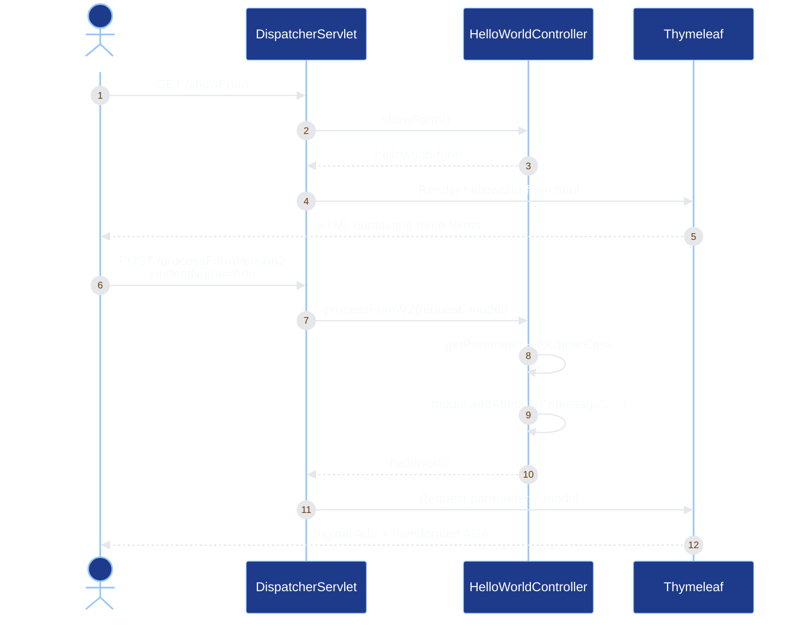
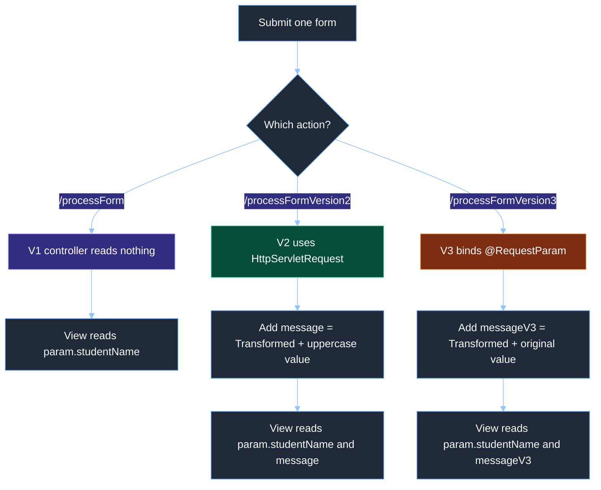
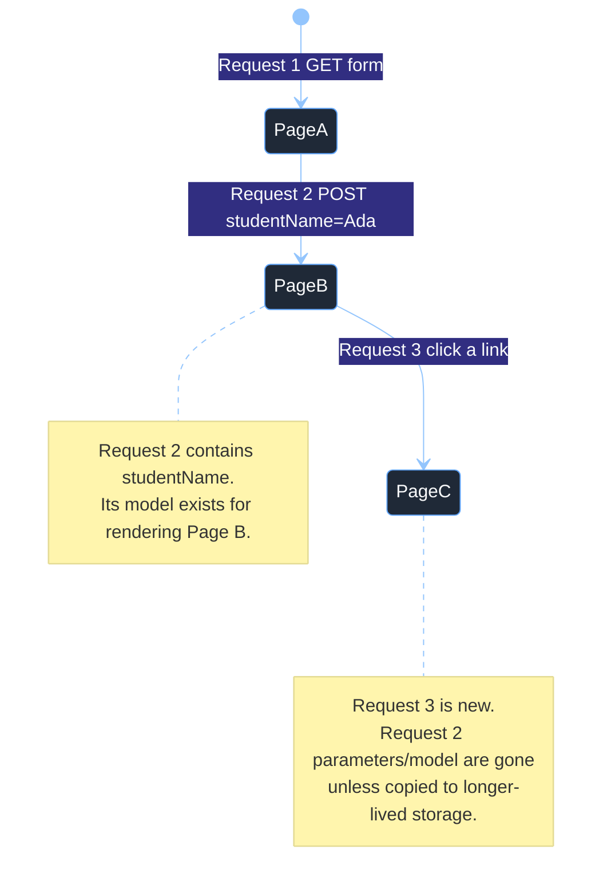

# Spring MVC, Thymeleaf, and Form Parameters

These notes capture the project as it existed on **2026-09-24**. They explain the runtime path first, then connect each annotation, HTML form, request value, model attribute, and Thymeleaf expression to the active code.

Course navigation: [course map](../../README.md) · [cumulative review](../../COURSE_REVIEW.md)

## Overview

### Lesson snapshot

| Item | Current project |
|---|---|
| Learning goal | Serve Thymeleaf HTML from Spring MVC and process the same form value in three ways |
| Spring Boot | `4.1.1` |
| Spring Framework observed at runtime | `7.0.9` |
| Java | Target `25`; verified on OpenJDK `26.0.1` |
| Build tool | Maven Wrapper `3.9.16` |
| Main dependencies | Spring MVC, Thymeleaf, DevTools, MVC/Thymeleaf test starters |
| Form page | `GET /showForm` |
| Processing routes | `POST /processForm`, `POST /processFormVersion2`, `POST /processFormVersion3` |
| Shared result view | `templates/helloworld.html` |

The MVC starter receives HTTP requests, and the Thymeleaf starter turns templates plus data into final HTML. The relevant declarations are in [pom.xml](pom.xml#L8-L56), while the application starts from [ThymeleafdemoApplication.java](src/main/java/com/example/thymeleafdemo/ThymeleafdemoApplication.java#L6-L11).

### One-sentence mental model

The browser sends a request, Spring's `DispatcherServlet` selects a controller method, the controller prepares data and returns a logical view name, and Thymeleaf combines that data with an HTML template to produce the response.

**Recall rule:** request in → controller selected → data prepared → view rendered → HTML out.

## Architecture

### The front-controller path

`DispatcherServlet` is the **front controller**. It is the central Spring MVC servlet through which requests pass. Your controller is not listening on the network by itself; embedded Tomcat receives the network request and hands it to Spring's dispatcher.

```mermaid
%%{init: {'theme':'base','themeVariables':{'primaryColor':'#1f2937','primaryTextColor':'#f9fafb','primaryBorderColor':'#60a5fa','lineColor':'#93c5fd','secondaryColor':'#312e81','tertiaryColor':'#064e3b','background':'#111827'}}}%%
flowchart LR
    B[Browser] -->|HTTP request| T[Embedded Tomcat]
    T --> D[DispatcherServlet]
    D --> H[Handler mapping]
    H --> C[@Controller method]
    C --> M[Model and request data]
    C -->|logical view name| V[Thymeleaf view resolver]
    M --> V
    V --> P[HTML template]
    P -->|rendered HTML| B

    style B fill:#312e81,stroke:#a5b4fc,color:#fff
    style D fill:#1e3a8a,stroke:#93c5fd,color:#fff
    style C fill:#064e3b,stroke:#6ee7b7,color:#fff
    style V fill:#7c2d12,stroke:#fdba74,color:#fff
```

<!-- Sources: src/main/java/com/example/thymeleafdemo/ThymeleafdemoApplication.java; src/main/java/com/example/thymeleafdemo/controller/HelloWorldController.java; pom.xml -->

The steps are:

1. `SpringApplication.run(...)` creates the application context and starts embedded Tomcat.
2. Component scanning finds the two classes annotated with `@Controller` because they are below the main package.
3. Spring registers their mapping annotations, such as `@GetMapping("/showForm")` and `@PostMapping("/processForm")`.
4. The dispatcher matches the request path and HTTP method to exactly one handler method.
5. A handler may read request values and add server-created values to a `Model`.
6. Returning `"helloworld"` is a **logical view name**. It is not response text.
7. Thymeleaf resolves that name to `src/main/resources/templates/helloworld.html`, evaluates its `th:*` attributes, and writes the rendered HTML response.

### `@Controller` versus `@RestController`

| Annotation | Meaning of a returned `String` | Typical use |
|---|---|---|
| `@Controller` | A logical view name such as `"helloworld"` | Server-rendered HTML |
| `@RestController` | Response-body content such as `"Hello World"` | JSON, text, or other REST responses |

`@RestController` combines controller registration with default `@ResponseBody` behavior. This project uses `@Controller` because its methods select Thymeleaf views in [DemoController.java](src/main/java/com/example/thymeleafdemo/controller/DemoController.java#L10-L17) and [HelloWorldController.java](src/main/java/com/example/thymeleafdemo/controller/HelloWorldController.java#L8-L32).

## Components

### Project map

| File | Responsibility |
|---|---|
| [pom.xml](pom.xml#L29-L65) | Selects Java 25, Spring MVC, Thymeleaf, DevTools, and test support |
| [ThymeleafdemoApplication.java](src/main/java/com/example/thymeleafdemo/ThymeleafdemoApplication.java#L6-L11) | Starts Boot and establishes the component-scan parent package |
| [HelloWorldController.java](src/main/java/com/example/thymeleafdemo/controller/HelloWorldController.java#L8-L32) | Shows the form and implements V1, V2, and V3 form processing |
| [DemoController.java](src/main/java/com/example/thymeleafdemo/controller/DemoController.java#L10-L17) | Maps `GET /helloworld`, adds a date, and returns the result view |
| [helloworld-form.html](src/main/resources/templates/helloworld-form.html#L1-L24) | Defines three independent POST forms |
| [helloworld.html](src/main/resources/templates/helloworld.html#L1-L17) | Displays the request parameter and two possible model attributes |
| [style.css](src/main/resources/static/css/style.css#L1-L4) | Defines `.formal`; the active templates do not currently link it |
| [application.properties](src/main/resources/application.properties#L1) | Sets only the application name, leaving port `8080` and context path `/` at defaults |
| [ThymeleafdemoApplicationTests.java](src/test/java/com/example/thymeleafdemo/ThymeleafdemoApplicationTests.java#L6-L11) | Verifies application-context startup only |

### Required resource layout

With Spring Boot's default MVC/Thymeleaf configuration, these locations have different jobs:

```text
src/main/resources/
├── application.properties
├── templates/
│   ├── helloworld-form.html     # processed by Thymeleaf
│   └── helloworld.html          # processed by Thymeleaf
└── static/
    └── css/
        └── style.css            # served directly at /css/style.css
```

- `templates/` contains server-side templates. A controller normally selects them by returning a view name.
- `static/` contains assets that can be served directly: CSS, JavaScript, and images.
- Returning `"helloworld"` resolves the active `helloworld.html`, not `helloworld.backup`.
- A context-relative stylesheet expression is preferably `th:href="@{/css/style.css}"`.

The backup template demonstrates `${date}` and `.formal`, but it is not the active result template. Consequently, [DemoController.java](src/main/java/com/example/thymeleafdemo/controller/DemoController.java#L13-L16) currently adds `date`, while [helloworld.html](src/main/resources/templates/helloworld.html#L5-L14) never reads it. This is why `GET /helloworld` does not display the date. The active template also does not contain a stylesheet `<link>`, so the existing CSS is served correctly but has no visible effect on that page.

## Data Flow

### Showing and submitting the form



<!-- Sources: src/main/java/com/example/thymeleafdemo/controller/HelloWorldController.java; src/main/resources/templates/helloworld-form.html; src/main/resources/templates/helloworld.html -->

The form submission and result rendering above happen in the **same POST request**. That is why Thymeleaf can still read `${param.studentName}` even though V2 also copies a transformed value into the model.

### What each version does



<!-- Sources: src/main/java/com/example/thymeleafdemo/controller/HelloWorldController.java:16-31; src/main/resources/templates/helloworld.html:5-14 -->

| Version | Controller input | Controller processing | Model value added | What the view displays |
|---|---|---|---|---|
| V1 | No explicit parameter | None | None | Original value through `${param.studentName}` |
| V2 | Whole `HttpServletRequest` plus `Model` | Reads `studentName` and uppercases it | `message` | Original request value plus uppercase model value |
| V3 | `@RequestParam("studentName") String name` plus `Model` | Binds only the named value | `messageV3` | Original request value plus the same-cased model value |

V3's annotation name and Java variable name are allowed to differ:

```java
@RequestParam("studentName") String name
```

`studentName` is the HTTP parameter key; `name` is only the local Java variable.

### Why two same-named inputs do not collide

The page contains three separate `<form>` elements, each with an input named `studentName`. Clicking one form's submit button submits only the successful controls **inside that form**. The other two inputs are not part of that request.

For form submission:

- `name="studentName"` creates the request parameter key.
- `value` supplies its value.
- `id` identifies an HTML element for labels, CSS, or JavaScript; it is not the submission key.
- A control with only `id="studentName"` and no `name` is not submitted as a normal form field.
- Disabled controls are not submitted. Unchecked checkboxes/radio buttons are normally absent.
- Repeating the same `name` inside the **same submitted form** can create multiple values. Read them as an array/list or with `getParameterValues()`.

**Recall rule:** the clicked form chooses the controls; `name` chooses the HTTP key; `value` supplies the data.

### Request lifetime: why page C does not remember page A



<!-- Sources: src/main/resources/templates/helloworld-form.html; src/main/java/com/example/thymeleafdemo/controller/HelloWorldController.java -->

Request parameters, request attributes, and an ordinary `Model` are request-scoped. A later link click starts another HTTP request, so it does not automatically inherit the earlier values.

To carry data across requests, choose an explicit mechanism:

| Mechanism | Suitable use |
|---|---|
| Query/path parameter | Small, non-sensitive navigation state that belongs in the URL |
| Session | Per-user state needed across several requests; remove it when no longer needed |
| Flash attribute | One-time data across a redirect, such as a success message |
| Database | Durable application data |

## Implementation Details

### Thymeleaf syntax in this project

The namespace declaration `xmlns:th="http://www.thymeleaf.org"` identifies Thymeleaf attributes to tools and editors. The `th:` attributes are evaluated on the server; the browser receives ordinary rendered HTML.

| Syntax | Meaning | Example |
|---|---|---|
| `th:text` | Replace an element's text safely; output is HTML-escaped | `th:text="${message}"` |
| `${...}` | Evaluate a variable expression from the Thymeleaf/Spring context | `${messageV3}` |
| `${param...}` | Access current HTTP request parameters | `${param.studentName}` |
| `@{...}` | Build a URL, usually context-relative | `@{/css/style.css}` |
| `+` | Concatenate expression values | `'Student name is ' + ${message}` |

Thymeleaf documents `${param.studentName}` as a `String[]` namespace entry because a parameter can have several values. `${param.studentName[0]}` is the explicit form for the first value. This project's expression rendered the single submitted value correctly during the smoke test, but indexing or binding in the controller makes multi-value intent clearer.

### What `Model` is doing

`Model` is a Spring MVC data carrier for values that the selected view should render. It is not a database model, session, or permanent store.

```java
model.addAttribute("message", "Transformed = " + transformedName);
```

- `"message"` is the key the view uses as `${message}`.
- The second argument is the value exposed to the view.
- The model belongs to this request's rendering flow.
- A controller need not manually construct or inject the servlet request just to receive a `Model`; Spring MVC recognizes supported handler-method argument types and supplies them.

The view can access request information without an explicit `HttpServletRequest` controller parameter because Spring MVC and Thymeleaf build the web rendering context from the current request. Adding `HttpServletRequest` to a handler merely gives **controller code** direct access to that same request.

### Parameters versus attributes

| Concept | Origin | Type | Servlet API | Thymeleaf access |
|---|---|---|---|---|
| Request parameter | Client query string or submitted form data | Text values (`String`/`String[]`) | `getParameter`, `getParameterValues` | `${param.studentName}` |
| Request attribute | Server/container code during request processing | Any `Object` | `setAttribute`, `getAttribute` | Root variable such as `${message}` when exposed for rendering |
| Model attribute | Controller-provided view data | Any object | Added through Spring's `Model` abstraction | Root variable such as `${message}` |

`request.getParameter("studentName")` returns the client-supplied form/query value or `null` when the key is absent. `request.getAttribute("studentName")` asks for a server-side object stored under that name; it does not read normal form data.

**Recall rule:** parameter = client sent it; attribute = server attached it.

### `HttpServletRequest` versus `@RequestParam`

| Approach | Best mental model | Missing-value behavior in this code |
|---|---|---|
| `HttpServletRequest request` | Give the handler access to the whole low-level request | `getParameter(...)` returns `null`; the current `.toUpperCase()` then causes `500` |
| `@RequestParam("studentName") String name` | Ask Spring to extract and bind one declared input | Required by default; a missing key causes `400` before the method runs |

You can declare more than one targeted value:

```java
public String process(
        @RequestParam("studentName") String name,
        @RequestParam("course") String course,
        Model model) {
    // ...
}
```

Useful alternatives for future lessons are `required = false`, `Optional<String>`, `defaultValue = "..."`, `List<String>`/`String[]` for repeated keys, and `MultiValueMap<String, String>` when all parameters are intentionally needed.

### Missing is different from blank

| Incoming data | Meaning | Current V2 | Current V3 |
|---|---|---|---|
| No `studentName` key | Missing | `getParameter` returns `null`; `.toUpperCase()` throws → `500` | Required binding fails → `400` |
| `studentName=` | Present with empty string | Uppercases `""`; handler returns `200` | Binds `""`; handler returns `200` |
| `studentName=Ada` | Present with text | Model gets `Transformed = ADA` | Model gets `Transformed = Ada` |

HTML `required` can improve browser feedback, but server-side validation is still necessary because clients can bypass HTML controls.

### GET versus POST for forms

HTML permits both methods because submitting data is not always a state-changing command. A search/filter form is naturally a GET even though it sends criteria to the server.

| GET | POST |
|---|---|
| Parameters normally appear in the URL query string | Form data normally appears in the request body |
| Intended for safe retrieval/navigation | Intended for processing that may create/change state or should not be represented as a reusable query URL |
| Bookmarkable and easy to share | Not normally bookmarkable as a complete submission |
| Refresh repeats a GET | Refresh after a direct POST response can prompt resubmission |

POST does **not** encrypt the data; HTTPS protects requests in transit.

The current mapping split is appropriate:

- `GET /showForm` displays the page.
- All three processing routes accept POST only.
- V3's `@RequestMapping(value = ..., method = RequestMethod.POST)` is equivalent in routing behavior to the shorter `@PostMapping(...)` form.

### Post/Redirect/Get — next revision topic

The current handlers return `"helloworld"` directly, so the POST request itself produces the result page. Refreshing that result can resubmit the POST.

Post/Redirect/Get (PRG) changes the flow to:

```text
POST form -> controller processes -> 3xx redirect -> browser performs GET -> result page
```

PRG gives the browser a GET result URL and avoids ordinary refresh-driven POST resubmission. Because redirect creates a new request, one-time output is commonly carried with a flash attribute. **PRG is not implemented in this project yet; revisit it in the next lesson.**

## Observed Verification — 2026-09-24

### Build and startup test

From the project directory:

```powershell
.\mvnw.cmd test
```

Observed result: `BUILD SUCCESS`; one test ran with zero failures, errors, or skips. The application context started with Spring Boot `4.1.1` on Java `26.0.1`. This proves startup only; [contextLoads()](src/test/java/com/example/thymeleafdemo/ThymeleafdemoApplicationTests.java#L8-L10) does not submit forms or assert HTML.

### Focused HTTP smoke test

The application was run temporarily on port `18084`, the following requests were checked, and the server was stopped afterward.

| Request | Observed status/result |
|---|---|
| `GET /showForm` | `200`; rendered all three POST forms |
| `GET /helloworld` | `200`; current result template rendered request/model values as `null`; date was not displayed |
| `GET /css/style.css` | `200`; `.formal` stylesheet was served |
| `POST /processForm` with `studentName=Ada` | `200`; displayed original `Ada` only |
| `POST /processFormVersion2` with `studentName=Ada` | `200`; displayed `Ada` and `Transformed = ADA` |
| `POST /processFormVersion3` with `studentName=Ada` | `200`; displayed `Ada` and `Transformed = Ada` |
| `GET /processFormVersion3?studentName=Ada` | `405 Method Not Allowed` |
| V3 POST with the key absent | `400 Bad Request` |
| V2 POST with the key absent | `500 Internal Server Error` from `null.toUpperCase()` |
| V2/V3 POST with `studentName=` | `200`; blank is present and differs from missing |

No database or other persistent state exists in this lesson, so the local POST checks only rendered HTML.

## Current Limitations and Common Mistakes

- **Expecting the date at `/helloworld`:** the controller adds `date`, but the active `helloworld.html` does not read it. The old date markup is in `helloworld.backup`.
- **Expecting CSS automatically:** `style.css` exists, but the active templates contain no stylesheet link. Use `th:href="@{/css/style.css}"` when reintroducing it.
- **Using `id` instead of `name`:** `id` does not create the request parameter.
- **Thinking every same-named input on the page is sent:** only controls in the submitted form participate.
- **Calling `getAttribute()` for form data:** normal query/form data is read with `getParameter()` or `@RequestParam`.
- **Assuming `getParameter()` throws when absent:** it returns `null`; later code may throw if it dereferences that null.
- **Assuming required `@RequestParam` causes `500`:** Spring rejects a missing required parameter with `400` before entering the method.
- **Treating `Model` as persistent storage:** it normally lasts only for rendering the current request.
- **Assuming POST is secure:** use HTTPS; the HTTP method itself provides no encryption.
- **Calling V3 transformed:** its current code prefixes `Transformed =` but does not call `toUpperCase()`.
- **Using the browser Back button as proof of server persistence:** a browser may show cached form/page state; that does not mean the old request model survives on the server.

## Active Recall

Try answering before expanding the answer mentally.

1. **What is the `DispatcherServlet`?**  
   Spring MVC's front controller: it coordinates handler lookup, invocation, view resolution, and other web concerns.

2. **Why does `return "helloworld"` select HTML instead of returning those letters?**  
   The class uses `@Controller`, so the string is treated as a logical view name and Thymeleaf resolves `templates/helloworld.html`.

3. **What would change under `@RestController`?**  
   The returned string would normally become response-body content.

4. **How does `${message}` receive a value?**  
   A controller calls `model.addAttribute("message", value)` for the current rendering request.

5. **How does `${param.studentName}` receive a value without the controller adding it?**  
   Thymeleaf's web context exposes parameters from the current HTTP request through the `param` namespace.

6. **Does `${param.studentName}` mean the same thing as `${studentName}`?**  
   No. The first explicitly reads a request parameter; the second looks for a root context/model/request attribute.

7. **Why does each submission contain only one `studentName` even though the page has three?**  
   They belong to three separate forms, and only the submitted form's successful controls are sent.

8. **Which HTML attribute creates the HTTP key: `id` or `name`?**  
   `name`.

9. **What is the difference between `getParameter()` and `getAttribute()`?**  
   A parameter is client-supplied form/query text; an attribute is a server-attached object.

10. **Why use `@RequestParam` instead of the whole request?**  
    It declares exactly which input the method needs and lets Spring bind and convert it.

11. **Can the annotation key and Java variable name differ?**  
    Yes: `@RequestParam("studentName") String name`.

12. **What happens when `studentName` is missing in V2 and V3?**  
    V2 reads `null` and its uppercase call causes `500`; V3's required binding produces `400` before invocation.

13. **Why is `studentName=` different from no key?**  
    It is present with the empty string rather than absent/null.

14. **Why does page C not automatically see page A's form value?**  
    Clicking through creates new HTTP requests; request parameters and model data do not automatically cross that boundary.

15. **When is GET reasonable for a form?**  
    For safe retrieval such as searches and filters whose criteria can appear in a reusable URL.

16. **What problem will PRG address?**  
    It redirects after POST so refresh normally repeats a GET rather than resubmitting the form command.

### Compact memory aids

- **MVC:** Model = view data, View = template, Controller = request handler.
- **Form:** submitted form + successful controls + `name=value` pairs.
- **Scope:** same request can see params/model; next request needs explicit transfer.
- **Input APIs:** whole request = `HttpServletRequest`; chosen field = `@RequestParam`.
- **HTTP:** GET retrieves; POST processes; HTTPS protects.

## Official References

- [Spring Framework 7 — DispatcherServlet](https://docs.spring.io/spring-framework/reference/web/webmvc/mvc-servlet.html)
- [Spring Framework 7 — annotated request mappings](https://docs.spring.io/spring-framework/reference/web/webmvc/mvc-controller/ann-requestmapping.html)
- [Spring Framework 7 — `@RequestParam`](https://docs.spring.io/spring-framework/reference/web/webmvc/mvc-controller/ann-methods/requestparam.html)
- [Spring Boot — servlet web applications, static content, and templates](https://docs.spring.io/spring-boot/reference/web/servlet.html)
- [Thymeleaf 3.1 — using Thymeleaf](https://www.thymeleaf.org/doc/tutorials/3.1/usingthymeleaf.html)
- [Jakarta Servlet 6.1 — `ServletRequest`](https://jakarta.ee/specifications/servlet/6.1/apidocs/jakarta.servlet/jakarta/servlet/servletrequest)

## Related Pages

- [Course README](../../README.md) — section navigation and progress
- [Cumulative course review](../../COURSE_REVIEW.md) — compact cross-section recall
- [Spring REST foundations](../../04-springboot-rest-crud/01-spring-boot-rest-crud/notes.md) — compare `@RestController`, response bodies, and DispatcherServlet routing

