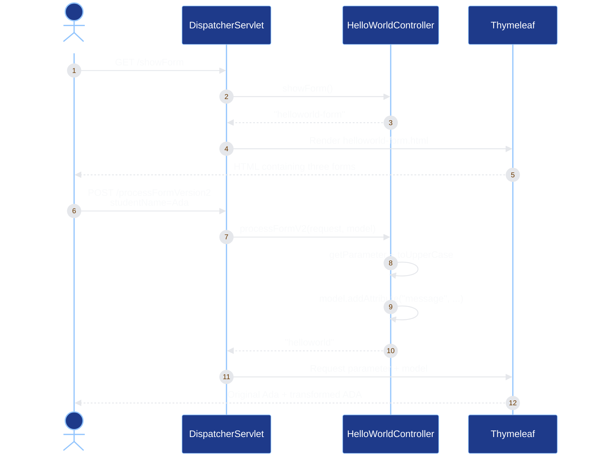
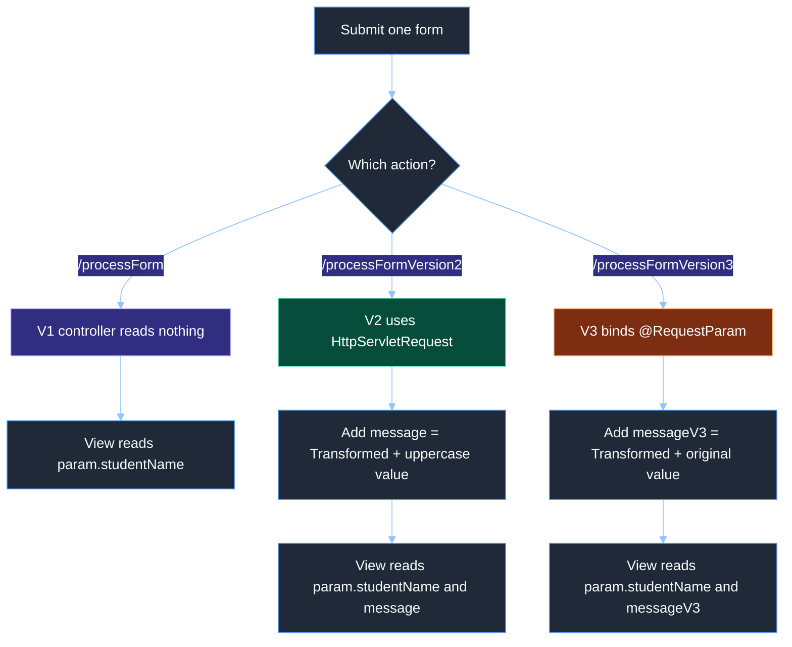
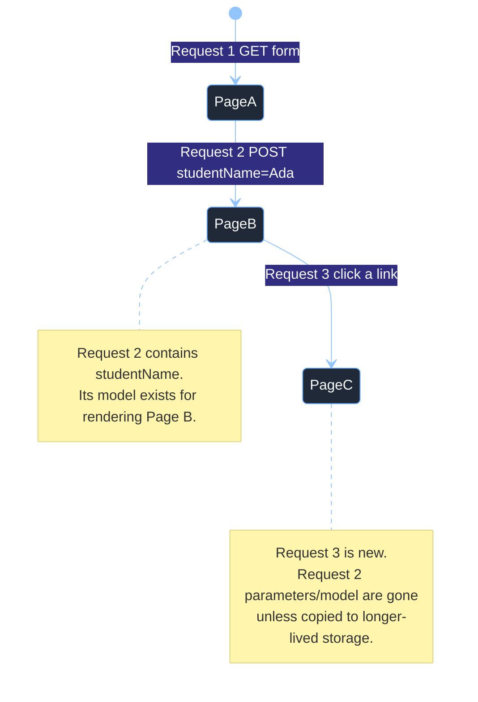
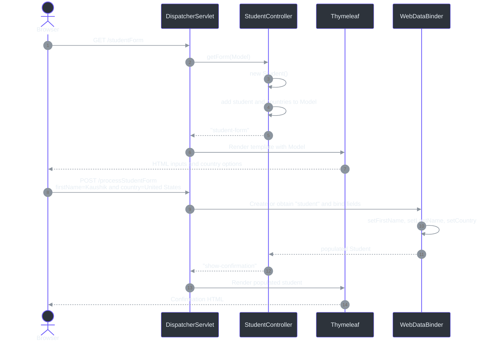
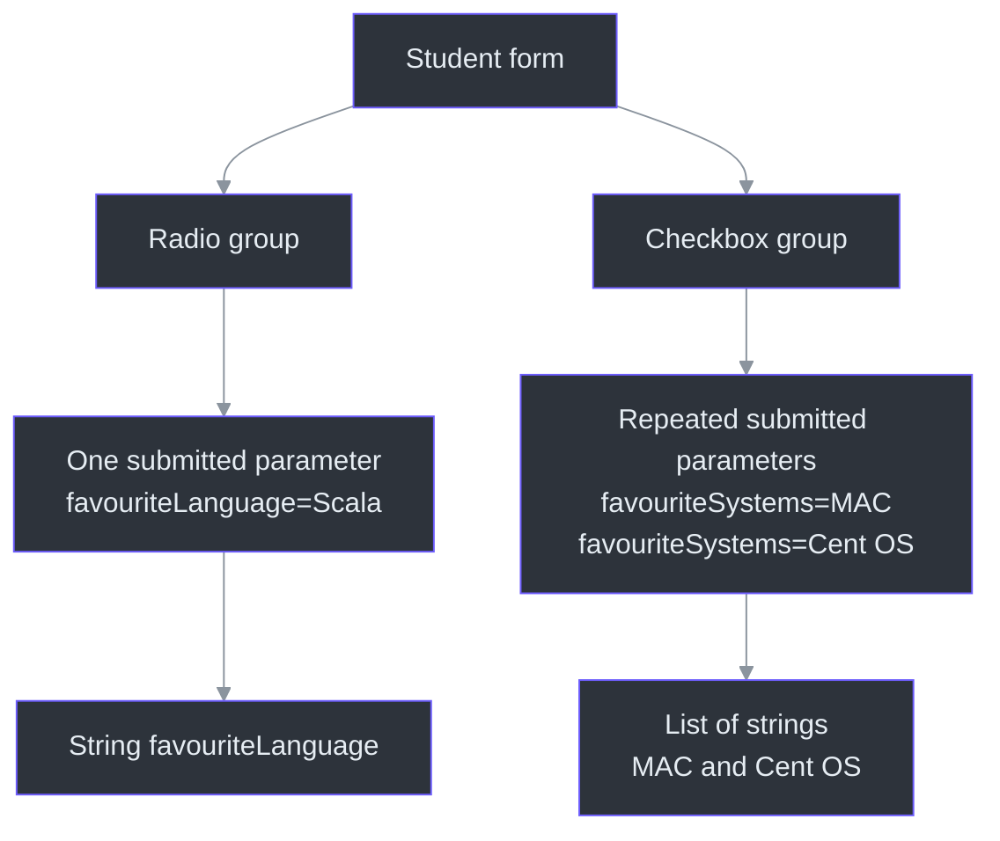
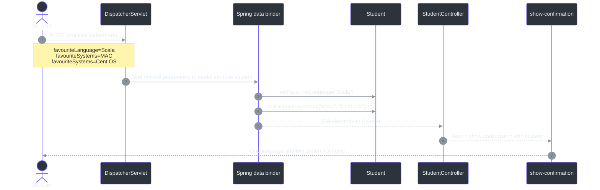

# Spring MVC, Thymeleaf, and Form Data Binding

These notes capture the project as it existed on **2026-09-24**. They explain the runtime path first, then connect each annotation, HTML form, request value, model attribute, and Thymeleaf expression to the active code.

Course navigation: [course map](../../README.md) · [cumulative review](../../COURSE_REVIEW.md)

## Overview

### Lesson snapshot

| Item | Current project |
|---|---|
| Learning goal | Serve Thymeleaf HTML from Spring MVC and process the same form value in three ways |
| Spring Boot | `4.1.1` |
| Spring Framework observed at runtime | `7.0.9` |
| Java | Target `25`; verified on OpenJDK `26.0.1` |
| Build tool | Maven Wrapper `3.9.16` |
| Main dependencies | Spring MVC, Thymeleaf, DevTools, MVC/Thymeleaf test starters |
| Form page | `GET /showForm` |
| Processing routes | `POST /processForm`, `POST /processFormVersion2`, `POST /processFormVersion3` |
| Shared result view | `templates/helloworld.html` |

The MVC starter receives HTTP requests, and the Thymeleaf starter turns templates plus data into final HTML. The relevant declarations are in [pom.xml](pom.xml#L8-L56), while the application starts from [ThymeleafdemoApplication.java](src/main/java/com/example/thymeleafdemo/ThymeleafdemoApplication.java#L6-L11).

### One-sentence mental model

The browser sends a request, Spring's `DispatcherServlet` selects a controller method, the controller prepares data and returns a logical view name, and Thymeleaf combines that data with an HTML template to produce the response.

**Recall rule:** request in → controller selected → data prepared → view rendered → HTML out.

## Architecture

### The front-controller path

`DispatcherServlet` is the **front controller**. It is the central Spring MVC servlet through which requests pass. Your controller is not listening on the network by itself; embedded Tomcat receives the network request and hands it to Spring's dispatcher.

```mermaid
%%{init: {'theme':'base','themeVariables':{'primaryColor':'#1f2937','primaryTextColor':'#f9fafb','primaryBorderColor':'#60a5fa','lineColor':'#93c5fd','secondaryColor':'#312e81','tertiaryColor':'#064e3b','background':'#111827'}}}%%
flowchart LR
    B[Browser] -->|HTTP request| T[Embedded Tomcat]
    T --> D[DispatcherServlet]
    D --> H[Handler mapping]
    H --> C[@Controller method]
    C --> M[Model and request data]
    C -->|logical view name| V[Thymeleaf view resolver]
    M --> V
    V --> P[HTML template]
    P -->|rendered HTML| B

    style B fill:#312e81,stroke:#a5b4fc,color:#fff
    style D fill:#1e3a8a,stroke:#93c5fd,color:#fff
    style C fill:#064e3b,stroke:#6ee7b7,color:#fff
    style V fill:#7c2d12,stroke:#fdba74,color:#fff
```

<!-- Sources: src/main/java/com/example/thymeleafdemo/ThymeleafdemoApplication.java; src/main/java/com/example/thymeleafdemo/controller/HelloWorldController.java; pom.xml -->

The steps are:

1. `SpringApplication.run(...)` creates the application context and starts embedded Tomcat.
2. Component scanning finds the two classes annotated with `@Controller` because they are below the main package.
3. Spring registers their mapping annotations, such as `@GetMapping("/showForm")` and `@PostMapping("/processForm")`.
4. The dispatcher matches the request path and HTTP method to exactly one handler method.
5. A handler may read request values and add server-created values to a `Model`.
6. Returning `"helloworld"` is a **logical view name**. It is not response text.
7. Thymeleaf resolves that name to `src/main/resources/templates/helloworld.html`, evaluates its `th:*` attributes, and writes the rendered HTML response.

### `@Controller` versus `@RestController`

| Annotation | Meaning of a returned `String` | Typical use |
|---|---|---|
| `@Controller` | A logical view name such as `"helloworld"` | Server-rendered HTML |
| `@RestController` | Response-body content such as `"Hello World"` | JSON, text, or other REST responses |

`@RestController` combines controller registration with default `@ResponseBody` behavior. This project uses `@Controller` because its methods select Thymeleaf views in [DemoController.java](src/main/java/com/example/thymeleafdemo/controller/DemoController.java#L10-L17) and [HelloWorldController.java](src/main/java/com/example/thymeleafdemo/controller/HelloWorldController.java#L8-L32).

## Components

### Project map

| File | Responsibility |
|---|---|
| [pom.xml](pom.xml#L29-L65) | Selects Java 25, Spring MVC, Thymeleaf, DevTools, and test support |
| [ThymeleafdemoApplication.java](src/main/java/com/example/thymeleafdemo/ThymeleafdemoApplication.java#L6-L11) | Starts Boot and establishes the component-scan parent package |
| [HelloWorldController.java](src/main/java/com/example/thymeleafdemo/controller/HelloWorldController.java#L8-L32) | Shows the form and implements V1, V2, and V3 form processing |
| [DemoController.java](src/main/java/com/example/thymeleafdemo/controller/DemoController.java#L10-L17) | Maps `GET /helloworld`, adds a date, and returns the result view |
| [helloworld-form.html](src/main/resources/templates/helloworld-form.html#L1-L24) | Defines three independent POST forms |
| [helloworld.html](src/main/resources/templates/helloworld.html#L1-L17) | Displays the request parameter and two possible model attributes |
| [style.css](src/main/resources/static/css/style.css#L1-L4) | Defines `.formal`; the active templates do not currently link it |
| [application.properties](src/main/resources/application.properties#L1) | Sets only the application name, leaving port `8080` and context path `/` at defaults |
| [ThymeleafdemoApplicationTests.java](src/test/java/com/example/thymeleafdemo/ThymeleafdemoApplicationTests.java#L6-L11) | Verifies application-context startup only |

### Required resource layout

With Spring Boot's default MVC/Thymeleaf configuration, these locations have different jobs:

```text
src/main/resources/
├── application.properties
├── templates/
│   ├── helloworld-form.html     # processed by Thymeleaf
│   └── helloworld.html          # processed by Thymeleaf
└── static/
    └── css/
        └── style.css            # served directly at /css/style.css
```

- `templates/` contains server-side templates. A controller normally selects them by returning a view name.
- `static/` contains assets that can be served directly: CSS, JavaScript, and images.
- Returning `"helloworld"` resolves the active `helloworld.html`, not `helloworld.backup`.
- A context-relative stylesheet expression is preferably `th:href="@{/css/style.css}"`.

The backup template demonstrates `${date}` and `.formal`, but it is not the active result template. Consequently, [DemoController.java](src/main/java/com/example/thymeleafdemo/controller/DemoController.java#L13-L16) currently adds `date`, while [helloworld.html](src/main/resources/templates/helloworld.html#L5-L14) never reads it. This is why `GET /helloworld` does not display the date. The active template also does not contain a stylesheet `<link>`, so the existing CSS is served correctly but has no visible effect on that page.

## Data Flow

### Showing and submitting the form


```mermaid
%%{init: {'theme':'base','themeVariables':{'primaryColor':'#1f2937','primaryTextColor':'#f9fafb','primaryBorderColor':'#60a5fa','lineColor':'#93c5fd','secondaryColor':'#312e81','tertiaryColor':'#064e3b','background':'#111827','actorBkg':'#1e3a8a','actorBorder':'#93c5fd','actorTextColor':'#ffffff','signalColor':'#e5e7eb','signalTextColor':'#f9fafb','labelBoxBkgColor':'#374151','labelTextColor':'#ffffff'}}}%%
sequenceDiagram
    autonumber
    actor Browser
    participant Dispatcher as DispatcherServlet
    participant Controller as HelloWorldController
    participant Thymeleaf

    Browser->>Dispatcher: GET /showForm
    Dispatcher->>Controller: showForm()
    Controller-->>Dispatcher: "helloworld-form"
    Dispatcher->>Thymeleaf: Render helloworld-form.html
    Thymeleaf-->>Browser: HTML containing three forms
    Browser->>Dispatcher: POST /processFormVersion2<br/>studentName=Ada
    Dispatcher->>Controller: processFormV2(request, model)
    Controller->>Controller: getParameter + toUpperCase
    Controller->>Controller: model.addAttribute("message", ...)
    Controller-->>Dispatcher: "helloworld"
    Dispatcher->>Thymeleaf: Request parameter + model
    Thymeleaf-->>Browser: Original Ada + transformed ADA
```

<!-- Sources: src/main/java/com/example/thymeleafdemo/controller/HelloWorldController.java; src/main/resources/templates/helloworld-form.html; src/main/resources/templates/helloworld.html -->

The form submission and result rendering above happen in the **same POST request**. That is why Thymeleaf can still read `${param.studentName}` even though V2 also copies a transformed value into the model.

### What each version does


```mermaid
%%{init: {'theme':'base','themeVariables':{'primaryColor':'#1f2937','primaryTextColor':'#f9fafb','primaryBorderColor':'#60a5fa','lineColor':'#93c5fd','secondaryColor':'#312e81','tertiaryColor':'#064e3b','background':'#111827'}}}%%
flowchart TD
    F[Submit one form] --> S{Which action?}
    S -->|/processForm| V1[V1 controller reads nothing]
    S -->|/processFormVersion2| V2[V2 uses HttpServletRequest]
    S -->|/processFormVersion3| V3[V3 binds @RequestParam]
    V1 --> R1[View reads param.studentName]
    V2 --> A2[Add message = Transformed + uppercase value]
    V3 --> A3[Add messageV3 = Transformed + original value]
    A2 --> R2[View reads param.studentName and message]
    A3 --> R3[View reads param.studentName and messageV3]

    style V1 fill:#312e81,stroke:#c4b5fd,color:#fff
    style V2 fill:#064e3b,stroke:#6ee7b7,color:#fff
    style V3 fill:#7c2d12,stroke:#fdba74,color:#fff
```

<!-- Sources: src/main/java/com/example/thymeleafdemo/controller/HelloWorldController.java:16-31; src/main/resources/templates/helloworld.html:5-14 -->

| Version | Controller input | Controller processing | Model value added | What the view displays |
|---|---|---|---|---|
| V1 | No explicit parameter | None | None | Original value through `${param.studentName}` |
| V2 | Whole `HttpServletRequest` plus `Model` | Reads `studentName` and uppercases it | `message` | Original request value plus uppercase model value |
| V3 | `@RequestParam("studentName") String name` plus `Model` | Binds only the named value | `messageV3` | Original request value plus the same-cased model value |

V3's annotation name and Java variable name are allowed to differ:

```java
@RequestParam("studentName") String name
```

`studentName` is the HTTP parameter key; `name` is only the local Java variable.

### Why two same-named inputs do not collide

The page contains three separate `<form>` elements, each with an input named `studentName`. Clicking one form's submit button submits only the successful controls **inside that form**. The other two inputs are not part of that request.

For form submission:

- `name="studentName"` creates the request parameter key.
- `value` supplies its value.
- `id` identifies an HTML element for labels, CSS, or JavaScript; it is not the submission key.
- A control with only `id="studentName"` and no `name` is not submitted as a normal form field.
- Disabled controls are not submitted. Unchecked checkboxes/radio buttons are normally absent.
- Repeating the same `name` inside the **same submitted form** can create multiple values. Read them as an array/list or with `getParameterValues()`.

**Recall rule:** the clicked form chooses the controls; `name` chooses the HTTP key; `value` supplies the data.

### Request lifetime: why page C does not remember page A


```mermaid
%%{init: {'theme':'base','themeVariables':{'primaryColor':'#1f2937','primaryTextColor':'#f9fafb','primaryBorderColor':'#60a5fa','lineColor':'#93c5fd','secondaryColor':'#312e81','tertiaryColor':'#064e3b','background':'#111827'}}}%%
stateDiagram-v2
    [*] --> PageA: Request 1 GET form
    PageA --> PageB: Request 2 POST studentName=Ada
    PageB --> PageC: Request 3 click a link
    note right of PageB
      Request 2 contains studentName.
      Its model exists for rendering Page B.
    end note
    note right of PageC
      Request 3 is new.
      Request 2 parameters/model are gone
      unless copied to longer-lived storage.
    end note
```

<!-- Sources: src/main/resources/templates/helloworld-form.html; src/main/java/com/example/thymeleafdemo/controller/HelloWorldController.java -->

Request parameters, request attributes, and an ordinary `Model` are request-scoped. A later link click starts another HTTP request, so it does not automatically inherit the earlier values.

To carry data across requests, choose an explicit mechanism:

| Mechanism | Suitable use |
|---|---|
| Query/path parameter | Small, non-sensitive navigation state that belongs in the URL |
| Session | Per-user state needed across several requests; remove it when no longer needed |
| Flash attribute | One-time data across a redirect, such as a success message |
| Database | Durable application data |

## Implementation Details

### Thymeleaf syntax in this project

The namespace declaration `xmlns:th="http://www.thymeleaf.org"` identifies Thymeleaf attributes to tools and editors. The `th:` attributes are evaluated on the server; the browser receives ordinary rendered HTML.

| Syntax | Meaning | Example |
|---|---|---|
| `th:text` | Replace an element's text safely; output is HTML-escaped | `th:text="${message}"` |
| `${...}` | Evaluate a variable expression from the Thymeleaf/Spring context | `${messageV3}` |
| `${param...}` | Access current HTTP request parameters | `${param.studentName}` |
| `@{...}` | Build a URL, usually context-relative | `@{/css/style.css}` |
| `+` | Concatenate expression values | `'Student name is ' + ${message}` |

Thymeleaf documents `${param.studentName}` as a `String[]` namespace entry because a parameter can have several values. `${param.studentName[0]}` is the explicit form for the first value. This project's expression rendered the single submitted value correctly during the smoke test, but indexing or binding in the controller makes multi-value intent clearer.

### What `Model` is doing

`Model` is a Spring MVC data carrier for values that the selected view should render. It is not a database model, session, or permanent store.

```java
model.addAttribute("message", "Transformed = " + transformedName);
```

- `"message"` is the key the view uses as `${message}`.
- The second argument is the value exposed to the view.
- The model belongs to this request's rendering flow.
- A controller need not manually construct or inject the servlet request just to receive a `Model`; Spring MVC recognizes supported handler-method argument types and supplies them.

The view can access request information without an explicit `HttpServletRequest` controller parameter because Spring MVC and Thymeleaf build the web rendering context from the current request. Adding `HttpServletRequest` to a handler merely gives **controller code** direct access to that same request.

### Parameters versus attributes

| Concept | Origin | Type | Servlet API | Thymeleaf access |
|---|---|---|---|---|
| Request parameter | Client query string or submitted form data | Text values (`String`/`String[]`) | `getParameter`, `getParameterValues` | `${param.studentName}` |
| Request attribute | Server/container code during request processing | Any `Object` | `setAttribute`, `getAttribute` | Root variable such as `${message}` when exposed for rendering |
| Model attribute | Controller-provided view data | Any object | Added through Spring's `Model` abstraction | Root variable such as `${message}` |

`request.getParameter("studentName")` returns the client-supplied form/query value or `null` when the key is absent. `request.getAttribute("studentName")` asks for a server-side object stored under that name; it does not read normal form data.

**Recall rule:** parameter = client sent it; attribute = server attached it.

### `HttpServletRequest` versus `@RequestParam`

| Approach | Best mental model | Missing-value behavior in this code |
|---|---|---|
| `HttpServletRequest request` | Give the handler access to the whole low-level request | `getParameter(...)` returns `null`; the current `.toUpperCase()` then causes `500` |
| `@RequestParam("studentName") String name` | Ask Spring to extract and bind one declared input | Required by default; a missing key causes `400` before the method runs |

You can declare more than one targeted value:

```java
public String process(
        @RequestParam("studentName") String name,
        @RequestParam("course") String course,
        Model model) {
    // ...
}
```

Useful alternatives for future lessons are `required = false`, `Optional<String>`, `defaultValue = "..."`, `List<String>`/`String[]` for repeated keys, and `MultiValueMap<String, String>` when all parameters are intentionally needed.

### Missing is different from blank

| Incoming data | Meaning | Current V2 | Current V3 |
|---|---|---|---|
| No `studentName` key | Missing | `getParameter` returns `null`; `.toUpperCase()` throws → `500` | Required binding fails → `400` |
| `studentName=` | Present with empty string | Uppercases `""`; handler returns `200` | Binds `""`; handler returns `200` |
| `studentName=Ada` | Present with text | Model gets `Transformed = ADA` | Model gets `Transformed = Ada` |

HTML `required` can improve browser feedback, but server-side validation is still necessary because clients can bypass HTML controls.

### GET versus POST for forms

HTML permits both methods because submitting data is not always a state-changing command. A search/filter form is naturally a GET even though it sends criteria to the server.

| GET | POST |
|---|---|
| Parameters normally appear in the URL query string | Form data normally appears in the request body |
| Intended for safe retrieval/navigation | Intended for processing that may create/change state or should not be represented as a reusable query URL |
| Bookmarkable and easy to share | Not normally bookmarkable as a complete submission |
| Refresh repeats a GET | Refresh after a direct POST response can prompt resubmission |

POST does **not** encrypt the data; HTTPS protects requests in transit.

The current mapping split is appropriate:

- `GET /showForm` displays the page.
- All three processing routes accept POST only.
- V3's `@RequestMapping(value = ..., method = RequestMethod.POST)` is equivalent in routing behavior to the shorter `@PostMapping(...)` form.

### Post/Redirect/Get — next revision topic

The current handlers return `"helloworld"` directly, so the POST request itself produces the result page. Refreshing that result can resubmit the POST.

Post/Redirect/Get (PRG) changes the flow to:

```text
POST form -> controller processes -> 3xx redirect -> browser performs GET -> result page
```

PRG gives the browser a GET result URL and avoids ordinary refresh-driven POST resubmission. Because redirect creates a new request, one-time output is commonly carried with a flash attribute. **PRG is not implemented in this project yet; revisit it in the next lesson.**

## Observed Verification — 2026-09-24

### Build and startup test

From the project directory:

```powershell
.\mvnw.cmd test
```

Observed result: `BUILD SUCCESS`; one test ran with zero failures, errors, or skips. The application context started with Spring Boot `4.1.1` on Java `26.0.1`. This proves startup only; [contextLoads()](src/test/java/com/example/thymeleafdemo/ThymeleafdemoApplicationTests.java#L8-L10) does not submit forms or assert HTML.

### Focused HTTP smoke test

The application was run temporarily on port `18084`, the following requests were checked, and the server was stopped afterward.

| Request | Observed status/result |
|---|---|
| `GET /showForm` | `200`; rendered all three POST forms |
| `GET /helloworld` | `200`; current result template rendered request/model values as `null`; date was not displayed |
| `GET /css/style.css` | `200`; `.formal` stylesheet was served |
| `POST /processForm` with `studentName=Ada` | `200`; displayed original `Ada` only |
| `POST /processFormVersion2` with `studentName=Ada` | `200`; displayed `Ada` and `Transformed = ADA` |
| `POST /processFormVersion3` with `studentName=Ada` | `200`; displayed `Ada` and `Transformed = Ada` |
| `GET /processFormVersion3?studentName=Ada` | `405 Method Not Allowed` |
| V3 POST with the key absent | `400 Bad Request` |
| V2 POST with the key absent | `500 Internal Server Error` from `null.toUpperCase()` |
| V2/V3 POST with `studentName=` | `200`; blank is present and differs from missing |

No database or other persistent state exists in this lesson, so the local POST checks only rendered HTML.

## Current Limitations and Common Mistakes

- **Expecting the date at `/helloworld`:** the controller adds `date`, but the active `helloworld.html` does not read it. The old date markup is in `helloworld.backup`.
- **Expecting CSS automatically:** `style.css` exists, but the active templates contain no stylesheet link. Use `th:href="@{/css/style.css}"` when reintroducing it.
- **Using `id` instead of `name`:** `id` does not create the request parameter.
- **Thinking every same-named input on the page is sent:** only controls in the submitted form participate.
- **Calling `getAttribute()` for form data:** normal query/form data is read with `getParameter()` or `@RequestParam`.
- **Assuming `getParameter()` throws when absent:** it returns `null`; later code may throw if it dereferences that null.
- **Assuming required `@RequestParam` causes `500`:** Spring rejects a missing required parameter with `400` before entering the method.
- **Treating `Model` as persistent storage:** it normally lasts only for rendering the current request.
- **Assuming POST is secure:** use HTTPS; the HTTP method itself provides no encryption.
- **Calling V3 transformed:** its current code prefixes `Transformed =` but does not call `toUpperCase()`.
- **Using the browser Back button as proof of server persistence:** a browser may show cached form/page state; that does not mean the old request model survives on the server.

## Active Recall

Try answering before expanding the answer mentally.

1. **What is the `DispatcherServlet`?**  
   Spring MVC's front controller: it coordinates handler lookup, invocation, view resolution, and other web concerns.

2. **Why does `return "helloworld"` select HTML instead of returning those letters?**  
   The class uses `@Controller`, so the string is treated as a logical view name and Thymeleaf resolves `templates/helloworld.html`.

3. **What would change under `@RestController`?**  
   The returned string would normally become response-body content.

4. **How does `${message}` receive a value?**  
   A controller calls `model.addAttribute("message", value)` for the current rendering request.

5. **How does `${param.studentName}` receive a value without the controller adding it?**  
   Thymeleaf's web context exposes parameters from the current HTTP request through the `param` namespace.

6. **Does `${param.studentName}` mean the same thing as `${studentName}`?**  
   No. The first explicitly reads a request parameter; the second looks for a root context/model/request attribute.

7. **Why does each submission contain only one `studentName` even though the page has three?**  
   They belong to three separate forms, and only the submitted form's successful controls are sent.

8. **Which HTML attribute creates the HTTP key: `id` or `name`?**  
   `name`.

9. **What is the difference between `getParameter()` and `getAttribute()`?**  
   A parameter is client-supplied form/query text; an attribute is a server-attached object.

10. **Why use `@RequestParam` instead of the whole request?**  
    It declares exactly which input the method needs and lets Spring bind and convert it.

11. **Can the annotation key and Java variable name differ?**  
    Yes: `@RequestParam("studentName") String name`.

12. **What happens when `studentName` is missing in V2 and V3?**  
    V2 reads `null` and its uppercase call causes `500`; V3's required binding produces `400` before invocation.

13. **Why is `studentName=` different from no key?**  
    It is present with the empty string rather than absent/null.

14. **Why does page C not automatically see page A's form value?**  
    Clicking through creates new HTTP requests; request parameters and model data do not automatically cross that boundary.

15. **When is GET reasonable for a form?**  
    For safe retrieval such as searches and filters whose criteria can appear in a reusable URL.

16. **What problem will PRG address?**  
    It redirects after POST so refresh normally repeats a GET rather than resubmitting the form command.

### Compact memory aids

- **MVC:** Model = view data, View = template, Controller = request handler.
- **Form:** submitted form + successful controls + `name=value` pairs.
- **Scope:** same request can see params/model; next request needs explicit transfer.
- **Input APIs:** whole request = `HttpServletRequest`; chosen field = `@RequestParam`.
- **HTTP:** GET retrieves; POST processes; HTTPS protects.

## Lesson Update — 2026-09-28: Student Form Data Binding and Dynamic Selects

### Lesson snapshot

| Item | Current lesson state | Source |
|---|---|---|
| Learning goal | Bind related form fields to one `Student` object instead of reading each parameter manually | [StudentController.java](src/main/java/com/example/thymeleafdemo/controller/StudentController.java#L19-L29) |
| Form route | `GET /studentForm` | [StudentController.java](src/main/java/com/example/thymeleafdemo/controller/StudentController.java#L19-L24) |
| Processing route | `POST /processStudentForm` | [StudentController.java](src/main/java/com/example/thymeleafdemo/controller/StudentController.java#L26-L29) |
| Form-backing type | `Student` with `firstName`, `lastName`, and `country` properties | [Student.java](src/main/java/com/example/thymeleafdemo/model/Student.java#L5-L35) |
| Form-object model key | `student` | [StudentController.java](src/main/java/com/example/thymeleafdemo/controller/StudentController.java#L21) |
| Configured choices | `countries=India, Spain, Mexico, Japan, United States` | [application.properties](src/main/resources/application.properties#L2) |
| Result view | Reads the populated `student` model attribute | [show-confirmation.html](src/main/resources/templates/show-confirmation.html#L7-L9) |

This lesson extends the earlier single-parameter forms. Those handlers receive one `studentName`; this handler asks Spring MVC to bind a group of related request parameters to a structured Java object.

**Mental model:** the GET supplies a blank form-backing object, Thymeleaf turns its properties into named HTML controls, and the POST lets Spring create and populate a new object from the submitted `name=value` pairs.

### Complete GET-render-POST flow


```mermaid
%%{init: {'theme':'base','themeVariables':{'primaryColor':'#2d333b','primaryTextColor':'#e6edf3','primaryBorderColor':'#6d5dfc','lineColor':'#8b949e','actorBkg':'#2d333b','actorBorder':'#6d5dfc','actorTextColor':'#e6edf3','signalColor':'#8b949e','signalTextColor':'#e6edf3','labelBoxBkgColor':'#161b22','labelTextColor':'#e6edf3','background':'#161b22'}}}%%
sequenceDiagram
    autonumber
    actor Browser
    participant Dispatcher as DispatcherServlet
    participant Controller as StudentController
    participant Thymeleaf
    participant Binder as WebDataBinder

    Browser->>Dispatcher: GET /studentForm
    Dispatcher->>Controller: getForm(Model)
    Controller->>Controller: new Student()
    Controller->>Controller: add student and countries to Model
    Controller-->>Dispatcher: "student-form"
    Dispatcher->>Thymeleaf: Render template with Model
    Thymeleaf-->>Browser: HTML inputs and country options
    Browser->>Dispatcher: POST /processStudentForm<br>firstName=Kaushik and country=United States
    Dispatcher->>Binder: Create or obtain "student" and bind fields
    Binder->>Binder: setFirstName, setLastName, setCountry
    Binder-->>Controller: populated Student
    Controller-->>Dispatcher: "show-confirmation"
    Dispatcher->>Thymeleaf: Render populated student
    Thymeleaf-->>Browser: Confirmation HTML
```

<!-- Sources: src/main/java/com/example/thymeleafdemo/controller/StudentController.java:19-29, src/main/java/com/example/thymeleafdemo/model/Student.java:5-35, src/main/resources/templates/student-form.html:9-41, src/main/resources/templates/show-confirmation.html:7-9 -->

The browser never receives a live Java object. Thymeleaf uses the GET object to generate HTML, the GET ends, and the browser later sends strings in a new POST. Spring then constructs or obtains the POST model object and binds those strings to it.

```text
GET request:  Student A -> read while generating blank HTML controls
POST request: Student B -> populated from submitted request parameters
```

They have the same type and model name, but they are normally different instances because they belong to different requests.

### Why the GET handler adds an empty `Student`

```java
@GetMapping("/studentForm")
public String getForm(Model model) {
    model.addAttribute("student", new Student());
    model.addAttribute("countries", Countries);
    return "student-form";
}
```

`Model` is Spring's container for view data. `new Student()` is the **form-backing object** or **command object**. It starts with `null` properties, but gives Thymeleaf a known property structure. The same pattern can later pre-populate an edit form or redisplay submitted values after validation errors.

```text
Model
├── "student"   -> Student(firstName=null, lastName=null, country=null)
└── "countries" -> [India, Spain, Mexico, Japan, United States]
```

`th:object="${student}"` must resolve the same model key used by `model.addAttribute("student", ...)`. The choice list is a separate model entry because it supplies options; it is not a property of the active `Student` class.

### Names that must line up

| Name or path | Producer | Consumer | Purpose |
|---|---|---|---|
| `student` | `model.addAttribute("student", new Student())` | `th:object="${student}"` | Select the form object during GET rendering |
| `student` | `@ModelAttribute("student")` | `${student.firstName}` and `${student.country}` | Name the populated object for the result view |
| `firstName` | `th:field="*{firstName}"` | `Student.setFirstName(...)` | Bind the first name |
| `lastName` | `th:field="*{lastName}"` | `Student.setLastName(...)` | Bind the last name |
| `country` | `th:field="*{country}"` | `Student.setCountry(...)` | Bind the selected country |
| `countries` | `model.addAttribute("countries", Countries)` | `${countries}` in `th:each` | Supply option values |

The Java variable may have a different name:

```java
public String processStudentForm(
        @ModelAttribute("student") Student submittedStudent) {
    // The model key is still "student".
}
```

The annotation value controls the model name; `submittedStudent` is only the local Java name.

### `${...}`, `*{...}`, and `@{...}`

| Expression | Meaning | Current example |
|---|---|---|
| `${...}` | Read from the complete Thymeleaf context/model | `${student}`, `${countries}`, `${tempCountry}` |
| `*{...}` | Read or bind relative to the nearest `th:object` | `*{firstName}`, `*{lastName}`, `*{country}` |
| `@{...}` | Build a context-aware URL | `@{/processStudentForm}` |

```html
<form th:action="@{/processStudentForm}"
      th:object="${student}"
      method="POST">
    <input type="text" th:field="*{firstName}">
</form>
```

Because `student` is selected, `*{firstName}` is approximately a shorter, binding-aware reference to `${student.firstName}`. On a text input, `th:field` generates the important `id`, `name`, and current `value`. The generated `name="firstName"` causes the browser to submit `firstName=...`.

**Memory aid:** `$` selects context data, `*` selects a property of the form object, and `@` builds a URL.

### What `@ModelAttribute` adds on POST

```java
@PostMapping("/processStudentForm")
public String processStudentForm(
        @ModelAttribute("student") Student student) {
    return "show-confirmation";
}
```

For this lesson, a useful approximation is:

```java
Student student = new Student();
student.setFirstName(request.getParameter("firstName"));
student.setLastName(request.getParameter("lastName"));
student.setCountry(request.getParameter("country"));
model.addAttribute("student", student);
```

The framework does more: it can obtain an existing attribute, instantiate one when needed, apply constructor/property binding and type conversion, record binding errors, supply the object to the controller, and expose it to the view. That last step explains why `${student.country}` works in the confirmation template without a separate POST `Model` parameter.

```mermaid
%%{init: {'theme':'base','themeVariables':{'primaryColor':'#2d333b','primaryTextColor':'#e6edf3','primaryBorderColor':'#6d5dfc','lineColor':'#8b949e','background':'#161b22'}}}%%
classDiagram
    class Student {
        -String firstName
        -String lastName
        -String country
        +Student()
        +getFirstName() String
        +setFirstName(String)
        +getLastName() String
        +setLastName(String)
        +getCountry() String
        +setCountry(String)
    }
    class StudentController {
        +getForm(Model) String
        +processStudentForm(Student) String
    }
    class StudentFormTemplate {
        +String selectedObject
        +String firstNameField
        +String lastNameField
        +String countryField
    }
    StudentController --> Student : creates and receives
    StudentFormTemplate --> Student : binds properties

    classDef source fill:#2d333b,stroke:#6d5dfc,color:#e6edf3
    class Student,StudentController,StudentFormTemplate source
```

<!-- Sources: src/main/java/com/example/thymeleafdemo/model/Student.java:5-35, src/main/java/com/example/thymeleafdemo/controller/StudentController.java:13-30, src/main/resources/templates/student-form.html:9-41 -->

### Nested/composed objects — future example, not implemented

If a later version uses composition, selection expressions follow the nested property path:

```java
public class Address {
    private String street;
    private String city;
    // getters and setters
}

public class Student {
    private Address address = new Address();
    // getters and setters
}
```

```html
<input type="text" th:field="*{address.street}">
<input type="text" th:field="*{address.city}">
```

The browser submits `address.street=...` and Spring navigates the property path to populate the nested `Address`. Initializing the nested object is an easy beginner pattern; constructor binding is another design to explore later.

```text
*{address.street}
    -> Student.getAddress()
    -> Address.setStreet(submittedValue)
```

### Additional submitted fields and safe binding

| Submitted field | Matching writable property? | Result |
|---|---:|---|
| `firstName=Kaushik` | Yes | Binds through `setFirstName(...)` |
| `address.street=MG Road` in the future model | Yes, nested | Binds to `Address.street` |
| `favoriteColor=Blue` with no such property | No | Not represented in `Student`; unknown fields are normally ignored |
| Control with no `name` | Not applicable | Browser does not submit it normally |
| Disabled control | Not applicable | Browser does not submit it |

If an extra value belongs to the form, add it to a purpose-built form object or receive it separately with `@RequestParam`. A client can manually send parameters not visible in the HTML, so a writable sensitive property can be populated if the target type exposes it. Production forms should prefer a dedicated form/DTO, constructor binding, or an explicit allowlist instead of binding untrusted input to a rich persistence entity.

### Static country options

The first form uses hard-coded choices:

```html
<select th:field="*{country}">
    <option th:value="Brazil">Brazil</option>
    <option th:value="Mexico">Mexico</option>
    <option th:value="India">India</option>
</select>
```

`th:field="*{country}"` defines which `Student` property receives the selection. An option's value is submitted; its body is displayed. For a static option, plain HTML is simpler:

```html
<option value="Brazil">Brazil</option>
```

If a static Thymeleaf value contains spaces, quote the string literal:

```html
<option th:value="'United States'">United States</option>
```

This is unnecessary for `${tempCountry}` because that expression already evaluates to one string, even when the string contains spaces.

### Dynamic country options from `application.properties`


```mermaid
%%{init: {'theme':'base','themeVariables':{'primaryColor':'#2d333b','primaryTextColor':'#e6edf3','primaryBorderColor':'#6d5dfc','lineColor':'#8b949e','background':'#161b22'}}}%%
flowchart LR
    P["application.properties<br>countries=India,..."] --> V["@Value(${countries})<br>List of strings"]
    V --> M["Model key<br>countries"]
    M --> E["th:each<br>tempCountry"]
    E --> O["option value and text"]
    O --> R["POST country=selection"]
    R --> S["Student.setCountry"]

    classDef dark fill:#2d333b,stroke:#6d5dfc,color:#e6edf3
    class P,V,M,E,O,R,S dark
```

<!-- Sources: src/main/resources/application.properties:2, src/main/java/com/example/thymeleafdemo/controller/StudentController.java:16-23, src/main/resources/templates/student-form.html:39-41, src/main/java/com/example/thymeleafdemo/model/Student.java:29-35 -->

The active controller injection is:

```java
@Value("${countries}")
List<String> Countries;
```

Spring resolves the property and converts its comma-separated text into the declared collection. The controller publishes that collection as the model attribute `countries`.

```html
<option th:each="tempCountry : ${countries}"
        th:value="${tempCountry}"
        th:text="${tempCountry}" />
```

- `th:each` repeats the option once per list element and creates the scoped `tempCountry` variable.
- `th:value` sets the submitted value.
- `th:text` sets the displayed label.
- The surrounding `th:field="*{country}"` connects the selection to `Student.country`.

An explicit `</option>` closing tag is clearer HTML, although the active self-closing template rendered successfully during the smoke test.

### Resolved `${countries}` troubleshooting example

The dropdown temporarily displayed one literal `${countries}`-style entry. The `th:each` expression was correct; two upstream names were wrong:

| Earlier mistake | Why it broke the chain | Correct active form |
|---|---|---|
| `@Value("${countries")` | Missing `}` prevented a complete placeholder | `@Value("${countries}")` |
| `contries=...` | The property key did not match `countries` | `countries=...` |

Thymeleaf received one literal value instead of the expected collection, so it iterated once and displayed that literal. Diagnose this flow from the source outward:

```text
application.properties key
    -> @Value placeholder spelling and braces
    -> Java field value and type
    -> model.addAttribute key
    -> Thymeleaf ${...} model name
    -> th:each iteration variable
```

**Recall rule:** `@Value("${countries}")` reads configuration; `model.addAttribute("countries", ...)` exposes it; `${countries}` reads it from the model.

### Implementation notes recorded on 2026-09-28

At the 2026-09-28 snapshot, the lesson worked but the following source details remained and were intentionally not changed while writing notes. Some were corrected by the 2026-09-29 radio/checkbox lesson, so treat this list as dated learning history rather than the current file state:

- The field is named `Countries`; normal Java style would be lowercase `countries` and usually `private`.
- `@Value(("${countries}"))` contains unnecessary parentheses but resolves correctly.
- `Student.java` imports `java.util.List` without using it.
- Both forms reuse the same `student` object name and POST endpoint. This is valid because only the submitted form's controls are sent.
- Each form places its submit input before its select, explaining the visual order.
- The static form places `Country:` inside `<select>` instead of using a `<label>`.
- Both last-name captions contain the extra text `cod`.
- No validation annotation or `BindingResult` is present yet.

These are review clues, not evidence that data binding failed.

### Observed verification — 2026-09-28

The Maven Wrapper was attempted first and failed before Maven started:

```text
Cannot index into a null array
Cannot start maven from wrapper
```

The established installed-Maven fallback was then run:

```powershell
mvn "-Dmaven.repo.local=C:\Users\Kaushik\.m2\repository" test
```

Observed result: `BUILD SUCCESS`; one test ran with zero failures, errors, or skips. The context started with Spring Boot `4.1.1` on Java `26.0.1`. This proves startup only; [contextLoads()](src/test/java/com/example/thymeleafdemo/ThymeleafdemoApplicationTests.java#L6-L11) does not render or submit the student form.

The application was then run temporarily on port `18088`, checked, and stopped:

| Request/check | Observed result |
|---|---|
| `GET /studentForm` | `200 OK` |
| Static options | `Brazil`, `Mexico`, `India` |
| Dynamic options | `India`, `Spain`, `Mexico`, `Japan`, `United States` |
| POST with `firstName=Kaushik`, `lastName=Kumar`, `country=United States` | `200 OK` |
| Confirmation | Displayed `Kaushik Kumar` and `United States` |
| Controller output | Printed `first name = Kaushik, lastName = Kumar, country = United States` |

This proves the property-to-model-to-option path and confirms that a dynamically supplied multi-word value remains one submitted `String`.

### Active recall for data binding

1. **Why does the GET add an empty `Student`?**
   It supplies the form-backing object whose properties Thymeleaf binds to controls.

2. **Does the browser modify that Java object?**
   No. It receives HTML and later sends strings in a new POST.

3. **What must `th:object="${student}"` match?**
   The model attribute name.

4. **What does `*{firstName}` mean?**
   Select `firstName` relative to the current `th:object`.

5. **What submission attribute does `th:field` generate?**
   `name`, along with a matching `id` and current value where applicable.

6. **What does `@ModelAttribute("student")` do?**
   It obtains/creates the object, binds request values, supplies it to the method, and exposes it to the view.

7. **Why can confirmation read `${student.country}` without a POST `Model` parameter?**
   The `@ModelAttribute` argument is already added to the model.

8. **How is a composed address property named?**
   `*{address.street}` or `*{address.city}`.

9. **Will an unknown field become a new `Student` property?**
   No; it has no matching writable property.

10. **Why avoid binding arbitrary input to a rich entity?**
    A client can submit fields that were not visible in the HTML, creating over-posting risk.

11. **What does `th:field="*{country}"` do on a select?**
    It binds the selected option to `Student.country` and manages selected-state rendering.

12. **Option value versus option text?**
    The value is submitted; the text is displayed.

13. **Why is `${tempCountry}` safe for `United States`?**
    It evaluates to one existing string rather than parsing the words as template syntax.

14. **What connects configured countries to the template?**
    Property key `countries`, model key `countries`, and `${countries}`.

15. **Why did the broken dropdown show one placeholder entry?**
    A malformed/mismatched property placeholder supplied one literal value, so the correct loop ran once.

## Lesson Update — 2026-09-29: Radio Buttons, Checkboxes, and Multi-Value Binding

### Lesson snapshot

| Item | Current lesson state | Source |
|---|---|---|
| Learning goal | Bind one selected radio value and several selected checkbox values to the same `Student` form object | [student-form.html](src/main/resources/templates/student-form.html#L27-L64) |
| Single-choice property | `String favouriteLanguage` | [Student.java](src/main/java/com/example/thymeleafdemo/model/Student.java#L9-L9) |
| Multiple-choice property | `List<String> favouriteSystems` | [Student.java](src/main/java/com/example/thymeleafdemo/model/Student.java#L10-L10) |
| Static choices | Three languages and three systems written directly in the first form | [student-form.html](src/main/resources/templates/student-form.html#L27-L36) |
| Dynamic choices | `languages` and `systems` loaded from configuration and iterated in the second form | [application.properties](src/main/resources/application.properties#L3-L4), [StudentController.java](src/main/java/com/example/thymeleafdemo/controller/StudentController.java#L18-L28) |
| Processing route | Both forms submit to `POST /processStudentForm` | [StudentController.java](src/main/java/com/example/thymeleafdemo/controller/StudentController.java#L32-L35) |
| Result rendering | One language is displayed directly; selected systems are iterated as list items | [show-confirmation.html](src/main/resources/templates/show-confirmation.html#L10-L14) |

The important idea is not the visual shape of a circle or square. It is the **number of submitted values** each control represents:

- A radio group represents **one choice**, so it binds naturally to one `String`.
- A checkbox group represents **zero, one, or several choices**, so it binds naturally to a collection such as `List<String>`.

**Recall rule:** radio = one property value; checkbox group = repeated values collected into one property.

### Radio versus checkbox binding


```mermaid
%%{init: {'theme':'base','themeVariables':{'primaryColor':'#2d333b','primaryTextColor':'#e6edf3','primaryBorderColor':'#6d5dfc','lineColor':'#8b949e','background':'#161b22'}}}%%
flowchart TD
    F[Student form] --> R[Radio group]
    F --> C[Checkbox group]
    R --> RP[One submitted parameter<br>favouriteLanguage=Scala]
    RP --> RS[String favouriteLanguage]
    C --> CP[Repeated submitted parameters<br>favouriteSystems=MAC<br>favouriteSystems=Cent OS]
    CP --> CL[List of strings<br>MAC and Cent OS]

    classDef dark fill:#2d333b,stroke:#6d5dfc,color:#e6edf3
    class F,R,C,RP,RS,CP,CL dark
```

<!-- Sources: src/main/resources/templates/student-form.html:27-64, src/main/java/com/example/thymeleafdemo/model/Student.java:9-10 -->

All choices in a group use the same `th:field` path:

```html
<input type="radio"
       th:field="*{favouriteLanguage}"
       th:value="Java">

<input type="checkbox"
       th:field="*{favouriteSystems}"
       th:value="Windows">
```

Because the form already selected `th:object="${student}"`, the paths mean:

```text
*{favouriteLanguage} -> student.favouriteLanguage
*{favouriteSystems}  -> student.favouriteSystems
```

The spelling must remain consistent across the template, Java property, getter, and setter. The active project consistently uses the British spelling `favourite...` in all four places.

### What `th:field` contributes for each control

`th:field` is binding-aware rather than merely a shorter `name` attribute. It connects an HTML control to a property of the current `th:object`, generates the submission name and an ID, reads the current property when redisplaying a form, and applies control-specific selected/checked behavior.

| Control | Active expression | Target Java property | Important generated behavior | Source |
|---|---|---|---|---|
| Text input | `*{firstName}` | `String firstName` | Generates `name`, `id`, and the current text value | [student-form.html](src/main/resources/templates/student-form.html#L9-L15) |
| Select | `*{country}` | `String country` | Gives the select its name and marks the matching option selected | [student-form.html](src/main/resources/templates/student-form.html#L18-L24) |
| Radio group | `*{favouriteLanguage}` | `String favouriteLanguage` | Gives every choice the same name, unique IDs, and checked-state handling for the matching value | [student-form.html](src/main/resources/templates/student-form.html#L27-L30) |
| Checkbox group | `*{favouriteSystems}` | `List<String> favouriteSystems` | Gives every choice the same name, unique IDs, checked-state handling, and checkbox marker inputs | [student-form.html](src/main/resources/templates/student-form.html#L33-L36) |

The live GET rendered radio IDs from `favouriteLanguage1` through `favouriteLanguage8` and checkbox IDs from `favouriteSystems1` through `favouriteSystems8`. IDs distinguish elements in the page; their common `name` is what groups the submitted values.

For example, one generated checkbox looked like this in the response:

```html
<input type="checkbox"
       id="favouriteSystems1"
       name="favouriteSystems"
       value="Windows">
<input type="hidden" name="_favouriteSystems" value="on">
```

Thymeleaf adds the underscore-prefixed marker because browsers normally omit unchecked checkboxes. It is framework bookkeeping for the checkbox field; the real selected values still use `name="favouriteSystems"`.

### Static choice values

The first form writes each possible value directly in the template:

```html
<input type="radio"
       th:field="*{favouriteLanguage}"
       th:value="'Go Lang'">

<input type="checkbox"
       th:field="*{favouriteSystems}"
       th:value="'Fedora OS'">
```

The nested quotes make a multi-word `th:value` one Thymeleaf string literal. The submitted values are `Go Lang` and `Fedora OS`, without quote characters. A normal static HTML attribute such as `value="Fedora OS"` would be a simpler alternative, but the active lesson intentionally demonstrates `th:value`.

### Dynamic choices from configuration

The second form does not repeat every choice manually. Its choices follow this chain:

```mermaid
%%{init: {'theme':'base','themeVariables':{'primaryColor':'#2d333b','primaryTextColor':'#e6edf3','primaryBorderColor':'#6d5dfc','lineColor':'#8b949e','background':'#161b22'}}}%%
flowchart LR
    P[application.properties<br>languages and systems] --> V[@Value fields<br>List of strings]
    V --> M[Model attributes<br>languages and systems]
    M --> E[th:each creates<br>one control per value]
    E --> TV[th:value assigns<br>submitted choice]
    TV --> B[th:field binds to<br>Student properties]

    classDef dark fill:#2d333b,stroke:#6d5dfc,color:#e6edf3
    class P,V,M,E,TV,B dark
```

<!-- Sources: src/main/resources/application.properties:3-4, src/main/java/com/example/thymeleafdemo/controller/StudentController.java:18-28, src/main/resources/templates/student-form.html:59-64 -->

| Stage | Languages | Systems | Source |
|---|---|---|---|
| Configuration key | `languages` | `systems` | [application.properties](src/main/resources/application.properties#L3-L4) |
| Controller field | `List<String> languages` | `List<String> systems` | [StudentController.java](src/main/java/com/example/thymeleafdemo/controller/StudentController.java#L18-L21) |
| Model key | `languages` | `systems` | [StudentController.java](src/main/java/com/example/thymeleafdemo/controller/StudentController.java#L27-L28) |
| Loop variable | `language` | `favouriteSystem` | [student-form.html](src/main/resources/templates/student-form.html#L59-L64) |
| Bound property | `favouriteLanguage` | `favouriteSystems` | [Student.java](src/main/java/com/example/thymeleafdemo/model/Student.java#L9-L10) |

The loop variable and bound property do **different jobs**. `${language}` or `${favouriteSystem}` is the current available choice, while `*{favouriteLanguage}` or `*{favouriteSystems}` identifies where the user's selection belongs on `Student`.

### Complete POST binding flow


```mermaid
%%{init: {'theme':'base','themeVariables':{'primaryColor':'#2d333b','primaryTextColor':'#e6edf3','primaryBorderColor':'#6d5dfc','lineColor':'#8b949e','actorBkg':'#2d333b','actorBorder':'#6d5dfc','actorTextColor':'#e6edf3','signalColor':'#8b949e','signalTextColor':'#e6edf3','labelBoxBkgColor':'#161b22','labelTextColor':'#e6edf3','background':'#161b22'}}}%%
sequenceDiagram
    autonumber
    actor Browser
    participant Dispatcher as DispatcherServlet
    participant Binder as Spring data binder
    participant Student
    participant Controller as StudentController
    participant View as show-confirmation

    Browser->>Dispatcher: POST /processStudentForm
    Note over Browser,Dispatcher: favouriteLanguage=Scala<br>favouriteSystems=MAC<br>favouriteSystems=Cent OS
    Dispatcher->>Binder: Bind request parameters to model attribute student
    Binder->>Student: setFavouriteLanguage("Scala")
    Binder->>Student: setFavouriteSystems(["MAC", "Cent OS"])
    Binder-->>Controller: @ModelAttribute Student
    Controller-->>View: Return show-confirmation with student
    View-->>Browser: One language and two system list items
```

<!-- Sources: src/main/java/com/example/thymeleafdemo/model/Student.java:39-52, src/main/java/com/example/thymeleafdemo/controller/StudentController.java:32-35, src/main/resources/templates/show-confirmation.html:10-14 -->

The controller does not need separate `@RequestParam` arguments for these fields. Its existing `@ModelAttribute("student") Student student` tells Spring to bind every matching submitted property into the form object.

### Why the confirmation page handles the two properties differently

One language is one scalar, so the result view reads it directly:

```html
<span th:text="${student.favouriteLanguage}"></span>
```

Selected systems form a collection, so the result view iterates it:

```html
<ul>
    <li th:each="system : ${student.favouriteSystems}"
        th:text="${system}"></li>
</ul>
```

`${student.favouriteSystems}` obtains the complete list. `th:each` assigns each element to the local variable `system`, and `${system}` renders that one element. The current template correctly keeps the `<ul>` outside the preceding paragraph.

### Two forms can bind the same properties safely

The page contains a static form and a dynamic form. Both use `th:object="${student}"` and submit to `/processStudentForm`, but clicking one submit button sends only successful controls inside that particular form. Values from the other form do not join the request.

This repeats the earlier lesson about the three `studentName` forms:

```text
clicked form -> its successful controls -> one request -> one bound Student
```

The server does not receive two `favouriteLanguage` values merely because both forms contain that field.

### Missing selections and current validation boundary

The current model has no validation annotations, and the POST handler has no `BindingResult`. Therefore the application does not reject a submission merely because no language or system was selected. Radio inputs submit only the selected value; checkbox processing also uses Thymeleaf's generated hidden marker inputs to represent that the field existed in the rendered form.

Making either choice mandatory belongs to a later validation lesson. It would require a server-side validation rule rather than relying only on browser markup.

### Common mistakes

| Mistake | Why it causes trouble | Correct mental model |
|---|---|---|
| Binding a multi-select checkbox group to one `String` | Several same-named values need a collection representation | Use `List<String>`, an array, or another suitable collection |
| Giving choices in one group different `th:field` paths | They become different properties instead of alternatives for one property | Keep one shared field path; vary `th:value` |
| Confusing `th:value` with `th:text` | The value is submitted; the text is displayed | Bind from the value, render the label separately |
| Expecting `th:each` to create data by itself | It can only iterate a value already present in the template context | Supply `languages` and `systems` from the controller model |
| Omitting the getter or setter | JavaBean property binding cannot read/write the intended property normally | Keep matching accessors for each bound property |
| Expecting both forms to be submitted together | Only the clicked form participates | Treat each form submission as a separate HTTP request |
| Assuming `contextLoads()` proves form binding | It sends no GET or POST and asserts no rendered HTML | Use a focused MVC test or live HTTP check |

HTML/CSS polish is intentionally outside this lesson. The current source's input-label markup is browser-tolerated and the Spring binding works; future cleanup of labels or void-element formatting is not evidence for or against the radio/checkbox data-binding behavior.

### Observed verification — 2026-09-29

After the radio and checkbox changes, installed Maven ran:

```powershell
mvn "-Dmaven.repo.local=C:\Users\Kaushik\.m2\repository" test
```

Observed result: `BUILD SUCCESS`; one test ran with zero failures, errors, or skips on Spring Boot `4.1.1` and Java `26.0.1`. The only test remains `contextLoads()`, so this proves application-context startup, not form behavior. The Maven Wrapper had already failed earlier in the lesson before Maven startup with `Cannot index into a null array` and `Cannot start maven from wrapper`.

Focused servers were run on temporary ports, checked, and stopped. The final port `18091` was confirmed free afterward.

| Request/check | Observed result |
|---|---|
| `GET /studentForm` | `200 OK`; rendered 3 static and 5 dynamic radios plus 3 static and 5 dynamic checkboxes |
| Static radio POST | `Rust` bound to `favouriteLanguage` and appeared in confirmation |
| Dynamic radio POST | `Scala` bound to `favouriteLanguage` and appeared in confirmation |
| Static checkbox POST | `Windows` and `Fedora OS` bound to `favouriteSystems` and rendered as two list items |
| Dynamic checkbox POST | `MAC` and `Cent OS` bound to `favouriteSystems` and rendered as two list items |
| Final combined POST | `Scala`, `MAC`, and `Cent OS` returned `200 OK` and appeared in the confirmation response |
| Generated checkbox markup | Included unique IDs, shared `name="favouriteSystems"`, and hidden `_favouriteSystems` markers |

These HTTP checks prove current rendering and data binding. They do not prove validation, database persistence, session storage, or Post/Redirect/Get; none of those features is implemented here.

### Active recall for radio buttons and checkboxes

1. **Why does `favouriteLanguage` use `String`?**
   A radio group represents one selected value.

2. **Why does `favouriteSystems` use `List<String>`?**
   Several checkboxes can be selected, producing repeated request values for the same property name.

3. **What should all choices in one group share?**
   The same `th:field` path.

4. **What distinguishes each choice in the group?**
   Its `th:value` or ordinary `value`.

5. **What does `th:field` generate for radio and checkbox controls?**
   A shared property-based name, unique IDs, and checked-state binding; checkbox fields also receive marker inputs.

6. **Why can two checked systems reach one setter?**
   Repeated `favouriteSystems` request parameters are converted into the setter's `List<String>` argument.

7. **How do `${systems}` and `*{favouriteSystems}` differ?**
   `${systems}` supplies available choices; `*{favouriteSystems}` is the selected collection on the form object.

8. **What does `th:each="favouriteSystem : ${systems}"` do?**
   It repeats the control once per configured system and exposes the current item as `favouriteSystem`.

9. **Why does confirmation use `th:each` only for systems?**
   Systems are a collection, while language is one scalar value.

10. **Do both forms contribute values when one submit button is clicked?**
    No. Only successful controls inside the submitted form are sent.

11. **Does the current form require a language or system selection?**
    No. There is no active validation rule for either property.

12. **What did the live HTTP checks prove that `contextLoads()` did not?**
    They proved the templates rendered, the browser-style parameters bound to the intended properties, and confirmation displayed scalar and collection results.

## Official References

- [Spring Framework 7 — `@ModelAttribute` method arguments](https://docs.spring.io/spring-framework/reference/web/webmvc/mvc-controller/ann-methods/modelattrib-method-args.html)
- [Spring Framework 7 — Web MVC data binding and safe model design](https://docs.spring.io/spring-framework/reference/web/webmvc/mvc-data-binding.html)
- [Spring Framework 7 — core data binding and nested property paths](https://docs.spring.io/spring-framework/reference/core/validation/data-binding.html)
- [Spring Framework 7 — using `@Value`](https://docs.spring.io/spring-framework/reference/core/beans/annotation-config/value-annotations.html)
- [Thymeleaf 3.1 — Spring form binding, fields, and selectors](https://www.thymeleaf.org/doc/tutorials/3.1/thymeleafspring.html)
- [Spring Framework 7 — DispatcherServlet](https://docs.spring.io/spring-framework/reference/web/webmvc/mvc-servlet.html)
- [Spring Framework 7 — annotated request mappings](https://docs.spring.io/spring-framework/reference/web/webmvc/mvc-controller/ann-requestmapping.html)
- [Spring Framework 7 — `@RequestParam`](https://docs.spring.io/spring-framework/reference/web/webmvc/mvc-controller/ann-methods/requestparam.html)
- [Spring Boot — servlet web applications, static content, and templates](https://docs.spring.io/spring-boot/reference/web/servlet.html)
- [Thymeleaf 3.1 — using Thymeleaf](https://www.thymeleaf.org/doc/tutorials/3.1/usingthymeleaf.html)
- [Jakarta Servlet 6.1 — `ServletRequest`](https://jakarta.ee/specifications/servlet/6.1/apidocs/jakarta.servlet/jakarta/servlet/servletrequest)

## Related Pages

- [Course README](../../README.md) — section navigation and progress
- [Cumulative course review](../../COURSE_REVIEW.md) — compact cross-section recall
- [Spring REST foundations](../../04-springboot-rest-crud/01-spring-boot-rest-crud/notes.md) — compare `@RestController`, response bodies, and DispatcherServlet routing
